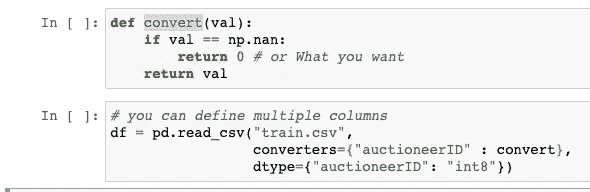
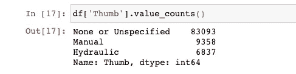

# ⚡️加载相同 CSV 文件的速度提高了 10 倍，memory⚡️减少了 10 倍

> 原文：<https://towardsdatascience.com/%EF%B8%8F-load-the-same-csv-file-10x-times-faster-and-with-10x-less-memory-%EF%B8%8F-e93b485086c7?source=collection_archive---------2----------------------->

## 熊猫，达克，多重加工，等等…


照片由[卡拉·富勒](https://unsplash.com/@caraventurera?utm_source=medium&utm_medium=referral)在 [Unsplash](https://unsplash.com?utm_source=medium&utm_medium=referral) ( **最快的哺乳动物**)上拍摄

即使我们有 1TB 的磁盘存储、8GB/16GB 的 RAM，许多其他数据加载 API 仍然难以加载 2GB 的文件。

这是因为当进程请求内存时，内存以两种方式分配:

1.  连续内存分配(分配连续的块)
2.  非连续内存分配(不同位置的独立块)

Pandas 使用连续内存将数据加载到 RAM 中，因为 RAM 上的读写操作必须比磁盘(或 SSD)快。

*   固态硬盘读数:~16，000 纳秒
*   从 RAM 中读取:~100 纳秒

在进入多处理& GPUs 等之前…让我们看看如何有效地使用 *pd.read_csv()* 。

> Pandas 可以很好地加载数据和预处理，但是要训练你的模型，从 [TensorFlow](https://www.tensorflow.org/api_docs/python/tf/data/Dataset) 或 [PyTorch](https://pytorch.org/docs/stable/data.html#torch.utils.data.DataLoader) 或任何你运行模型的地方开始使用 DataLoader。


塞巴斯蒂安·耶佩斯在 [Unsplash](https://unsplash.com?utm_source=medium&utm_medium=referral) 上拍摄的照片

> 注意:如果您在手机上阅读，您可能无法滚动浏览代码。(打开要点可读性更好。)

## ***1。使用列:***

而不是加载数据并删除处理数据时无用的不必要的列。只加载有用的列。

🔥内存使用与您使用的列数成比例。🔥

## **2 *。*使用正确的** `**dtypes**` **进行数值数据:**

在熊猫数据框架中，每一列都有自己的`dtype`，例如，整数有`int64`、`int32`、`int16`等

*   `int8`可以存储-128 到 127 的整数。
*   `int16`可以存储从-32768 到 32767 的整数。
*   `int64`可以存储-9223372036854775808 到 9223372036854775807 的整数。

默认情况下，熊猫将`int64`分配给整数`datatype`，因此通过定义正确的`dtypes`，我们可以显著减少内存使用。

🔥内存使用减少了 75%。🔥

**🔥Pro 提示:**在加载数据时使用`converters`来替换缺失值或 nan，特别是对于使用`dtype.`预定义了数据类型的列



由[塞缪尔·吉文](https://unsplash.com/@sam_girven?utm_source=medium&utm_medium=referral)在 [Unsplash](https://unsplash.com?utm_source=medium&utm_medium=referral) 上拍摄的照片

## ***3。使用正确的*** `***dtypes***` ***进行分类列:***

在我的数据集中，我有一个列`Thumb`，默认情况下它被解析为一个字符串，但是它只包含固定数量的值，这些值对于任何数据集都保持不变。



还有性别等栏目..可存储为[分类](https://pandas.pydata.org/pandas-docs/stable/user_guide/categorical.html)值，将内存从约 1000 KB 减少至约 100 KB。(检查 sat)

🔥内存使用减少了 97%。🔥

**🔥专业提示:**如果你的数据帧包含大量空值、缺失值或 nan，你可以通过将它们转换成[稀疏序列](https://pandas.pydata.org/pandas-docs/stable/user_guide/sparse.html)来减少它们的内存占用。

## ***4。nrows，跳过行*和**

甚至在将所有数据加载到 RAM 之前，使用小数据集测试您的函数和工作流总是一个好的做法，pandas 使精确选择行数变得更加容易(您甚至可以跳过不需要的行。)

在大多数情况下，出于测试目的，当一个样本可以做得很好时，您不需要加载所有数据。

`nrows`从文件中读取的行数。

```
>>> Import pandas as pd
>>> df = pd.read_csv("train.csv", nrows=1000)
>>>len(df)
1000
```

`skiprows`文件开头要跳过的行数(0-索引)或要跳过的行数(int)。

```
# Can be either list or first N rows.
df = pd.read_csv('train.csv', skiprows=[0,2,5]) 
# It might remove headings
```

**🔥提示:**`nrows`的一个有效用法是当您有超过 100 个列时，检查并为每一列定义正确的数据类型。所有这些开销都可以使用如下所示的`nrows`来减少。

```
sample = pd.read_csv("train.csv", nrows=100) # Load Sample datadtypes = sample.dtypes # Get the dtypes
cols = sample.columns # Get the columnsdtype_dictionary = {} 
for c in cols:
    """
    Write your own dtypes using 
    # rule 2
    # rule 3 
    """
    if str(dtypes[c]) == 'int64':
        dtype_dictionary[c] = 'float32' # Handle NANs in int columns
    else:
        dtype_dictionary[c] = str(dtypes[c])# Load Data with increased speed and reduced memory.
df = pd.read_csv("train.csv", dtype=dtype_dictionary, 
                 keep_default_na=False, 
                 error_bad_lines=False,
                 na_values=['na',''])
```

**注意:**由于 nan 在 pandas 中被认为是 float，所以如果您的列包含 nan，不要忘记将 integer data _ types 转换为 float。

**5。分块加载数据:**

熊猫 read_csv()中的内存[问题](https://wesmckinney.com/blog/update-on-upcoming-pandas-v0-10-new-file-parser-other-performance-wins/)长期存在。因此，加载大型数据集的最佳变通方法之一是分块加载。

**注意:**分块加载数据实际上比直接读取整个数据要慢，因为您需要再次`concat`分块，但是您可以轻松加载超过 10 GB 的文件。


照片由[伊琳娜·布洛克](https://unsplash.com/@irinablok?utm_source=medium&utm_medium=referral)在 [Unsplash](https://unsplash.com?utm_source=medium&utm_medium=referral) 上拍摄

## 6.使用 pandas 的多重处理:

因为 pandas 没有 njobs 变量来利用多处理能力。我们可以利用`multiprocessing`库在多线程上异步处理块大小操作，这可以将运行时间减少一半。

古塔曼巴拉拉曼

> **注意:**您只需要在 __main__ 中定义`pool`，因为只有 main 可以在多个处理器之间异步分配池。

## 7.Dask 代替熊猫:

虽然 Dask 没有像 pandas 那样提供广泛的数据预处理功能，但它支持并行计算，加载数据比 pandas 更快

```
import dask.dataframe as dddata = dd.read_csv("train.csv",dtype={'MachineHoursCurrentMeter': 'float64'},assume_missing=True)
data.compute()
```

🔥**专业提示:**如果你想知道 jupyter 细胞运行所需的时间，只需在细胞开始处添加`%%time`魔法函数

试题库:[**Paratext**](https://github.com/wiseio/paratext)**，**[**Datatable**](https://github.com/h2oai/datatable)**。**

> 他们的是另一种方式，你可以在云中租一台虚拟机，64 个内核和 432GB 内存，每小时 3 美元左右，甚至更好的价格。
> 
> **警告**:你需要花下一周的时间来配置它。

谢谢你坚持到最后，我希望你学到了新的东西。快乐装货…✌️.（👏如果你喜欢的话。)

> 在下面评论你用来更快加载数据的技巧，我会把它们添加到列表中。

***(把他们添加到你的博客列表中):***

🔥 [Itamar Turner-Trauring](https://pythonspeed.com) —速度巨蟒大师(必须✅).

🔥 [Gouthaman Balaraman](http://gouthamanbalaraman.com/) —用 python 进行量化金融(必须✅).

在 [Linkedin](https://www.linkedin.com/in/prudhvi-vajja-22079610b/) 上与我联系。