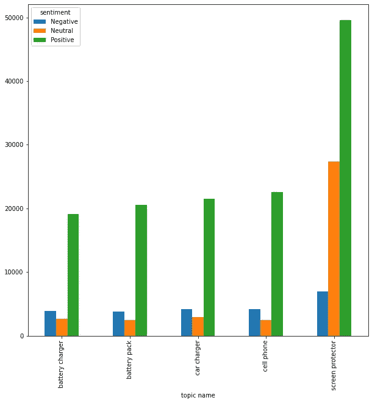
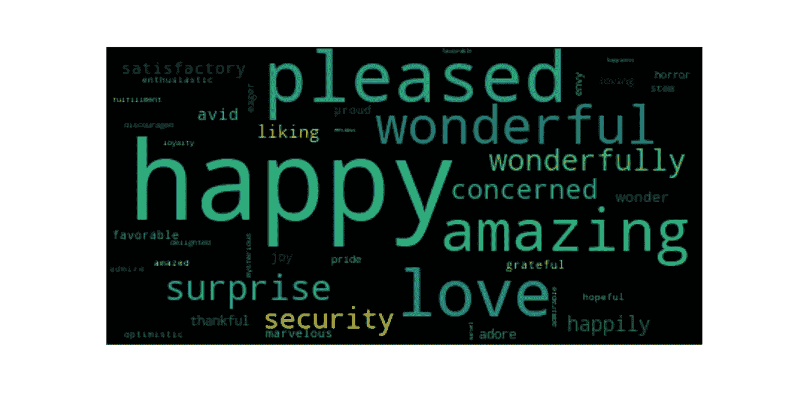
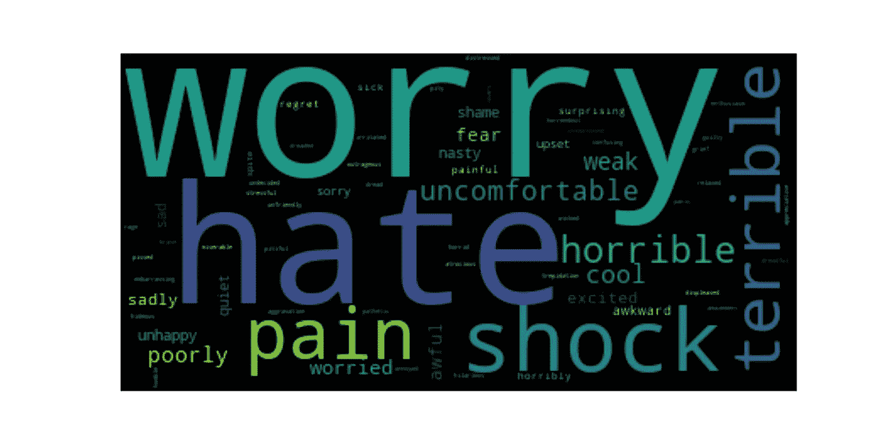

# 情感分析:基于方面的观点挖掘

> 原文：<https://towardsdatascience.com/%EF%B8%8F-sentiment-analysis-aspect-based-opinion-mining-72a75e8c8a6d?source=collection_archive---------7----------------------->

## [入门](https://towardsdatascience.com/tagged/getting-started)

## 情感分析和主题建模技术的研究。

# 介绍

当发展一个成功的企业时，最关键的因素之一是你与客户的沟通和关系。然而，随着用户群的增长，一个主要的挑战是产生大量的数据，通常是以自然语言的形式。这些数据可以来自客户反馈，甚至可以来自社交媒体平台，客户可以在这些平台上表达他们对使用您的服务或产品的体验的想法和意见。

真正的挑战是自动解析和组织这些数据，使之成为更易理解和可操作的洞察。应用于这种数据的最流行的自然语言处理技术之一是情感分析。情感分析旨在自动提取和分类文本中表达的情感(观点的主观部分)和/或情绪(感觉的投射或显示)。

意见可以被定义为四个因素(实体、持有人、主张和情感)的组合，其中意见持有人可能相信关于实体的主张，并且在许多情况下，将情感与该信念相关联。与提取一段文本中表达的一般情感相反，基于方面的情感分析旨在提取文本中描述的实体(在这种情况下，是产品或服务的属性或组件)以及对这些实体表达的情感。

通过探索客户对您的服务或产品的特定部分的反应所获得的优势可以帮助支持业务用例，包括产品开发和质量控制、通信、客户支持和决策过程。在这种情况下，这篇文章研究了将传统的主题建模技术与情感分析相结合来提取文本方面，以及对它们表达的情感。

# 数据预处理

这篇文章中使用的数据集是由[朱利安·麦考利](http://jmcauley.ucsd.edu/data/amazon/links.html)提供的。它包含亚马逊的产品评论和元数据，包括 1996 年 5 月至 2014 年 7 月期间的 1.428 亿条评论。该数据集包括评论(评级、文本、有用性投票)、产品元数据(描述、类别信息、价格、品牌和图像特征)和链接(也查看过/也购买过的图表)。在这里，我们将使用手机和配件的评论。该数据集中的评论总数是 194，439。

我们将遵循一些自然语言处理任务中使用的标准预处理技术。这些技术包括:

*   将文本转换为小写。
*   删除标点符号和额外的空格。
*   象征化。
*   删除停用词。
*   引理满足。

在我们研究应用主题建模技术之前，最后一个预处理步骤是对评论进行矢量化，即我们需要将数据表示为数字形式，以便模型可以处理它们。您可以使用几种表示方法，最流行的方法是单词的 TF-IDF 得分或它们的频率计数(单词袋方法)。在这里，我们将坚持单词袋表示法。我们将使用 Sklearn 的特征提取模块中的`CounterVectorizer`函数。该函数将文本集合转换为字数矩阵。

# 主题建模

主题建模是一种无监督的机器学习方法，用于将文本分配到最能表征此类文档的组中。这个概念也可以用来提取文本方面。

Sklearn 包括一个潜在的狄利克雷分配(LDA)算法版本。对于这个概念，我们想提炼五个方面。一旦设置了参数，我们就可以使 LDA 适合文本的矢量化版本。

为了使输出更容易阅读，我们可以将为每个主题生成的相关性分数作为一列附加到每个评论中，并通过取具有最高相关性分数的主题来计算主导主题。

现在我们可以看到评论属于哪个主题(根据其编号)。但是 LDA 从这样的评论中提取了什么关键词呢？我们可以通过调用矢量器的`get_feature_names()`来查看它们，并使用 LDA 的`components_`函数来查看它们与该方面的相关性分数:

我们通过在五个方面中取其最高相关性分数来确定一个关键词属于哪个方面。然后，对于每个方面，我们可以按降序排列我们的数据框架，并选择得分最高的关键字。

这五个方面是:

*   蓄电池充电器
*   电池组
*   汽车充电器
*   手机
*   屏幕保护器

# 情感分析

已经开发了各种技术和方法来解决自动识别文本中表达的情感。在这篇文章中，我将使用 Python 情感分析库 VADER 来分类评论是积极的、消极的还是中立的。

一种非常简单的情感分析方法是使用一个单词列表，这些单词已经根据它们的语义取向进行了标记。例如，我们可以假设单词“好”有一个正价，而单词“坏”有一个负价。VADER 使用这种技术，并提供了一个百分比分数，它代表了属于每个情感类别的歌词的比例。它还提供了一个复合得分，计算方法是将每个单词的效价得分相加，然后将得分归一化到-1(最大负值)和+1(最大正值)之间。

VADER 的好处在于我们不需要以任何方式对文本进行预处理。我们可以将原始产品评论输入到 VADER 的情感函数中，并检索每个产品的综合得分。

首先，我们将从 VADER 的 Python 库中导入`SentimentIntensityAnalyzer`函数。我将初始化 VADER 的情绪分析器，然后迭代数据框架中的评论。然后，我将计算复合情绪得分是高于还是低于阈值，这样我们就可以给它们贴上积极、消极或中性的标签。

# 从结果中获得的见解

一旦我们获得了每个评论的复合分数，我们就可以对这五个方面中的每一个绘制并计算正面、负面和中性评论的数量。

每个方面的正面、负面和中性评论的总数。

该图表显示，每个方面的大多数评价都是积极的。特别是，超过 83，000 条评论的*屏幕保护者*获得了 49，572 条正面评论。对于一个企业来说，超过 50%的评论表达了积极的情绪，这是一个很好的迹象，表明你的客户对产品感到满意。

我们还能收集到哪些潜在的见解？让我们更深入地了解一下客户在说什么。对于这个概念，我们将使用对*屏幕保护的评论。*

用于支持情感分析的主要特征之一包括明确传达主观偏见的个体情感词(例如，好、坏)。情感词汇可以从专业词典中找到，在那里它们被映射到自己的情感上。

这些词通常是形容词(如好的，坏的)，副词(如愉快地，古怪地)，名词(如祝福，垃圾)，动词(如爱，恨)。情感也可以通过使用比较词来表达(例如，更好，更差)。为了识别文本中的形容词、副词、名词和动词，我们可以应用词性标注。词性标注是根据单词的定义和上下文，将文本中的单词标记为对应于特定词类(名词、动词、形容词、副词、代词、介词、连词、感叹词、数词、冠词或限定词)的过程。

这里，我们使用 NLTK POS tagger 来标识 POS 标签。由于我们已经有了一个相当大的数据集，我们希望尽可能地自动缩小情感词的范围。在这种情况下，我们能够识别英语和正确拼写的单词，并将它们映射到 [SentiWordNet](https://github.com/aesuli/SentiWordNet) ，这是一个用于观点挖掘的词汇资源。SentiWordNet 给单词分配三个情感分数:积极、消极和客观。

客观性可以定义为在考虑和陈述事实时不受个人感觉或观点的影响。因此，主观性是客观性的对比。在评分方面，我们要识别客观性评分低的词。但并不是所有的主观词都是感情词。

为了从主观词汇中捕获情感词汇，我们使用了另一种词汇资源 [WordNet-Affect](https://wndomains.fbk.eu/wnaffect.html) ，它以分层结构表示与情感词汇相关的情感概念。一旦我们检查了主观词汇是否在 WordNet-Affect 中，我们就可以很有把握地认为这些是情感词汇。基于他们的 SentiWordNet 正面和负面得分，我们还可以将他们分成单独的集合，并计算他们在整个数据集中出现的次数。

我们将在单词云中展示结果，单词云是一种简单的数据可视化方式，根据单词在数据中出现的频率，单词以不同的大小显示。单词的大小显示了它在评论中出现的频率。

正情词云

负面情绪词云

基于这两个词云，很明显，评论中最常见的正面和负面情绪词分别是*快乐*和*担忧*T6。对于一个企业来说，同样，把*快乐*作为最流行的积极情绪词是令人放心的！

> “我爱这个案子！太漂亮了。我喜欢这款保护套的触感，因为它有橡胶。很开心！”

但是负面情绪的话可能会令人担心。在浏览了包含*担心*的评论后，我们可以注意到，它们出现的大多数是在否定词“*没担心”*或“*别担心”*之后。否定在情感分析中起着重要的作用，因为它可以逆转情感词的极性。否定词如“not”或“never”通常被认为是停用词，它们在预处理过程中被移除，并影响情感词的极性。这是未来需要考虑的一个重要问题。

下面的评论举例说明了一个例子，其中出现了评论中第二常见的负面情绪词*仇恨:*

> “我讨厌屏幕保护器。讨厌它们，因而很少使用它们。它们要么很难安装，要么让显示器看起来像垃圾，要么两者兼而有之。”

估计这个人不喜欢屏幕保护…

# 结论

那么，我从这个分析中学到了什么？

传统的主题建模技术可以用来成功地从文本中提取方面。像许多数据科学问题一样，问题的核心任务之一是数据的预处理。这对于情感分析结果具有特别的影响，其中移除特定的停用词可能会影响否定的识别，从而影响所表达的真实情感。

对于完整的笔记本，请查看下面我的 GitHub repo:

[https://github.com/LowriWilliams/Aspect_Sentiment_Analysis](https://github.com/LowriWilliams/Aspect_Sentiment_Analysis)

如果你对更多的主题建模帖子感兴趣，我最近写了关于确定给定主题的更有意义的标题。你可以在这里阅读:

🗣️ [主题建模:超越令牌输出](/️-topic-modelling-going-beyond-token-outputs-5b48df212e06)