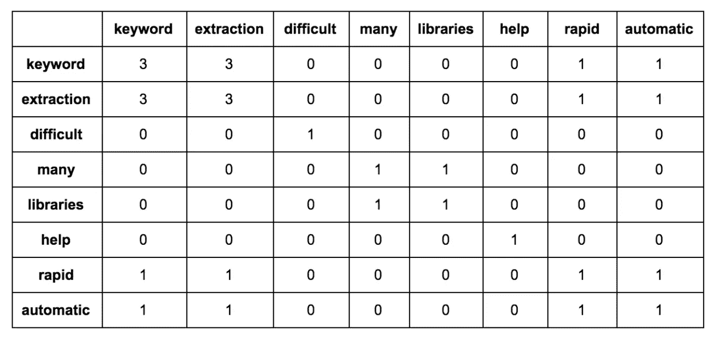
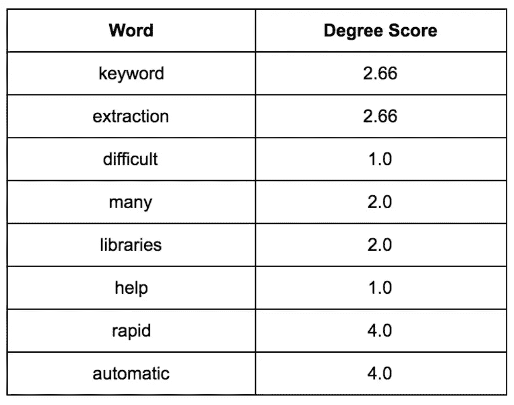
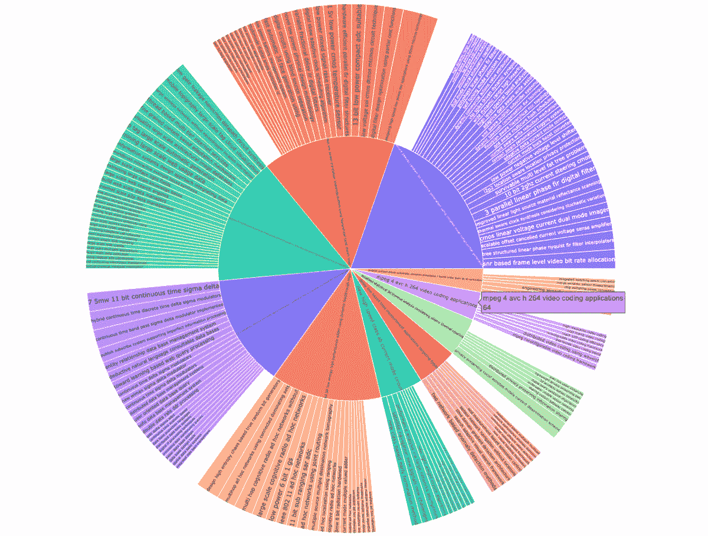

# 主题建模:超越令牌输出

> 原文：<https://towardsdatascience.com/%EF%B8%8F-topic-modelling-going-beyond-token-outputs-5b48df212e06?source=collection_archive---------10----------------------->

## 关于如何给题目赋予有意义的标题的调查

***注:*** *本文讨论的方法背后的方法论源于* [*数据创新加速器*](https://www.cardiff.ac.uk/data-innovation-accelerator) *和* [*之间的一个合作项目，简单地说就是做想法*](https://www.simplydo.co.uk/) *。*

# 介绍

我最近面临一项任务，其最终目标是将大量非结构化的句子和短文段自动聚合到相关主题的组中。

在这个任务中，我意识到主题建模方法还没有太多的报道，特别是当试图给主题起一个有意义的名字时。我很快意识到现有的方法有同样的问题；他们使用一系列标记(单个单词)来命名主题。通常由人类解释者来决定，例如，`'mouse', 'keyboard', 'monitor', 'cpu'`是来自描述计算机部件的一段文本的标记。

这篇文章讨论了关键词提取技术和主题建模的应用，以便给主题起一个有意义的名字。在这种情况下，我将有意义的 T21 定义为不仅仅是一些符号，在这些符号中，读者必须解释它们之间的整体语义关系，以理解整体主题。作为一名读者，从前面提到的例子中，我希望能够知道这个特定的主题是关于`'computer parts'`的，而不必考虑太多。

# 数据预处理

[Susan Li](https://towardsdatascience.com/@actsusanli) 是数据科学社区的知名撰稿人。她那篇名为“ [*用 NLTK 和 Gensim*](/topic-modelling-in-python-with-nltk-and-gensim-4ef03213cd21)*”*用 Python 进行主题建模的文章，因其清晰地应用了[潜在狄利克雷分配](https://en.wikipedia.org/wiki/Latent_Dirichlet_allocation) (LDA)，一种广泛使用的主题建模技术，将精选的研究论文转换为一组主题，而获得了一些好评。

有问题的数据集可以在 Susan 的 [Github](https://github.com/susanli2016/Machine-Learning-with-Python/blob/master/dataset.csv) 上找到。它由 2，507 个简短的研究论文标题组成。

在我们开始应用 LDA 主题建模方法之前，让我们先来看看我们需要考虑的预处理技术。像许多自然语言处理(NLP)问题一样，通常要做的第一件事是将文本转换成小写，并去掉文本中的任何标点符号，这样我们就有了一组标准化的字符串来处理。如果我们不删除它们，我们经常会得到重复的字符串集合，它们的不同仅仅是因为它们包含了一些应该被删除的内容。此外，我说“*许多 NLP* 问题，而不是“*所有 NLP”*问题作为情感分析中的标点符号，一个旨在自动检测一段文本是否表达积极或消极情感或观点的 NLP 问题，是需要考虑的重要问题。作为一个简短的例子，考虑读者如何基于感叹号的过度包含来不同地解释`They cut my hair short`和`They cut my hair short!!!!`的情绪。然而，在应用主题建模时，标点符号是相对无意义的。我们可以通过使用正则表达式来删除它们。我们还想考虑删除字符串两端以及字符串内部可能出现的额外空白。

既然我们的文本去掉了标点符号，我们希望将标题表示为单个单词(记号化),并考虑删除停用词。停用词(如“the”、“a”、“an”、“in”)是提供无意义信息的常用词，通常在预处理阶段从文本中移除。

我们可以使用 Python 的 NLP 库之一自然语言工具包(NLTK)轻松标记和删除停用词。为了说明这一点，我们可以将 NLTK 内置的`word_tokenize`函数应用于标题。该输出将每个文本表示为一个包含构成标题的每个单词的`list`。然后我们可以初始化 NLTK 的停止字功能。我注意到现在还没有一个像样的停用词表，很多人和我一样，不得不在原来的列表中添加单词。然后，我们遍历每个列表，删除与停用词列表相对应的词。

最后，我们想看看如何将引理满足应用于每个标题的剩余单词。词条满足考虑了单词的形态分析。为此，有必要拥有详细的字典，算法可以通过这些字典将该形式链接回其所有屈折形式的引理或基础形式(例如，`studies, studying`共享引理`study`)。NLTK 包含一个英语词汇数据库。这些单词根据它们的语义关系连接在一起。这种联系取决于单词的意思。特别是，我们可以使用 WordNet，一个词汇之间语义关系的词汇数据库。再一次，我们假设我们想要得到一套描述论文标题的标准化词汇。我们初始化 WordNet lemmatiser，然后应用于列表中的每个单词，用它的 lemma 替换它。现在，输出应该是这样的:

# 主题建模

现在我们的数据已经处理完毕，我们可以开始研究如何应用 LDA 并将论文标题分组到主题中。在我们这样做之前，还有最后一个预处理步骤，那就是将标题表示为向量，也就是说，我们需要将数据表示为数字形式，以便模型可以处理它们。您可以使用几种表示方法，最流行的方法是单词的 TF-IDF 得分或它们的频率计数(单词袋方法)。在这里，我们将坚持单词袋表示法。我们将使用 Sklearn 的特征提取模块中的`CounterVectorizer`函数。该函数将文本集合转换为字数矩阵。

Sklearn 还包括一个 LDA 版本。对于这个概念，假设我们想将论文标题分成 10 个主题中的 1 个。一旦设置了参数，我们就可以使 LDA 适合文本的矢量化版本。为了更容易阅读，我们可以将为每个主题产生的相关性分数作为一列附加到每个标题，并通过取具有最高相关性分数的主题来计算主导主题。

太好了！现在我们可以看到标题属于哪个主题(根据其编号)。但是 LDA 给出了什么关键词来描述这些话题呢？我们可以通过调用矢量器的`get_feature_names()`函数来查看它们:

信息对我们有多大用处？嗯，它不是那么有用，因为有一些主题有相同的关键字，如`network`和`data`。我们要删除那些重复的单词，因为我们希望在给主题分配有意义的标题之前，一个标题只属于一个主题。

# 为主题指定有意义的名称

现在是有趣的部分。让我们首先将每个主题的令牌输出合并到主数据帧中与该主题对应的每一行。这样，我们就有了一个主要的数据框架。

在我解释代码做什么之前，我们先介绍一下快速自动关键词提取(RAKE)。RAKE 是一个众所周知的关键字提取工具，它使用停用词和短语分隔符列表来检测一段文本中最相关的词或短语。以下面的文字为例:

*“关键词提取终究没那么难。有许多库可以帮助你提取关键词。快速自动关键词提取就是其中之一。”*

首先，RAKE 将文本分割成一个单词列表，在这个过程中删除停用词。这将返回一个名为*内容词*的列表。

content_words = [ `keyword`，`extraction`，`difficult`，`many`，`libraries`，`help`，`rapid`，`automatic` ]

然后，该算法在短语分隔符和停用词处拆分文本，以创建候选表达式。因此，候选关键短语如下:

`*Keyword extraction*` *终究不是那个* `*difficult*` *。还有* `*many libraries*` *可以* `*help*` *你跟* `*keyword extraction*` *。* `*Rapid automatic keyword extraction*` *就是其中之一。*

一旦文本被分割，该算法就创建一个单词共现矩阵。每行显示给定的内容词与候选短语中的每一个其他内容词同时出现的次数。对于上面的示例，矩阵如下所示:

在矩阵建立之后，单词被给予一个分数，该分数可以使用三种方法之一来计算:矩阵中单词的*度(即该单词与文本中任何其他内容单词共现的次数之和)，作为*词频*(即该单词在文本中出现的次数)，或者作为该单词的*度除以其频率*。*

如果我们要计算示例中每个单词的程度分数除以频率分数，结果将如下所示:

这些表达也有一个分数，这个分数是单词的分数总和。如果我们要计算上面粗体短语的分数，它们会是这样的:

如果两个关键字或关键短语以相同的顺序同时出现两次以上，则不管该关键短语在原始文本中包含多少停用词，都会创建一个新的关键短语。该关键短语的分数就像单个关键短语的分数一样被计算。

如果关键字或关键短语的分数属于前 T 个分数，则选择该关键字或关键短语，其中 T 是要提取的关键字的数量。对于上面的例子，该方法将返回前 3 个关键字，根据我们定义的分数，它们将是*快速自动关键字提取* (13.33)、*关键字提取* (5.33)和*许多库* (4.0)。

因此，如果我们迭代每个主题，并对这些主题中的原始论文标题应用 RAKE，我们可以提取关键字和短语，以及它们的分数。我们希望能够将使用 RAKE 提取的关键字与 LDA 模型提取的关键字相关联。我们可以将 RAKE 的关键词分成单词和双词，并根据 LDA 的输出屏蔽这些词。我们这样做是因为 RAKE 会提取可能与该主题无关的关键词。

一旦我们过滤掉不相关的关键词，如果我们对它们的得分进行降序排列，我们应该会看到每个主题得分最高的关键词。我们可以把这些得分最高的关键词作为每个题目的主标题。如果有不止一个关键字，我们可以将它们附加在一起，并用分隔符`/`将它们分开。

剩下的关键词呢？那些也很有用。事实上，根据您试图通过主题建模实现的目标，这些剩余的关键字可以用作主题的子术语。也就是说，这个话题还可能是关于什么的。

我们有很多子术语，所以我们可以通过选择得分高于 10 的关键字来限制它们。让我们用旭日图来展示结果，这样我们就可以看到它的实际效果。

不错！我们有 10 个主题，每个主题都有几个子术语。但最重要的是，每个题目都是知识性的！让我们看看观想的粉红色部分。主题是“mpeg 4 avc h 264 视频编码应用”。它有 7 个子主题，都与视频配置框架相关:

*“mpeg 可重构视频编码框架”、“使用小波的分布式视频编码”、“基于分布式视频编码”、“可重构视频编码框架”、“达到 100 编码效率”、“帧间视频编码”、“T10”、“T11”高分辨率视频编码。*

# 结论

那么，我从这个分析中学到了什么？

将关键词提取与主题建模相关联是一种非常有用的方法，可以为给定的主题确定更有意义的标题。像许多数据科学问题一样，问题的核心任务之一是数据的预处理。但是一旦做了，而且做得好，结果会很有希望。

我怀疑这种方法也可以用来支持自动确定将数据分成多少个主题。已经有一些方法可以做到这一点，例如在一系列主题上运行 LDA，并将每个模型的最低复杂度视为主题的最佳数量。在这篇文章中，我们手动选择将数据分布到 10 个主题中。但是，如果一个人可以计算在给定的范围内每个主题是否存在关键词，并将具有全套关键词的最高数量的主题作为最佳主题数量，结果可能会很有趣！这是我想进一步调查的事情。

完整的笔记本，请看下面我的 GitHub repo:[https://GitHub . com/lowri Williams/Topic _ modeling _ Beyond _ Tokens](https://github.com/LowriWilliams/Topic_Modelling_Beyond_Tokens/blob/master/topic_modelling.ipynb)