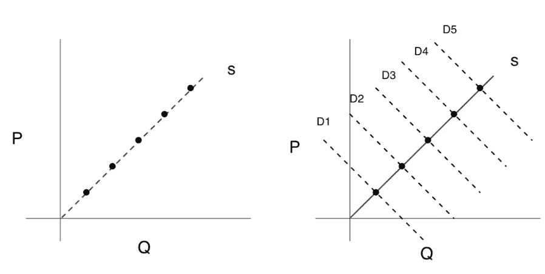

# 1+1=?当因果推理遇到机器学习时更好的决策

> 原文：<https://towardsdatascience.com/1-1-better-decision-making-when-causal-inference-meets-machine-learning-bd3b00d8286b?source=collection_archive---------46----------------------->

## 双机器学习:使用机器学习(ML)方法估计因果效应的一般框架

近年来，机器学习已经应用于不同的领域，如在线营销和商务，个性化医疗和数据驱动的政策制定。这一巨大的成功使得人们对自主系统做出正确决策的期望越来越高。公司经常使用经典的机器学习工具来解决决策问题，例如在哪里定价，或者营销活动以哪些客户为目标。这引发了当今机器学习的主要挑战之一，即理解**因果**联系。

# 决策问题需要因果关系

要做出数据驱动的决策，对因果关系的理解是关键。这里有一个来自我们日常业务的简单例子:**价格弹性。**为产品设定最优价格，公司需要知道在不同(假设)价格水平下会卖多少，这就是需求的价格弹性。

如果你是一个 ML 从业者，一个经典的 ML 算法，以价格水平作为一个特征来预测销售结果，可能是你的首选。然而，在实践中，这种方法不能简单地给出价格对销售的因果影响。下面的情节展示了“为什么”——*预测和因果推理是截然不同的(尽管密切相关)问题。(Athey，2017，第 484 页)*左手边，是预测问题，我们在寻找价格和数量的相关性。在右边，虚线是反事实，即如果我改变价格，给定产品的销售额是多少。尽管有积极的联系，因果关系是负面的。如果我们提高价格，数量就会减少。



预测(左)与因果推理

正如上面的例子和许多其他例子在 [**Athey，S. (2017)中描述的那样。超越预测:使用大数据解决政策问题。科学 335，483–485**](https://science.sciencemag.org/content/355/6324/483)**，**机器学习模型不是为了估计因果关系而建立的。应用机器学习的现成预测方法会导致对因果影响的有偏估计。另一方面，传统的因果推理需要对模型的函数形式进行强有力的假设。如果我们错误地指定了函数形式，我们最终会得到有偏差的估计。因此，可以修改现有的机器学习技术，以利用机器学习的优势从数据中学习条件期望函数的形式——双机器学习**的诞生**！

# **两全其美的通用框架**

有许多研究人员在因果机器学习领域开发方法。我对双机学习特别感兴趣，因为它的通用性和简单性。它可以与惩罚方法、神经网络、树算法和集成方法结合使用，并且易于操作。让我告诉你这有多简单:

假设我们有几组具有重要特性 X 的产品，我们用 P 来表示价格，Y 是需求响应(销售)。我们然后:

1.  在 X 上回归 Y，并计算 Y 与模型中 Y 的预测值之间的差值(即残差)，我们称之为 Y_res。
2.  我们类似地回归 X 上的 P，并计算 P_res，即 P 与模型中 P 的预测值之间的差值。
3.  最后，我们在 P_res 上回归 Y _ RES。P _ RES 上的结果系数是 P 对 Y 的因果效应的点估计。

为了得到一个公正的估计。你需要在每个步骤中应用交叉拟合。更具体地说，您应该:1)将您的数据随机划分为两个子集 2)在第一个子集中拟合两个 ML 模型 3)使用我们在第一个子集中拟合的模型估计第二个子集中的系数 4)检查 1 到 3，但在每个步骤中翻转子集 5)平均系数，这将是无偏估计

这不是简单明了吗？！如果你仍然对如何实现它没有信心，我推荐一个很棒的 python 包，叫做 [econML](https://github.com/microsoft/EconML) 。它包含了许多前沿的因果机器学习作品，double ML 就是其中之一。以下是该包的代码片段:

```
 est = LinearDMLCateEstimator(model_y=MultiTaskElasticNetCV(cv=3, tol=1, selection='random'),
                             model_t=MultiTaskElasticNetCV(cv=3),
                             featurizer=PolynomialFeatures(1),
                             linear_first_stages=**True**)
est.fit(Y, T, X, W)
te_pred = est.const_marginal_effect(X_test)# Reference: [https://github.com/microsoft/EconML/blob/master/notebooks/Double%20Machine%20Learning%20Examples.ipynb](https://github.com/microsoft/EconML/blob/master/notebooks/Double%20Machine%20Learning%20Examples.ipynb)
```

其中 Y 是结果，T 是治疗，X 是特征，W 是共同创始人。这个包可以让你把不同的机器学习模型嵌入到它的 double ML 类中，超级方便。

在这篇文章中，我介绍了因果关系和机器学习的一些基本概念。此外，我还引入了一个广义 ML 框架来估计因果效应。您可以将这种方法应用到您的工作或其他数据科学项目中，以帮助您获得最佳控制，从而更快地获得正确答案。

我计划分享更多关于这种方法的理论，这样你就能更好地理解为什么以及如何推进这种方法。

# 参考:

1.  [爱丽丝(因果关系和经济学的自动学习和智能)——微软研究院](https://www.microsoft.com/en-us/research/project/alice/)
2.  [对随机实验中异质治疗效果的一般机器学习推断](https://arxiv.org/abs/1712.04802)