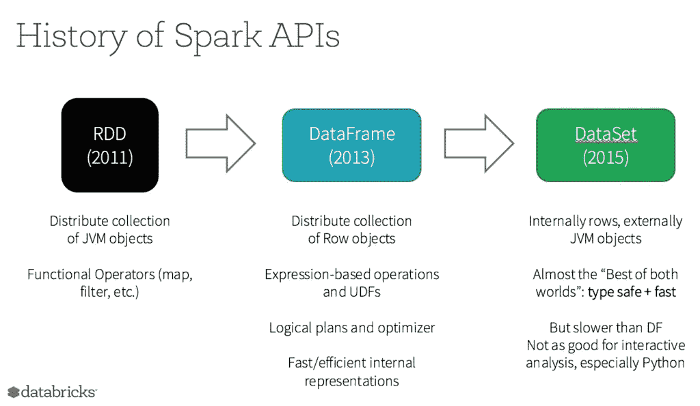

# 1.Apache Spark 简介

> 原文：<https://towardsdatascience.com/1-introduction-to-apache-spark-299db7a4b68d?source=collection_archive---------17----------------------->

## [理解大数据](https://towardsdatascience.com/tagged/making-sense-of-big-data)，探索 Spark 性能优化

## 开始探索 Spark 性能优化新系列的启动帖子

照片由 [NASA](https://unsplash.com/@nasa?utm_source=medium&utm_medium=referral) 在 [Unsplash](https://unsplash.com?utm_source=medium&utm_medium=referral) 上拍摄

Apache Spark 是大数据领域的一个流行框架。由于我有 Python 和 SQL 编码的背景，我很快就掌握了 Spark 的使用方法。然而，由于不了解这些机制，我在开始时经常感到困惑。我以前在单机上运行代码的经验向使用集群的转变，加上处理的数据大小变化从 MB 向 GB(甚至 TB)的转变，促使我开始学习 Spark。我将在这个系列中讨论我对 Spark 性能优化的探索，从第一篇介绍文章开始。这篇文章将涉及一些与 Spark 相关的关键概念、API 和工具。

事不宜迟，我们开始吧！

[**Spark**](https://spark.apache.org/docs/latest/index.html) 是一个分布式集群计算软件框架。它提供了简单的 API 来计算大量数据，而最终用户几乎不需要了解跨机器的任务和资源管理，这些都是由 Spark 在幕后完成的。

## 1.分布式计算

要实现分布式计算，需要在一个机器集群上进行资源和任务管理。资源管理包括为当前任务获取可用的机器，而任务管理包括协调集群中的代码和数据。

Spark 应用程序由驱动程序组成，在集群上执行并行计算。为了启动 Spark 应用程序，在主机上运行的驱动程序将首先启动一个`SparkContext`对象。这个`SparkContext`对象将与一个集群管理器通信，这个集群管理器可以是 Spark 自己的独立集群管理器、Mesos、YARN 或 Kubernetes，以获取这个应用程序的资源。然后，`SparkContext`对象将把应用程序代码和任务发送给工作节点。

对于一个应用程序，一个 worker 节点可以有多个执行器，这取决于该 worker 节点上可用的 CPU 数量。在应用程序的计算过程中，每个执行器将数据保存在内存或磁盘存储器中，并运行任务。这样，执行者就相互隔离了，同一个应用程序的任务并行运行。

[火花簇模式概述](https://spark.apache.org/docs/latest/cluster-overview.html)

## 2.弹性分布式数据集(RDD)

**是 Spark 中的核心抽象，代表弹性分布式数据集。它能够将大数据分割成适合每台机器的较小数据，因此计算可以在多台机器上并行进行。此外，rdd 会自动从节点故障中恢复，以确保存储的弹性。**

**[**HDFS**](https://hadoop.apache.org/docs/r1.2.1/hdfs_design.html) (Hadoop 分布式文件系统)是我在使用 Spark 时经常碰到的另一个重要概念。尽管 RDD 和 HDFS 都是关于弹性分布式存储的，但它们是为处理不同的问题而设计的。RDD 的弹性观点指的是计算失败的自动处理。虽然 HDFS 是关于存储管理的，但它是为处理存储故障而设计的。**

## **3.Spark APIs**

**Spark 提供了三个 API:**[**data frames**](https://databricks.com/glossary/what-are-dataframes)[**Datasets**](https://databricks.com/glossary/what-are-datasets)。所有这三个 API 都确保了分布式、弹性的数据计算，但是它们适用于不同的应用场景。****

********

****[三个 Spark API](https://databricks.com/glossary/what-is-rdd)****

****RDD 是 Spark 提供的底层 API，它支持非结构化或半结构化数据的操作。使用 RDD 就像告诉 Spark 如何执行任务，而不是简单地告诉 Spark 执行什么任务。因此，在这三个 API 中，RDD 提供了最好的编码灵活性和数据控制。然而，与此同时，在没有利用 Spark 内部优化的情况下，一个好的 RDD 大师对程序员的经验提出了更高的要求。****

****除了低级的 RDD API，Spark 还提供高级的 DataFrames API。数据框架强调数据结构。因此，DataFrames 对有关系数据库经验的程序员来说是友好的。当使用 DataFrame 时，感觉非常类似于使用 Pandas DataFrame 或 Excel 电子表格，但 Spark 在幕后处理集群计算。****

****如果我们说 RDD 和数据框架 API 位于倾斜的两侧，RDD 位于灵活的低级控制一侧，数据框架位于简单的高级编码一侧，那么数据集 API 位于其他两个 API 的中间。在 DataFrames API 之上，Datasets API 强加了类型安全以避免运行时错误。****

****RDD 和数据集 API 都需要类型安全，并且只支持 Java 和 Scala。但是 DataFrame API 支持动态类型语言，比如 Python 和 r。****

****Jules Damji 有一个关于 RDD、数据框架和数据集的精彩博客。如果你有兴趣，别忘了去看看。****

## ****4.Spark SQL****

****[**Spark SQL**](https://spark.apache.org/docs/latest/sql-programming-guide.html) 是 Spark 处理结构化数据的模块。****

****Spark SQL 使用两种结构化 API，即数据集和数据帧。利用仅在数据集或数据帧中可用的模式信息，Spark SQL 代码以声明的方式告诉 Spark 做什么，而不是在使用低级 RDD API 时告诉 Spark 如何做。这样，用 Spark SQL 编写的代码受益于 Spark 的 catalyst，它优化了性能。因此，使用 Spark SQL 和结构化 API 更容易编写高性能代码。****

********

****[Catalyst 优化 SQL 查询性能](https://databricks.com/glossary/catalyst-optimizer)****

****使用 Spark SQL 和 DataFrames API 相当于在关系数据库上运行 SQL 查询。常用的 SQL 函数，如 filter、join、aggregation、window 函数等，在 [Spark SQL](https://spark.apache.org/docs/latest/sql-ref-functions-builtin.html#aggregate-functions) 中也有。Spark SQL 和 DataFrames API 支持几种编程语言，包括 Python、R、Scala 和 Java。****

****Spark SQL、 [**Presto**](https://prestodb.io/docs/current/index.html) 和 [**Hive**](https://cwiki.apache.org/confluence/display/Hive) 都支持使用 SQL 语法查询驻留在分布式存储中的大规模数据，但用于不同的场景。****

****Spark SQL 是 Spark 中的核心模块，而 Presto 在 Hadoop 生态中。Spark SQL 强调计算，通常用于大规模 ETA 和流水线。然而，Presto 强调查询，更常用于特别分析。Spark SQL 和 Presto 都在内存中计算。当谈到内存短缺时，Spark SQL 允许溢出到磁盘中，而 Presto 将遭受 OOM 问题。Spark SQL 中也考虑了容错，但 Presto 中没有。****

****Hive 是一个数据仓库软件，管理 Hadoop 生态系统中的大规模结构化数据。Hive 查询可以通过 Spark 或 MapReduce 来执行。Hive 有自己的 SQL 引擎，名为 HiveQL。正如我们上面提到的，Spark SQL 是 Spark 处理结构化数据的模块。类似地，Hive 是 Hadoop 处理结构化数据的模块。****

******总结******

****在这篇文章中，我讨论了 Spark 的一些基本概念。尽管高级 DataFrame API 和 Spark SQL 使得编写高性能代码更加容易，但是理解 Spark 的工作方式有助于进一步提高性能。在下一篇文章中，我将以 YARN 为例，讨论如何使用 YARN web UI 理解 Spark 资源和任务管理。如果你对本次探索星火性能优化系列感兴趣，敬请关注！****