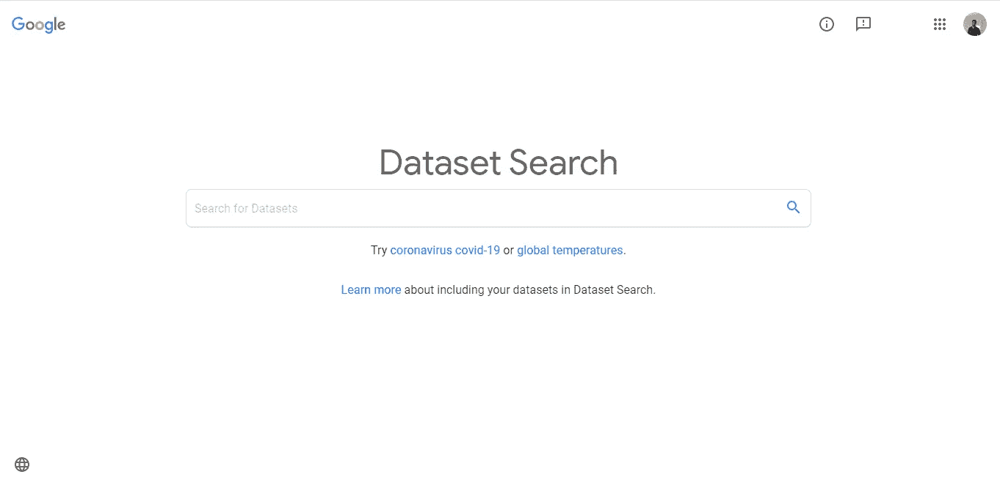

# 为您的数据科学项目查找任何数据集的 1 个技巧

> 原文：<https://towardsdatascience.com/1-trick-to-find-any-dataset-for-your-data-science-project-391c365359f4?source=collection_archive---------48----------------------->

## 使用谷歌数据集搜索引擎搜索和贡献数据集

弗兰基·查马基在 [Unsplash](https://unsplash.com?utm_source=medium&utm_medium=referral) 上拍摄的照片

互联网上有数千个数据集储存库，提供对数百万个数据集的访问。任何人工智能项目的一个共同要求是存在大量数据来训练模型，数据越多越好。每个有抱负的数据科学家都面临着为他们的数据科学项目找到正确数据集的问题。

也有很多开源数据集可供不同组织、大学和政府研究，你可以直接访问他们的网站。您可以在下面找到其中的一些:

## 一些开源数据集来源:

1.  各种数据集由 ka ggle:【https://www.kaggle.com/datasets 
2.  https://archive.ics.uci.edu/ml/index.php UCI 的 ML 数据集:
3.  美国政府开源数据:[https://www.data.gov/](https://www.data.gov/)
4.  NOAA 提供全球历史天气和气候数据:[https://www.ncdc.noaa.gov/cdo-web/](https://www.ncdc.noaa.gov/cdo-web/)
5.  Qualdl 的金融、经济和替代数据集:[https://www.quandl.com/](https://www.quandl.com/)
6.  英国社会、经济和人口数据资源:[https://www.ukdataservice.ac.uk/](https://www.ukdataservice.ac.uk/)
7.  国际货币基金组织贷款、汇率和其他经济和金融指标的时间序列数据:[https://www.imf.org/en/Data](https://www.imf.org/en/Data)

有很多网站提供开源数据集。您不必再花费宝贵的时间从多个来源为您的数据科学项目寻找合适的数据集，而是在一个地方找到它们。

# 谷歌数据集搜索:

谷歌有一个数据集搜索引擎，你可以在那里找到你的数据科学项目的数据集。它索引了数据集上可用的宣传，并在这个 Google 数据集搜索引擎上推荐给用户。

(图片由作者提供)，谷歌数据集搜索引擎

> 使用[https://datasetsearch.research.google.com/](https://datasetsearch.research.google.com/)网址访问谷歌数据集引擎。

谷歌数据集搜索可以为你的项目找到合适的存储在互联网上任何地方的数据集。

## 如何从 Google 数据集搜索中找到数据集:

您可以通过提供支持信息(如名称或描述)来搜索任何数据集。谷歌搜索使用 schema.org 和其他元数据标准向你推荐数据集。

(图片由作者提供)，在谷歌数据搜索上搜索数据集时的建议

在很高的层面上，谷歌依赖于数据集提供者。它使用可用数据集的元数据，将其与可用的其他资源链接，并建立这个丰富的元数据语料库的索引。

([来源](https://ai.googleblog.com/2018/09/building-google-dataset-search-and.html))，谷歌数据集搜索背后的技术概述

## 为 Google 数据集搜索贡献您的数据:

您也可以在互联网上公开您的数据集，它可以由谷歌数据集搜索引擎推荐。要在互联网上公开您的数据集，您需要遵循特定的步骤。

1.  向 schema.org 的[添加元数据，读取](https://schema.org/)[文档](https://developers.google.com/search/docs/data-types/dataset)添加元数据。
2.  验证标记产生了您在[结构化数据测试工具](https://search.google.com/structured-data/testing-tool)中预期的结构化数据
3.  如果你有多个页面，创建一个站点地图，并将它添加到你的[搜索控制台](https://search.google.com/search-console/about)

# 结论:

使用 Google 数据集搜索，您可以从大量公开可用的数据集中找到适合您的数据科学项目的数据集。谷歌数据集搜索引擎的目标是为发布、消费和发现数据集开发一个生态系统。

# 参考资料:

[1]谷歌数据集搜索常见问题解答(2019 年 3 月 2 日):[https://support.google.com/webmasters/thread/1960710](https://support.google.com/webmasters/thread/1960710)

[2]乔·詹姆斯 Youtube 视频(2019 年 12 月 3 日):[https://www.youtube.com/watch?v=1aUt8zAG09E](https://www.youtube.com/watch?v=1aUt8zAG09E)

> 感谢您的阅读