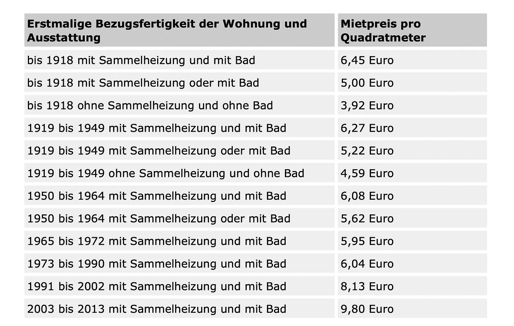
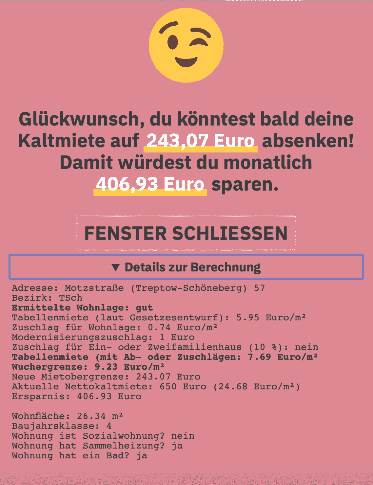

# 柏林房租冻结前一周:我能在网上找到多少非法的高价报价？

> 原文：<https://towardsdatascience.com/1-week-until-the-berlin-rent-freeze-how-many-illegal-overpriced-offers-can-i-find-online-6e5511d49e5a?source=collection_archive---------20----------------------->

乔纳斯·泰贝在 [Unsplash](https://unsplash.com/s/photos/berlin?utm_source=unsplash&utm_medium=referral&utm_content=creditCopyText) 上的照片

# 柏林目前的住房状况

搬到柏林后，找到一套价格合理的公寓绝对是最困难的事情之一。为了了解竞争有多激烈，11 月**1749 名找房子的人在外面排队参观位于著名的舍内贝格区的一套空置公寓**。就在 12 小时前，这套公寓在网上登了广告。

为了阻止不断上涨的住房成本，柏林州政府通过了一项有争议的法律来限制房租。再过一周，2 月 23 日，新法将正式生效。

# 目前的网上公寓是否遵循租金上限？

作为我的下一个数据科学辅助项目，我决定**分析**[**immobilienscout 24**](https://www.immobilienscout24.de/Suche/de/berlin/berlin/wohnung-mieten)上当前的在线房源，看看当前的房东是否已经尊重新的租金上限。不遵守法律会被处以高额罚款:

> 违反租金上限可能会被处以高达 500，000 欧元的罚款。

我把这篇博客分成三部分，帮助你找到和阅读与你最相关的内容:

*   **第一部分:**一些技术细节和我如何获得数据集
*   了解更多关于租金上限及其计算方法的信息
*   **Part 3:** 直奔结果，看我发现了什么。

# 第 1 部分:在 4 分钟内下载 4040 个列表

有了这个惊人的 [scrapy](https://scrapy.org) 包，我能够在两分钟之内的两个会话中从网上搜集到总共 4040 个房源。当然，设置蜘蛛花了相当长的时间。

接下来，所有的数据都被加载到一个[**pandas**](https://pandas.pydata.org)**data frame**中并进行清理。我不会在这里说太多细节，但这是相当多的清洗。

# 第 2 部分:批量计算新的租金上限

为了计算新的租金上限，我不得不**为数据集**设计一些特性。不过，首先让我们看看租金上限是如何计算的。

## 租金上限计算 101

简而言之，新租金上限由以下四个部分计算得出:

1.  **一个基本价格:**下面的租金表根据**的建筑年份、中央供暖系统(Sammelheizung)和/或浴室(Bad)的存在情况，确定净冷租金可能有多高。**

柏林租金表，来源:[柏林体育场](https://stadtentwicklung.berlin.de/wohnen/wohnraum/mietendeckel/)

**2。现代设备因素:**对于配有现代家具的公寓，如果至少具备以下三个特征，价格**将增加 1.00 欧元**:

*   没有门槛就能到达的电梯
*   安装厨房
*   优质卫生设备
*   绝大多数生活空间都采用高品质地板
*   能耗特征值小于 120 千瓦时/(米·年)

**3。a 地段溢价/扣除:**适用于 a …

*   **…简单住宅区**，在计算租金上限时，考虑从租金表中的相关租金中扣除 0.28 欧元**。**
*   **…** **中等住宅区扣 0.09 欧元**
*   **…良好的住宅区将收取 0.74 欧元的附加费。**

颇具讽刺意味的是，位置分类**至今仍未发布**。

**4。单人或双人家庭住宅:**如果居住空间位于不超过两套公寓的建筑中，租金上限**增加百分之十的附加费。**

如果你把这四个因素加起来，你就得到租金上限。但是，只有满足以下标准，租金才算**过高:**

> **考虑到上述四个因素，如果租金比租金表**中的相关租金上限高出 20%以上，则租金过高。

如果你在这一点上迷失了，住在柏林，并相当关心你目前是否为你在柏林的公寓支付了太多的费用，**试试这个很酷的** [**计算器**](https://www.mietendeckelrechner.de) (德语)，看看你是否更好地理解了计算。

## 从 256 个 PDF 页面中提取位置评级

到目前为止，最具挑战性的部分是**为尚未发布的位置分类**找到代理。在在线计算器中，我看到 2019 年的[柏林租金指数被用作代理，所以我遵循了同样的方法。](https://www.stadtentwicklung.berlin.de/wohnen/mietspiegel/de/download/Strassenverzeichnis2019.pdf)

然而,**这个项目最大的挑战是,**这些信息是以 PDF 格式发布的，与我实际需要的格式相差甚远。在 [**tabula**](https://tabula-py.readthedocs.io/en/latest/) **包**的帮助下，我能够**将 256 个 PDF 页面转化为柏林每条街道的 270，068 行**位置评级。

最后，合并两个来源中拼写略有不同的街道名称，用[**fuzzywuzzy**](https://chairnerd.seatgeek.com/fuzzywuzzy-fuzzy-string-matching-in-python/)**包**变得简单多了。尽管计算量很大，但比任何可以想象的正则表达式模式都要容易得多。

## 我对租金上限计算的保守假设

在我的计算中，我采用了以下保守假设来计算每平方米的租金上限:

*   基准表(1) 中相应建造年份的**最高价格，假设所有公寓都有中央供暖系统和浴室**
*   假设所有的公寓都有现代设备，那么它们至少符合现代家具的三个标准
*   2019 年发布的**租金指数 PDF 文档是位置评级(3)的一个很好的近似值**
*   所有的公寓都是非独栋住宅，因为我只租了几套公寓

## 下面提供的信息和分析的正确性和完整性的免责声明:虽然我非常小心地进行了这个项目，但是我对下面提供的结果的正确性和完整性不承担任何责任。

# 第 3 部分:分析结果

从大约 4k 个搜索到的房源中，有 1687 个房源(41.6%)有 2014 年之前的建造年份和地址信息，以便计算租金上限。

> 令人震惊的是，在 1687 个房源样本中，有四分之三的分析房源价格高于允许的租金上限。

在 ImmobilienScout 24 网站上，四分之三的分析租赁房源都超过了租金上限。

如果所有这些公寓都以当前的非法价格出租，所有租户每月将**比根据新法律**多支付 463，059.79€:

数据集中所有非法定价房源的租金构成。

在整个数据集中(信息充足的房源)，月平均**冷租为 15.12€/平方米**。根据新的法律，这一平均值将**降低 39%，至平均 9.21€/平方米**。

仔细看看每平方米的冷租金超出新租金上限多少就会发现，例如**1272 个房源中有 386 个在 0.50€到 2.49€之间的价格过高**。

仔细观察不同地区的价格变化，可以发现**中部地区，如 Mitte 或 Tiergarten，与更偏远的地区，如 Hellersdorf 或 Marzahn 相比，平均价格下降幅度更大**。

当前平均价格和新租金上限之间的租金比较。

从当前冷租金/平方米到新计算的租金上限/平方米的百分比变化

最后，在我的 1272 套高价公寓的小样本中，我看了看谁在 ImmibolienScout24 上发布了最多的房源。不出所料，许多较大的房地产公司名列榜首。然后，我计算了他们目前的平均非法价格/平方米，并与我计算的平均租金上限进行比较，以找出他们对所有房源的平均超额收费**。结果如下所示，[Berlin Haus Verwaltung GmbH](https://www.berlinhaus.com)以 29 个房源位居榜首，平均收费**10.60€/平方米，高于新租金上限允许的价格**。**

所有房地产公司的比较，以及他们在新租金上限下的超额收费。

最后，我想**展示一个具体的** [**的例子**](https://www.immobilienscout24.de/expose/115804546) ，把我们带回到这篇博文的开头，我们从舍内贝格一个拥挤的公寓开始。过滤我关于租金超额价格最高的舍内贝格的数据集，发现在新法律**下，人们每月可以节省 406.93€，将租金从 650.00€减少到 243.07€。**

舍内贝格公寓租金构成示例

为了再次检查我的结果，我把数据输入在线计算器，得到了同样的结果。

来源:[https://www . mietendeckelrechner . de](https://www.mietendeckelrechner.de)

我希望你喜欢这篇博文。如果你目前住在柏林，想知道你是否为你的房子付了太多钱，**免费看看这个** [**整洁的计算器**](https://www.mietendeckelrechner.de) **。**

如果我有更多的时间**，我可能会自己开发一个小的网络应用**，任何人都可以类似地**发布一个在线房源的链接**和**自动计算租金是否超出法律规定。**