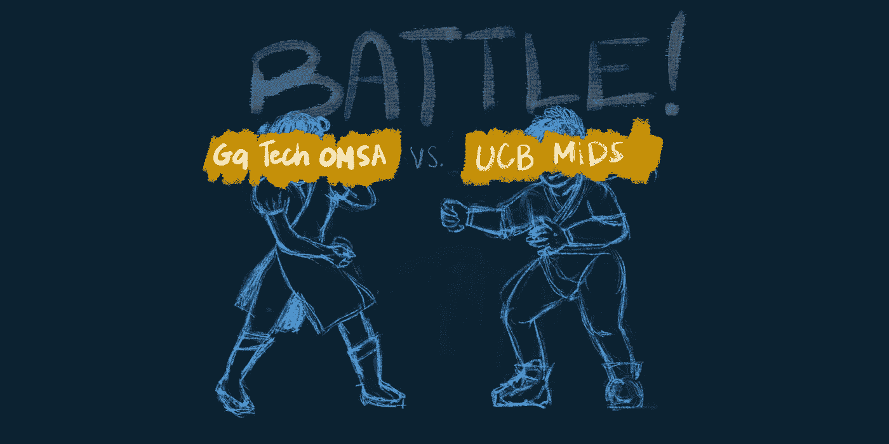

# 项目开始一年:佐治亚理工学院 OMSA 分校 vs 加州大学伯克利分校 MIDS 分校

> 原文：<https://towardsdatascience.com/1-year-into-the-program-georgia-tech-omsa-vs-uc-berkeley-mids-c1675356d531?source=collection_archive---------6----------------------->

## 哪项投资值得你花费时间和金钱？

第一轮。战斗！(图片由作者提供)

我正与我的好朋友和前同事 [John Lee](https://www.linkedin.com/in/csjohnlee/?miniProfileUrn=urn%3Ali%3Afs_miniProfile%3AACoAAAdLAHIB8BF9KF_d8ZD-vLj0PLMStn_kby8) 合作，将我们在**一年后**的经历与**两个不同的数据科学/分析在线硕士项目**进行比较。

我们将这篇文章分成 3 个部分:1)分享一些关于我们自己的信息，2)在 **2 分钟**中总结 **2 个项目，以及 3)回答 **10 个关于我们现在了解的**项目的问题。**

# 关于你的参赛者

2019 年秋季同时开学，约翰报名参加了加州大学伯克利分校**数据科学硕士(MIDS)** 项目，而我报名参加了佐治亚理工**在线分析科学硕士(OMSA)** 项目。

为了搭建舞台…

*   我们的年龄(28-30 岁)和人生阶段(与不同城市的配偶结婚，没有孩子)非常相似。
*   我们俩有着相似的职业道路(之前是环境工程专业的本科生，后来成为暖通空调/能源效率专业的机械工程师)。在某个时候，我们是两个不同组织的同事。我们有大约 6-7 年的工作经验。
*   我们都在日常工作之外兼职学习(不是数据科学家)。
*   开始这个项目时，我们都没有什么编程或数据科学经验。
*   我们都完成了项目中的大部分基础课程。

为什么这些相似之处是相关的？这证明了我们经验中偏见的一些背景。

# 两分钟之内，一年的项目看起来像什么？

我们认为“项目一年”相当于两个学期(秋季和春季)。虽然，严格来说，MIDS 每年有三个学期。MIDS 需要暑期班，但 OMSA 不需要。

*免责声明*:请记住，你应该参考官方学校的网站([盖茨 OMSA](https://pe.gatech.edu/degrees/analytics) ， [UCB MIDS](https://datascience.berkeley.edu/) )获取最新信息。

## **盖茨 OMSA**

选修的课程:12 门课程中的 3 门

a.ISYE 6501 —分析建模入门(难度:3/5，平均时数/周:10–15)
b . MGT 8803—商业分析入门
(难度:2/5，平均时数/周:5–10)
c . CSE 6040—数据分析计算入门
(难度:3/5，平均时数/周:10–15)

还有两门课程被认为是 OMSA 学生“必读”课程清单的一部分:d . MGT 6203-商业数据分析，和 e. CSE 6262 数据可视化和分析。

**期限:**您有最多 6 年的时间来完成该计划。每学期最多可以上 2 节课(如果想上 3+节课，联系项目)。我发现每学期 1 节课最适合我的工作生活平衡。如果你需要选择退出一个学期(秋季或春季)，你需要联系该计划。

**费用:** (3 个班)*(3 个单位/班)*(＄275/单位)+(＄304 校园费/学期)* 2 个学期= 3083 美元。

**资源:**面向 GT 学生的典型在线资源工具(图书馆、项目、技术折扣等)。)、 [Slack 频道](http://omsa-study.slack.com)(需要 gatech.edu 的邮箱地址或者[给 Slack 的主人](https://docs.google.com/spreadsheets/d/1j--C5eVxlbMBDBnp68IZX9cY6hbCoGsA8S2CsRK1zlA/edit#gid=0))、 [Reddit](https://www.reddit.com/r/OMSA/)

**录取率:**校内版的[录取率更低](https://www.analytics.gatech.edu/career-services/student-profile)。OMSA 录取率在 2017 年约为 24–27%，在 2019 年移至[~ 70%](https://www.reddit.com/r/OMSA/comments/egee6p/fall_2020_admissions_thread/)([more GaTech stat](https://lite.gatech.edu/))。

**社区规模:**2019-2020 年约有 [~2.8k 在读学生](https://lite.gatech.edu/lite_script/dashboards/enrollment.html)。截至 2020 年 5 月，我们在 OMSA 研究 Slack 频道和 Reddit 上大约有 3.7k。

**加入计划前的准备:**我考了 UCSD edX Python 的数据科学，交了 350 美金的验证证书。我还兼职做了一些项目。项目+ edX 课程可能总计约 80-100 小时。

## 加州大学伯克利分校 MIDS 分校

参加的课程:9 门课程中的 4 门

a.W200 —数据科学的 Python 基础
(难度:3/5，平均小时/周:18)
b. W201 —数据和分析的研究设计应用
(难度:2/5，平均小时/周:10)
c. W203 —数据科学的统计学
(难度:4/5，平均小时/周:20)
d. W205 —数据工程基础
(难度:3/5，平均小时/周:8)

还有一门额外的基础课:e .应用机器学习。点击查看课程列表[。](https://datascience.berkeley.edu/academics/curriculum/)

持续时间: MIDS 要求夏季学期作为最长 8 个学期(包括夏季学期)的一部分才能毕业。MIDS 允许学生因紧急情况而休学一学期。

**费用:** (4 个班)* (3 个单位/班)*(2573 美元/单位)+(728.50 美元校园费/学期)* 2 个学期+ $95 (1 次)= 32428 美元。([官方网站](https://datascience.berkeley.edu/admissions/tuition-and-financial-aid/))

资源:任何伯克利学生都可以使用的典型在线工具(图书馆、项目、技术折扣等)。)、WeWork Access(超级酷)、Slack Channel(一旦被该计划接受)、Zoom、通常每年 3 次的面对面会议(但是，学生只需参加**一次**，500 美元/注册+差旅费)

**录取率**:不知道。一份 2018 年 [MIDS 项目状态报告](https://www.ischool.berkeley.edu/sites/default/files/page_attachments/mids_program_status_report_2018.pdf)披露了一些数字，例如该项目每年接受约 150 名学生，目标是增加到 450 名。

**社区规模:**截止 2020 年 5 月，我们的 Slack 频道约有 880 名会员，官方[学堂资讯频道](http://ucbischool.slack.com/)有 2.5k。一旦你被该计划接受，你将需要 ischool.bekeley.edu 帐户加入。

**加入计划前的准备:**我上了数据科学基础、Python 编程、计算机科学导论、算法导论等在线课程。除了准备 GRE 考试(不再需要)，个人准备的总时间大约是 200 小时。

# 1 年后我们学到的 10 件事

完成了秋季和春季学期后，我们对各自项目的理解肯定比最初申请时更加清晰。

## 1.课程如何“体验”？

*   *盖茨 OMSA:* **班级规模从每班 400 名学生到超过 1000 名学生不等**(如果算上 Edx micro master/验证过的学生)。在基础课程之后，这个数字可能会更低。Piazza(官方课程论坛)有时很难跟进每个帖子，但幸运的是，GaTech 和 Edx 学生有单独的论坛。**讲座**是预先录制好的。**成绩**在很大程度上基于考试(理解这一点有一些变化)。总的来说，我认为这类似于我在大学时的传统课堂经历。
*   *加州大学伯克利分校 MIDS 分校:* **班级规模**低于 [20 人/班](https://datascience.berkeley.edu/experience/)。**讲座**正在**现场直播并录制**。**成绩**很大程度上基于项目。

## 2.你每周花多少时间？

*   盖茨 OMSA : [OMScentral](https://omscentral.com/) 是一个很棒的**班级复习网站**，在这里你可以更广泛地了解**时间承诺和难度**因班级而异。就我个人而言，我接近大多数课程的平均水平，平均每周 10-15 小时。
*   加州大学伯克利分校 MIDS 分校:课堂讨论主要在 Slack 上进行。我平均每周花大约 15 个小时来阅读至少 50%的指定阅读材料。

## 3.关于这个项目，我们最惊讶的是什么？

*   *盖茨 OMSA* :绝对有一门**【艺术】****【科学】**一样多的分析学。另外，**并不是所有广告的课程**每学期都有，尤其是计算方向。你也不能参加 OMSCS 的课程，除非它们是通过 OMSA 项目提供的，这个项目可能每个学期都有变化。
*   加州大学伯克利分校 MIDS 分校:我很惊讶同学们是如何做到全职工作和管理工作量的。这个在线项目也比我预期的要好很多。首先，我认为在线课程与 Udemy 上的典型在线课程没有太大区别，在 Udemy 上，你可以观看讲座，做一些作业(不太关心质量)。然而，**现场会议和与同学在项目上的合作会激发你的积极性**。此外，与他人一起努力完成工作比独自上课教会你更多，因为讨论的是你从未想过的问题/话题。

## 4.你能应用你学到的东西吗？

*   盖茨 OMSA:我能够比我预期的更多地应用我所学到的东西。例如，CSE 6040 使我能够在解析 pdf 文件时应用 regex。MGT 8803 帮助我理解了会计和预算中支持我的经理角色的财务术语。ISYE 6501 让我准备好不断思考如何将机器学习方法应用于实际问题。
*   *加州大学伯克利分校 MIDS 分校*:我的几个同学合作对新冠肺炎数据集进行了探索性分析。统计学课程(W203)教会了我不要盲目相信任何研究。你真的要看看它的方法，自己决定是否有假阳性或假阴性。

## 5.你最喜欢这个节目的哪一点？

*   *盖特奇·OMSA*:我很高兴我接触到了很多基础统计学和机器学习理论。这很重要，因为我可以理解数学证明和论文。我对理解这些材料更有信心，并有动力去寻找潜在的应用。我真的很喜欢活跃的 slack 频道，也喜欢和我当前职业领域之外的人联系。
*   加州大学伯克利分校 MIDS 分校:作为这个项目的一部分，我真正感激的是在使用数据处理和从数据中获取价值方面获得了信心。从我开始这个项目到现在总共有 180 个。我喜欢学习是渐进的，你学习建立你的环境，学习概念，然后应用到一个项目中。

## 6.你最不喜欢这个节目的哪一点？

*   盖特奇·OMSA:有时候会让人感到孤立。
*   加州大学柏克莱分校 MIDS 分校:学费高昂。

## 7.到目前为止，你对你参加的课程和/或课程的整体质量感觉如何？

*   盖茨 OMSA:只要你投入工作，基础课程对初学者来说是友好的。我确实从我上的每一堂课中获益匪浅。另一方面，我确实认为，在以前的学生做了大量的评论之后，项目课程可以得到改进。由于可用性和顺序设计，我很难选择课程。你必须四处打听，才能知道先上哪门课是个好主意。
*   *加州大学伯克利分校 MIDS 分校*:基础课程对于数据科学领域的初学者是可行的。但我总是遇到一些同学(他们知道得更多)，让我觉得我不应该在这里(冒名顶替综合症)。例如，我已经按照指示干净、清晰地完成了一个数据分析项目的数据流。提交后，另一名同学超越并分享了他们的相同项目，但相反，他们创建了一个攻击僵尸的游戏来生成流数据。看到其他学生所做的真的激励我去尝试更困难的任务。

## 8.如果时光能够倒流，你还会选择这个节目吗？

*   盖茨 OMSA :佐治亚理工学院计算机科学在线硕士(OMSCS)是一个非常受欢迎的“哥哥”在线项目。事后看来，我认为我应该选择 OMSCS，因为它更符合我的个人目标，并且在我的舒适区之外。例如，如果你想成为一名机器学习工程师或更多地参与生产管道，Reddit 上的意见建议 OMSCS 可能是一条更好的道路，因为你为开发管道做了更好的准备。我有点担心我将来不会被更认真地对待一个更技术性的角色。尽管如此，我真的很喜欢我正在学习的东西，并计划坚持这个项目。
*   *加州大学伯克利分校 MIDS 分校*:是的。我仍然不知道我是否更喜欢其他节目，因为我不知道其他节目会怎么样。无论如何，我很自豪也很高兴成为这个项目的一部分。它非常适合我，一个不知道从哪里开始学习数据科学的人。

## 9.你的项目的价值因素是什么？

*   *盖茨 OMSA* :物有所值的因素肯定是**负担能力**和**高声誉的学校**。有些课程很有挑战性(20 多小时/周)，有些则更灵活(< 20 小时/周)。如果你有策略地选择课程，如果这是你的目标，你可以更快地完成课程(范围从 1200 小时到 2000 小时)。这是一个混合了商业课程的跨学科项目，这可能会给某些雇主增加加分，以资助你的高级学位。
*   *加州大学伯克利分校 MIDS 分校*:伯克利 MIDS 分校绝对拥有**强大的网络，一个积极上进的同龄人社区**，以及在美国西海岸**广为人知的名校。虽然除了与课程相关的材料，我还没有与我的网络讨论过其他内容，但我接触过的一些同学都在英伟达(Nvidia)、方(FANG)和其他硅科技公司工作。拥有这样的班级群体的好处是真正看到了他们对家庭作业问题的看法，他们的工作场所会如何处理类似的问题，以及他们在该领域的知识。**

## **10.你对每个项目的潜在学生有什么建议？**

*   ***盖茨 OMSA* : **垃圾进=垃圾出。从数据分析到你从这个项目中得到的东西，一切都是如此。我推荐所有潜在的学生阅读这个 [Reddit 的常见问题指南](https://www.reddit.com/r/OMSA/wiki/index)。省省吧。预订它。多读几遍。**认真对待先决条件** ( [编码](https://www.edx.org/professional-certificate/introduction-to-python-programming)、[微积分、](https://www.math.gatech.edu/courses/math/1712)、 [prob/stat](http://www2.isye.gatech.edu/~sman/courses/6739/) 、[线性代数](https://www.edx.org/course/linear-algebra-foundations-to-frontiers-2))用 Jupyter 笔记本(或任何你喜欢的工具)尝试简单的项目( [1](https://www.kaggle.com/c/house-prices-advanced-regression-techniques) 、 [2](https://www.kaggle.com/neuromusic/avocado-prices) 、 [3](https://www.kaggle.com/uciml/iris) )会帮助你在开始时不那么沮丧。如果你在考虑申请 OMSA 大学，这里是我的博客，告诉你如何申请。****
*   **加州大学伯克利分校 MIDS 分校利用你的人际网络。无论是在课堂上还是在职业上，你都可以从他们那里学到很多东西。许多人都是来自加州湾区和科技公司的高水平专业人士。对待你的项目，就好像它们会在你的作品集里展示给招聘经理看一样。不要担心成绩，如果你努力，成绩就会随之而来。更早地进入简单的 DS 项目。学习一些 Linux 命令和 git。一旦开始上课，就会变得很忙。**

**每个项目都提供不同的体验。不管它们是否适合你，最终还是要由你自己来决定。**

**如果你正在考虑选择哪所学校，我们希望这能为你的研究和决策过程提供有价值的见解。如果你觉得这很有帮助，或者希望看到更多关于这些在线硕士项目的问题，请鼓掌！:)**

**请随时在社交媒体上与我们联系:**

****跟随容闳上** [中](https://medium.com/@yungcodes)。[推特](https://twitter.com/yungcodes1)。 [Github](http://github.com/datyungling) 。**

****在** [Instagram](https://www.instagram.com/csjohn_lee/) 上关注约翰。[领英](https://www.linkedin.com/in/csjohnlee/)。 [Github。](https://csjohnlee.github.io/)**