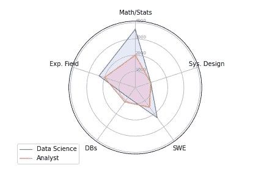
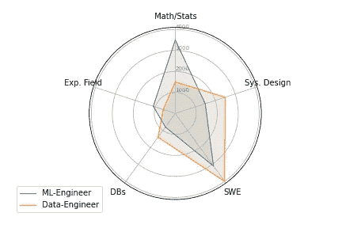

# 10.000 小时的数据科学|熟练掌握

> 原文：<https://towardsdatascience.com/10-000-hours-in-data-science-gaining-proficiency-440387e723c1?source=collection_archive---------41----------------------->

## 从数据新手到专业人士的路

反数字时钟，布拉格犹太市政厅时钟-理查德·迈克尔(版权所有)。

有一种观点认为，练习一件事超过 10000 小时(10000 小时)就能让你对这门学科达到足够的熟练程度。这个概念是基于 M. Gladwell 的《T2》一书《局外人》。所说的 10k 小时是你花在练习或学习一门学科上的时间，直到你掌握得很牢固，可以被称为精通。虽然这个小时数有些随意，但我们将看看如何利用这些小时来精通数据科学领域。

想象一下，这是你在数据学徒之旅中的学习预算。如果我从零开始，这就是我如何花这一万个小时成为一名熟练的数据科学家。

# 核心模块

**数学与 *Stat* istics:** *基础统计学、贝叶斯统计、数据分析导论、一些概率论、基础分析与微积分*。
数据科学家的主要工作是从问题领域提供数据洞察。牢固掌握数学基础是必不可少的。你可以从现有的大学课程和 [Coursera 课程](https://www.coursera.org/collections/math-skills-statistics-data-science)中找到很多优秀的内容。这是开始您的旅程并初步了解统计工作原理的好方法。不过，基础课程是必不可少的，请用[真实交易](https://ocw.mit.edu/courses/mathematics/18-650-statistics-for-applications-fall-2016/lecture-videos/lecture-18-video/)挑战自己。假设是 2500 小时(312 天 8 小时的工作时间)。

***分析/统计语言和模块* :** *R，Python(熊猫)，Julia，SAS* 。这是你的面包和黄油，可以被视为你统计教育的一部分。这就是边做边学。阅读一本关于 R 的奥莱利的书只会让你到此为止。加载一个精选的数据集，一些挑战和解决一些问题。统计语言存在一个范围。因此，如果你接近科学计算，你可能会考虑朱莉娅。仅有统计分析的另一端是 SAS。有些人认为 R 可以两者兼得。
1000 小时(125 天 8 小时工作制)

***多用途编程语言* :** *Python，Go，Java，Bash，Perl，C++* ，…
这在很大程度上取决于您每天面对的系统。如果你刚开始，选择一门语言并坚持下去。一旦你学会了这个概念，你就会更容易学会不同的语言。我本人在日常工作中非常依赖于 Python 和 Bash 的组合。其他任务需要彻底理解优秀的旧 Java，甚至是 Perl。
2000h (250 天 8 小时工作制)。

***数据库技术*** : *{T-，My-，U-}SQL，PostgreSQL，MongoDB，…* 。
关系型或非关系型数据库是您在生产环境中必须使用的一些系统。了解你的数据是如何存储的，查询是如何运行的，如何撤销一个交易是很有用的。对于以后的工作，你的数据来源可能会有很大的不同，最好有一个基本的了解。
750 小时(94 天 8 小时工作制)

***操作系统* :** *Windows，Linux，MacOS。无论你的工作环境如何:掌握它！知道来龙去脉。这一次你可能需要安装一些非常奇怪的库来解决一个特定的问题(*真实故事*)。知道东西在哪里以及它们为什么在那里有很大的帮助。了解什么是 SSH 连接，以及如何在不同的系统上运行分析。不在本地机器上运行分析将会在未来的某个时候发生。500 小时(62 天 8 小时工作制)。*

***ETL/ELT 系统:*** 这是编程语言、数据库技术和操作系统的混合体。像 [Spark](https://spark.apache.org/) 、 [Hadoop](https://hadoop.apache.org/) 、 [Hive](https://cwiki.apache.org/confluence/display/Hive/LanguageManual) 这样的框架为集群计算平台上的数据存储和分析提供了先进的手段。一些公司可能依赖于不同的技术栈，如微软 Azure Systems、谷歌云或 AWS 解决方案。这与数据库技术密切相关，可能已经要求对高级编程语言(如 Java 或 Python)有很好的理解。也有初学者系统，像 [KNIME](https://www.knime.com/) 让你的脚沾水。400 (50 天 8 小时)

***你的问题域*** :这可能是 *Fin-Tech，Bio-Tech，Business Analytics。你应该熟悉你的工作领域。你做的是研发吗？您是否在可视化业务流程和客户行为？不同的领域需要不同的见解。您的数据必须对您有意义，并且您应该能够看到模型输出是在有效范围内还是完全偏离。花*绝对*最少 350 小时在你的问题领域。我建议更多。多得多。你可以决定你是想成为万金油还是你所在领域的专家。
>350 小时(44 天 8 小时)*

细心的读者会发现，到目前为止，这总共才 7500 个小时。我们现在有一个基础，你可能想从这里进入某个方向。

# 不同的数据交易——你的个人方向

回到过去，黑暗蒙昧的时代，我们有行会。处理数据的领域也有不同的行业。不同类型的商人解决不同的问题，在这个主题上有不同的[文章](https://medium.com/ai-musings/the-different-types-of-data-scientists-and-what-kind-you-should-hire-4475abee2bbd)。
以下是这些行业在要求上的不同之处:

1.  **数据科学家:**你做统计和分析，你推出解决方案，部署回答问题和提供见解的平台。干净利落。升级你的统计游戏:+ 200h。也许是一点我们称之为统计学习的 ML+100h 和某种类型的多用途语言，比如 Python、Perl 或 Bash。
2.  **数据工程师**:你关心数据。您构建系统，使数据科学家能够有效地工作，并为分析师提供日常面包。你的重点在于底层系统。系统+500 小时，ETL/ELT 系统+200 小时，数据库和编程语言+200 小时。你甚至可以不要过多地参与统计部分(500 小时的纯统计和理论)。
3.  **机器学习工程师**:你实现了让奇迹发生的模型。你需要所有的统计洞察力，还需要精通所有的 ML-
    +300 小时 ML，+200 小时 Stats。你还应该精通一种高级编程语言，这种语言首先使得实现 ML 模型成为可能。
4.  **分析师**:你从系统中获取数据，让它变得漂亮，便于管理层报告。您需要知道在您的问题领域中什么是重要的，在问题案例中+200h，在数据库系统中+100h。您每天都需要您的 SQL。尽管有各种各样的分析师工作。所以通知自己，继续学习你认为必要的东西。

*数据科学家的时间和经验与分析师的工作相比。*

*ML 工程师相对于数据工程师的时间和经验。
Math/Stats = Mathematics and Statistics，包括您使用 r 等 stat 语言的工作。
Systems =设置和维护数据系统(例如 ETL/ELT、GC、AWS 等)
DBs =数据库系统(关系型、非关系型)
SWE =软件工程(Python、Perl、Java、Scala、Go、JavaScript 等)
Exp。领域=问题领域的经验。花在这个话题上的时间。*

上面的数字说明了典型的职业以及在每个领域可以投入多少时间和精力。这些只是简单的建议，因人而异。例如，我们示例中的数据工程师也可以称为处理大量数据的软件工程师，与软件开发相比，另一个工程师需要更多的数据库工作经验。

就像生活中的一切一样，界限是模糊的。有时数据科学家也做 ML 工程师的工作，反之亦然。请记住，10k 预算是你的入门，给你一个进入该领域的方向，而不是你的专业。因此，你拥有世界上所有的自由，最终去攻读你一直想要的超心理学博士学位。

# 一万小时是多少工作

一万小时是一段很长的时间，如果你要工作一年，那就是每天 27 小时，这对普通人来说不太可行。
因此，更好的 3 年约 9 小时的工作可能更适合。
如果你在兼职学习，并希望在未来的某个时候换一份工作，那么再过几年你可能就万事俱备了。重要的是**要和它**保持一致。几年后，每天几个小时的高质量锻炼会让你受益匪浅。

# 关键要素

没关系，如果你在大学、在学校、在研讨会或在家里花了一万个小时。你必须**展示你的作品**。一个学位，如果做得正确的话，可以显示这一点——但这并不是必须的。它是关于通过解决问题获得领域经验和概念的熟练程度。
**解决一个问题，并把它放入文件夹**、你的简历或你的 GitHub 库。

对你最合适的。人们雇佣你是因为你解决问题的能力。不是为了你两年前在那个项目上得到的。你可能会说这是一个非常酷的项目。

太好了！如果你对宇宙有所贡献，你应该告诉人们。

这是一个漫长的旅程，如果你喜欢你所做的事情，它就是值得的。一路上你会学到很多东西。

**简短的免责声明:**请始终记住，在野外有不同领域的数据科学相关工作。每项工作都有其特定的目的，需要不同的工具。每个雇主可能会寻找不同的技能组合。祝你一路顺风！