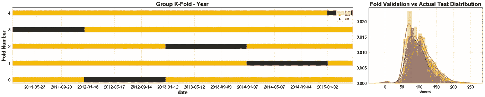

# 可视化的 10+1 交叉验证技术

> 原文：<https://towardsdatascience.com/10-1-cross-validation-techniques-visualized-9013095fb68e?source=collection_archive---------41----------------------->


在本文中，我们将:

*   探索 **11 种交叉验证**技术。
*   **可视化****培训**和**验证**样品在**中各折**。这是立即理解特定 CV 技术如何工作的最佳方式。
*   **绘制**每次**验证**中的**分布与实际**测试**的分布。**

我们有一个数据集。它被分成两部分。一个叫做训练，另一个叫做测试。除了一列之外，它们的列数相同。培训也有目标。

我们的任务是在训练数据上拟合模型，在测试数据上预测未知目标。

我们不能仅仅满足于所有的训练数据，并期望测试一切顺利。我们需要验证我们的模型捕获了训练数据中的隐藏模式，是稳定的，不会过度拟合，并且在未知数据上概括得很好。


初始数据集分为训练和测试。培训用于交叉验证。来源:[向数据科学](/train-test-split-and-cross-validation-in-python-80b61beca4b6)，通过[阿迪·布朗什坦](https://towardsdatascience.com/@adi.bronshtein)

这就是交叉验证发挥作用的地方。

我们中的许多人都熟悉并使用最著名的交叉验证技术，其中训练集被分成 K 个部分，在 K 次迭代的每一次中，不同的部分被用作测试集(称为验证集)，而剩余的集被用于训练。在每次迭代中，进行预测，最后的预测是它们的平均值。


十重交叉验证。来源:[牛等人](https://www.mdpi.com/1422-0067/19/7/2071)，转自 [researchgate](https://www.researchgate.net/figure/Ten-fold-cross-validation-diagram-The-dataset-was-divided-into-ten-parts-and-nine-of_fig1_326465007)

在我们开始之前，先说几句:这个数据集来自 M5 预测准确性竞赛。任务是尽可能精确地预测沃尔玛在美国销售的各种产品的单位销售(需求)。在这个演示中，我将使用这些数据中的一部分。这个数据是时间序列的。这里将展示的一半技术在时间序列数据的参考书目中没有被推荐(尽管在这里它们表现得相当好)。

我选择尽可能保持文章的整洁，不在这里包含代码。

你在这里看到的所有东西的代码都在我的 Github 上。

好了，我们走吧！

首先快速绘制数据集的目标。测试集正好是一年。


# 1.k 倍交叉验证—无洗牌

在参考文献中，已知并且不建议对时间序列数据使用这种类型的 CV，因为它忽略了数据中的一致性。记住实际的测试数据是未来的一个时期。

分布图用橙色显示了每次迭代验证的 5 个分布，用蓝色显示了实际样本外测试数据的分布。


```
CV mean score: 		   23.64240, std: 1.8744.
Out of sample (test) score: 20.455980
```

# 2.k 倍交叉验证—洗牌

五分之一的数据也是每次迭代中的验证集，但这次它随机分布在整个数据中。和前面一样，在一次迭代中用作验证的每个样本永远不会在另一次迭代中用作验证。


```
CV mean score: 		   22.59125, std: 1.7155.
Out of sample (test) score: 20.526280
```

# 3.随机排列交叉验证

ShuffleSplit 将在每次迭代期间随机采样整个数据集，以生成训练集和验证集。test_size 和 train_size 参数控制每次迭代的验证和训练集应该有多大。因为我们在每次迭代中从整个数据集进行采样，所以在一次迭代中选择的值可以在另一次迭代中再次选择**。**

**由于一些数据不包括在训练中，这种方法比正常的 k 倍交叉验证更快。**

****

```
CV mean score: 		   22.47461, std: 2.2129.
Out of sample (test) score: 20.630861
```

# **4.分层 K 倍交叉验证—无洗牌**

**类似于正常的 K 折叠，但是每个折叠包含每个目标的大约相同百分比的样本。最好与分类一起使用，而不是回归。**

****

```
CV mean score: 		   22.57824, std: 2.7578.
Out of sample (test) score: 20.532799
```

# **5.分层 K-折叠交叉验证——带洗牌**

**对于每个目标，折叠包含大约相同百分比的样本，但是首先，数据被打乱。**

****

```
CV mean score: 		   22.51464, std: 3.0626.
Out of sample (test) score: 20.585582
```

# **6.分组 K 倍**

**我们可以从数据集的另一列定义组。确保同一组不在训练集和验证集中。**

****

```
CV mean score: 		   23.21066, std: 2.7148.
Out of sample (test) score: 20.550477
```

**在前一个示例中，我们使用 year 作为组，在下一个示例中使用 months 作为组。**

****

```
CV mean score: 		   22.32342, std: 3.9974.
Out of sample (test) score: 20.481986
```

# **7.成组的 K 倍——去掉一个组**

**在每次迭代中，用除一组以外的所有组的样本训练模型。在以月为组的情况下，执行 12 次迭代。**

****

```
CV mean score: 		   22.48503, std: 5.6201.
Out of sample (test) score: 20.468222
```

# **8.随机排列的分组 K-折叠**

**这是两种方法的结合。我们定义组，并在每次迭代期间随机采样整个数据集，以生成训练集和验证集。**

****

```
CV mean score: 		   21.58829, std: 2.5721.
Out of sample (test) score: 20.365067
```

# **9.时间序列分割**

**建议将以下方法用于时间序列数据。**

**在时间序列分割中，训练集总是被分成两部分。第一部分始终是训练集，而后一部分是验证集。验证集的长度保持不变，而训练集随着每次迭代变得越来越大。**

****

```
CV mean score: 		   24.32591, std: 2.0312.
Out of sample (test) score: 20.999613
```

# **10.阻止时间序列分割**

**训练集和验证集在每次迭代中都是唯一。没有值被使用两次。训练集总是在验证之前。由于在更少的样本中训练，它也比其他交叉验证方法更快。**

****

```
CV mean score: 		   22.57081, std: 6.0085.
Out of sample (test) score: 19.896889
```

# **奖金:11。清除的交叉验证**

**在每次迭代中，在训练集之前和之后，我们移除一些样本。**

****

```
CV mean score: 		   23.64854, std: 1.9370.
Out of sample (test) score: 20.589597
```

**将禁运设置为大于 0 的值，我们将在验证集之后移除额外的样本。**

****

```
CV mean score: 		   23.87267, std: 1.7693.
Out of sample (test) score: 20.414387
```

**最后，让我们看看每种技术在交叉验证均方根误差和实际测试 RMSE 上的表现。**

****

**我把这个留给你作为思考的食粮，来决定哪种技术是最好的。**

**我会选择随机排列的 K 倍群。**

**参考资料:**

**[https://hub . packtpub . com/cross-validation-strategies-for-time-series-forecasting-tutorial/](https://hub.packtpub.com/cross-validation-strategies-for-time-series-forecasting-tutorial/)**

**[https://sci kit-learn . org/stable/modules/cross _ validation . html](https://scikit-learn.org/stable/modules/cross_validation.html)**

**[https://www . Wiley . com/en-us/Advances+in+金融+机器+学习-p-9781119482086](https://www.wiley.com/en-us/Advances+in+Financial+Machine+Learning-p-9781119482086)**