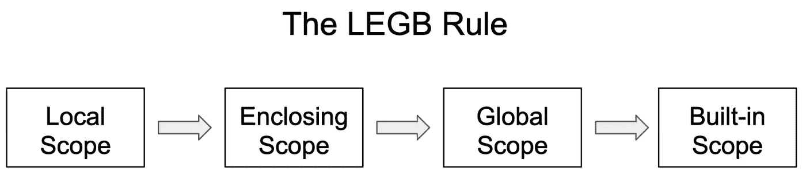

# 不熟悉 Python？每个 Python 程序员都应该知道的 10 个缩写

> 原文：<https://towardsdatascience.com/10-acronyms-that-every-python-programmer-should-know-58008635b5fe?source=collection_archive---------13----------------------->

阿希什·阿查里亚在 [Unsplash](https://unsplash.com?utm_source=medium&utm_medium=referral) 上拍摄的照片

## 编程原则、规则和一些有趣的事实

# 介绍

Python 已经成为很多开始学习编码的人的编程语言选择。它有非常直观的语法和支持动态类型的灵活性。此外，它是一种解释语言，这使得使用交互式控制台进行学习成为可能。基本上，你可以只使用一个命令行工具，比如 Mac 中的 Terminal，来开始 Python 的学习，因为现在 macOS 都附带了 Python。

当你学习 Python 时，你会逐渐熟悉它的数据结构、控制流、类、函数和其他基本的东西。我发现有趣的一件事是 Python 中的各种首字母缩写词，我们不时会遇到。本文将回顾十个这样的缩略语。其中一些是通用编程原则，而其他一些则更具体地针对 Python 编码。然而，它们中的每一个都有自己有用和/或有趣的方面。

## 1.面向对象编程

我们应该知道的第一个缩写是 OOP——面向对象编程，这是 Python 的设计基础。我们知道编程本身是关于编码的，但是程序本身应该是关于数据的。我们的程序需要输入数据、处理数据和输出数据。请注意，这里讨论的数据是最广义的，可以包括表格数据、字符串、用户动作(例如，点击按钮)、图像和任何形式的具有信息的数据。我们代码的工作就是处理这些不同形式的数据，并以期望的方式呈现它们。

为了完成我们的工作，我们需要能够处理这些数据的代码，现代编程语言(包括 Python)中一个常见的设计模式是采用 OOP 范例。**这个想法非常直观——我们用特定的对象包装我们的数据。**更具体地，对象可以保存数据(例如，属性)并且可以操作数据(例如，方法)。例如，如果我们开发一个赛车游戏。我们可以构建汽车对象，每个对象都有特定的属性，比如颜色、最大速度和重量。此外，这些对象可以有操作，如刹车和加速。这些数据的逻辑组织以汽车为中心。

让我们看一个 Python 中的具体例子。我们可以使用内置的 *str* 类包装字符串数据，这不仅允许我们使用字符串对象传递字符串数据，还允许我们改变字符串的表示方式。下面来看一个很琐碎的例子。

字符串数据的操作

## 2.干(不重复)

干的原则(不要重复自己)是每个程序员都应该实践的最根本的规则之一。这个想法很简单— **如果你注意到你的代码中有任何重复，这是一个信号，你需要进行一些重构**,以尽可能减少重复代码或完全删除任何重复。以下伪代码向您展示了应用 DRY 原则对一些代码进行的重构。

不要重复你自己

代码重构的另一个可能场景是，您发现自己要处理一堆具有相同结构的数据。与其使用一系列字典、列表或元组来存储每个个体的数据，不如考虑用自己的类来处理这些数据。这不仅仅是为了让你的代码不容易出错，也是为了长期的可维护性。

## 3.PIP(Python 的包安装程序)

Python 受欢迎的最重要原因可能是它的开源特性，这产生了大量的免费 Python 包。根据[维基百科](https://en.wikipedia.org/wiki/Python_Package_Index)，在 Python 包索引(PyPI)中有超过 235，000 个包被编入索引。我们可以使用 pip 工具从 PyPI 安装任何包。安装相当简单，只需要在命令或终端中输入一行代码。下面的代码片段总结了一些常见的用法。要了解更多关于 pip 工具的用法，您可以访问其官方网站[这里](https://pip.pypa.io/en/stable/user_guide/)。

PIP 使用示例

## 4.LEGB(本地、封闭、全局和内置)

**LEGB 规则是指 Python** 中的变量查找顺序，如下图所示。具体来说，当解释器试图解析变量时，Python 有四层作用域——理解哪些值绑定到变量。首先从局部作用域开始，它可以是一个函数或者一个类。如果解释器为变量找到了相应的界限值，它将停止查找并使用具有该特定值的变量。

可变分辨率规则

否则，它将在更高的层次上查找— **封闭范围**。封闭范围仅存在于函数的嵌套结构中。具体来说，当一个函数在另一个函数中声明时，我们称内部函数为内部函数，外部函数为外部函数。当解释器试图解析内部函数范围内使用的变量时，如果它不能在局部范围内解析，它将转到封闭范围，即外部函数的局部范围。

如果它仍然不能解析封闭范围内的变量，它将转到**全局范围**。全局范围通常是模块级的，通常是一个独立的 Python 文件。值得注意的是，当您将包导入到当前文件中时，导入的函数和类也将成为全局范围的一部分。**内置作用域**是在解释器启动时加载的函数、类和其他模块，以使这些最基本的对象始终可用(如`print`和其他内置函数)。

## 5.MRO(方法解析顺序)

方法解析顺序表示**Python 或编程语言一般如何解析方法或属性**。与上面讨论的 LEGB 规则不同，LEGB 规则关注的是解析变量，而 MRO 关注的是对象以及如何解析其方法调用或检索特定属性。MRO 主要是在多重继承的上下文中讨论的——从多个类(即超类)和/或多层继承继承的类(即子类)。因为子类和超类共享一些可能不同实现的公共方法，Python 解释器需要一种机制来确定在特定调用中应该使用哪个方法或属性，这是 MRO 负责的。下面的代码片段显示了一个示意性示例。

方法解析顺序

对于 W 类的实例(第 22 行)，当我们调用`bingo()`方法时，这个方法在它自己的类中被解析，因为它是在类中定义的(第 18–20 行)。然而，这个方法将进一步调用`bin()`和`go()`方法。以类似的方式，`bin()`方法在它自己的类中被解析，然而，它调用超类的`bin()`方法，如第 15 行所示。但是在它的直接超类(即 Y 和 Z)中，都没有实现`bin()`方法，因此 Python 将更上一层到超类的超类(即 X)，在那里实现并调用`bin()`方法。

值得注意的是，对于 W 的`go()`方法，它的两个超类都实现了这个方法，但是正如你所看到的，只有 Y 类中使用的实现被调用。这是因为当我们定义我们的 W 类时，继承顺序是 Y 和 Z，这将使 MRO 遵循相同的顺序。与此相关，我们可以使用特殊方法`__mro__`找出特定类的 MRO，如下所示。此外，为了向您展示类继承的顺序是如何重要的，我们创建了另一个类，Z 类在 Y 类之前，这改变了 W_ class 的 MRO。

特殊方法 __mro__

## 6.& 7.EAFP(请求原谅比请求允许容易)& LBYL(三思而后行)

EAFP(请求原谅比请求许可容易)编码风格是 Python 热衷于遵循的。因为 Python 是一种动态编程语言，所以在运行时实现以及修改现有的实例对象、类甚至模块都是可能的。**因此，建议您在编写代码时假设特定的属性或功能是可用的。**换句话说，这个想法是如果一些代码潜在地有特殊的问题，让问题浮出水面并相应地解决它们。通过应用 EAFP 规则，如果我们想更进一步，我们可以简单地使用 *try…except* 语句编写特定的代码来处理代码可能引发的潜在异常。基本上，我们的想法是，当一些意想不到的事情发生时，我们可以事后处理。

与 EAFP 原则相反，还有另一种编码风格叫做 LBYL，代表三思而后行。使用这种编码风格，程序员被期望在某些代码运行之前排除所有可能的不良情况。因此，你可以在项目中看到更多遵循 LBYL 原则的 if 语句。基本上，这种编码风格试图以特别的方式防止任何问题。

下面的代码片段向您展示了一个使用 EAFP 对 LBYL 的可能场景。使用 EAFP 编码风格，我们简单地将我们的代码和预期的可能异常封装在一个 *try…except* 语句中，而使用 LBYL 编码风格，我们必须使用自省方法和值检查来在划分之前验证适用的条件。正如您所看到的，EAFP 代码看起来更整洁，没有创建嵌套结构。当然，如果你愿意，你也可以在你的项目中应用 LBYL。最终项目仍将类似地工作。

EAFP 对 LBYL

## 8.PEP (Python 增强提案)

上一节讨论了一般的编码风格。但是最有影响力的 Python 编码风格指南之一被称为 PEP 8—**Python 增强提案** # 8，由 BDFL(将在接下来讨论)和其他几个 Python 核心维护者撰写。pep 涵盖了很多东西——都与 Python 相关。你可以在[官方网站](https://www.python.org/dev/peps/)找到完整的名单。这里列出了一些值得注意的，请随意阅读。

PEP 8:[Python 代码样式指南](https://www.python.org/dev/peps/pep-0008/)
PEP 257: [Docstring 约定](https://www.python.org/dev/peps/pep-0257/)
PEP 20:[Python 之禅](https://www.python.org/dev/peps/pep-0020/)
PEP 498: [文字字符串插值](https://www.python.org/dev/peps/pep-0498/)
PEP 202: [列表理解](https://www.python.org/dev/peps/pep-0202/)
PEP 405: [Python 虚拟环境](https://www.python.org/dev/peps/pep-0405/)

## 9.BDFL(仁慈的终身独裁者)

什么是 BDFL？当然，部分标题已经告诉你它代表什么，但是它实际上意味着什么呢？这是来自[维基百科](https://en.wikipedia.org/wiki/Benevolent_dictator_for_life)的定义。

> **终身仁慈的独裁者** ( **BDFL** )是一个给少数开源软件开发领导者的头衔，通常是项目创始人，他们在社区内的争议或争论中保留最终发言权。

虽然这个定义通常适用于开源软件开发，但它最初是在 Python 社区中使用的，作为一种指代 Python 编程语言的创造者[吉多·范·罗苏姆](https://en.wikipedia.org/wiki/Guido_van_Rossum) (GvR)的方式。在担任这个 BDFL 角色超过 20 年后，他在 2018 年卸任。如果你对 BDFL 的故事感兴趣，请在他的维基百科页面上探索更多。

## 10.REPL(读取-评估-打印循环)

在我看来，REPL (Read-Eval-Print 循环)是一个方便的工具，可以让学习 Python 变得如此轻松。如您所知，我们可以像使用命令或终端窗口一样简单地开始学习 Python 编码。您可以使用 pip 工具在那里安装您的软件包，如前所示。更重要的是，您可以立即编写您的第一行 Python 代码(例如，可能应该是这一行:`print(“Hello World!”)`)，而不需要对其他编程语言可能需要的 IDE 工具进行任何配置。让我们快速拍一张它的快照。

REPL 的例子

REPL 的工作流程非常简单——读取代码，对其进行评估，并在控制台中打印评估的任何适用结果，然后一次又一次地重复这三个步骤，探索 Python 的各种特性。REPL 在标准 python 或其他常见 Python 开发工具中实现为默认模式，如 ipython，它是著名的 Python 学习和编码工具— [Jupiter Notebook](https://jupyter.org/) 的基础。

# 结论

Python 是一种灵活而强大的面向对象语言，由 BDFL GvR 创建。利用 PIP，我们可以很容易地管理 Python 包，并通过 REPL 在控制台中学习语言和各种包。当我们用 Python 编码时，我们希望遵循 PEP 8 中概述的风格。其他重要的编码原则包括干和 EAFP。如果你愿意，你也可以在你的代码中做一些 LBYL。LEGB 规则和 MRO 将帮助您理解如何解析变量、属性和函数，以使您的代码按预期运行。