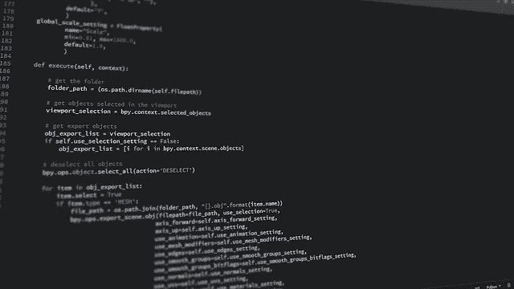

# 深入挖掘:10 本高级人工智能书籍

> 原文：<https://towardsdatascience.com/10-advanced-ai-books-for-those-who-feel-the-need-to-go-deeper-bbb7a7d1c169?source=collection_archive---------25----------------------->

## 获得洞察力并深入了解最先进的方法

图片来自[皮克斯拜](https://pixabay.com/?utm_source=link-attribution&amp;utm_medium=referral&amp;utm_campaign=image&amp;utm_content=408302)的赫尔曼·特劳布

正如你无疑发现了自己，要成为一名有效的机器学习科学家，你需要获得很多知识和经验。要在机器学习和 AI 方面起步，学习几门网络课程和入门书籍大概就够了。然而，为了变得更好，你需要更多的学习。多得多。

大多数关于人工智能最新方法的信息都包含在顶级会议上发表的论文中，如 [ICML](https://icml.cc/) 、 [NeurIPS](https://nips.cc/) 或 [ICLR](https://iclr.cc/) 以及 [arXiv](https://arxiv.org/) 。为了能够阅读这些论文，大多数论文需要在它们各自的领域中有深入的知识，并且(通常)需要有很深的数学理解。更重要的是，整个领域都在以惊人的速度发展。因此，不仅你必须能够阅读这些论文，而且你必须快速阅读它们并提取最重要的部分，以便能够决定其中包含的信息对你是否有用。

在这篇文章中，我收集了 10 本书，我想推荐给任何想深入了解最新技术以及更多数学和编程经验的人。总的来说，这些书对任何想在这个领域工作的人都有意义。我没有包括涵盖特定主题的书籍，如 NLP、计算机视觉或医学图像处理。文章根据特定的主题分为不同的类别。这些书中有几本也可以在网上免费获得，所以没有理由不马上开始学习更多的知识！

# 人工智能的数学基础

图片由[皮克斯拜](https://pixabay.com/?utm_source=link-attribution&amp;utm_medium=referral&amp;utm_campaign=image&amp;utm_content=1023846)的 Gerd Altmann 提供

## 特雷弗·哈斯蒂的《统计学习的要素》

毫无疑问，您会同意，良好的统计学基础对于任何数据科学家都是极其重要的。这本书对统计学习中最重要的概念进行了全面而实际的解释。同时，你不需要成为数学专家来理解这些概念。作者涵盖了监督和非监督学习，包括支持向量机，神经网络和决策树，随机森林，套索回归等等。对我来说，这是任何标准 ML 算法的首选参考。

平装本在[这里](https://web.stanford.edu/~hastie/ElemStatLearn/printings/ESLII_print12.pdf)或者[亚马逊](https://www.amazon.com/Probability-Theory-Comprehensive-Course-Universitext/dp/144715360X/ref=sr_1_1?crid=1YB94M82YSAM9&keywords=probability+theory+a+comprehensive+course&qid=1585743137&sprefix=probability+theory+a%2Caps%2C274&sr=8-1)上可以免费买到。

## 谢尔登·埃克斯勒正确地完成了线性代数

设计作为线性代数的第二课程书，这本书真正深入到线性代数的数学基础。它假设你已经理解了基本概念，而是以一种更理论化的方式来呈现这个主题。虽然为了理解深度学习领域的大多数论文，绝对没有必要非常了解线性代数，但我发现它不仅对阅读，而且对自己的研究都非常有帮助。

在亚马逊上购买这本书的精装本或平装本。

## 概率论:阿齐姆·克兰克的综合教程

这是一本**全面而严谨的**概率论书籍。当我说严格的时候，我是认真的:它是为已经有一些概率论经验的人准备的。像所有关于概率的数学课程一样，它以测度论的一章开始。然而，只有最相关的测量理论概念被涵盖。之后，这本书深入到独立性，条件概率，鞅，马尔可夫链，随机过程和随机积分的概念。由于这是一本主要面向数学家的书，所有的东西都得到了恰当的证明(尽管有些证明是作为练习留下的！)而且你得花时间去理解定理。然而，这本书也提供了大量的例子和数字，以便更好地理解。我会把它推荐给任何想从数学角度理解概率的人。

这本书在[亚马逊](https://www.amazon.com/Probability-Theory-Comprehensive-Course-Universitext-ebook/dp/B00DZ0NM66/ref=sr_1_1?keywords=probability+theory+klenke&qid=1585672573&s=digital-text&sr=1-1)上有精装版。

# 一般人工智能主题

图片由 [Gerd Altmann](https://pixabay.com/users/geralt-9301/?utm_source=link-attribution&amp;utm_medium=referral&amp;utm_campaign=image&amp;utm_content=4736369) 从 [Pixabay](https://pixabay.com/?utm_source=link-attribution&amp;utm_medium=referral&amp;utm_campaign=image&amp;utm_content=4736369) 拍摄

## 《人工智能:现代方法》，斯图尔特·拉塞尔和彼得·诺维格著

这是人工智能圣经。它提供了一个非常好的领域概述，同时非常清晰和简洁，要求惊人的数学背景。这本书还设法涵盖了大量的材料:它开始谈论智能代理、搜索算法和约束满足，接着是易于阅读的逻辑介绍，最后是学习、概率推理、NLP 和机器人等主题。这最后几章是在第三次添加时才添加到书中的，我觉得它们包含的信息并没有真正与其余的内容很好地协调。然而，我可以全心全意地把这本书的其余部分推荐给任何想拓展他的人工智能视野的人。

和所有其他的书一样，这本书在亚马逊上有平装本和精装本。

## 深度学习，作者伊恩·古德菲勒

这本书现在已经成为深度学习的标准书籍，涵盖了非常基础的主题，如线性代数和概率以及前馈网络的介绍，以及更高级的主题，如 CNN，RNNs，正则化和自动编码器。还包括图形模型和蒙特卡罗方法的概述。

如果你刚学完一些基础的机器学习课程，想更深入的了解深度学习，我推荐这本书。

这本书**可以在网上免费获得**在 deeplearningbook.org。精装版在[亚马逊](https://www.amazon.com/Deep-Learning-Adaptive-Computation-Machine/dp/0262035618)上出售。

## 机器学习:概率视角

如果你在你的生活中曾经做过一门适当的机器学习课程，这本书可能已经被推荐给你了。事实上，该领域的顶尖人物之一南多·德·弗雷塔斯(Nando de Freitas)的课程(可以在 YouTube 上找到)就是基于这本书。请注意，这本书并不容易阅读，也不打算这么做:它涵盖了优化，概率，支持向量机，高斯模型，贝叶斯和频率统计，线性和逻辑回归，图形模型，期望最大化，高斯过程，变分和蒙特卡洛推理，聚类和深度学习都在一本书里(哇！).这本书的主题，以及标题中“概率”的原因，是作者倾向于贝叶斯方法。如果你认为线性回归很简单，那就看看贝叶斯线性回归这一章吧！这本书对我来说是过去几十年里对这个课题所做的所有研究的参考。它并没有像我在这里提到的其他书籍一样涵盖深度学习的主题，但它也不打算这样做。还有其他的书也是这样设计的。

再次，[亚马逊](https://www.amazon.com/Machine-Learning-Probabilistic-Perspective-Computation-ebook/dp/B00AF1AYTQ/ref=sr_1_1?crid=U7TSBG1RBA85&keywords=kevin+murphy&qid=1585672055&s=books&sprefix=kevin+murphy%2Cstripbooks-intl-ship%2C249&sr=1-1)提供这本书(精装本)。然而，考虑到这本书的价格，你也可能倾向于从大学图书馆借阅。

## 神经网络和深度学习

这是一本关于深度学习的相对较新的书。我拿起它只是为了看看它是否包含我还没有在其他地方读过的信息，因为我已经读过作者的另一本书([文本的机器学习](https://www.springer.com/gp/book/9783319735306))。男孩被我惊呆了！尤其是第一章让我耳目一新，让我重新思考整个 ML 领域。在这些章节中，Aggarwal 博士建立了支持向量机、回归、奇异值分解和其他经典 ML 算法之间的联系，并解释说这些实际上只是神经网络的特例。很有意思！这本书的其余部分致力于神经网络的基础，非常详细地解释了反向传播，正则化，CNN，RNNs 和自动编码器，同时也简要地看了最新的东西，如注意机制。

在[亚马逊](https://www.amazon.com/gp/product/3319944622/ref=dbs_a_def_rwt_bibl_vppi_i0)上可以找到精装本。

# 更专业的话题

图片由 [Gerd Altmann](https://pixabay.com/users/geralt-9301/?utm_source=link-attribution&amp;utm_medium=referral&amp;utm_campaign=image&amp;utm_content=1594742) 从 [Pixabay](https://pixabay.com/?utm_source=link-attribution&amp;utm_medium=referral&amp;utm_campaign=image&amp;utm_content=1594742) 拍摄

## 强化学习:理查德·萨顿介绍

在我看来，每个从事 ML 工作的人至少应该知道什么是强化学习，因为它目前似乎是我们朝着通用 AI 前进的最大希望。“强化学习”涵盖了这个主题，如果不是详尽无遗(不可能)，那么至少非常广泛。这本书最大的优点是简单明了。在读这本书的时候，我从来没有感觉到作者遗漏了一些可以帮助我更好地理解这个主题的东西。阅读真的是一种享受。虽然它在某些部分变得相当数学化，但更复杂的东西总是被标记出来，如果你喜欢，你可以跳过它(尽管我会建议你从头开始)。

这本书可以在网上免费获得[这里](https://web.stanford.edu/class/psych209/Readings/SuttonBartoIPRLBook2ndEd.pdf)。你也可以在麻省理工学院出版社购买印刷版。

## 统计学中的因果推理:朱迪亚·珀尔的入门

虽然将这本书列入我的清单可能会感到奇怪，因为它涵盖了一个相当有限的主题，但我觉得它值得在这里占有一席之地，主要是因为因果推理正迅速成为人工智能的一个主要话题，朱迪亚·珀尔是首席研究员和因果推理理论的发明者(在他的许多其他成就中)。在这本书里，你会发现什么是因果推理，当然你会学到所有关于因果关系和相关性的知识。它作为因果关系领域的介绍，因此向读者提供概念而不是详尽的细节。它还包含许多例子和发人深省的问题，作为更深入思考这个问题的动力。对我来说，关于反事实的讨论特别有趣，令人耳目一新。

你可以在[威利](https://www.wiley.com/en-us/Causal+Inference+in+Statistics%3A+A+Primer-p-9781119186847)或者[亚马逊](https://www.amazon.com/Causal-Inference-Statistics-Judea-Pearl-ebook/dp/B01B3P6NJM)上买到这本书。

# 高级编程知识

图片来自 [Pixabay](https://pixabay.com/?utm_source=link-attribution&amp;utm_medium=referral&amp;utm_campaign=image&amp;utm_content=1084923) 的 [Johnson Martin](https://pixabay.com/users/JohnsonMartin-724525/?utm_source=link-attribution&amp;utm_medium=referral&amp;utm_campaign=image&amp;utm_content=1084923)

## 流畅的 Python:清晰、简洁和有效的编程，卢西亚诺·拉马尔霍著

IMHO，每个深度学习科学家或者数据科学家都需要能够写出清晰简洁的 Python 代码。虽然设计庞大的代码架构通常不是我们工作的主要部分，但编写易于理解的算法才是。这本书真的可以帮助你发展你的 Python 技能。我在看这本书的时候发现了很多我事先不知道的 Python 特性。我几乎每天都在使用的一个概念是元类。此外，我在其他任何地方都没有找到对 Python 数据模型如此清晰的描述。如果您想让您的同事和 GitHub 追随者对您编写的优雅代码感到敬畏，请拿起这本书！

当然，亚马逊也提供这个。你也可以通过[奥莱利的网站](http://shop.oreilly.com/product/0636920032519.do)购买。

# 结论

有如此多的资源可以用来学习人工智能和机器学习，以至于比以往任何时候都更容易获得关于这一主题的深刻知识。我提供的书籍只是你可以使用的无数高质量材料的例子。我希望这个列表能给你一些指导，让你对外面的世界有所了解。享受阅读！