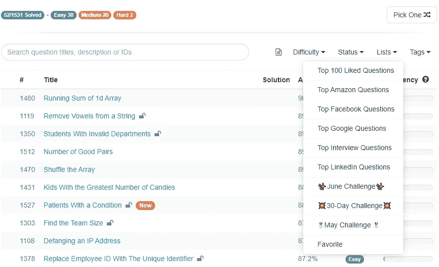

# Python 编码面试前要解决的 10 个算法

> 原文：<https://towardsdatascience.com/10-algorithms-to-solve-before-your-python-coding-interview-feb74fb9bc27?source=collection_archive---------0----------------------->

## [编程](https://towardsdatascience.com/tagged/programming) | [面试](https://towardsdatascience.com/tagged/interviewing) | [办公时间](https://towardsdatascience.com/tagged/office-hours)

## 在这篇文章中，我提出并分享了在 MAANG 访谈中反复出现的一些基本算法的解决方案。


由[上](https://unsplash.com?utm_source=medium&utm_medium=referral)的[间隔](https://unsplash.com/@headwayio?utm_source=medium&utm_medium=referral)拍摄

## 建议的点播课程

*你们很多人联系我要有价值的资源* ***钉 Python 编码面试*** *。下面我分享几个* ***课程/平台*** *我强烈推荐练习完本帖算法后继续锻炼:*

*   [**Python 数据工程纳米学位(uda city)**](https://imp.i115008.net/zaX10r)**→***优质课程如果你致力于从事数据工程的职业，*
*   [***Python 高级编码问题(StrataScratch)***](https://platform.stratascratch.com/coding?via=antonello)***→****我找到的准备 Python 的最佳平台& SQL 编码面试到此为止！比 LeetCode 更好更便宜。*
*   [**用 Python 练习编码面试题(60+题)**](https://datacamp.pxf.io/DV3mMd) **→** *列表、数组、集合、字典、map()、filter()、reduce()、iterable 对象。*

*> > >还不是中等成员？考虑与我的* [***推荐链接***](https://anbento4.medium.com/membership) *签约，以获得 Medium 提供的一切服务，费用低至每月 5 美元***！**

# *为什么练习算法是关键？*

*如果你对 Python 相对陌生，并计划开始面试顶级公司(其中包括 MAANG ),听听这个:你需要现在就开始练习算法。*

*不要像我刚开始解的时候那么幼稚。尽管我认为偶尔破解几个算法很有趣，但我从来没有花太多时间去练习，甚至没有花更少的时间去实现一个更快或更有效的解决方案。在我自己之间，我在想，在一天结束的时候，整天解决算法有点太乏味了，它在真实的日常工作环境中没有实际用途，从长远来看，它不会给我的口袋带来多少。*

> ***“知道如何解决算法会让你在求职过程中获得竞争优势”***

*嗯……我错了(至少部分错了):我仍然认为在算法上花太多时间而不关注其他技能不足以让你获得梦想中的工作，但我明白，由于复杂的问题出现在程序员的日常工作中，大公司必须找到一个标准化的流程来收集对候选人解决问题和关注细节技能的见解。这意味着，知道如何解决算法将让你在求职过程中获得竞争优势，因为即使是不太出名的公司也倾向于采用类似的评估方法。*

*[](/3-ways-to-aggregate-data-in-pyspark-72209197c90) [## PySpark 中聚合数据的 3 种方法

### PySpark 用编码示例解释基本聚合。

towardsdatascience.com](/3-ways-to-aggregate-data-in-pyspark-72209197c90) 

# 外面有一个完整的世界

在我开始更加一致地解决算法后不久，我发现有大量的资源可供练习，学习解决它们的最有效策略，并为面试做好心理准备( [***【黑客等级】***](https://www.hackerrank.com/interview/interview-preparation-kit) *，**[***leet code***](https://leetcode.com/explore/interview/card/top-interview-questions-easy/)，[***coding bat***](https://codingbat.com/python)和[)](https://www.geeksforgeeks.org/python-programming-language/?ref=leftbar)*

*在练习顶级面试问题的同时，这些网站通常会按公司对算法进行分组，嵌入活跃的博客，人们可以在博客上分享他们面试经历的详细总结，有时甚至会提供模拟面试问题，作为额外收费计划的一部分。*

*比如 ***LeetCode*** 让你按具体公司、按频率筛选顶级面试问题。您还可以选择自己觉得合适的难度级别(简单、中等和困难):*

**

*来源:[https://leetcode.com/problemset/all/](https://leetcode.com/problemset/all/)*

*有数百种不同的算法问题，这意味着能够识别常见的模式并在不到 10 分钟的时间内编写一个有效的解决方案将需要大量的时间和精力。*

> *“如果你一开始真的很难解决它们，不要失望，这是完全正常的”*

*如果你一开始真的很难解决它们，也不要失望，这是完全正常的。即使是更有经验的 Python 程序员也会发现，如果没有足够的培训，许多算法在短时间内很难解决。*

*同样，如果你的面试没有像你预期的那样进行，并且你刚刚开始解决算法，也不要失望。有些人准备了几个月，每天解决几个问题，并定期排练，然后才能搞定面试。*

*为了在你的训练过程中帮助你，下面我选择了我在电话编码面试中一再看到的 10 种算法(主要围绕**字符串操作**和**数组**)。这些问题的水平主要是 ***容易*** 所以把它们当作好的起点。*

*请注意，我为每个问题分享的解决方案只是许多可能实现的潜在解决方案中的一个，而且通常是 BF(“暴力”)解决方案。因此，请随意编写您自己版本的算法，尝试在运行时和使用的内存之间找到正确的平衡。*

# *字符串操作*

## *1.反向整数*

```
*Output:
-132
543*
```

*一个预热算法，可以帮助你练习切片技巧。实际上，唯一棘手的是确保你考虑到了整数为负的情况。我看到这个问题以不同的方式出现，但它通常是更复杂请求的起点。*

## ***2。平均单词长度***

```
*Output:
4.2
4.08*
```

*要求您使用字符串进行一些简单计算的算法非常常见，因此熟悉像`**.replace()**` 和`**.split()**`这样的方法很重要，在这种情况下，它们帮助我删除了不想要的字符，并创建了一个单词列表，其长度可以很容易地测量和求和。*

## ***3。添加字符串***

```
*Output:
2200
2200*
```

*我发现这两种方法都同样敏锐:第一种方法简单直观，使用`**eval( )**`方法动态评估基于字符串的输入，第二种方法巧妙使用`**ord( )**` 函数，通过字符的 Unicode 码位将两个字符串重新构建为实际数字。如果我真的必须在这两者之间做出选择，我可能会选择第二种方法，因为它起初看起来更复杂，但在解决需要更高级的字符串操作和计算的“中等”和“硬”算法时，它通常很方便。*

## *4.第一个唯一字符*

```
*Output:
1
2
1
###
1
2
1*
```

*同样在这种情况下，提供了两种可能的解决方案，我猜想，如果您对算法相当陌生，第一种方法看起来更熟悉，因为它从一个空字典开始构建简单的计数器。*

*然而，从长远来看，理解第二种方法会对你有更大的帮助，这是因为在这个算法中，我简单地使用了`**collection.Counter(s)**`，而不是自己构建一个字符计数器，并用`**enumerate(s)**`替换了`**range(len(s))**`，这个函数可以帮助你更优雅地识别索引。*

## *5.有效回文*

```
*Output:
True*
```

**“有效回文”*问题是一个真正的经典，你可能会在许多不同的口味下反复找到它。在这种情况下，任务是通过删除最多一个字符来检查天气，字符串与其相反的对应物匹配。当 ***s = 'radkar*** 时，函数返回`**True**`，因为通过排除' k '我们得到单词 *'radar'* ，这是一个回文。*

# *数组*

## *6.单调阵列*

```
*Output:
True
False
True*
```

*这是另一个非常常见的问题，上面提供的解决方案非常优雅，因为它可以写成一行程序。*一个数组是单调的* *当且仅当它是单调递增的，或者单调递减的*并且为了评估它，上面的算法利用了`all()`函数，如果 iterable 中的所有项都为真，则返回`True`，否则返回`False`。如果 iterable 对象为空，`all()`函数也返回`True`。*

## *7.移动零点*

```
*Output:
[1, 3, 12, 0, 0]
[1, 7, 8, 10, 12, 4, 0, 0, 0, 0]*
```

*当您使用数组时，`.remove()`和`.append()`方法是宝贵的盟友。在这个问题中，我使用它们首先删除属于原始数组的每个零，然后将它附加到同一个数组的末尾。*

## *8.填补空白*

```
*Output:
[1, 1, 2, 3, 3, 3, 5, 5]*
```

*在真实的面试中，我被要求解决这个问题几次，两次解决方案都必须包括边缘情况(为了简单起见，我在这里省略了)。理论上，这是一个很容易构建的算法，但是你需要清楚地知道你想用 for 循环和 if 语句实现什么，并且能够自如地使用`None`值。*

## *9.匹配和不匹配的单词*

```
*Output:
(['The','We','a','are','by','heavy','hit','in','meet','our',
    'pleased','storm','to','was','you'],
 ['city', 'really'])*
```

*这个问题相当直观，但该算法利用了一些非常常见的集合运算，如`set()`、`intersection() or &`和`symmetric_difference()or ^`，这些运算对使您的解决方案更加优雅非常有用。如果这是你第一次遇到它们，一定要看看这篇文章:*

## *10.素数数组*

```
*Output:
[2, 3, 5, 7, 11, 13, 17, 19, 23, 29, 31]*
```

*我想用另一个经典问题来结束这一部分。如果你熟悉质数定义和 ***模运算*** ，那么通过`range(n)`循环可以很容易地找到解决方案。*

# *结论*

*在这篇文章中，我分享了 10 个 Python 算法的解决方案，这是编码面试中的常见问题。如果你正在准备一个知名科技公司的面试，这篇文章是一个很好的起点，让你熟悉常见的算法模式，然后转向更复杂的问题。还要注意的是*这篇文章中的练习(以及它们的解决方案)是对 Leetcode 和 GeekForGeeks 上的问题的重新诠释。我远非该领域的专家，因此我提出的解决方案只是指示性的。**

## *给我的读者一个提示*

> *还不是中等会员？考虑注册我的推荐链接，以每月 5 美元的价格获得 Medium 提供的一切！*
> 
> *这个帖子包括附属链接，如果你购买的话，我可以免费给你一点佣金。*

## *您可能还喜欢:*

*[](/3-nanodegrees-you-should-consider-to-advance-your-data-engineering-career-in-2021-baf597debc72) [## 3 门数据工程课程，在 2022 年推进您的职业发展

### 加入数据行业，改变角色或通过注册数据工程简单地学习前沿技术…

towardsdatascience.com](/3-nanodegrees-you-should-consider-to-advance-your-data-engineering-career-in-2021-baf597debc72) [](/5-algorithms-solved-using-python-dictionary-counters-5f68f5740211) [## 使用 Python 字典计数器解决的 5 种算法

### 通过 Python 字典学习计数对象的三种方法。

towardsdatascience.com](/5-algorithms-solved-using-python-dictionary-counters-5f68f5740211) [](/5-pythons-sets-problems-to-solve-before-your-coding-interview-41bb1d14ac25) [## 下一次面试前要解决的 5 组 Python 算法

### 集合是许多 Python 访谈中反复出现的话题，并且经常提供高效求解算法的捷径。

towardsdatascience.com](/5-pythons-sets-problems-to-solve-before-your-coding-interview-41bb1d14ac25)**