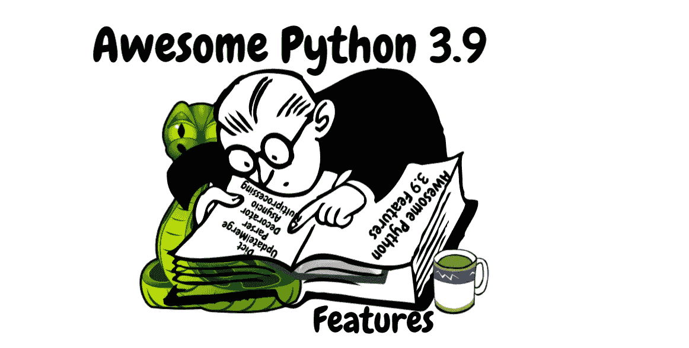
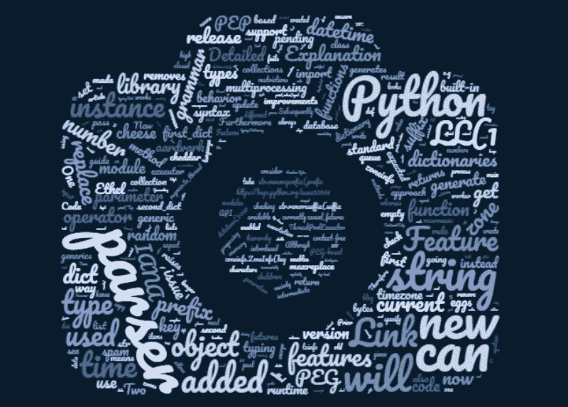
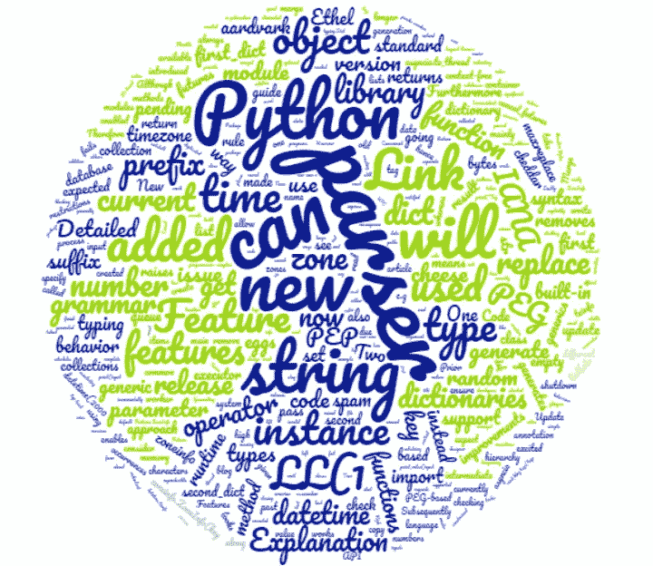

# 10 个令人惊叹的 Python 3.9 特性

> 原文：<https://towardsdatascience.com/10-awesome-python-3-9-features-b8c27f5eba5c?source=collection_archive---------0----------------------->

## 必须了解的 Python 3.9 特性

最新的 Python 3.9.0 最终版本将于 2020 年 10 月 5 日星期一发布

就像大多数 Python 爱好者一样，我对探索和使用最新的特性感到非常兴奋。本文将概述 Python 3.9 的必备特性。

> 对于 Python 程序员来说，这又是一个激动人心的时刻。



作者图片

我通读了 Python 3.9 发行说明和相关讨论。基于这些信息，我想写一个全面的指南，这样每个人都可以对这些功能及其详细的工作原理有所了解。

在我开始之前，我必须说，我非常兴奋地探索 3.9 版本，因为一些功能肯定会在我的应用程序中使用。

# 简单地

从字典更新/合并到添加新的字符串方法，再到引入 zoneinfo 库，已经添加了许多新特性。此外，还引入了一种新的稳定、高性能的解析器。

随着新模块`zoneinfo` 和`graphlib`的加入，标准库更新了许多新特性。许多模块也得到了改进，例如`ast`、`asyncio`、`concurrent.futures`、`multiprocessing`、`xml` 等等。

> 这个版本进一步稳定了 Python 标准库。

现在让我们来探索 Python 3.9 的特性。

# 1.特性:字典更新和合并操作符

内置的`dict` 类中增加了两个新的操作符`|`和`|=`。

`|`操作符用于合并字典，而`|=`操作符可用于更新字典。

## 人教版:584

## 代码:

用于合并:`|`

```
>>> a = {‘farhad’: 1, 'blog’: 2, 'python’: 3}
>>> b = {’farhad’: 'malik’, 'topic’: 'python3.9’}
>>> a | b
{’blog’: 2, 'python’: 3, ’farhad’:’malik’,  'topic’: 'python3.9’}
>>> b | a
{’farhad’: 1,’blog’: 2, 'python’: 3, 'topic’:’python3.9’ }
```

求更新:`|=`

```
>>> a |= b
>>> a
{’blog’: 2, 'python’: 3,’farhad’:’malik’}
```

要记住的关键规则是，如果有任何键冲突，那么将保留最右边的值。这意味着最后看到的值总是有效的。这也是其他`dict` 操作的当前行为。

## 详细解释:

正如我们在上面看到的，两个新的操作符`|`和`|=`已经被添加到内置的`dict` 类中。

`|`操作符用于合并字典，而`|=`操作符可用于更新字典。

我们可以认为`|`是列表中的`+`(连接)，我们可以认为`|=`是列表中的`+=`操作符(扩展)。

如果我们评估 3.8 版本，我们会注意到合并和更新字典的方法很少。

作为一个例子，我们可以做`first_dict.update(second_dict)`。这种方法的问题是它在适当的位置修改了`first_dict` 。解决这个问题的一个方法是将`first_dict` 复制到一个临时变量中，然后执行更新。然而，它添加了额外的不必要的代码，只是为了让更新/合并工作。

我们也可以用`{**first_dict, **second_dict}`。这种方法的问题是它不容易被发现，并且更难理解代码打算执行什么。这种方法的另一个问题是映射类型被忽略，类型总是 dict。作为一个例子，如果`first_dict` 是一个`defaultdict` 并且`second_dict` 是 dict 类型，那么它将失败。

最后，`collections` 库包含一个`ChainMap` 函数。它可以接受两个字典，比如`ChainMap(first_dict, second_dict)`，并返回一个合并的字典，但是这个库并不常见。

对于具有不兼容的`__init__` 方法的`dict` 的子类，它也会失败。

## 更多信息:[https://www.python.org/dev/peps/pep-0584](https://www.python.org/dev/peps/pep-0584)


作者图片

# 2.特性:新的灵活的高性能基于 PEG 的解析器

Python 3.9 版本提议用一种新的基于 PEG 的高性能和稳定的解析器取代当前基于 LL(1)的 Python 解析器。

## 人教版:617

## 详细解释:

当前的 CPython 解析器是基于 LL(1)的。随后，该语法是基于 LL(1)的，以允许它被 LL(1)解析器解析。LL(1)解析器是一个自顶向下的解析器。此外，它从左到右解析输入。当前的语法是上下文无关的语法，因此没有考虑标记的上下文。

Python 3.9 版本提议用一个新的基于 PEG 的解析器来代替它，这意味着它将取消当前的 LL(1)语法 Python 限制。此外，当前的解析器已经修补了许多将被删除的漏洞。因此，从长远来看，这将降低维护成本。

例如，尽管 LL(1)解析器和语法实现起来很简单，但是这些限制不允许它们以自然的方式向语言设计者和读者表达常见的结构。解析器只查看前面的一个标记来区分可能性。

选择运算符`|`是命令。对于一个实例，如果编写了以下规则:

```
rule: A|B|C
```

LL(1)解析器是一个上下文无关的语法解析器，它将生成这样的构造，即给定一个输入字符串，它将推断出是否需要扩展 A 或 B 或 c。它将检查第一个选项是否成功。如果仅失败一次，它将继续第二次或第三次。

PEG 解析器只为一个字符串生成一个有效的树。因此，它不像 LL(1)解析器那样不明确。

PEG 解析器还通过语法动作直接生成规则的`AST` 节点。这意味着它避免了中间步骤的产生。

关键是 PEG 解析器已经过广泛的测试和验证。PEG 解析器的性能得到了微调。因此，对于大多数指令来说，它只占用当前解析器 10%的内存和速度。这主要是因为没有构造中间语法树。

为了保持文章的简单和可读性，我删除了对底层细节的提及。如果需要了解更多信息，底部提供了链接。

## 更多信息:[https://www.python.org/dev/peps/pep-0617](https://www.python.org/dev/peps/pep-0617)



作者图片

# 3.特性:新的字符串功能，以消除前缀和后缀

两个新功能被添加到`str` 对象中。

*   第一个函数删除前缀。是`str.removeprefix(prefix)`。
*   第二个函数删除后缀。正是`str.removesuffix(suffix)`。

## 人教版:616

## 代码:

```
'farhad_python'.removeprefix('farhad_')
#returns python'farhad_python'.removesuffix('_python')
#returns farhad
```

## 详细解释:

数据科学应用程序中涉及操作文本的常见任务之一是删除字符串的前缀/后缀。`str` 对象增加了两个新功能。这些函数可以用来删除字符串中不需要的前缀和后缀。

第一个函数删除前缀。第二个函数是`str.removeprefix(prefix).`删除后缀。是`str.removesuffix(suffix).`

记住字符串是字符的集合，每个字符在字符串中都有一个索引。我们可以使用索引和冒号 `:`来返回字符串的子集。这个特性被称为字符串切片。

如果我们研究函数，它们在内部检查字符串是否以前缀开始(或以后缀结束),如果是，那么它们使用`str[:]`切片特性返回一个没有前缀(或在后缀之后)的字符串。

随着这些函数成为标准库的一部分，我们得到了一个一致的、不太脆弱的、高性能的、更具描述性的 API。

## 更多信息:[https://www.python.org/dev/peps/pep-0616](https://www.python.org/dev/peps/pep-0616)

# 4.特性:内置泛型类型的类型提示

在此版本中，通过移除 Python 中的并行类型层次，注释程序变得更加简单。

该版本支持类型模块中当前可用的所有标准集合中的泛型语法。

我们可以使用`list` 或`dict` 内置集合类型作为泛型类型，而不是在函数签名中使用`typing.List or typing.Dict`。

因此，代码现在看起来更清晰，并且更容易理解/解释代码。

## PEP: 585

## 详细解释:

虽然 Python 是一种动态类型语言，但是 Python 程序中的类型注释支持类型的自省。随后，该注释可用于运行时类型检查的 API 生成。

这个版本支持类型模块中当前可用的所有标准集合中的泛型语法。

一般类型通常是一个容器，例如 list。它是一种可以参数化的类型。参数化泛型是具有容器元素的预期类型的泛型的实例，例如 list[str]

我们可以使用`list` 或`dict` 内置集合类型作为泛型类型，而不是使用`typing.List or typing.Dict.`

例如，我们可以通过注释代码来指导 Python 运行时类型检查:

```
def print_value(input: str):
  print(input)
# We would get notified  if the input is not a string
```

在过去的几个版本中，已经在现有 Python 运行时的基础上逐步构建了许多静态类型特性。其中一些功能受到现有语法和运行时行为的限制。因此，由于泛型，在类型模块中存在重复的集合层次结构。

例如，我们将看到`typing.List`、`typing.Dictionary` 以及内置的`list`、`dictionary`等等。这使我们能够编写代码:

```
**def** read_blog_tags(tags: list[str]) -> **None**:
    **for** tag **in** tags:
        print("Tag Name", tag)
```

## 更多信息:[https://www.python.org/dev/peps/pep-0585](https://www.python.org/dev/peps/pep-0585)

# 5.特性:支持 IANA 时区

已经创建了模块`zoneinfo` 来支持`IANA` 时区数据库。对`IANA` 时区数据库的支持已经被添加到标准库中。



## 人教版:615

`IANA` 时区通常被称为`tz` 或`zone info`。有许多 IANA 时区使用不同的搜索路径来为日期时间对象指定 IANA 时区。例如，我们可以将搜索路径的名称作为洲/城市传递给一个`datetime` 对象来设置它的`tzinfo`。

```
dt = datetime(2000, 01, 25, 01, tzinfo=ZoneInfo("Europe/London"))
```

如果我们传入一个无效的键，那么`zoneinfo.ZoneInfoNotFoundError`将被抛出。

## 详细解释:

我们使用`datetime` 库来创建一个`datetime` 对象，并通过设置 tzinfo 属性来指定它的时区。然而，当使用`datetime.tzinfo`基线时，我们最终会创建复杂的时区规则。

大多数时候，我们只需要设置对象并将其时区设置为 UTC、系统本地时区或 IANA 时区。

我们可以创建一个`zoneinfo.ZoneInfo(key)` 对象，其中的键是 string 类型的，表示系统时区数据库中时区文件的搜索路径。可以创建`zoneinfo.ZoneInfo(key)`对象，并将其设置为`datetime` 对象的`tzinfo` 属性。

## 代码:

```
**from** **zoneinfo** **import** ZoneInfo
**from** **datetime** **import** datetime

dt = datetime(2000, 01, 25, 01, tzinfo=ZoneInfo("America/Los_Angeles"))
```

## 欲知详情:[https://www.python.org/dev/peps/pep-0615](https://www.python.org/dev/peps/pep-0615)

# 6.功能:取消并发期货的能力

一个新的参数 `cancel_futures`被添加到`concurrent.futures.Executor.shutdown()`中。

此参数`cancels` 所有未开始的未决期货。在 3.9 版本之前，进程会在关闭执行器之前等待它们完成。

## 解释:

新参数`cancel_futures` 已经添加到`ThreadPoolExecutor` 和`ProcessPoolExecutor`中。它的工作方式是当参数的值为 True 时，那么当调用 shutdown()函数时，所有未决的期货都将被取消。

简而言之，当执行 `shutdown()`时，解释器检查执行器是否没有被垃圾收集。如果它仍然在内存中，那么它将获得所有挂起的工作项，然后取消期货。

一旦没有挂起的工作项，它就会关闭工作线程。

## 链接:[https://bugs.python.org/issue30966](https://bugs.python.org/issue30966)

# 7.特性:异步和多处理改进

在这个版本中，对 asyncio 和多处理库进行了许多改进。

作为一个例子，

1.  由于严重的安全问题，不再支持`asyncio.loop.create_datagram_endpoint()` 的`reuse_address` 参数。
2.  新增了`coroutines, shutdown_default_executor()` 和协程`asyncio.to_thread()`。`shutdown_default_executor` 为等待`ThreadPoolExecutor` 完成关闭的默认执行器安排关闭。`asyncio.to_thread()`主要用于在单独的线程中运行 IO 绑定的函数，以避免阻塞事件循环。

关于多重处理库的改进，一个新的方法`close()`被添加到了 `multiprocessing.SimpleQueue` 类中。

此方法显式关闭队列。这将确保队列被关闭，并且不会停留超过预期的时间。要记住的关键是，一旦队列关闭，就不能调用方法`get(), put(), empty()`。

## 链接:[https://bugs.python.org/issue30966](https://bugs.python.org/issue30966)

# 8.功能:一致的包导入错误

在 3.9 版本之前导入 Python 库的主要问题是，当相对导入越过其顶级包时，Python 中的导入行为不一致。

`builtins.__import__()`升高`ValueError` 同时`importlib.__import__()` 升高 ImportError。

现在已经修好了。__import__()现在会引发`ImportError` 而不是`ValueError`。

## 欲知详情:[https://bugs.python.org/issue37444](https://bugs.python.org/issue37444)

# 9.功能:随机字节生成

3.9 版本中增加的另一个特性是功能`random.Random.randbytes()`。该函数可用于生成随机字节。

我们可以生成随机数，但是如果我们需要生成随机字节呢？在 3.9 版本之前，开发人员必须发挥创造力来生成随机字节。虽然我们可以使用`os.getrandom(), os.urandom() or secrets.token_bytes()` 但是我们不能生成伪随机模式。

作为一个例子，为了确保随机数以预期的行为生成，并且该过程是可重复的，我们通常使用随机的种子。随机模块。

因此，`random.Random.randbytes()`法被引入。它也能以可控的方式生成随机字节。

## 更多信息:[https://bugs.python.org/issue40286](https://bugs.python.org/issue40286)

# 10.功能:字符串替换功能修复

在 Python 版本之前，`“”.replace(“”,s,n)`返回空字符串，而不是所有非零 n 的 s

这个错误让用户感到困惑，并导致应用程序的行为不一致。

3.9 版本已经修复了这个问题，现在与`"".replace("", s)`保持一致。

`replace` 函数的工作方式是，对于给定的 max replace occurrence 参数，它用一组新的字符替换字符串中的一组字符。

```
string.replace(s, old, new[, maxreplace])Return a copy of string s with all occurrences of substring old replaced by new. If the optional argument maxreplace is given, the first maxreplace occurrences are replaced.
```

为了进一步解释这个问题，在 3.9 版本之前，`replace` 函数的行为不一致

```
"".replace("", "blog", 1)
Returns ’'
One would expect to see blog"".replace("", "|", 1)
Returns ’'
One would expect to see |"".replace("", "prefix")
Howver returns ’prefix'
```

因此，现在的变化是，如果我们进入:

```
“”.replace(“”,s,n) returns s instead of empty string for all non-zero n
```

## 更多信息:[https://bugs.python.org/issue28029](https://bugs.python.org/issue28029)


作者图片

Python 3.9 中也删除了许多冗余特性，比如`Py_UNICODE_MATCH.`

我对探索 3.9 版感到非常兴奋，因为其中的一些特性肯定会在我的应用程序中使用。

如果你想了解更多关于这些改进的信息，请点击阅读官方指南[。](https://docs.python.org/3.9/whatsnew/3.9.html)