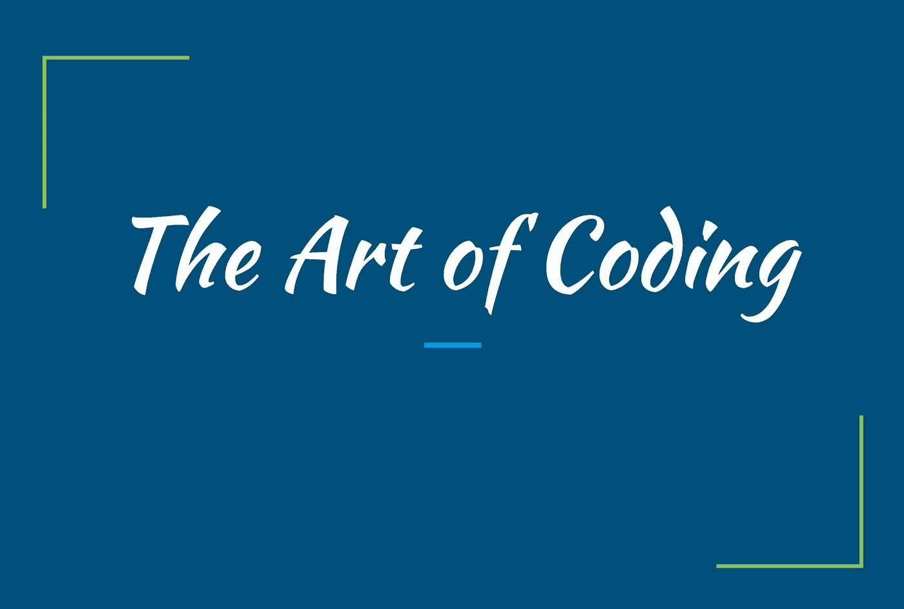
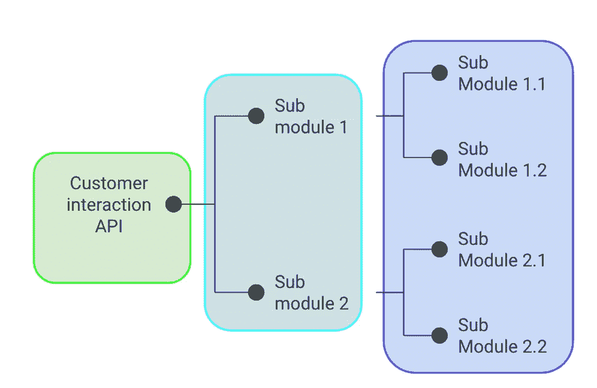

# 没人会教你的 10 条编码原则

> 原文：<https://towardsdatascience.com/10-coding-principles-that-no-one-will-teach-you-37d64b5081ef?source=collection_archive---------13----------------------->

来源:作者图片

# 介绍

互联网将编码员定义为用一种外来语言实现涉及复杂逻辑和数学方程的算法以促进特定计算操作和功能的计算机呆子。诚然，人可以用这样的方式编码， **真正的编码技巧是当你能给机器写令人费解的指令时，这些指令也能被人类容易地阅读和理解。**

想想看，写好代码就相当于写好故事。首先，给你的变量起个合适的名字。你不会把你故事中的人物命名为`*ssddds*`或`*sfddfd*`吧？:P

此外，一个令人恼火的深奥而老成的词汇的混合，使你的故事显得清晰明了，并不能使它成为一个好故事，对吗？(词汇学分，Shashi Tharoor :P)
同样，仅仅在代码中使用高级算法并不能让你成为一名优秀的程序员！

当我们与不同的团队和业务单位合作进行一个真实世界的项目时，我们需要编写**干净的**、**可维护的、**以及(如果可能的话)**优化的代码**，以确保**跨职能流程**。本文将展示一些概念和编码实践，从长远来看，它们将对您有所帮助。

# 1.对合适的人有合适的可见性

如今，在我们生活的世界中，所有业务部门对技术的依赖都在呈指数级增长，以实现业务的自动化、优化和扩展。尤其是在这个在家工作的新世界，数据驱动的解决方案的必要性是不可避免的。我们需要用一种[**面向对象编程**](https://en.wikipedia.org/wiki/Object-oriented_programming) 的方式来思考解决业务问题。需要正确层次的 [**抽象**](https://en.wikipedia.org/wiki/Abstraction_(computer_science))[**封装**](https://en.wikipedia.org/wiki/Encapsulation_(computer_programming)) ，向不同层次的业务展示不同层次的可视性。
在**商界，**通常，

> 客户只关心结果，不关心算法！

这里顾客的定义是主观的。

> 任何直接/间接使用你的解决方案的人都是你的客户。

取决于你做什么，它可以是合作开发者，项目经理，项目经理，测试团队，或者实际的客户本身。在本文中，我将使用术语“客户”。我们的责任是确保客户能够获得输出，而不处理超出范围的任何事情。

考虑一个茶叶店的类比；顾客说的都是，“*兄弟，两杯茶！”，*他们并不是真的想知道后台发生了什么，也就是说，水和牛奶的比例是多少，我们从哪里获得供应，等等。除非他们明确说明。

同样，泡茶的厨师通常不需要知道玻璃杯是在哪里制造的，或者种植茶叶所需的土壤条件是什么。他只是需要货源。

# 2.模块化您的解决方案

封装级别[来源:作者图片]

总是将你的代码保持在模块中，而不是给出一个冗长的脚本/笔记本作为你的解决方案，利用 [**导入系统**](https://docs.python.org/3.8/reference/import.html) **。**

**优点**:

1.  让顾客觉得事情简单，对他们隐藏不必要的细节。
2.  **可重用资产**:你可以找到一些几乎所有项目都会用到的模块，你可以很容易地重用它们，而不是重复发明轮子。
3.  **更容易的协作**:当每个个体贡献者处理不同的文件时，合并冲突的概率将显著降低。

如果您对创建自己的 Python 包感兴趣，请查看官方文档[。你也可以看看我**为了创建新的 Python 包**而创建的这个](https://packaging.python.org/tutorials/packaging-projects/) [**Python 包**](https://pypi.org/project/createPackage/) 。是的，这是一个**包装异常！**这将创建基本的框架和文件夹结构；你可以用你的溶液填满它们。

# 3.首先创建 0 版解决方案

总是先创建一个基本解决方案。这将允许我们展示一些进展并开始讨论，这将有助于你从客户那里获得早期反馈。

> 开始错了，总比结束错了好。

因为即使你有一个你认为能在截止日期前完成的更好的解决方案的想法，你也应该**假设你不能完成它的场景**。然后，对于客户来说，你什么都没有。

这样，您就取得了一些进步，并可以在按照您的预期完成模块后，以改进的表现给客户留下深刻印象。

> 总是有一个后备选择。A 计划几乎永远行不通，准备好 B 计划。

# 4.版本控制系统和错误记录

说到后备选项，当你在团队中工作时，对版本控制系统有一个公平的理解是必须的，比如[**【Git】**](https://en.wikipedia.org/wiki/Git)**。这将确保:**

1.  **更容易的协作和分支。**
2.  **隐式备份**
3.  **指责游戏在这里不起作用。每一行代码都被跟踪。**
4.  **你的文件夹看起来不像
    *final _ code . py
    final _ code _ 2 . py
    final _ code _ for _ sure . py
    final _ code _ possible _ not . py
    final _ code _ tell _ you _ so . py…..*
    再也:P**

**拥有一个**日志文件**来记录**的进度和错误**将会大大减少调试工作。**

# **5.即插即用功能**

**创建一个**配置文件**，用于激活/停用解决方案的各种功能。这可以在许多方面帮助我们:**

1.  **如果我们对同一个问题有多种可能的解决方案，并且需要测试所有的可能性。**
2.  **你需要在一个子模块中调试一个问题，这不需要很多其他模块。在这里，您可以简单地停用它们，避免运行那些不需要的模块所花费的时间。**

# **6.信任他人，而不是他们的代码**

**现实世界编码中最重要的技能之一是防御性编码的艺术。在我上一篇关于现实项目 中 Python 的 [**目录和文件处理的文章中，我提到了**异常处理的必要性。****](https://medium.com/@sreekiranar/directory-and-file-handling-in-python-for-real-world-projects-9bc8baf6ba89)**

> **防御性编码是一种编程方式，旨在预测可能的失败点。**

**当你是一个大型项目的一部分时，你将与许多其他开发人员合作，你将不得不创建具有外部输入的模块，这些外部输入将是原始数据本身或来自其他模块的处理输出。**

**我们需要预料到人为错误和现实世界噪音的可能性，并努力处理它们；我们的想法是，我们的解决方案不应中断；如果您的模块无法运行，您应该**记录错误并继续**。**

**尤其是我们在处理 AI 项目的时候，由于误报，一些模块的失败是意料之中的；这并不意味着代码应该中断；可能还有其他运行良好并为客户增加价值的模块。你需要花时间在:**

1.  ****异常处理**:总是假设你的模块出现故障的情况，并提供异常。**
2.  ****角落案例:**这是你直觉思维可以发挥作用的地方；当您创建一个解决方案时，考虑各种可能需要为异常情况添加一些额外逻辑和条件的场景。**

**正如他们所说，**

> **代码必须继续！**

# **7.也不要相信你的代码！**

**不言而喻，我们是人类，**人类容易犯错误**。无论你是一个多么优秀的程序员，都要对你犯错误的可能性保持开放的态度。您可以尝试以下方法来尽量减少错误:**

1.  **一旦你**完成一个模块**，**休息一下**。做些别的事情，然后**回来看看**你的代码。你会惊讶地发现，你可以很容易地找到前一阵子从未想到过的错误和优化。这也适用于你被困在某件事情上的时候。**
2.  ****同行评审:**不同的视角总能帮到你，有时候，仅仅通过向别人解释你的代码，你就能想出更好的点子。**想大声点**！**

# **8.不要对你的代码感情用事！**

**当你花大量时间头脑风暴、学习新技术、解决大量边角案例、代码优化等。为了创造一个解决方案，你倾向于依赖它，因为它是由你的创造力和智慧创造的。**

**当然，这种激情和创造力会让你写出更好的代码，解决复杂的挑战，但也有一些缺点。有时候，完美主义会适得其反。**

1.  **你继续向你的客户过度解释你的算法之美，而客户并不真正关心这些。**
2.  **在不断发展的业务场景中，任何事情都可能在一天之内发生变化。你会被要求放下去年一直在做的事情，开始一个新的项目，而执着于你的代码会让这变得困难。**
3.  **你得到**过度保护** **你的代码，**失去客观性，认为不可能出错。**

**这听起来可能很傻，但这是一件真实的事情，即使在这个行业工作了三年多，我有时仍会为此而挣扎。**

# **9.完美只能追求**

**最后，接受一个事实，完美是无法达到的，只能追求。不管你觉得今天写的代码有多好，如果一个月后再看，你可以想出很多方法来改进它。就像那个迷因，**

> **我，一个知识分子，评判犯同样错误的人，我最近学会停止犯**

**但是如果你追求完美，你就会达到卓越。只要你玩得开心，就要坚持学习！**

# **10.结论**

**我们在这个博客中讨论的大多数观点不仅适用于编码，也适用于生活。正如史蒂夫·乔布斯所说，**

> ****每个人都应该学会给电脑编程，因为它教会你如何思考****
> 
> ****——乔布斯****

**事实上，我也是遵循这些原则来完成这篇文章的！**

**感谢您花宝贵的时间阅读我的哲学；我希望你能从中受益:)**

**您可以在**sreekiranar@gmail.com**给我反馈和建议，或者在 [**LinkedIn**](https://www.linkedin.com/in/sreekiran-a-r-3b05a1116/) **上联系我。**你也可以看看我的 [**GitHub**](https://github.com/Sreekiranar) 和[**stack overflow**](https://stackoverflow.com/users/9605907/sreekiran)**。****

> *****快乐编码！:D*****