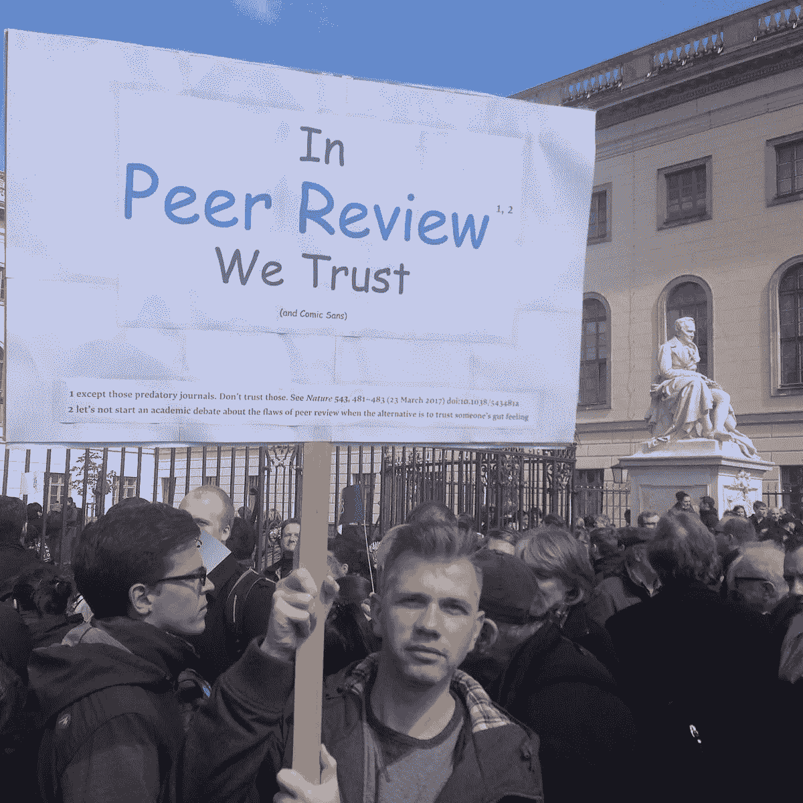

# 判断实证论文优劣的 10 条戒律

> 原文：<https://towardsdatascience.com/10-commandments-for-judging-the-merits-of-an-empirical-paper-862100b6b32d?source=collection_archive---------55----------------------->

## 审查人员通用指南

[来源](https://commons.wikimedia.org/wiki/File:In_Peer_Review_We_Trust.jpg)

有许多与当前同行评议制度相关的病态问题已经成为许多讨论的主题。最实质性的问题之一是，在主要期刊上报道的结果通常是具有最令人兴奋和最有新闻价值的发现的论文。这里的问题是，对一些人来说可能是新奇的和有新闻价值的东西，对其他人来说可能是过分的，其有效性值得怀疑。研究设计中的各种问题，如[小样本](https://www.nature.com/articles/nrn3475)和赢家诅咒、[多重比较](http://www.stat.columbia.edu/~gelman/research/unpublished/p_hacking.pdf)和[选择性报告结果](https://journals.plos.org/plosmedicine/article/file?type=printable&id=10.1371/journal.pmed.0040079)，往往有助于发表有效性存疑的“性感”发现。

幸运的是，这些问题已经成为所有学科的科学家们进行大量讨论和自我反思的主题。虽然职业激励可能会导致研究人员为了发布令人兴奋的发现而对他们的分析漫不经心，但最常见的问题是错误信息加上认知偏差的结果，例如[确认偏差](http://citeseerx.ist.psu.edu/viewdoc/download?doi=10.1.1.372.1743&rep=rep1&type=pdf)，我们都容易受到影响(例如，我们往往只看到我们想看到的证据)，而不是任何渎职行为。最终，我觉得这在很大程度上是统计教育的问题，更普遍的问题是*专注于教授一种技术，而不是面向问题的技能组合*，没有适当关注*批判性思维技能*。当然，毕业后我可以做各种各样的分析技术，而不需要真正理解我在做什么！

这一领域的大部分焦点正确地集中在试图让研究人员改变他们的行为，在介绍他们的方法时更加反思和透明。较少关注审稿人和编辑的行为。评论者应该注意什么？很难区分新颖但有效的结果和有效性有问题的结果，特别是对于那些没有大量数据处理经验的人。这个博客试图提供一些通用规则来指导评论者。

特别是，本着应用计量经济学的深刻而吸引人的 10 条戒律，我为评论者准备了 10 条戒律。这不是一份详尽的清单，也不是一份完整的清单，主要针对的是经验性的而不是纯理论的论文。研究人员如何组织和撰写论文的一个主要动机(如果不是主要动机的话)是，他们遵循的方法是他们认为最有可能被编辑/审稿人视为可发表的论文。研究人员会对激励做出反应，我建议，如果评审人员遵循这些简单的步骤，我们就可以改变“游戏规则”，因此，*最终会改变提交实践和行为*。

1.**对不确定性持更开放的态度**:至少在我的经验中，评论者更喜欢关于因果关系的强有力的陈述，但事情并不总是非黑即白的。作者应该可以(甚至被鼓励)展示他们的发现作为提示，承认局限性并提出未来需要做的工作。然而，评论家们越来越需要的是可靠的确定性。通常，研究人员的目的是证明估计效果的“证据”,并通过一系列稳健性检查证明没有其他可能的替代解释。这反过来会导致作者夸大他们的发现，因为害怕如果他们更谨慎的话会受到评论者的惩罚。

2.**更能接受小的/适度的效应大小**:并不是每项研究都会证明关键感兴趣变量的变化会导致研究结果的巨大变化。事实上，大多数人不会或至少不应该这么做。*研究逐步进行*，要求大的效果尺寸是不现实的。这里的主要问题是，效应大小通常可以以多种不同的方式呈现，这种预期扭曲了激励，因此作者可以找到创造性的方式来呈现他们估计的“大”效应。虽然出版不应依赖于展示大的效应尺寸，但效应尺寸也不应小到微不足道。统计显著性应该是不够的，除了关于效应大小的实际大小的报告的问题之外，一个同样成问题的问题是*相对常见的是根本不努力报告效应大小*。这也是审稿人应该劝阻的。

3.不要被复杂性所迷惑 : *计量经济学的复杂性不应该被误认为是严谨的*。简单的分析通常不仅更容易理解和交流，而且不太可能导致严重的错误或失误。如果需要复杂的模型，那么要确保研究人员展示了所有必要的细节，以便“技术细节”能够容易理解。一些根据上下文谨慎提问的例子可能包括:简单的二元关系看起来像什么？即使没有看起来有些奇怪的功能规范，结果还成立吗？在添加控制变量之前，与对照组的处理进行简单比较，结果看起来像什么？

4.**作为上述方法的自然延伸，应用笑声测试**:应用 Kennedy (2002) 所称的“笑声”测试，或者 Hamermesh (2000，第 374 页)所称的“嗅嗅”测试:“问问自己，如果向一个深思熟虑的外行人仔细解释这些发现，听众是否能避免大笑”。有时，如果结果看起来好得令人难以置信，那么事实往往就是如此。这在低功效研究(小样本)中尤其如此，因为看似意外/新颖的发现往往只是噪声数据集中的随机波动，不太可能是可再现的效果。

5.**问正确的问题**:我发现自己经常问的一些潜在有用的问题包括:对为什么只在特定的小组或特定的情况下观察到结果的解释是否可信？与这一点相关的是，我经常问自己，给出的解释是否符合结果(观察数据本来就有噪音！)或者作者事先有这些前科是否合理。采用看似更明智的不同程序是否会对实质性结果产生重大影响？这可能包括函数形式的改变或控制变量的选择。我想强调的是，这些问题不应该被设计成“零黑客”调查结果(也考虑这里的第 10 点)，而是对分析的合理程度和结论是否有根据有一个总体感觉。

6.不要被稳健性检查所迷惑，也不要要求太多:稳健性检查可能很重要，但不应该让你相信主要发现的真实性。也许还值得注意的是，从作者的角度来看，建议额外的健壮性检查可能会增加大量时间，但通常不会带来额外的好处。

7.**不要歧视** : *根据研究的优点来判断研究*，而不是根据它是否是你喜欢的主题或来自知名研究人员或研究所。出版偏见是这样的，做仔细和深思熟虑的研究的人可能不总是有大“声誉”的人。

8.与上述观点相关的还有一个针对编辑的观点[不要根据报道结果的新闻价值来拒绝。](https://medium.com/@doing_research_well/desk-rejects-cb172dee605b)

9.**警惕浮夸的陈述**，晦涩的语言或抽象的理论框架。

10.**不要纠结于 p 值**:据美国统计协会报道，“一个结论不会立刻在分界线的一边变成‘真’而在另一边变成‘假’”。一个 p 值*和一个估计的效应大小*传递了一些有用的信息，但它不应该是全部。正如美国儿科学会的声明所总结的那样，“没有一个单一的指标可以替代科学推理。”就个人而言，在判断一篇论文的科学价值时，我会寻找许多东西(其中许多在上面讨论过)，但实际报告的 p 值，无论是 0.01 还是 0.10，都远远低于列表。