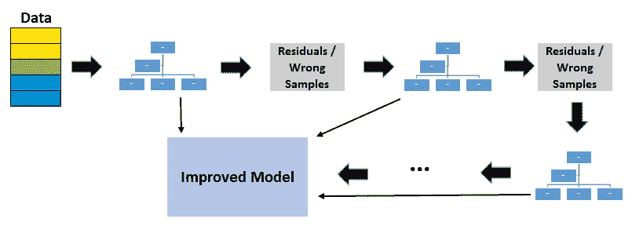

# 每个数据科学家都应该知道的 10 个概念

> 原文：<https://towardsdatascience.com/10-concepts-every-data-scientist-should-know-70beddcd4ac2?source=collection_archive---------22----------------------->

## 面试中可能遇到的概念。

泰勒·凯西在 [Unsplash](https://unsplash.com/s/photos/light-up?utm_source=unsplash&utm_medium=referral&utm_content=creditCopyText) 上的照片

数据科学是一个如此广阔的领域。如果这是一个食谱，主要成分将是线性代数，统计学，软件，分析技能，讲故事，所有与一些领域知识的经验丰富。配料的数量根据你所做的工作而变化。

作为一名数据科学家，无论您做什么，都有一些术语和概念您绝对应该熟悉。在这篇文章中，我将介绍其中的 10 个概念。请注意，这篇文章的目的绝不是要列出你需要知道的所有话题。然而，了解以下概念绝对会增加你的技能组合的价值，并在你的旅程中帮助你学习更多。

我们开始吧。

# **1。中心极限定理**

我们首先需要引入**正态(高斯)分布**让中心极限定理有意义。正态分布是一种看起来像钟的概率分布:

x 轴代表数值，y 轴代表观察这些数值的概率。正态分布用于表示分布未知的随机变量。因此，它被广泛应用于包括自然科学和社会科学在内的许多领域。证明为什么它可以用来表示未知分布的随机变量的理由是**中心极限定理(CLT)** 。

根据 **CLT** ，当我们从一个分布中抽取更多样本时，样本平均值将趋向于一个**正态分布**，而不管总体分布如何。

考虑一个案例，我们需要学习一个国家所有 20 岁人的身高分布。收集这些数据几乎是不可能的，当然也是不切实际的。所以，我们在全国范围内抽取 20 岁人群的样本，计算样本中人群的平均身高。根据 CLT，当我们从总体中抽取更多样本时，抽样分布将接近正态分布。

为什么正态分布如此重要？正态分布用平均值和标准偏差来描述，它们很容易计算。如果我们知道正态分布的均值和标准差，我们就可以计算出关于它的几乎所有东西。

# **2。p 值**

**P 值**是获得我们的观察值或有相同或较少机会被观察的值的概率。考虑随机变量 a 的以下概率分布。很可能观察到 10 左右的值。随着值变得更高或更低，概率降低。

我们有另一个随机变量 B，想看看 B 是否大于 a，从 B 得到的平均样本均值是 12.5。12.5 的 p 值是下图中的绿色区域。绿色区域表示获得 12.5 或更极端值(在我们的例子中高于 12.5)的概率。

假设 p 值是 0.11，但是我们如何解释它呢？p 值为 0.11 意味着我们对结果有 89%的把握。换句话说，有 11%的概率结果是随机的。类似地，p 值为 0.5 意味着有 5%的概率结果是随机的。

> p 值越低，结果越确定。

如果随机变量 B 的样本平均值是 15，这是一个更极端的值，p 值将低于 0.11。

# **3。偏差—方差权衡**

**偏差**发生在我们试图用一个简单得多的模型来近似一个复杂或错综复杂的关系的时候。我认为它是一个懒惰的模型。考虑一种情况，其中自变量(特征)和因变量(目标)之间的关系非常复杂并且是非线性的。但是，我们尝试使用线性回归建立一个模型。在这种情况下，即使我们有数百万个训练样本，我们也无法建立准确的模型。通过使用简单的模型，我们限制了性能。不能反映特征和目标之间的真实关系。偏高的型号倾向于**欠配**。

**方差**发生在模型对自变量(特征)的变化高度敏感的时候。该模型试图选取关于特征和目标之间关系的每个细节。它甚至学习数据中可能随机出现的噪声。特征中非常小的变化可能会改变模型的预测。因此，我们最终得到了一个模型，它捕获了训练集的每一个细节，因此训练集的准确性将非常高。然而，新的、以前未见过的样本的准确性不会很好，因为特征中总是存在不同的变化。这种情况也被称为**过拟合**。该模型过度适应训练数据，但未能很好地概括数据集内的实际关系。

所以高偏差和高方差都不好。完美的模型是低偏差和低方差的模型。然而，完美的模型很难找到，如果可能的话。偏差和方差之间有一个权衡。我们应该力求在它们之间找到恰当的平衡。作为一名机器学习工程师，成功的关键是掌握在偏差和方差之间找到正确的平衡。

# **4。L1 和 L2 正规化**

过拟合是数据科学领域中的一个重要问题，需要小心处理，以便建立一个健壮和准确的模型。当模型试图很好地拟合训练数据，以至于不能推广到新的观察结果时，就会出现过度拟合。过度拟合模型捕捉训练数据中的细节和噪声，而不是总体趋势。

过度拟合问题的解决方案是降低模型复杂度。例如，如果我们有一个多项式模型，我们可以通过减少自由度来降低模型的复杂性。多项式模型是非线性的。对于线性模型，我们需要另一种正则化技术，即**正则化**。

**正则化**通过惩罚模型中较高的项来控制模型的复杂性。如果增加一个正则项，该模型试图最小化损失和模型的复杂性。

**L1 正规化**

它也被称为针对稀疏性的正则化。顾名思义，它用于处理主要由零组成的稀疏向量。稀疏向量通常导致非常高维的特征向量空间。因此，模型变得很难处理。

L1 正则化通过在每次迭代中从权重中减去一个小的量来强制无信息特征的权重为零，从而最终使权重为零。

> L1 正则化惩罚|权重|。

**L2 正规化**

为了简单性**它也被称为正则化**。如果我们把模型的复杂度作为权重的函数，那么特征的复杂度与它的权重的绝对值成正比。

L2 正则化迫使权重趋向于零，但并不使它们完全为零。L2 正则化就像在每次迭代中去除一小部分权重的力。因此，权重永远不会等于零。

> L2 正则化惩罚(权重)

**注:** **岭回归**使用 L2 正则化，而**拉索回归**使用 L1 正则化。**弹性网回归**结合了 L1 和 L2 正则化。

# **5。维度的诅咒**

简而言之，维数灾难意味着有太多的特征。更多的数据是好的，但是如果数据结构良好。如果我们有许多特征(列)但没有足够的观察值(行)来处理，那么我们就有问题了。

拥有许多特征但没有足够的观察值会导致过度拟合。正如预期的那样，该模型捕捉了数据集中的观察细节，而不是概括要素和目标之间的真实关系。

当我们试图对观察结果进行聚类时，会出现另一个缺点。聚类算法使用距离度量。拥有太多的特征会导致观测值之间的距离非常相似，因此很难将观测值分组到聚类中。

维数灾难的一个解决方案是通过保持特征数量不变来收集更多的观测值(行)。然而，这将是耗时的，并且不总是可行的。此外，它会给模型增加额外的计算负担。更好的解决方案是使用一种**降维**算法，比如 PCA。降维是通过从现有特征中提取新特征来减少特征的数量，目的是保持数据集中的方差。

# **6。装袋增压**

在机器学习领域，通过组合许多基本估计器(即算法)来设计集合学习方法。例如，随机森林是通过组合几个决策树创建的集成学习算法。打包和提升是组合基本估计量的两种不同方法。

**Bagging** 的意思是集合几个弱学习者的预测。我们可以把它想成**平行**结合弱学习者。将几个弱学习者的预测平均值作为整体预测。

随机森林创建与装袋许多决策树

Boosting 就是把**系列的几个弱学习者组合起来。我们最终从许多顺序连接的弱学习者中得到一个强学习者。梯度增强决策树(GBDT)是最常用的集成学习算法之一。像在随机森林中一样，GBDT 中的弱学习器(或基估计器)是决策树。**

GBDT 创建了许多决策树

# **7。熵和信息增益**

**熵**是不确定性或随机性的度量。一个变量的随机性越大，熵就越大。均匀分布的变量具有最高的熵。例如，掷一个公平的骰子有 6 个概率相等的可能结果，所以它有均匀的分布和高熵。

熵 vs 随机性

在处理决策树时，我们很可能会遇到熵和信息增益。它们是算法决定拆分时的决定性因素。选择导致更纯节点的分裂。这些都表示“**信息增益**”，基本上就是分裂前后的熵差。

当选择一个特征进行分割时，决策树算法试图实现

*   更多的预测
*   杂质少
*   低熵

# **8。精度和召回**

精确度和召回率是用于评估分类模型的度量。在描述这些指标之前，最好先解释一下**混淆矩阵。**

混淆矩阵显示了每个类别的正确和错误(即真或假)预测。在二进制分类任务的情况下，混淆矩阵是 2×2 矩阵。如果有三个不同的类，那就是一个 3x3 的矩阵，以此类推。

假设 A 类是正类，B 类是负类。混淆矩阵的关键术语如下:

*   **真阳性(TP)** :预测阳性类别为阳性(ok)
*   **假阳性(FP)** :将阴性类别预测为阳性(不正常)
*   **假阴性(FN)** :将阳性类别预测为阴性(不正常)
*   **真阴性(TN)** :预测阴性类别为阴性(ok)

**精度**表示有多少正面预测是正确的。精度的焦点是**正面预测**。

**Recall** 表示模型能够正确预测多少个阳性类别。召回的重点是**实际正班**。

# 9.ROC 曲线和 AUC

**ROC(接收器工作特性)曲线**通过组合所有阈值处的混淆矩阵来总结分类模型的性能。ROC 曲线的 x 轴是真阳性率(灵敏度)，ROC 曲线的 y 轴是假阳性率(1-特异性)。

[图源](https://developers.google.com/machine-learning/crash-course/classification/roc-and-auc)

如果阈值设置为 0，模型将所有样本预测为阳性。在这种情况下，TPR(灵敏度)为 1。然而，FPR(1-特异性)也是 1，因为没有阴性预测。如果阈值设置为 1，TPR 和 FPR 都变为 0。因此，将阈值设置为 0 或 1 不是一个好的选择。

我们的目标是提高真阳性率(TPR ),同时保持低假阳性率(FPR)。正如我们在 ROC 曲线上看到的，随着 TPR 增加，FPR 也增加。所以最终决定了我们能容忍多少假阳性。

我们可以使用另一个称为 **AUC** (曲线下面积)的指标，而不是试图在 ROC 曲线上找到最佳阈值。AUC 是介于(0，0)和(1，1)之间的 ROC 曲线下的面积，其可以使用积分来计算。AUC 基本上汇总了模型在所有阈值的表现。AUC 的最佳可能值是 1，这表示一个完美的分类器。AUC 越接近 1，分类器越好。在下图中，分类器 A 比分类器 b 好。

[图来源](https://link.springer.com/referenceworkentry/10.1007%2F978-1-4419-9863-7_209)

# **10。朴素贝叶斯分类器的假设**

与其他监督学习算法一样，朴素贝叶斯使用特征对目标变量进行预测。关键区别在于，朴素贝叶斯假设特征是相互独立的，特征之间没有相关性。然而，现实生活中并非如此。这种特征不相关的天真假设是这种算法被称为“天真”的原因。

所有特征都是独立的假设使得朴素贝叶斯算法**比复杂算法**更快。在某些情况下，速度优先于更高的精度。它可以很好地处理文本分类和垃圾邮件检测等高维数据。

感谢您的阅读。如果您有任何反馈，请告诉我。