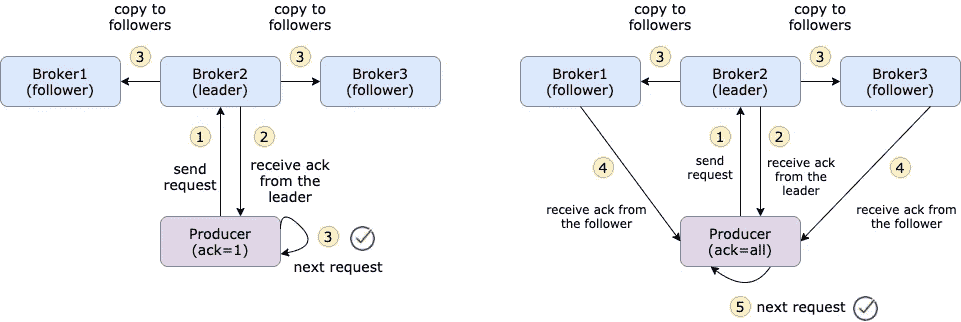
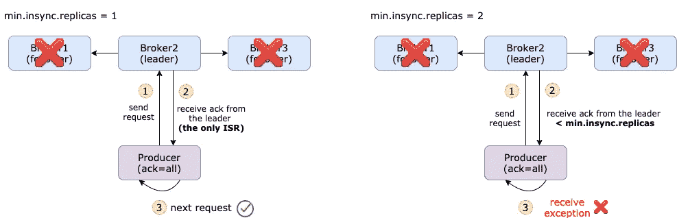
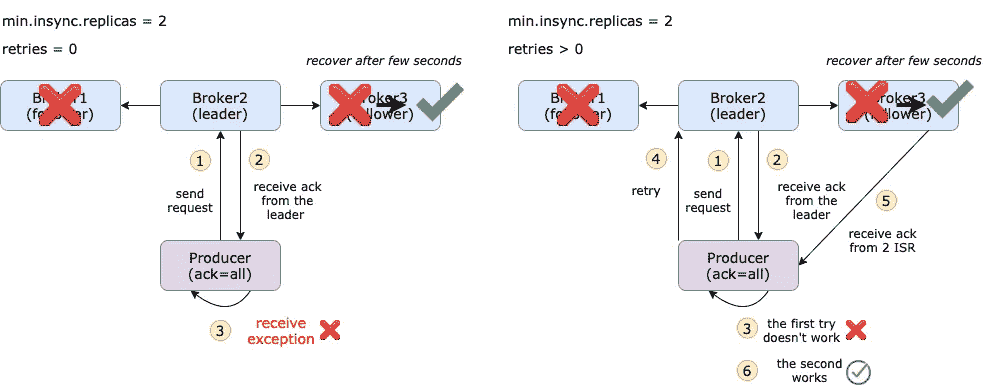
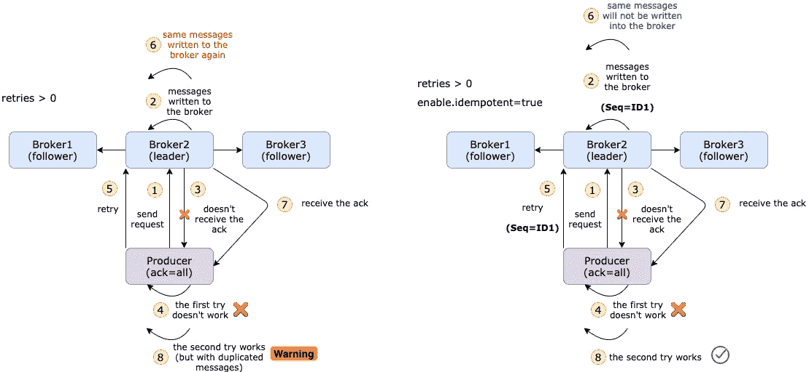
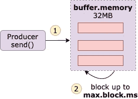

# 10 种配置让您的 Kafka Producer 更具弹性

> 原文：<https://towardsdatascience.com/10-configs-to-make-your-kafka-producer-more-resilient-ec6903c63e3f?source=collection_archive---------4----------------------->

## 让你的卡夫卡制作人更上一层楼


[詹姆斯·庞德](https://unsplash.com/@jamesponddotco)在 [Unsplash](https://unsplash.com/) 上拍摄的照片

afka 以其弹性、容错和高吞吐量而闻名。但是它的表现并不总是符合所有人的预期。在某些情况下，我们可以通过横向扩展或纵向扩展代理来改进它。而在大多数情况下，我们不得不*玩配置的游戏*。

卡夫卡生态系统里真的有[吨的配置](https://kafka.apache.org/documentation/#configuration)。几乎不可能掌握每一种配置的想法。一方面，它们无疑使系统更加灵活，但另一方面，开发人员可能会对如何使用它们感到非常困惑。

幸运的是，大多数配置都是预先定义好的，在大多数情况下都能很好地工作。首先，他们需要了解的强制性配置非常有限。

但是当然，我假设你正在读这篇文章，因为你想把你的卡夫卡制作人带到一个新的水平。因此，在这篇文章中，我想分享 10 个配置，我认为它们对提高生产商的适应能力非常重要。

本文将要讨论的配置有`acks`、`replica.lag.time.max.ms`、`min.insync.replicas`、`retries`、`enable.idempotent`、`max.in.flight.requests.per.connection`、`buffer.memory`、`max.block.ms`、`linger.ms`、`batch.size`。

## ack(确认)

ack 是生产者从 Kafka 代理那里得到的确认，以确保消息已经成功提交给该代理。config `acks`是生产者在考虑成功提交之前需要接收的确认数量。



ack=1 和 ack=all 的区别，高创造

默认值为 1，这意味着只要生产者收到来自该主题的主代理的 ack，它就会将其视为成功的提交，并继续处理下一条消息。不建议设置`acks=0`，因为那样你在提交上没有任何保证。`acks=all`将确保生产者从该主题的所有*同步*副本中获得确认。它提供了最强的消息持久性，但也需要很长时间，从而导致更高的延迟。所以，你需要决定什么对你更重要。

## 同步副本

`acks=all`会从所有的*同步*副本(ISR)那里得到确认，那么什么是同步副本呢？创建主题时，必须定义想要多少个副本。副本只不过是其中一个代理中消息的副本，因此副本的最大数量就是代理的数量。

在这些复制品中，有一个领导者，其余的都是追随者。领导者处理所有的读写请求，而从者被动地复制领导者。**同步副本是在最后 10 秒完全赶上领先的副本。**时间段可以通过`replica.lag.time.max.ms`进行配置。如果某个代理出现故障或出现网络问题，那么他就无法与负责人联系，10 秒钟后，该代理就会从 ISR 中删除。

默认最小同步副本(`min.insync.replicas`)为 1。这意味着，如果所有的追随者都倒下了，那么 ISR 就只剩下领导者了。即使`acks`设置为 all，它实际上只将消息提交给 1 个代理(领导者),这使得消息容易受到攻击。



由[高](https://medium.com/u/2adc5a07e772?source=post_page-----ec6903c63e3f--------------------------------)创建的不同最小同步副本之间的差异

配置`min.insync.replicas`基本上定义了生产者在考虑成功提交之前必须接收多少副本。这个配置添加在`acks=all`之上，使你的消息更加安全。但另一方面，你必须平衡延迟和速度。

## 失败时重试

假设你设置了`acks=all`和`min.insync.replicas=2`。出于某种原因，跟随者完成了，然后生产者识别出一个失败的提交，因为它不能从`min.insync.replicas`代理那里得到确认。

您将收到来自生成器的错误消息:

```
KafkaError{code=NOT_ENOUGH_REPLICAS,val=19,str="Broker: Not enough in-sync replicas"}
```

您将看到来自正在运行的代理的以下错误消息。这意味着，即使代理正在运行，如果当前的 ISR 不足，Kafka 也不会将消息附加到正在运行的代理。

```
ERROR [ReplicaManager broker=0] Error processing append operation on partition test-2-2-0 (kafka.server.ReplicaManager)
org.apache.kafka.common.errors.NotEnoughReplicasException: The size of the current ISR Set(0) is insufficient to satisfy the min.isr requirement of 2 for partition test-2-2-0
```

默认情况下，生成器不会处理这个错误，因此会丢失消息。这被称为**最多一次语义**。但是您可以通过配置`retries=n`让生产者重新发送消息。这基本上是提交失败时生成器可以重试的最大次数。默认值为 0。



由[高](https://medium.com/u/2adc5a07e772?source=post_page-----ec6903c63e3f--------------------------------)创建的重试次数=0 和重试次数> 0 之差

如果您设置了`retries=5`，那么生产者将最多重试 5 次。您不会注意到生成器日志中的重试次数，因为它只显示提交最终是否成功。但是你可以在代理端看到`retries+1`日志消息。

## 避免重复的消息

在某些情况下，消息实际上已提交给所有同步副本，但由于网络问题(例如，只允许单向通信)，代理无法发回 ack。同时，我们设置`retries=3`，然后生产者将重新发送消息 3 次。这可能会导致主题中出现重复的消息。

假设我们有一个向主题发送 100 万条消息的生产者，在消息提交后但生产者收到所有 ack 之前，代理失败。在这种情况下，我们可能会收到超过 100 万条关于这个话题的消息。这也被称为**一次性租赁语义**。

最理想的情况是**恰好一次语义**，在这种情况下，即使生产者重新发送消息，消费者也应该只收到一次相同的消息。

我们需要的是一个**幂等生产者。** [幂等](https://stackoverflow.com/questions/1077412/what-is-an-idempotent-operation#:~:text=Idempotence%20means%20that%20applying%20an,the%20result%20is%20still%20zero.)是指一个操作应用一次或者应用多次效果相同。用配置`enable.idempotent=true`很容易打开这个特性。

它是如何工作的？消息是分批发送的，每批都有一个序列号。在代理端，它跟踪每个分区的最大序列号。如果一个具有较小或相等序列号的批次进入，代理不会将该批次写入主题。这样，也保证了批次的顺序。



[高](https://medium.com/u/2adc5a07e772?source=post_page-----ec6903c63e3f--------------------------------)创造的禁用幂等元和启用幂等元的区别

## 按顺序发送消息

保证顺序的另一个重要配置是`max.in.flight.requests.per.connection`，默认值是 5。这表示可以在生成器端缓冲的未确认请求的数量。如果`retries`大于 1，并且第一个请求失败，但是第二个请求成功，那么第一个请求将被重新发送，并且消息将处于错误的顺序。

根据[文档](http://kafka.apache.org/documentation/#max.in.flight.requests.per.connection):

> 请注意，如果此设置设置为大于 1，并且发送失败，则存在由于重试(即，如果启用重试)而导致消息重新排序的风险。

如果您没有启用幂等，但是仍然希望保持消息有序，那么您应该将该设置配置为 1。

但是如果您已经启用了幂等，那么您就不需要显式定义这个配置。卡夫卡会选择合适的价值观，如这里所说的。

> 如果用户没有明确设置这些值，将选择合适的值。如果设置了不兼容的值，将抛出一个`ConfigException`。

## 发送消息太快

当生产者调用`send()`时，消息不会立即发送，而是添加到内部缓冲区。默认的`buffer.memory`是 32MB。如果生产者发送消息的速度比发送给代理的速度快，或者出现了网络问题，那么超过了`buffer.memory`，那么`send()`调用将被阻塞到`max.block.ms`(默认为 1 分钟)。



buffer.memory 和 max.block.ms 由[高](https://medium.com/u/2adc5a07e772?source=post_page-----ec6903c63e3f--------------------------------)创建

增加这两个值可以缓解这个问题。

另外两个可以玩的配置是`linger.ms`和`batch.size`。`linger.ms`是批次准备发送前的延迟时间。默认值为 0，这意味着即使批处理中只有一条消息，也会立即发送批处理。有时候，人们增加`linger.ms`来减少请求的数量，提高吞吐量。但是这将导致更多的消息保存在内存中。所以，确保你照顾到双方。

还有一个和`linger.ms`相当的配置，就是`batch.size`。这是单批的最大数量。当满足这两个要求中的任何一个时，将发送批次。

## 结论

以下是我认为可以让你的卡夫卡制作人更有弹性的 10 个配置。当然，它们不是您需要注意的唯一配置，但这可能是一个很好的起点。请务必阅读官方 Apache Kafka 文档以获得可靠的参考。

如果你有任何其他想法，请在下面留下你的评论。保重！

## 参考

[](https://www.cloudkarafka.com/blog/2019-09-28-what-does-in-sync-in-apache-kafka-really-mean.html) [## 阿帕奇卡夫卡中的同步副本到底是什么意思？- CloudKarafka，阿帕奇卡夫卡留言…

### Kafka 认为，当同步副本集(ISR)中的所有副本都确认它们…

www.cloudkarafka.com](https://www.cloudkarafka.com/blog/2019-09-28-what-does-in-sync-in-apache-kafka-really-mean.html) [](https://www.confluent.io/blog/exactly-once-semantics-are-possible-heres-how-apache-kafka-does-it/) [## 恰好一次语义是可能的:下面是阿帕奇卡夫卡如何做到这一点

### 我很高兴我们达到了 Apache Kafkaand 社区期待已久的激动人心的里程碑:我们已经…

www.confluent.io](https://www.confluent.io/blog/exactly-once-semantics-are-possible-heres-how-apache-kafka-does-it/)