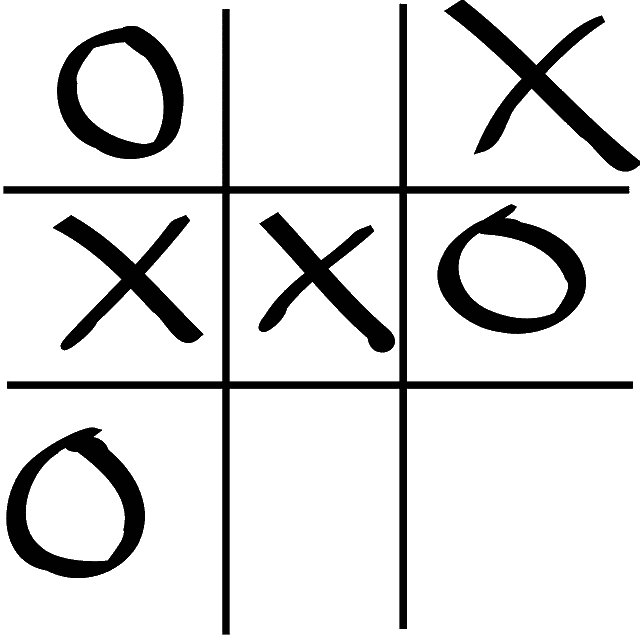

# 给 Python 开发者的 10 个很酷的 Python 项目想法

> 原文：<https://towardsdatascience.com/10-cool-python-project-ideas-for-python-developers-7953047e203?source=collection_archive---------0----------------------->

## 您可以使用 Python 构建的有趣想法和项目列表

来自 [Pexels](https://www.pexels.com/photo/focused-man-working-on-laptop-in-workshop-3844533/?utm_content=attributionCopyText&utm_medium=referral&utm_source=pexels) 的 Andrea Piacquadio 的照片

> 编写 Python 代码的乐趣应该在于看到短小、简洁、易读的类，这些类用少量清晰的代码表达了大量的动作——而不是让读者厌烦得要死的大量琐碎代码。
> 
> 吉多·范·罗苏姆

[**Python**](https://www.python.org/) 是世界上使用最多的[编程语言](/top-programming-languages-for-ai-engineers-in-2020-33a9f16a80b0)之一，这可以归功于它的**通用性质**，这使它成为行业中各个领域的合适候选。使用 Python，你不仅可以为 web 开发程序**，还可以为桌面**和命令行**开发程序。Python 可以适合不同技能水平的程序员，从学生到中级开发人员，再到专家和专业人员。但是每一种编程语言都需要不断的学习，Python 也是如此。**

如果你真的想获得深入的实践知识，没有比从事一些很酷的项目更好的方法来使用 Python 了，这些项目不仅能让你在空闲时间有所事事，还能教会你如何更好地使用 Python。

## 你知道吗？

> 根据 Stackoverflow 的说法，python 是最受欢迎的语言，这意味着大多数开发人员都使用 Python。

 [## 2020 年大一新生热门 Python 面试问答

### 这里列出了大一新生最常被问到的 python 面试问题和答案，涵盖了核心…

blog.digitalogy.co](https://blog.digitalogy.co/python-interview-questions-and-answers-for-freshers/) 

# 选择项目平台

Python 在合适的人手里可以是一种非常通用的编程语言，你可以用它构建许多漂亮的程序来加强你对这种语言的掌握。与理论知识相比，更多地接触实践知识是至关重要的，尤其是在学习编程语言(如 Python)时。

但是在我们开始我们为你准备的有趣的项目之前，你必须决定你将在哪个平台上工作。本文提及的项目平台可分为以下三类**:**

## ● **网页**

构建一个 web 应用程序允许你和其他人通过互联网从任何地方访问它。为此，您需要在应用程序的前端、可视部分和后端工作，在那里实现业务逻辑。**工具&框架**比如 [**Django**](https://www.djangoproject.com/) **、** [**烧瓶**](https://flask.palletsprojects.com/en/1.1.x/) 和 [**Web2Py**](http://www.web2py.com/) 是你可以使用的许多选项中的一些。

## ● **桌面 GUI**

桌面应用程序也非常普遍，并且迎合了相当大一部分用户的需求。当涉及到构建桌面应用程序时，Python 使得使用其 [**PySimpleGUI**](https://realpython.com/pysimplegui-python/) 包开发桌面应用程序变得非常容易，这允许您使用 Python 构建所有必要的元素。框架 [**PyQt5**](https://pypi.org/project/PyQt5/) 也提供了高级的 GUI 构建元素，但是有一个更陡峭的学习曲线。

## ● **命令行**

命令行程序只能在控制台窗口中运行，根本没有 GUI。用户交互是通过命令进行的，这是最古老的与程序交互的方法，但是不要把它缺少 GUI 误认为它没有用处。数百家顶级企业依赖命令行程序来执行其日常业务活动。构建命令行程序，可以使用 [**docopt**](http://docopt.org/#:~:text=Command%2Dline%20interface%20description%20language&text=docopt%20is%20based%20on%20conventions,Naval%20Fate.) ，**[**Python Fire**](https://pypi.org/project/fire/#:~:text=Python%20Fire%20is%20a%20library,it%20fires%20off%20your%20command.)**，**[**plac**](https://pypi.org/project/plac/)**，以及** [**cliff**](https://pypi.org/project/cliff/) 等工具。**

> **“Python 从一开始就是 Google 的重要组成部分，并且随着系统的成长和发展而保持不变。如今，数十名谷歌工程师使用 Python，我们正在寻找更多掌握这种语言的人。”**
> 
> **——彼得·诺维格，谷歌公司搜索质量总监**

** [## 10 家使用 Python 的世界级公司

### Python 正被 IT 界的一些巨头积极使用

towardsdatascience.com](/10-world-class-companies-using-python-26cde24919a8)** 

# **Python 开发者的 Python 项目理念**

**如果您已经决定了要使用的平台，让我们直接进入项目。下面提到的是一些面向所有技能水平的开发人员的有趣项目，这些项目将在将他们的 Python 技能和信心提升到下一个水平方面起到至关重要的作用。**

# ****1。内容聚合器****

****

**在 [Unsplash](https://unsplash.com/?utm_source=unsplash&utm_medium=referral&utm_content=creditCopyText) 上[奥比·奥尼耶多尔](https://unsplash.com/@thenewmalcolm?utm_source=unsplash&utm_medium=referral&utm_content=creditCopyText)的照片**

**对于总是在网上寻找东西的数百万人来说，互联网是主要的信息来源。对于那些寻找特定主题的大量信息的人来说，使用内容聚合器可以节省时间。**

**内容聚合器是一种工具，它从一个地方的大量网站中收集并提供关于某个主题的信息。要制作一个，您可以借助 requests 库来处理 HTTP 请求，借助[**beautiful soup**](https://www.crummy.com/software/BeautifulSoup/)来解析和抓取所需的信息，并借助一个数据库来保存收集到的信息。**

****内容聚合器的例子:****

*   **[AllTop](https://alltop.com/)**
*   **赫普**

# ****2。网址缩写****

**URL 是导航到互联网上任何资源的主要来源，无论是网页还是文件，有时，其中一些 URL 可能非常大，带有奇怪的字符。URL 缩写在减少这些 URL 中的字符并使它们更容易记忆和使用方面起着重要的作用。**

**制作 URL 缩短器的想法是**使用随机和字符串模块**从输入的长 URL 生成一个新的短 URL。一旦你完成了，你就需要映射长 URL 和短 URL，并将它们存储在数据库中，以允许用户将来使用它们。**

****网址缩写示例—****

*   **[bit.ly](https://bitly.com/)**
*   **[TinyURL](https://tinyurl.com/)**

**这里是免费参加课程的链接:——**

** [## 免费 Django 教程-尝试 Django 1.10 |创建一个 URL 缩短服务

### 这一切都始于一个想法。我想要自由...很糟糕。从工作中解脱，从无聊中解脱，最重要的是…

www.udemy.com](https://www.udemy.com/course/try-django-1-10/) 

# 3.文件重命名工具

照片由来自 [Pexels](https://www.pexels.com/photo/web-banner-with-online-information-on-computer-3803517/?utm_content=attributionCopyText&utm_medium=referral&utm_source=pexels) 的 [Brett Sayles](https://www.pexels.com/@brett-sayles?utm_content=attributionCopyText&utm_medium=referral&utm_source=pexels) 拍摄

如果您的工作需要您经常管理大量文件，那么使用文件重命名工具可以节省您大量的时间。它的基本功能是使用一个定义好的初始标识符来重命名数百个文件，这个标识符可以在代码中定义，也可以从用户那里获得。

为此，您可以使用 Python 中的库，如 [**sys**](https://docs.python.org/3/library/sys.html) 、 [**shutil**](https://docs.python.org/3/library/shutil.html#:~:text=Source%20code%3A%20Lib%2Fshutil.,see%20also%20the%20os%20module.) 和[**os**](https://docs.python.org/3/library/os.html) 来即时重命名文件。要实现向文件添加自定义初始标识符的选项，您可以使用[**正则表达式库**](https://docs.python.org/3/library/re.html) 来匹配文件的命名模式。

**批量文件重命名工具示例—**

*   [任](https://en.wikipedia.org/wiki/Ren_(command))
*   [重命名](https://www.tecmint.com/rename-multiple-files-in-linux/)

 [## 用于自然语言处理的 Python 库

### 用于自然语言处理的流行 python 库概述

towardsdatascience.com](/python-libraries-for-natural-language-processing-be0e5a35dd64) 

# 4.目录树生成器

目录树生成器是一种工具，您可以在希望可视化系统中的所有目录并确定它们之间的关系的情况下使用。目录树本质上指示的是哪个目录是父目录，哪个是它的子目录。如果您处理大量目录，并且希望分析它们的位置，像这样的工具会很有帮助。为了构建这个，你可以使用 [**os 库**](https://docs.python.org/3/library/os.html) 列出文件和目录以及 [**docopt 框架**。](http://docopt.org/)

**目录树生成器示例—**

*   [树](https://en.wikipedia.org/wiki/Tree_(command))
*   [Dirtreex](https://github.com/mauriziodimatteo/dirtreex)

# 5. **MP3 播放器**

照片由[稍微有用的](https://unsplash.com/@usefulcollective?utm_source=unsplash&utm_medium=referral&utm_content=creditCopyText)在 [Unsplash](https://unsplash.com/?utm_source=unsplash&utm_medium=referral&utm_content=creditCopyText) 上拍摄

如果你喜欢听音乐，你会惊讶地发现你可以用 Python 来构建一个音乐播放器。您可以构建一个带有图形界面的 mp3 播放器，该播放器带有一组用于播放的基本控件，甚至可以显示集成的媒体信息，如艺术家、媒体长度、专辑名称等。

您还可以选择导航到文件夹并为您的音乐播放器搜索 mp3 文件。为了使在 Python 中处理媒体文件更容易，可以使用**[**simple audio**](https://pypi.org/project/simpleaudio/)、 [**pymedia**](https://pypi.org/project/PyMedia/) 和 [**pygame**](https://www.pygame.org/news) 库。**

****MP3 播放器示例—****

*   **[音乐蜜蜂](https://getmusicbee.com/)**
*   **[Foobar2000](http://www.foobar2000.org/)**

# **6.**井字游戏****

**井字游戏是一个经典游戏，我们相信你们每个人都很熟悉。这是一个简单有趣的游戏，只需要两个玩家。目标是在一个 **3x3 的网格**上创建一条由三个 x 或 o 组成的不间断的水平、垂直或对角线，谁先完成，谁就是游戏的赢家。像这样的项目可以使用 Python 的 [**pygame 库**](https://www.pygame.org/news) ，它带有所有需要的图形和音频，让你开始构建这样的东西。**

****

**图片来自 [Pixabay](https://pixabay.com/?utm_source=link-attribution&utm_medium=referral&utm_campaign=image&utm_content=150614)**

****这里有几个教程你可以试试:****

*   **[https://techvidvan . com/tutorials/python-game-project-TIC-tac-toe/](https://techvidvan.com/tutorials/python-game-project-tic-tac-toe/)**
*   **[用 Python 制作游戏& Pygame](http://inventwithpython.com/pygame/)**
*   **[用 Pygame 开发游戏](https://pythonspot.com/game-development-with-pygame/)**

****游戏开发中更有趣的 Python 项目:****

*   **[蛇](https://www.edureka.co/blog/snake-game-with-pygame/)**
*   **[刽子手](https://selftaught.blog/python-tutorial-build-hangman/)**
*   **[猜谜游戏](https://djangocentral.com/creating-a-guessing-game-in-python/)**
*   **[石头剪刀布](https://www.udemy.com/course/rock-paper-scissors-python/?LSNPUBID=JVFxdTr9V80&ranEAID=JVFxdTr9V80&ranMID=39197&ranSiteID=JVFxdTr9V80-F5d48vfiCCpJ8HwvuE4BRw&utm_medium=udemyads&utm_source=aff-campaign)**
*   **d[Python 中的滚冰模拟器](https://data-flair.training/blogs/dice-rolling-simulator-python/)**

# **7.测验应用程序**

**使用 Python 可以构建的另一个流行而有趣的项目是一个测验应用程序。一个流行的例子是 [**卡豪特**，](https://kahoot.com/)，它因使学习成为学生们的一项有趣活动而闻名。该应用程序提供了一系列具有多个选项的问题，并要求用户选择一个选项，稍后，该应用程序会显示正确的选项。**

**作为开发人员，您还可以创建功能来添加任何需要的问题以及要在测验中使用的答案。要制作一个测验应用程序，您需要使用一个数据库来存储所有的问题、选项、正确答案和用户分数。**

****问答应用示例—****

*   **[卡胡特](https://kahoot.com/)**
*   **[我的测验](https://myquiz.org/)**

****了解最好的 Python IDEs 和代码编辑器—****

** [## 2020 年你必须使用的最好的 Python IDEs 和代码编辑器

### 具有显著特性的顶级 Python IDEs 和代码编辑器

towardsdatascience.com](/best-python-ides-and-code-editors-you-must-use-in-2020-2303a53db24) 

# 8.**计算器**

照片由[爱德华多·罗萨斯](https://www.pexels.com/@lalorosas?utm_content=attributionCopyText&utm_medium=referral&utm_source=pexels)从 [Pexels](https://www.pexels.com/photo/gray-laptop-computer-showing-calculator-application-with-codes-907487/?utm_content=attributionCopyText&utm_medium=referral&utm_source=pexels) 拍摄

当然，任何人都不应该错过在学习新的编程语言的同时开发计算器的古老想法，即使只是为了好玩。我们相信你们都知道什么是计算器，如果你已经尝试过，你可以尝试用一个更好的 GUI 来增强它，使它更接近今天操作系统的现代版本 T21。为了实现这一点，您可以使用 [**tkinter**](https://docs.python.org/3/library/tkinter.html) 包来将 GUI 元素添加到您的项目中。

# 9.**打造虚拟助手**

由[本斯·博罗斯](https://unsplash.com/@benceboros?utm_source=unsplash&utm_medium=referral&utm_content=creditCopyText)在 [Unsplash](https://unsplash.com/?utm_source=unsplash&utm_medium=referral&utm_content=creditCopyText) 拍摄的照片

如今，几乎每部智能手机都有自己的智能助手版本，可以通过语音或文本接收你的命令，管理你的电话、笔记、预订出租车等等。这方面的一些例子有**谷歌助手、Alexa、Cortana 和 Siri** 。如果你想知道如何制作这样的东西，你可以使用诸如****[**speecher recognition**](https://pypi.org/project/SpeechRecognition/)**[**gTTS、**](https://pypi.org/project/gTTS/) 和 **Wikipedia** 之类的软件包。这里的目标是记录音频，将音频转换为文本，处理命令，并使程序根据命令进行操作。******

******这是免费参加课程的链接—******

**** [## 免费 Python 教程-学习 Python:构建虚拟助手

### 我是一个自学的程序员和学习爱好者。我的专长主要是人工智能，Ruby on Rails…

www.udemy.com](https://www.udemy.com/course/learn-python-build-a-virtual-assistant-in-python/?LSNPUBID=JVFxdTr9V80&ranEAID=JVFxdTr9V80&ranMID=39197&ranSiteID=JVFxdTr9V80-l6XGdgLohub6YYv8_fu5pA&utm_medium=udemyads&utm_source=aff-campaign) 

# 10.货币转换器

顾名思义，这个项目包括构建一个货币转换器，允许您以基础货币输入所需的值，并以目标货币返回转换后的值。一个好的做法是对从互联网获取更新的转换率的能力进行编码，以获得更准确的转换。为此，您也可以使用 [**tkinter**](https://docs.python.org/3/library/tkinter.html) 包来构建 GUI。**** 

# ****更多的 Python 项目想法要建立—****

*   ****用 Django 构建一个简单的网页****
*   ****[密码生成器](https://www.101computing.net/random-password-generator/)****
*   ****[制作一个推特机器人](https://realpython.com/twitter-bot-python-tweepy/)****
*   ****[年龄和性别检测](https://data-flair.training/blogs/python-project-gender-age-detection/)****
*   ****[乳腺癌分类](https://data-flair.training/blogs/project-in-python-breast-cancer-classification/)****
*   ****[驾驶员睡意检测](https://data-flair.training/blogs/python-project-driver-drowsiness-detection-system/)****
*   ****[语音情感识别](https://data-flair.training/blogs/python-mini-project-speech-emotion-recognition/)****
*   ****[用 Python 创建加密应用](https://www.udemy.com/course/coinmarketcap/)****
*   ****[Python 中的速度打字测试](https://techvidvan.com/tutorials/project-in-python-typing-speed-test/)****
*   ****[用 Python 检测所有假新闻](https://data-flair.training/blogs/advanced-python-project-detecting-fake-news/)****
*   ****[Python 中的网络爬虫](https://www.educative.io/courses/grokking-the-system-design-interview/NE5LpPrWrKv)****
*   ****Python 中的剽窃检查器****
*   ****Python 文件浏览器****
*   ****闹钟****
*   ****一款实时价格提醒应用****
*   ****站点连接检查器****
*   ****正则表达式查询工具****
*   ****费用跟踪器****
*   ****Youtube 视频下载程序****

# ****结论****

****总结我们列出的一些有趣的想法和可以使用 Python 构建的项目，我们可以说 Python 是一种非常有用的编程语言，可以用来开发各种类型和规模的应用程序。此外，Python 提供的包在很大程度上简化了开发过程，为开发人员提供了巨大的价值。总结一下，我们想说 Python 的潜力是无限的，您可能缺少的唯一东西就是正确的想法。****

****如果你有更多的建议或想法，我们很乐意倾听。****

# ****更多有趣的读物****

****我希望这篇文章对你有用！以下是一些有趣的读物，希望你也喜欢****

**** [## 面向所有人的顶级谷歌人工智能工具

### 使用谷歌人工智能中心将想法变为现实

towardsdatascience.com](/top-google-ai-tools-for-everyone-60346ab7e08)  [## Python vs. Node。JS:哪个最适合你的项目？

### 使用一组预定义的因素对 Python 和 Node.js 进行详细比较

towardsdatascience.com](/python-vs-node-js-which-one-is-best-for-your-project-e98f2c63f020)  [## 面向数据科学的顶级 Python 库

### 面向数据科学的流行 Python 库概述

towardsdatascience.com](/top-python-libraries-for-data-science-c226dc74999b)  [## 机器学习和深度学习的最佳 Python 库

### 现代机器学习模型和项目的 Python 库

towardsdatascience.com](/best-python-libraries-for-machine-learning-and-deep-learning-b0bd40c7e8c) 

> ***关于作者***
> 
> ***克莱尔 D*** *。是位于****Digitalogy—****的内容制作者和营销人员，这是一个技术采购和定制匹配市场，根据全球各地的特定需求，将人们与预先筛选的&顶尖开发人员和设计师联系起来。在****Linkedin*******Twitter*******insta gram****上连接****Digitalogy****。***********