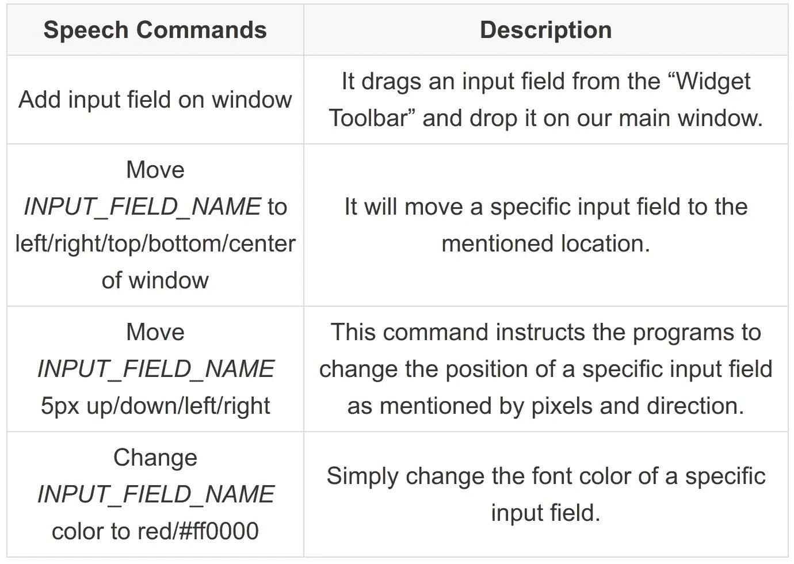
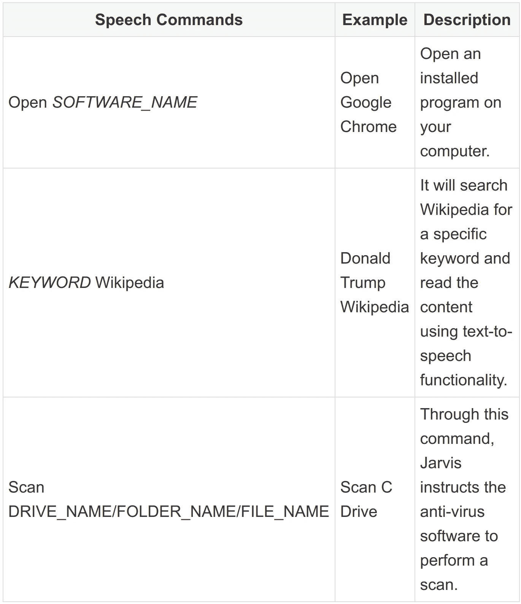
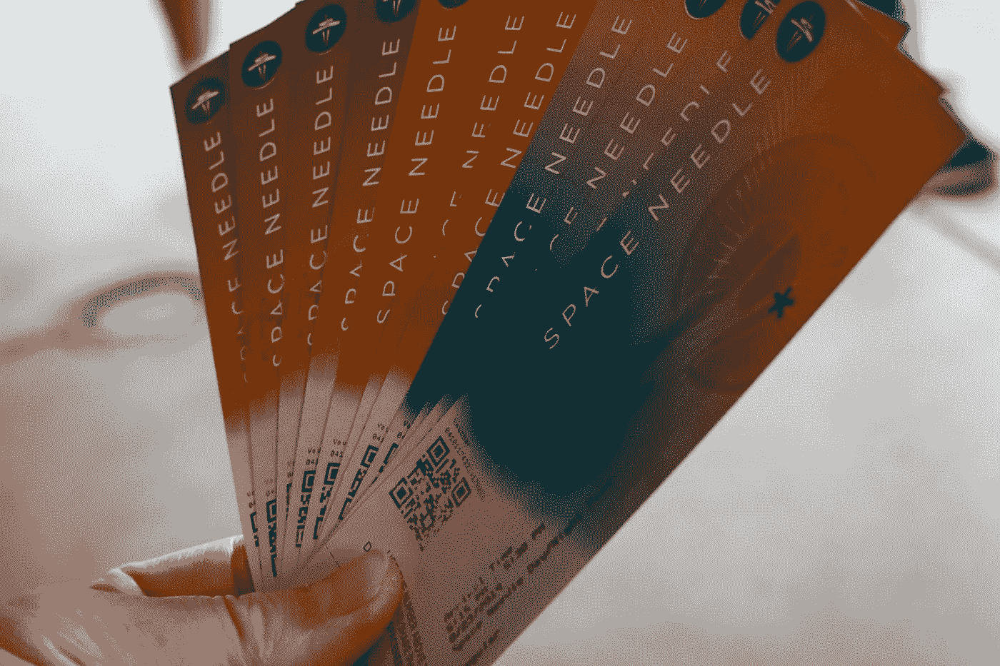
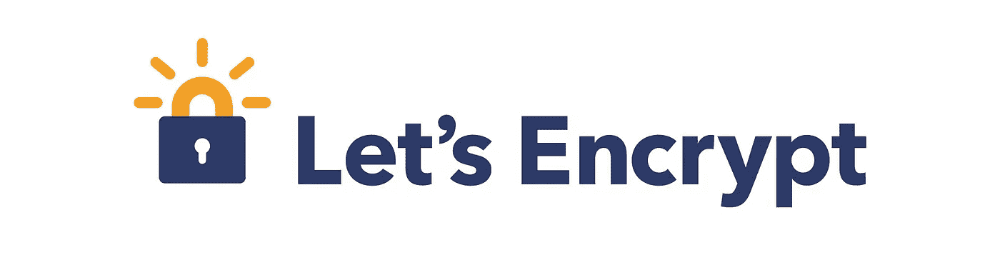
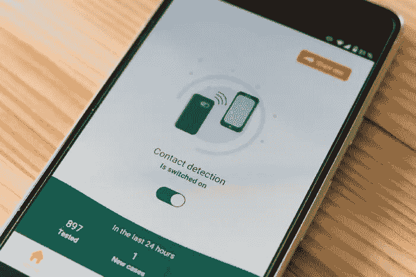
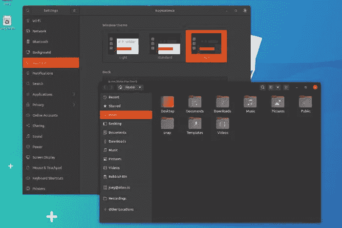

# Python 开发者的 10 个疯狂的酷项目创意

> 原文：<https://towardsdatascience.com/10-crazy-cool-project-ideas-for-python-developers-d7efeb0a345?source=collection_archive---------9----------------------->

## PYTHON 编程

## 挑战您的 Python 技能的疯狂项目想法

西蒙·艾布拉姆斯在 [Unsplash](https://unsplash.com/?utm_source=unsplash&utm_medium=referral&utm_content=creditCopyText) 上拍摄的照片

你知道 **Python** 被称为**全能编程语言**吗？

是的，的确如此，[尽管它不应该用在每一个项目上](https://livecodestream.dev/post/2020-05-30-what-is-python-best-for/)，

您可以使用它来创建桌面应用程序、游戏、移动应用程序、网站和系统软件。它甚至是最适合实现**人工智能**和**机器学习**算法的语言。

所以，我花了几周时间为 Python 开发者收集独特的项目想法。这些项目想法有望让你重拾对这门神奇语言的兴趣。最好的部分是，您可以通过这些有趣但具有挑战性的项目来增强您的 Python 编程技能。

让我们一个一个来看看。

# 1-使用语音命令创建软件 GUI

互动样本—原照片由 [Headway](https://unsplash.com/@headwayio?utm_source=unsplash&utm_medium=referral&utm_content=creditCopyText) 在 [Unsplash](https://unsplash.com/?utm_source=unsplash&utm_medium=referral&utm_content=creditCopyText) 上拍摄—作者编辑

如今，桌面应用程序开发领域已经取得了巨大的进步。你会看到许多拖放 GUI 生成器和语音识别库。那么，为什么不把它们结合在一起，通过与计算机对话来创建一个用户界面呢？

这纯粹是一个新概念，经过一些研究，我发现从来没有人试图这样做。所以，这可能比下面提到的那些更有挑战性。

下面是一些使用 Python 开始这个项目的说明。首先，你需要这些包:-

*   [语音识别库](https://pypi.org/project/SpeechRecognition/)
*   [页面—拖动&下拉 GUI 生成器](https://sourceforge.net/projects/page/)
*   [文档](http://page.sourceforge.net/html/intro.html)
*   [页面如何工作的视频](https://www.youtube.com/watch?v=oULe0h0Jl3g&ab_channel=OpenSourcesAbout)
*   [使用页面](https://www.youtube.com/watch?v=oCAWWUhwEUQ&ab_channel=LinuxUnixAix)创建登录窗口

现在，我们的想法是硬编码一些语音命令，比如:

你明白了，对吧？添加更多这样的命令非常简单明了。

因为这将是一个**最低可行产品(MVP)** 。所以，如果你不得不硬编码许多条件语句(比如 if…else)，这完全没问题。

设置了一些基本命令后，就该测试代码了。现在，您可以尝试在窗口中构建一个非常基本的登录表单。

这个想法最大的灵活性在于它可以应用于游戏开发、网站和移动应用。即使在不同的编程语言中。

# 2-人工智能赌博机器人

网球比赛——照片由 [Moises Alex](https://unsplash.com/@arnok?utm_source=unsplash&utm_medium=referral&utm_content=creditCopyText) 在 [Unsplash](https://unsplash.com/?utm_source=unsplash&utm_medium=referral&utm_content=creditCopyText) 上拍摄

赌博是一种人们预测结果的活动，如果他们是正确的，那么他们就会得到回报。现在，有许多技术进步发生在过去几年的人工智能或机器学习中。

例如，你可能听说过像 [AlphaGo Master](https://en.wikipedia.org/wiki/Master_%28software%29) 、 [AlphaGo Zero](https://en.wikipedia.org/wiki/AlphaGo_Zero) 和 [AlphaZero](https://en.wikipedia.org/wiki/AlphaZero) 这样的程序，它们可以比任何职业人类棋手更好地玩 [Go (game)](https://en.wikipedia.org/wiki/Go_%28game%29) 。你甚至可以获得一个叫做 Leela Zero 的类似程序的[源代码](https://github.com/leela-zero/leela-zero)。

我想传达的观点是，AI 正在变得比我们更聪明。这意味着它可以通过考虑所有的可能性并从过去的经验中学习来更好地预测一些事情。

让我们应用 Python 中的一些监督学习概念来创建一个 AI 下注机器人。这里有一些你需要开始使用的库。

*   [熊猫——数据分析](https://pandas.pydata.org/)
*   [NumPy——多维数组、矩阵和数学函数](https://numpy.org/)
*   [scikit-learn——机器学习](https://scikit-learn.org/)
*   [XGBoost —梯度增强](https://xgboost.ai/)
*   [Matplotlib —绘图](https://matplotlib.org/)
*   [seaborn —统计数据可视化](https://seaborn.pydata.org/)
*   [pickle — Python 对象序列化](https://docs.python.org/3/library/pickle.html)

首先，你需要选择一个游戏(如网球、足球等。)来预测结果。现在搜索可用于训练模型的历史匹配结果数据。

例如，网球比赛的数据可以在。csv 格式来自[tennis-data.co.uk 网站](http://tennis-data.co.uk/data.php)。

如果你不熟悉赌博，这里是它是如何工作的。

*   你想在罗杰·费德勒身上赌 10 美元，赔率为 1.3。
*   如果他赢了，你将获得 10 美元(实际金额)，外加 3 美元(利润)。
*   如果他输了，你也会输掉你的钱(例如 10 美元)。

在训练模型之后，我们必须计算每个预测的**置信水平**，通过检查预测正确的次数来找出我们的机器人的性能，最后还要关注**投资回报(ROI)** 。

下载 Edouard Thomas 的类似开源人工智能赌博机器人项目。

# 3-交易机器人

交易—照片由 [Nick Chong](https://unsplash.com/@nick604?utm_source=unsplash&utm_medium=referral&utm_content=creditCopyText) 在 [Unsplash](https://unsplash.com/?utm_source=unsplash&utm_medium=referral&utm_content=creditCopyText) 上拍摄

交易机器人与之前的项目非常相似，因为它也需要 AI 进行预测。

现在的问题是，一个 AI 能否正确预测股价的波动？

答案是肯定的。

在开始之前，我们需要一些数据来开发一个交易机器人。

*   雅虎！金融—获取股票数据
*   [Alpha Vantage —财务数据实时 API](https://github.com/RomelTorres/alpha_vantage)

来自 Investopedia 的这些资源可能有助于训练机器人。

*   [新手交易策略](https://www.investopedia.com/articles/trading/06/daytradingretail.asp)
*   [只有通过这 5 步测试才能进行交易](https://www.investopedia.com/articles/active-trading/090415/only-take-trade-if-it-passes-5step-test.asp)

读完这两篇文章后，你现在会对什么时候买股票，什么时候不买有更好的理解。这些知识可以很容易地转换成 Python 程序，自动为我们做出决定。

你也可以参考这个叫做 [freqtrade](https://github.com/freqtrade/freqtrade) 的开源交易机器人。它是使用 Python 构建的，实现了几种机器学习算法。

# 4-钢铁侠贾维斯(基于人工智能的虚拟助手)

AI 助手界面——Joshua Sortino 在 [Unsplash](https://unsplash.com/?utm_source=unsplash&utm_medium=referral&utm_content=creditCopyText) 上拍照

这个创意取自好莱坞电影系列**钢铁侠**。这部电影围绕技术、机器人和人工智能展开。

在这里，钢铁侠利用人工智能为自己打造了一个虚拟助手。这个程序被称为贾维斯，帮助钢铁侠完成日常任务。

钢铁侠用简单的英语给贾维斯下达指令，贾维斯也用英语回应。这意味着我们的程序将需要语音识别以及文本到语音的功能。

我建议使用这些库:

*   [语音识别](https://pypi.org/project/SpeechRecognition/)
*   [文本到语音转换(TTS)](https://pypi.org/project/pyttsx3/)

现在，您可以像这样硬编码语音命令:

您还可以使用 Jarvis 完成大量其他任务，例如:

*   在手机上设置闹钟。
*   持续检查家庭安全摄像头，并在有人在外面等候时通知。您可以添加更多功能，如面部检测和识别。它能帮助你找出那里有谁或有多少人。
*   打开/关闭房间窗户。
*   开灯/关灯。
*   自动回复邮件。
*   计划任务。

甚至脸书的创始人“马克·扎克伯格”也做了一个 Jarvis 作为副业。

# 5-监控网站，了解即将到来的艺术家音乐会

门票——安迪·李在 [Unsplash](https://unsplash.com/?utm_source=unsplash&utm_medium=referral&utm_content=creditCopyText) 上的照片

[Songkick](https://www.songkick.com/) 是一项非常受欢迎的服务，提供关于即将举行的音乐会的信息。它的 [API](https://www.songkick.com/developer) 可以用来搜索即将到来的音乐会:

*   艺术家
*   位置
*   举办地点
*   日期和时间

您可以创建一个 Python 脚本，使用 Songkick 的 API 每天检查特定的音乐会。最后，只要音乐会有空，就给自己发一封电子邮件。

有时 Songkick 甚至会在他们的网站上显示**购票**链接。但是，这个链接可以转到不同音乐会的不同网站。这意味着即使我们利用网络抓取，也很难自动购买门票。

相反，我们可以简单地显示 buy tickets 链接，就像在我们的手动操作应用程序中一样。

# 6-自动免费续订让我们加密 SSL 证书

让我们加密 Logo—[https://letsencrypt.org/](https://letsencrypt.org/)

[让我们加密](https://letsencrypt.org/)是一个提供免费 SSL 证书的认证机构。但是，问题是这个证书的有效期只有 90 天。90 天后，你必须续费。

在我看来，这是使用 Python 实现自动化的一个很好的场景。我们可以编写一些代码，在网站 SSL 证书到期前自动更新证书。

在 GitHub 上查看这个[代码以获得灵感。](https://github.com/jaygreco/PA_SSL_AutoRenew)

# 7-识别人群中的个人

人脸识别—作者图片

如今，各国政府在公共场所安装了监控摄像头，以加强公民的安全。大多数这些摄像机仅仅是为了记录视频，然后法医专家必须手动识别或追踪个人。

如果我们创建一个 Python 程序，实时识别摄像机中的每个人，会怎么样？首先，我们需要进入一个全国性的身份证数据库，我们可能没有。

因此，一个简单的选择是用你的家庭成员的记录创建一个数据库。

然后你可以使用一个[人脸识别](https://pypi.org/project/face-recognition/)库，把它和相机的输出连接起来。

# 8 触点跟踪

联系人追踪应用程序——照片由 [Unsplash](https://unsplash.com/?utm_source=unsplash&utm_medium=referral&utm_content=creditCopyText) 上的 [Markus Winkler](https://unsplash.com/@markuswinkler?utm_source=unsplash&utm_medium=referral&utm_content=creditCopyText) 拍摄

接触追踪是一种识别在特定时间段内相互接触的所有人的方法。它在像新冠肺炎或艾滋病毒这样的疫情最有用。因为没有任何关于谁被感染的数据，我们无法阻止它的传播。

Python 可以与名为 **DBSCAN(基于密度的带噪声应用空间聚类)**的机器学习算法一起用于接触追踪。

由于这只是一个附带项目，所以我们无法获得任何官方数据。现在，最好使用 [Mockaroo](https://www.mockaroo.com/) 生成一些真实的测试数据。

具体代码实现你可以看看[这篇文章](/contact-tracing-using-less-than-30-lines-of-python-code-6c5175f5385f)。

# 9-自动将文件从一个文件夹移动到另一个文件夹

Ubuntu 中的 Nautilus 文件管理器——图片由作者提供

这是一个非常基本的 Python 程序，可以持续监控一个文件夹。每当文件被添加到该文件夹中时，它检查其类型并相应地将其移动到特定的文件夹。

例如，我们可以跟踪我们的下载文件夹。现在，当一个新的文件被下载后，它会根据其类型自动移动到另一个文件夹中。

。exe 文件很可能是软件设置，所以把它们移到“软件”文件夹中。然而，在“图像”文件夹内移动图像(png、jpg、gif)。

这样我们可以组织不同类型的文件以便快速访问。

# 10-从 YouTube 上收集职业道路视频

YouTube 主页——照片由 [Kon Karampelas](https://unsplash.com/@konkarampelas?utm_source=unsplash&utm_medium=referral&utm_content=creditCopyText) 在 [Unsplash](https://unsplash.com/?utm_source=unsplash&utm_medium=referral&utm_content=creditCopyText) 上拍摄

创建一个应用程序，接受我们在职业生涯中需要学习的技能名称。

例如，要成为一名 web 开发人员，我们需要学习:

*   HTML5
*   CSS3
*   Java Script 语言
*   后端语言(PHP、Node.js、Python、ASP.NET 或 Java)
*   自举 4
*   wordpress 软件
*   后端框架(Laravel，Codeigniter，Django，Flask 等。)
*   等等。

进入技能后会有一个**“生成职业路径”**按钮。它指示我们的程序搜索 **YouTube** 并根据每个技能选择相关的视频/播放列表。如果有很多类似的技能视频，那么它会选择一个最多的观点，评论，喜欢等。

该程序然后根据技能将这些视频分组，并在 GUI 中显示它们的缩略图、标题和链接。

它还会分析每个视频的持续时间，汇总它们，然后通知我们学习这条职业道路需要多长时间。

现在，作为用户，我们可以观看这些按部就班订购的视频，成为这一职业的大师。

# 结论

用独特的编程项目挑战自己让你保持活跃，提高你的技能，并帮助你探索新的可能性。

我上面提到的一些项目思路也可以作为你的**最后一年项目**。

是时候用 Python 编程语言展示你的创造力了，把这些想法变成你会引以为豪的东西。

感谢阅读！