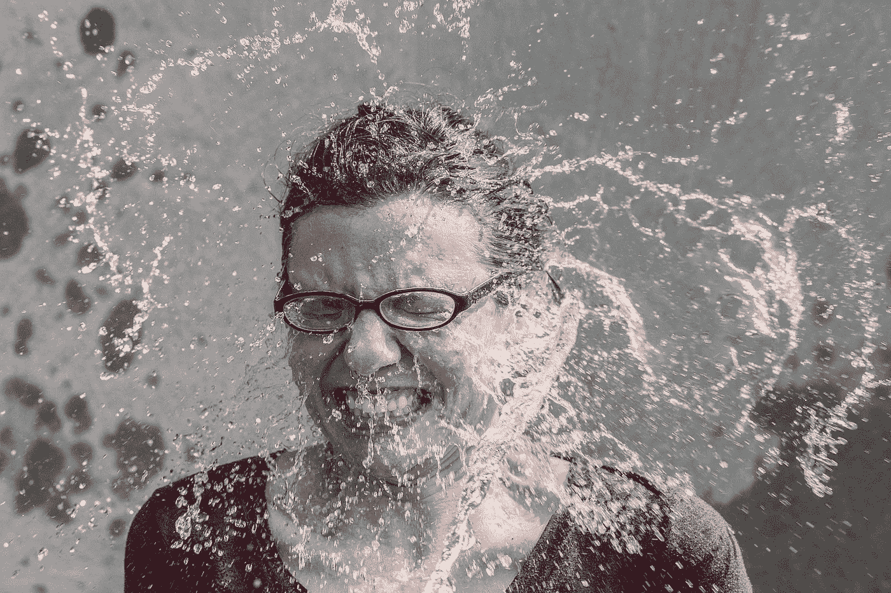
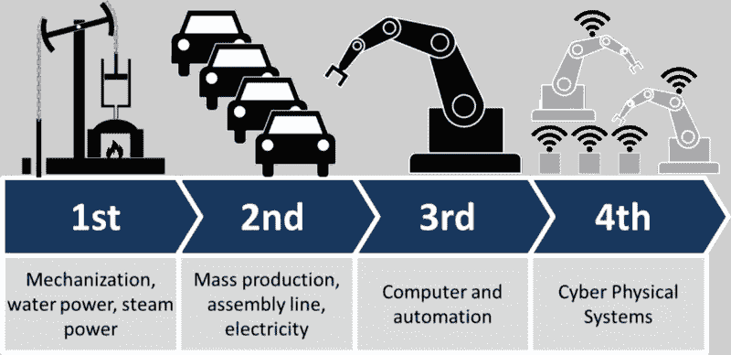
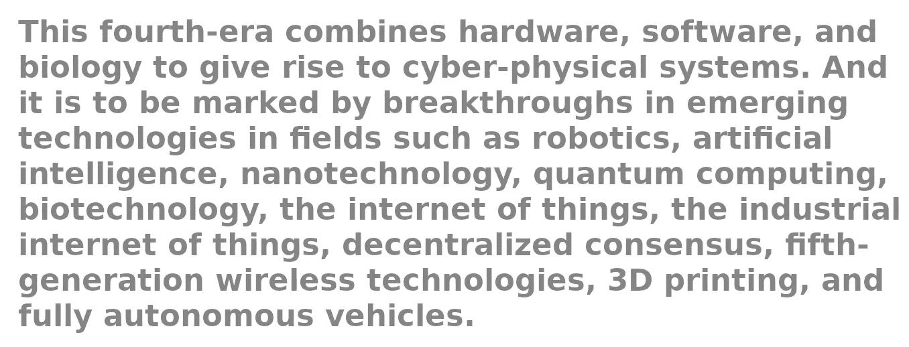

# “程序员深度学习”10 天

> 原文：<https://towardsdatascience.com/10-days-with-deep-learning-for-coders-759b34b9336b?source=collection_archive---------51----------------------->

## 我对“fastai”的课程和书籍的体验

图片由来自 [Pixabay](https://pixabay.com) 的 [Ryan McGuire](https://pixabay.com/users/RyanMcGuire-123690/) 拍摄

# 背景

10 天前开始针对编码员的实用深度学习。我不得不说他们务实的态度正是我所需要的。

我通过在短短几个月内学习 Python、Pandas、NumPy 以及任何我需要的东西开始了数据科学。我做了我需要做的任何课程(例如 [Kaggle 微课](https://www.kaggle.com/learn/overview))和我需要阅读的任何书籍(例如 [Python for Data Analysis](https://wesmckinney.com/pages/book.html) )。所有这些都是我在今年四月开始的为期 90 天的 MOOC'athlon 学习挑战的一部分。这是我一生中最伟大的学习时期之一。在这之后，我在 Kaggle 完成了 Iris 数据和波士顿房价预测项目。然后我从网上搜集数据，用我的熊猫技能把它们清理掉。实施研究论文仍然令人困惑和沮丧。我在研究论文和 Kaggle 项目中挣扎。我擅长 C 语言。你可以给我任何编程语言，我可以比大多数人学得更快，因为编程是我的第二天性。计算机编程只是在我的脑海中流动。而这并没有发生在数据科学上。尽管有学习和大量的工作，但最终，我不记得我做了什么(是的，数据争论是一个地狱般的工作)。我一直处于沮丧的状态。我开始为小事生气，这也影响到了我的个人生活。我想到了退出数据科学和机器学习。已经 4 个月了，我根本没有能力完成任何被认为对商业有用的事情。我感觉被困在一个 4x4 英尺的混凝土盒子里。

# 挫折的终结

我总是在不断寻找解决问题的不同方法。我认为不同的观点是来自宇宙的祝福。是的，我们都有自己的“观点”,当有人从一个你从未想过的不同而奇怪的角度来看待同一个问题时，总是令人耳目一新。改变我处境的是 Caleb Kaiser 的一篇博文:

 [## 不要学机器学习

### 学习如何用 ML 模型构建软件

towardsdatascience.com](/dont-learn-machine-learning-8af3cf946214) 

他的博客文章让我明白，这种沮丧不仅仅属于我，这是每个程序员都会有的，我并不孤单。这完全改变了我的观点，我决定采用他的方法。我决定两样都做:看书和看视频。

在仅仅一周的课程中，我就能够理解[T2 应用数据科学](https://appsilon.com/weight-poisoning-computer-vision/)关于体重中毒的研究论文。

又过了几天，在经历了多次失败之后，我成功地在 binder 上实现了熊探测模型。你可以试试这个网络应用。给它传一张以下图片:

1.美国黑熊

2.灰色的

3.北极熊

4.玩具熊

它会检测出是哪一个。给它传递任何其他东西，比如一只鞋，它会尝试将它与模型中 150x4 的熊图片匹配，并尽最大努力。不是人类=:o):

[https://my binder . org/v2/GH/ArnuldOnData/fastai-projects/master？URL path = % 2f voila % 2f fronder % 2f ch 02% 2f bear-detection . ipynb](https://mybinder.org/v2/gh/ArnuldOnData/fastai-projects/master?urlpath=%2Fvoila%2Frender%2FCh02%2Fbear-detection.ipynb)

照片由[本·怀特](https://unsplash.com/@benwhitephotography?utm_source=unsplash&utm_medium=referral&utm_content=creditCopyText)在 [Unsplash](https://unsplash.com/?utm_source=unsplash&utm_medium=referral&utm_content=creditCopyText) 上拍摄

我似乎记得我做过的大部分事情。数据科学终于成为我的第二天性。这次 fastai 的课程让我更有信心去追求更多更高的机器学习知识。我认为如果一些学习方法对你不起作用，那么你需要试试这门课的实用方法。

# 为什么

这并不是说，传统的学习方法，如做 MOOCs，然后 Kaggle 项目或大学毕业的数据科学路线不起作用。他们可能会，也可能不会。人们是不同的，我们都有不同的背景，我们不可能都遵循传统或混合的方法。时代变了。多亏了互联网，它的去中心化特性，以及网络中立性，世界比过去更加紧密地联系在一起。世界变得越来越小，每个人都可以相互联系。这导致了第四次工业革命:

Christoph Roser 在 http://AllAboutLean.com[拍摄的图片](https://t.co/7aYU3bKNen)

克劳斯·施瓦布，[世界经济论坛创始人兼执行主席，](https://medium.com/u/7d44f110eb09?source=post_page-----759b34b9336b--------------------------------)文字来自[维基百科](https://en.wikipedia.org/wiki/Fourth_Industrial_Revolution)

第四次工业革命将导致:

*   [熄灯制造](https://en.wikipedia.org/wiki/Lights_out_(manufacturing))(全自动工厂，不需要人在现场)
*   智能工厂将监控物理过程，创建物理世界的虚拟副本，并做出分散决策。
*   通过物联网，信息物理系统在内部以及跨越[价值链](https://en.wikipedia.org/wiki/Value_chain)的参与者所使用的组织服务，彼此之间以及与人类之间进行实时通信和合作

按照我的理解,*第四次工业革命方式*说我们需要快速学习工具，我们需要快速适应新技术和新系统。不要花 2-4 年的时间来学习和准备工作，你需要有能力和态度直接投入工作，建立一些有用的东西，在接下来的几个月里为企业增加价值的东西。我们需要以不同于以往的方式学习。我认为[杰瑞米·霍华德、](https://medium.com/u/34ab754f8c5e?source=post_page-----759b34b9336b--------------------------------) [雷切尔·托马斯、](https://medium.com/u/ee56d0bac1b7?source=post_page-----759b34b9336b--------------------------------)和[西尔万·古格](https://sgugger.github.io/)这种不酷的学习方法正是这个 21 世纪的行业所需要的。