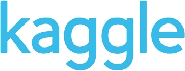

# Kaggle 竞赛和现实生活项目的 10 个区别

> 原文：<https://towardsdatascience.com/10-differences-between-a-kaggle-competition-and-real-life-project-38525fb56c60?source=collection_archive---------29----------------------->

Kaggle 竞赛和真实项目之间有一些非常重要的区别，新手数据科学家应该了解这些区别。Kaggle 创造了梦幻般的竞争精神。它的排行榜促使人们提供越来越好的解决方案，将准确性推向极限。Kaggle 的笔记本和讨论让分享知识和学习变得很容易。然而，现实生活中的项目有些不同。我希望这篇文章对考虑从 Kaggle 竞赛开始进入数据科学的人有所帮助。我记得在我的第一个现实生活项目中，所有通常在 Kaggle 上运行良好的模型都悲惨地失败了，这让我有点不知所措。我希望我对此有所准备。

**1。数据决定一切，而不是众多型号**。在 Kaggle 比赛中，你通常只能使用组织者提供的数据集。在现实生活中，没有这样的限制。你可以挖掘(即收集、准备)尽可能多的新数据。通常是数据造成了差异。也可能有这样的情况，你根本没有任何数据集，你必须定义你想要收集什么数据。你是从零开始，这是另一天的话题。

**2。领域专长的确很重要。**当杰瑞米·霍华德说没有的时候，他实际上指的是卡格尔竞赛。在 Kaggle 上，您已经创建了一个数据集。这完全是关于理解数据分布、制作特性、构建和堆叠模型。您不需要太多关于 data domain 的知识。然而，只要您对数据收集过程有所控制，您就可以从领域专业知识中受益匪浅。这当然有助于你对数据做出更好的假设，从而改进你的建模。我发现收集适当的数据比建模要困难得多。

**3。该死，没有排行榜。** Kaggle 排行榜让你注意到自己犯的一个错误。如果你是项目中唯一的数据科学家，就很难对你的模型性能进行基准测试。排行榜显示了准确性的上限，您总是知道您还可以做多少来改进您的模型。不幸的是，这在现实生活中并不适用。

**4。数据清理很重要。**没有人为你清理数据。你独自承担在数据收集过程中犯下的所有错误。通常有很多这样的例子。大量的改进来自于数据清理。

**5。解决方案的复杂性很重要。在 Kaggle 比赛中，你只需复制一次你的代码。在现实生活中，有时你必须每 5 或 15 分钟复制一次代码。一种新的 Kaggle 竞争(又名内核竞争)正在缩小这种差距，但它们相当罕见。模型响应时间通常对实时预测非常重要。**

**6。您的测试集是动态的。**您的列车组是动态的。在 Kaggle 竞赛中，你要进行大量的测试来挑选最好的特征和模型。您的环境大部分时间是固定的——训练集和测试集不会改变。通常你不会有这么舒适的设置。在 Kaggle 比赛中完成一次的事情，一旦你的火车设置发生变化，就必须一遍又一遍地重做。在某些领域，你的火车设置会每小时改变一次！您的整个解决方案(包括功能和型号选择)应该完全自动化。

**7。测试和重构**。您的代码的生命周期可能超过 2 个月，您通常会进行几轮深入的重构。良好的测试块将有助于这一点。看一下 pytest。

**8。模型部署。你训练出来的模型很棒，但对公司没用。它必须以某种方式部署到生产中。部署通常意味着模型被加载到内存中，有接收请求的接口，可以处理请求并返回预测。像 tornado/flask 这样的网络服务器可能会有所帮助。MOOCs 很少提到这一点，Kaggle 也是。**

**9。性能控制。一旦你的模型被部署，你需要控制它的性能。通常，当数据集发生重大变化或收集到新数据时，您会希望重新训练模型。报告(比如开源 Dash 或 RShiny)不仅可以帮助你控制模型的准确性，还可以吸引更多的商业注意力到你公司的数据科学项目中。麦肯锡的“用图表说话”或 Dona M. Wong 的“华尔街日报信息图表指南”就像是数据展示世界中的圣经。**

**10。伐木。**通常在 Kaggle 上使用，仅用于控制训练流程。不需要使用不同的日志记录级别来记录训练/预测管道中的每一点。在现实生活项目中，任何事情都可能发生，因为环境要复杂得多—它不仅限于笔记本电脑或服务器上的一台笔记本电脑。良好的日志记录实践有助于减少调试时间。

塞尔吉·马卡雷维奇，2020 年 1 月 8 日，[https://www.linkedin.com/in/sergii-makarevych-78b62339/](https://www.linkedin.com/in/sergii-makarevych-78b62339/)