# 数据科学家必备的 10 款 Jupyter 笔记本扩展

> 原文：<https://towardsdatascience.com/10-essential-jupyter-notebook-extensions-for-data-scientists-86b68ec7a66e?source=collection_archive---------17----------------------->

## 近距离观察最佳 jupyter contrib 扩展


[布雷特·里奇](https://unsplash.com/@brett_ritchie_photography?utm_source=unsplash&utm_medium=referral&utm_content=creditCopyText)在[Unsplash](https://unsplash.com/s/photos/planet?utm_source=unsplash&utm_medium=referral&utm_content=creditCopyText)【1】上拍摄的照片。

# 目录

1.  介绍
2.  扩展ˌ扩张
3.  摘要
4.  参考

# 介绍

作为一名主要在 Jupyter Notebook 工作的数据科学家，我在我的笔记本中经历了几次开发的好处，同时也遇到了许多各种各样的问题。其中一些问题可以通过[jupyter _ contrib _ nb extensions](https://jupyter-contrib-nbextensions.readthedocs.io/en/latest/install.html)[2]解决。如果没有解决，那么笔记本可以增强。这个 Python 包有许多 nb 扩展，您可以配置这些扩展来帮助简化您的数据科学开发过程。重要的是要注意，一旦你安装了这个软件包，你将需要从你的终端重启你的笔记本电脑才能看到它的效果。下面，我将描述在我的数据科学过程中帮助我的 10 大或基本 Jupyter 笔记本扩展。

# 扩展ˌ扩张

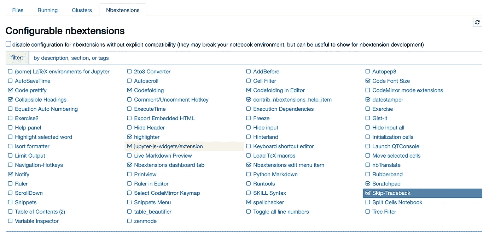

nb 扩展选项卡。作者截图[3]。

正如您从上面的截图中看到的，您可以启用大量的扩展来简化 Jupyter 编码和数据科学开发。我已经选择并启用了 10 个扩展，我也将在下面描述。有几个已经预先点击过的，比如*jupyter-js-widgets/extensions*，一旦你启用了你的扩展，它就会显示小部件和图标。同样，也有 *Nbextensions 编辑菜单项*已经预选。

> **代码美化**

*   该扩展有助于美化或正确格式化 Jupyter 笔记本单元格中的 Python 代码。您可以单击图标在当前单元格中重新格式化您的代码。下面是这个扩展执行前后的情况。这段代码已经很好地格式化了，所以我想展示一下它在右边正确地创建了格式化的间距。对于一些笔记本来说，这可能是一个小变化，但对于其他人来说，你可能有数百个功能的格式不正确，这个扩展可以立即修复你的格式。

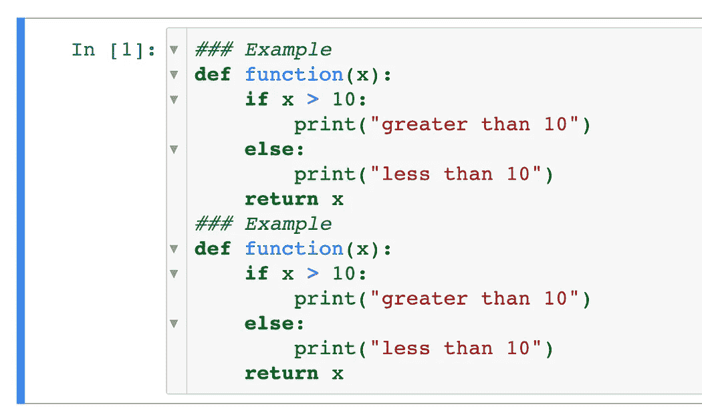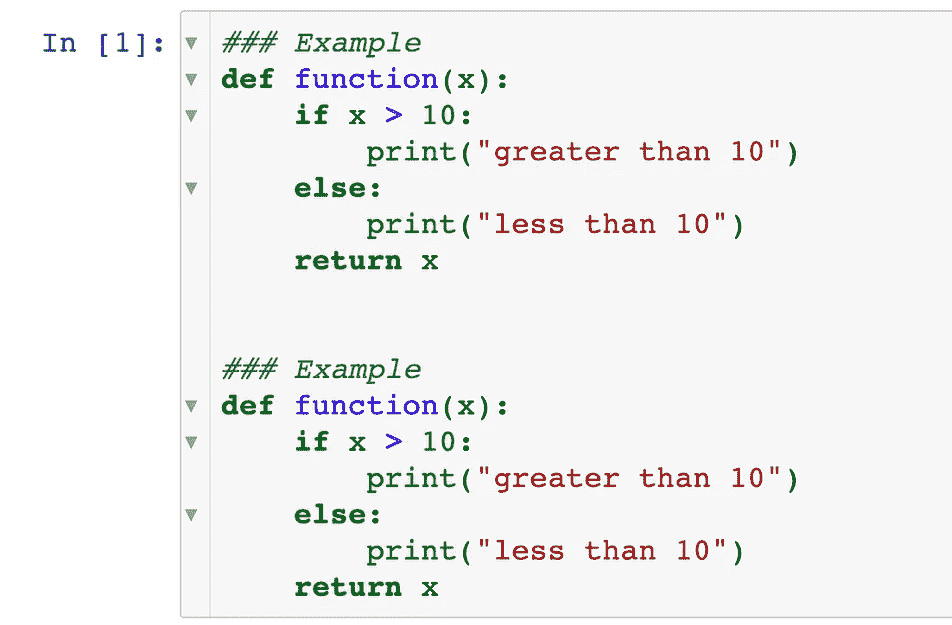

美化前后。作者截图[4]。

> **可折叠标题**

*   如果您用标题构建 Jupyter 笔记本，您可以使用标题左侧的向下箭头折叠同一标题部分中的信息和单元格。以下是可折叠标题的使用前和使用后。当你有，比如说一个笔记本有 10 个标题，而你想在代码评审或涉众会议上只突出一个标题部分，或者只是为了帮助你自己更专注于一个部分时，这是很有用的。除了选项、CSS、内部构件和导出更改之外，还有更多重要的参数可以添加到您的扩展中(*一旦您安装了这个库*，这些以及其他进一步的实现将包含在大多数扩展中)。

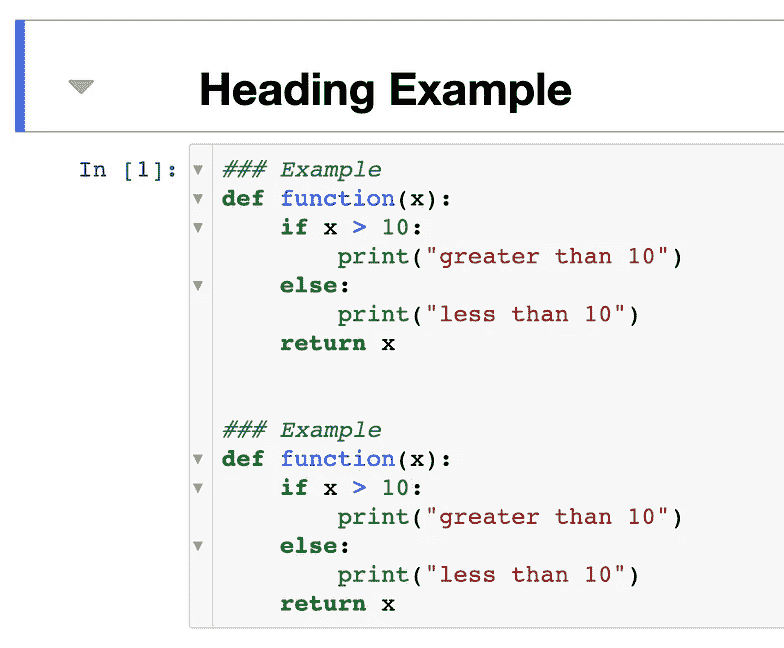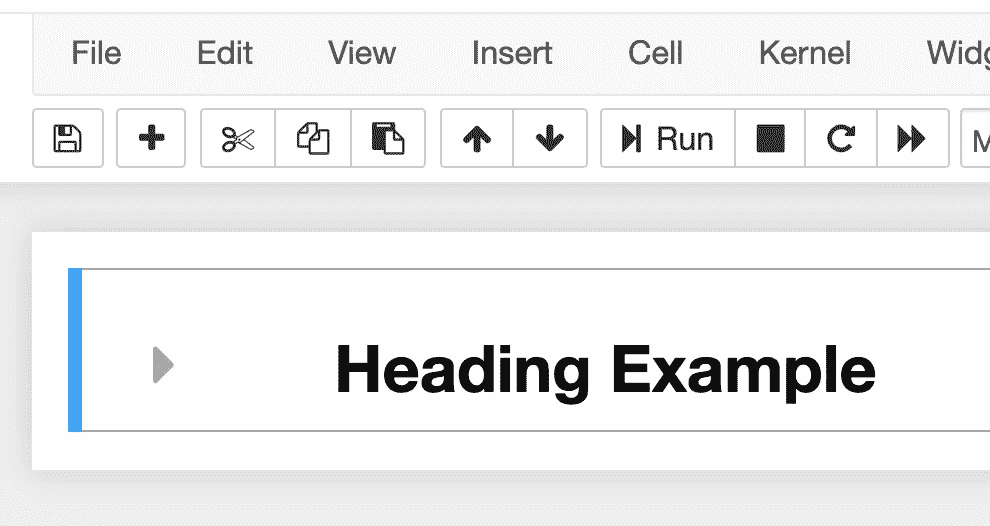

可折叠标题的前后。作者截图[5]。

> **通知**

这个扩展允许您的笔记本在您的内核空闲时向您发送 web 通知。如果您有一个长时间的任务在运行，这个扩展可以通过了解您当前的进程而变得有用。你也可以选择 0 秒、5 秒、10 秒和 30 秒。这是您笔记本中的下拉菜单示例。

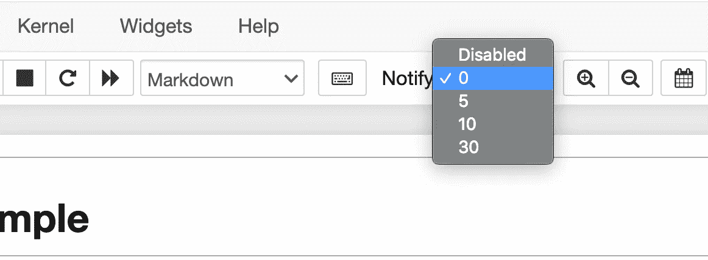

通知下拉菜单。作者截图[6]。

> **代码折叠(和编辑器中的代码折叠)**

> 这可能是我最喜欢的扩展。与可折叠的标题类似，这个扩展可以折叠您的代码部分，以便您可以更容易地滚动和查看您的笔记本。

如果您有一个长字典或长函数，您可以折叠它们，以便它们主要是隐藏的，但仍然显示函数命名，以便您仍然可以看到主要部分。在下面的例子中，你可以看到函数是如何折叠的，你甚至可以折叠到注释级别来隐藏这两个函数，只保留你的注释文本。紫色箭头图标表示代码在那里，但是被隐藏了。当与他人共享您的代码时，或者当您想专注于笔记本的某些部分时，这种扩展是有益的。

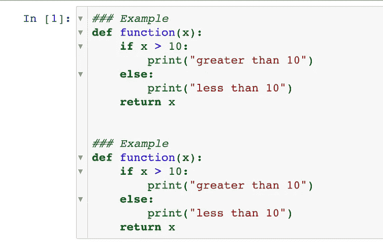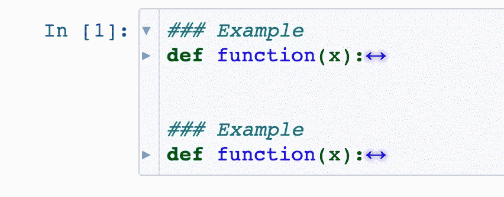

代码折叠示例。作者截图[7]。

> **荧光笔**

这个扩展相当简单，不言自明。您可以通过点击荧光笔图标来高亮显示您的减价文本。你可以看到有几个选项，如下面使用的红色和黄色。下面是这个简单而有用的扩展的前后对比。

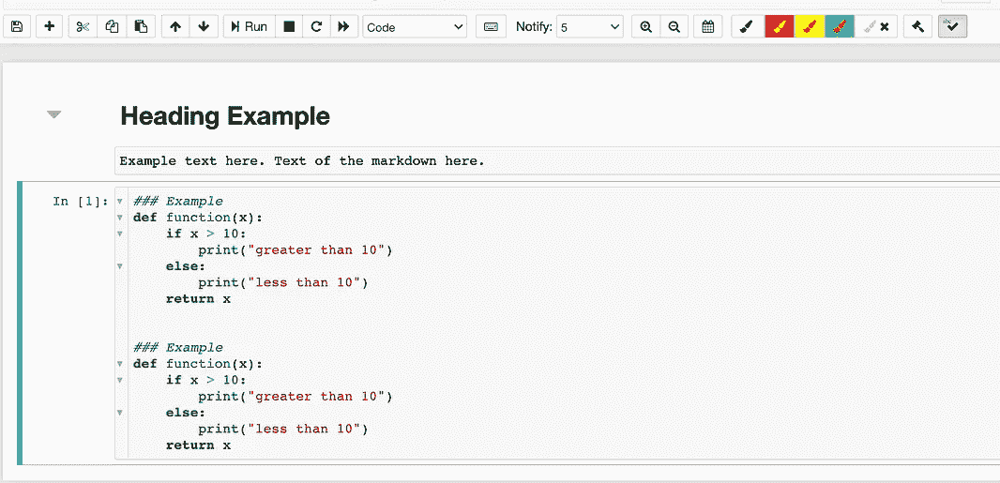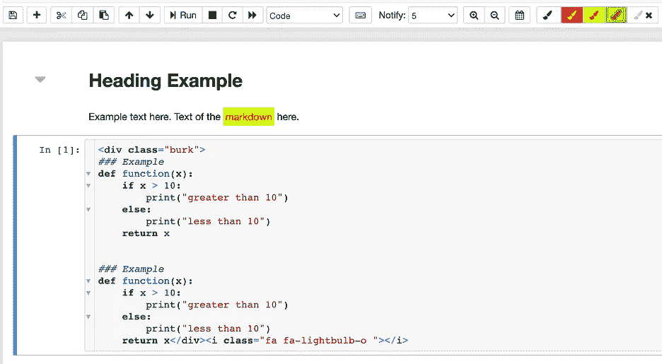

荧光笔延伸之前和之后。作者截图[8]。

> **拼写检查器**

拼写检查器也很简单，但是很有用。如果您正在共享您的笔记本，将它推送到 GitHub，或者向利益相关者展示它，这个扩展特别有用。你需要确保在你的减价单元格中拼写正确。你不会看到拼写错误的单词出现在你显示的减价中，而只会出现在你的编辑中。这个特性是有益的，因此如果你确实有一些你不同意拼写检查的单词，比如 Jupyter Notebook ( *实际上不是 Jupiter Notebook* )，你仍然可以显示它而没有令人分心的红色高亮文本。

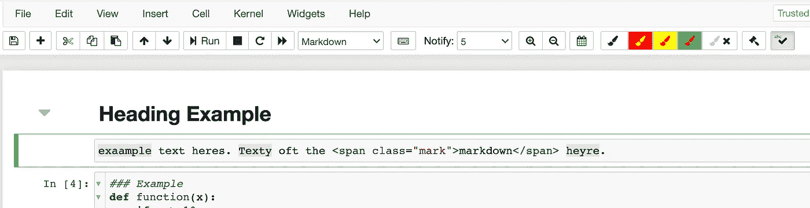

拼写检查示例。作者截图[9]。

> **代码字号**

如果你想改变代码的字体大小，这个扩展允许你这样做。当共享和协作时，尤其是共享您的屏幕时，这个特性可以证明是有益的，这样您的代码更容易查看。

> **日戳**

这个扩展允许你粘贴你当前的日期和时间到你的单元格中。我建议将其保存为 markdown，这样格式就不会像代码一样运行*很难看到*格式。如果您想跟踪何时启动了一个涉及不同单元和功能的进程，这个扩展可能会很有用(在流行的 tqdm 库之上*)。*

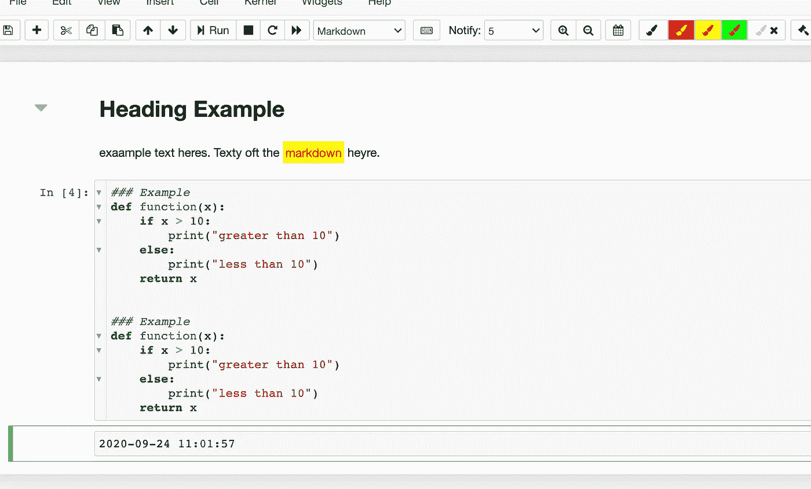

> **草稿栏**

这个扩展非常有用。您可以通过选择键盘上的 **Ctrl-B** 来使用便签簿，如下所示。您可以修改当前的代码，也可以在相同的内核上运行。如果您需要在笔记本中比较代码和注释，这对于并排查看代码和注释也很有用。

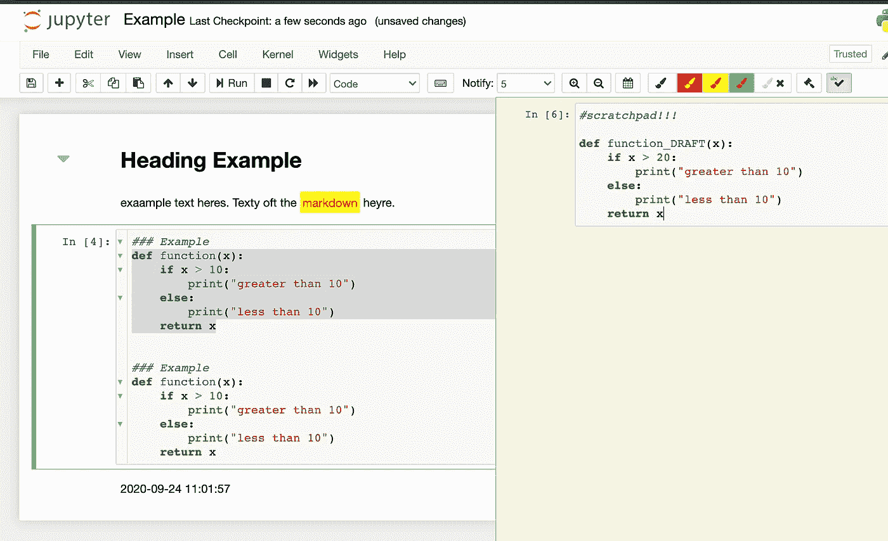

便签簿示例。作者截图[10]。

> **跳过回溯**

这种独特的扩展允许您忽略在 Jupyter 笔记本单元格中看到的一些重复或冗长的错误消息。它的工作原理类似于可折叠的标题和代码折叠。在下面的截图中，您可以看到错误的主要部分仍然在右边，但是减少了重复的错误信息，这些错误信息有时会导致头痛，使您无法修复相同的错误。

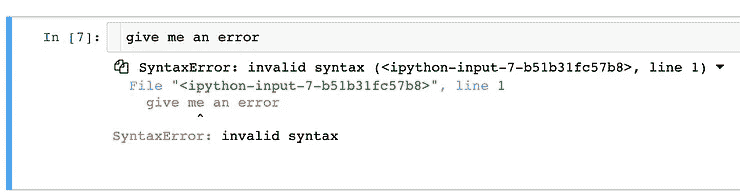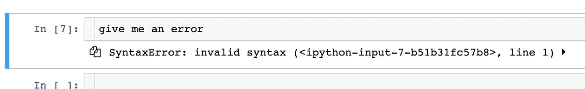

跳过追溯示例。作者截图[11]。

# 摘要


杰斯·贝利在 [Unsplash](https://unsplash.com/s/photos/notebook?utm_source=unsplash&utm_medium=referral&utm_content=creditCopyText) 上拍摄的照片。

这是 Jupyter 笔记本的 10 个基本扩展，适用于数据科学家或任何喜欢在 Jupyter 笔记本上编程和开发的人。我希望你学到了一些新的技巧，可以让你作为数据科学家的工作变得更容易。请记住，还有很多扩展需要探索。这些是我觉得特别有趣和有用的。

这里是我上面提到的所有扩展:

```
Code prettifyCollapsible HeadingsNotifyCodefoldinghighlighterspellcheckerCode Font SizedatestamperScratchpadSkip-Traceback
```

*感谢您的阅读！如果您曾经使用过这些或其他 Jupyter 笔记本扩展，请在下面评论。*

# 参考

[1]照片由[布雷特·里奇](https://unsplash.com/@brett_ritchie_photography?utm_source=unsplash&utm_medium=referral&utm_content=creditCopyText)在[Unsplash](https://unsplash.com/s/photos/planet?utm_source=unsplash&utm_medium=referral&utm_content=creditCopyText)(2018)拍摄

[2] Jupyter Contrib 团队，[Jupyter-Contrib-nb extensions](https://jupyter-contrib-nbextensions.readthedocs.io/en/latest/install.html)，(2015–2018)

[3] M.Przybyla，NBextensions 选项卡截图，(2020 年)

[4] M.Przybyla，美化前后截图，(2020 年)

[5] M.Przybyla，可折叠标题前后的截屏，(2020 年)

[6] M.Przybyla，通知下拉菜单截图，(2020 年)

[7] M. Przybyla，代码折叠示例截图，(2020 年)

[8] M.Przybyla，荧光笔扩展截图之前和之后，(2020 年)

[9] M.Przybyla，拼写检查示例截图，(2020 年)

[10] M.Przybyla，Scratchpad 示例截图，(2020 年)

[11] M.Przybyla，作者提供的跳过追溯示例截图，(2020 年)

[12]Jess Bailey 在[Unsplash](https://unsplash.com/s/photos/notebook?utm_source=unsplash&utm_medium=referral&utm_content=creditCopyText)上拍摄的照片，(2018)