# 数据科学统计学中的 10 个重要数字摘要(理论、Python 和 R)

> 原文：<https://towardsdatascience.com/10-essential-numerical-summaries-in-statistics-for-data-science-theory-python-and-r-f3ee5e0eca32?source=collection_archive---------10----------------------->

## 理解并使用 Python 和 R 在 stats 中应用基本的数字汇总来描述数据的中心、分布、最可能的值。

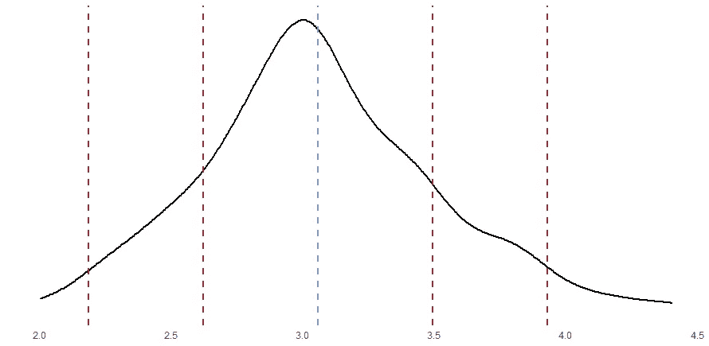

在本文中，我们将回顾以下数值摘要的理论和应用(用 Python 和 R 编写的示例):

1.  平均
2.  中位数
3.  方式
4.  百分位
5.  四分位数(五位数汇总)
6.  标准偏差
7.  差异
8.  范围
9.  比例
10.  相互关系

# 平均

这是平衡点，描述了正态分布数据的最典型的值。我说“正态分布”数据是因为平均值受异常值的影响很大。

平均值将所有数据值相加，然后除以值的总数，如下所示:

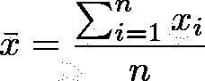

平均值的公式

“ *x 条*用于表示样本均值(数据样本的均值)。“∑”( sigma)表示从“ *i* =1”直到“ *i* = *n* ”的所有值的加法运算(“n”是数据值的数量)。然后将结果除以' *n* '。

**Python:** `**np.mean([1,2,3,4,5])**` 结果为 3。

**R:** `**mean(c(2,2,4,4))**` 结果是 3。

**异常值的影响:**

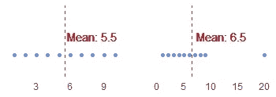

平均值中异常值的影响

第一个图的范围是从 1 到 10。平均值是 5.5。当我们用 20 代替 10 时，平均值增加到 6.5。在下一个概念中，我们将讨论“中位数”，这是忽略异常值的最佳选择。

# 中位数

这就是“中间数据点”，一半数据在中位数以下，一半在中位数以上。这是数据的第 50 个百分位数(我们将在本文后面讨论*百分位数*)。它也主要用于有偏差的数据，因为异常值不会对中位数产生大的影响。

有两个公式来计算中位数。选择使用哪个公式取决于 *n* (样本中数据点的数量，或样本大小)是偶数还是奇数。


n 为偶数时的中位数公式。

当 *n* 为**偶数**时，没有“中间”数据点，所以取中间两个值的平均值。


n 为奇数时的中位数公式。

当 *n* 为**奇数**时，中间数据点为中值。

**Python:**`np.median([1,2,3,4,5,6])`(*n*是偶数)。结果是 3.5，3 到 4 之间的平均值(中间点)。

**R:**(*n*为奇数)。结果是 4，中间点。

**异常值的影响:**

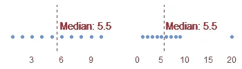

异常值对中位数的影响很小。在这种情况下没有。

在上图中，我们使用了计算平均值时使用的相同数据。请注意，当我们用 20 代替 10 时，第二张图中的中位数保持不变。并不意味着中位数会一直忽略离群值。如果我们有大量的数字和/或异常值，中位数可能会受到影响，但异常值的影响很小。

# 方式

该模式将返回最常出现的数据值。

**Python:** `statistics.mode([1,2,2,2,3,3,4,5,6])`结果是 2。

R 并没有给你具体的均值，但是你可以通过下面的操作得到每个数据值的频率: **R:** `table(c('apple','banana','banana','tomato','orange','orange','banana'))`结果是`apple:1, banana:3, orange:2, tomato:1`。“香蕉”出现的频率更高，有 3 次。下面是这个水果矢量的直方图。

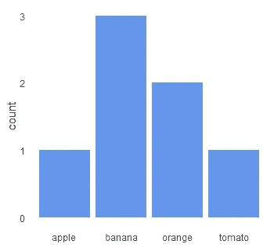

使用直方图的模式示例。

# 百分位

等于或小于给定数据点的数据百分比。它有助于描述数据点在数据集中的位置。如果百分位数接近于零，那么观察值是最小的。如果百分位数接近 100，那么该数据点是数据集中最大的一个。

**Python:**

```
from scipy import statsx = [10, 12, 15, 17, 20, 25, 30]## In what percentile lies the number 25?
stats.percentileofscore(x,25)
# result: 85.7
```

**R:**

```
library(stats)x <- c(10, 12, 15, 17, 20, 25, 30)## In what percentile lies the number 25?
ecdf(x)(25)
# resul: 85.7## In what percentile lies the number 12?
ecdf(x)(12)
# resul: 0.29
```

# 四分位数(五位数汇总)

四分位测量中心，也很好地描述了数据的分布。对有偏差的数据非常有用。有四个四分位数，它们组成了五数汇总(结合*最小值*)。**五数汇总**由以下部分组成:

1.  最低限度
2.  第 25 百分位(下四分位)
3.  第 50 百分位(中位数)
4.  第 75 百分位(上四分位数)
5.  第 100 百分位(最大值)

**Python:**

```
import numpy as npx = [10,12,15,17,20,25,30]min = np.min(x)
q1 = np.quantile(x, .25)
median = np.median(x)
q3 = np.quantile(x, .75)
max = np.max(x)print(min, q1, median, q3, max)
```

**R:**

```
x <- c(10,12,15,17,20,25,30)min = min(x)
q1 = quantile(x, .25)
median = median(x)
q3 = quantile(x, .75)
max = max(x)paste(min, q1, median, q3, max)## You can also use the function favstats from the mosaic 
## It will give you the five-number summary, mean, standard deviation, sample size and number of missing values.librarylibrary(mosaic)
favstats(x)
```

一个*箱线图*是一个很好的方法来绘制五个数字的摘要和探索数据集。

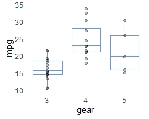

“mtcars”数据集(mpg x gear)的箱线图。

箱线图的底端代表最小值；第一条水平线代表下四分位数；正方形内部的线是中间值；下一行是上四分位数，最上面是最大值。

# 标准偏差

标准差广泛用于统计学和数据科学。它测量数据集的变化量或离差量，计算数据相对于平均值的分散程度。小值意味着数据是一致的，并且接近平均值。较大的值表示数据高度可变。

**偏差:**这个想法是把平均值作为一个参考点，一切都从这个点开始变化。**偏差**被定义为观察值与参考点之间的距离。该距离通过从平均值( *x-bar* )中减去数据点( *xi* )获得。


计算标准差的公式。

**计算标准偏差:**所有偏差的平均值将始终为零，因此我们对每个偏差进行平方，并将结果相加。然后，我们将其分为' *n-1'* (称为*自由度*)。我们对最终结果求平方根，以取消偏差的平方。

标准差是数据中所有偏差的代表。它从不为负，只有当所有值都相同时，它才为零。

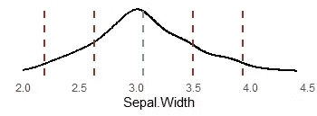

萼片的密度图。虹膜数据集中的宽度。

这张图显示了萼片的密度。虹膜数据集中的宽度。标准差为 **0.436** 。蓝线代表平均值，红线距离平均值一个和两个标准差。例如，萼片。值为 3.5 的宽度与平均值相差 1 个标准偏差。

**Python:**

**R:**

**离群值的影响:**标准差和均值一样，受离群值的影响很大。下面的代码将使用 R 来比较两个向量的标准差，一个没有异常值，另一个有异常值。

```
x <- c(1,2,3,4,5,6,7,8,9,10)
sd(x)
# result: 3.02765#Replacing 10 by 20:
y <- c(1,2,3,4,5,6,7,8,9,20)
sd(y)
# result: 5.400617
```

# 差异

方差几乎是标准偏差的相同计算，但它停留在平方单位。所以，如果你求方差的平方根，你就得到了标准差。

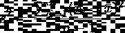

方差的公式。

注意用' *s 平方'*表示，标准差用' *s'* 表示。

**Python:**

**R:**

# 范围

最大值和最小值之差。对于一些基本的探索性分析很有用，但不如标准差强大。

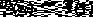

范围的公式。

**Python:**

**R:**

# 比例

它通常被称为“百分比”。定义数据集中满足某些要求的观察值的百分比。

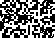

# 相互关系

定义两个定量变量之间关联的强度和方向。它的范围在-1 和 1 之间。正相关意味着一个变量随着另一个变量的增加而增加。负相关意味着一个变量随着另一个变量的增加而减少。当相关性为零时，则完全没有相关性。结果越接近其中一个极端，两个变量之间的关联就越强。


计算相关性的公式。

**巨蟒:** `stats.pearsonr(x,y)`

**R:** `cor(x,y)`

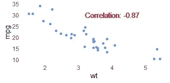

MPG 和体重的相关性。

该图显示了 *mtcars* 数据集中 *MPG* 和*重量* (-0.87)之间的相关性。这是一个很强的负相关，意味着随着体重的增加，MPG 下降。

当您探索和分析数据时，这些基本摘要是必不可少的。它们是深入研究统计和高级分析的基础。如果你有什么想让我加入的总结，请随意回复。