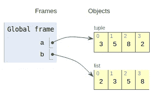
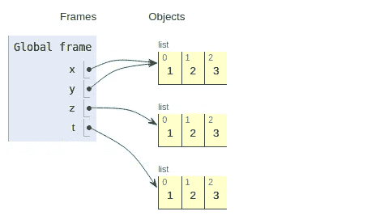
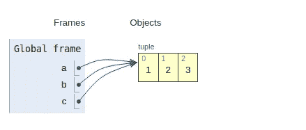

# 掌握 Python 元组的 10 个例子

> 原文：<https://towardsdatascience.com/10-examples-to-master-python-tuples-6c606ed42b96?source=collection_archive---------4----------------------->

## 综合实践指南


Javier Allegue Barros 在 [Unsplash](https://unsplash.com/s/photos/no-change?utm_source=unsplash&utm_medium=referral&utm_content=creditCopyText) 上拍摄的照片

数据结构是任何编程语言的关键部分。为了创建健壮且性能良好的产品，人们必须非常了解数据结构。

在这篇文章中，我们将研究 Python 编程语言的一个重要数据结构，那就是*元组*。

元组是由逗号分隔并包含在括号中的值的集合。与列表不同，元组是不可变的。不变性可以被认为是元组的识别特征。

我将举例说明元组的特征和对它们的操作。

## 1.创建元组

元组由括号中的值组成，用逗号分隔。

```
a = (3, 4)print(type(a))
<class 'tuple'>
```

元组可以存储不同数据类型的值和重复值。

```
a = (3, 3, 'x', [1,2])print(a)
(3, 3, 'x', [1, 2])print(type(a))
<class 'tuple'>
```

我们也可以在不使用括号的情况下创建元组。由逗号分隔的值序列将创建一个元组。

```
a = 3, 4, 5, 6print(type(a))
<class 'tuple'>
```

## 2.创建包含 0 或 1 个元素的元组

具有零元素的元组只是一个空元组，创建如下:

```
a = ()print(type(a))
<class 'tuple'>
```

但是，有一个小技巧可以创建一个只有一个元素的元组。你需要在元素后面加一个逗号。否则，您将创建一个值类型的变量。

```
a = (3)
print(type(a))
<class 'int'>b = ([1,2])
print(type(b))
<class 'list'>
```

让我们做同样的事情，但是在值后面使用逗号:

```
a = (3,)
print(type(a))
<class 'tuple'>b = ([1,2],)
print(type(b))
<class 'tuple'>
```

## 3.元组是可迭代的

就像列表一样，您可以迭代一个元组。

```
a = (1, 2, 3)
for i in a:
   print(i**2)
1
4
9
```

## 4.索引和切片

索引和切片元组与列表相同。

```
a = (3, 5, 'x', 5)
print(f'The first element of tuple a is {a[0]}')
print(f'The last element of tuple a is {a[-1]}')The first element of tuple a is 3
The last element of tuple a is 5
```

和切片:

```
a = (1, 2, 5, 6, 7)print(a[-2:])
(6, 7)print(a[:3])
(1, 2, 5)
```

## 5.元组是不可变的，但是可以有可变的元素

不变性可能是元组最具识别性的特征。我们不能给元组中的单个项赋值。

```
a = (3, 5, 'x', 5)
a[0] = 7 #error
```

然而，元组可以包含可变元素，比如列表。

```
a = ([1,2], ['x', 'y'])a[0][0] = 99
a[1][0] = 't'print(a)
([99, 2], ['t', 'y'])
```

## 6.排序与已排序

因为元组是不可变的，所以我们不能对它们进行排序:

```
a = (3, 0, 2)a.sort() #error
'tuple' object has no attribute 'sort'
```

但是，排序函数可以将元组作为参数，并返回元组中值的排序列表。请注意，它不返回排序的元组。返回变量的类型是 list。

```
a = (3, 5, 8, 2)
b = sorted(a)print(b)
[2, 3, 5, 8]print(type(b))
<class 'list'>
```



创建于 [pythontutor](http://pythontutor.com/) (图片由作者提供)

## 7.元组的长度

len 函数可以用来获得一个元组的长度。

```
a = (3, 0, 2)
len(a)
3
```

## 8.计数和索引方法

元组有计数和索引方法。count 方法返回一个值在元组中出现的次数。

```
a = (1, 'x', 1, 1, 'x')print(a.count('x'))
2print(a.count(1))
3
```

index 方法返回元组中某个值的索引。

```
a = (1, 'x', 3, 5, 'x')print(a.index('x'))
1print(a.index(1))
0
```

**注意**:如果一个值在一个元组中多次出现，index 方法返回第一次出现的索引。

## 9.将元组相加

“+”运算符可用于将元组相加。

```
a = (1, 2)
b = ('x', 'y')
c = a + bprint(c)
(1, 2, 'x', 'y')
```

## 10.返回多个值的函数

元组最常见的一个用例是使用返回多个值的函数。下面的函数采用一个数组，并返回数组中项目的总数和计数。

```
def count_sum(arr):
   count = len(arr)
   sum = arr.sum()
   return count, sum
```

这个函数返回的是一个包含两项的元组:

```
import numpy as np
arr = np.random.randint(10, size=8)a = count_sum(arr)print(a)
(8, 39)print(type(a))
<class 'tuple'>
```

## 奖金

元组和列表都是值的集合。最显著的区别是不变性。

由于不变性，复制元组和列表是不同的。我们在复制列表时需要更加小心，因为它们是可变的。

我们有三种方法复制一个列表并赋给一个新的变量:

```
x = [1, 2, 3]y = x
z = x[:]
t = x.copy()
```

列表 y、z 和 t 包含与 x 相同的值。然而，y 指向 x 的值，而 z 和 t 是完全不同的列表。



创建于 [pythontutor](http://pythontutor.com/) (图片由作者提供)

因此，x 的任何变化都会引起 y 的变化。

```
x.append(4)print(y)
[1, 2, 3, 4]print(t)
[1, 2, 3]
```

复制列表时，我们需要非常小心。然而，我们不应该对元组有同样的关注，因为它们是不可变的。

当你复制一个元组并把它赋给一个新变量时，它们都指向内存中相同的值。

```
a = (1, 2, 3)b = a
c = a[:]
```



创建于 [pythontutor](http://pythontutor.com/) (图片由作者提供)

感谢您的阅读。如果您有任何反馈，请告诉我。