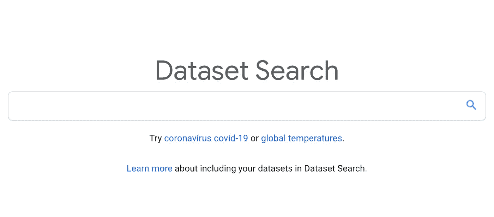
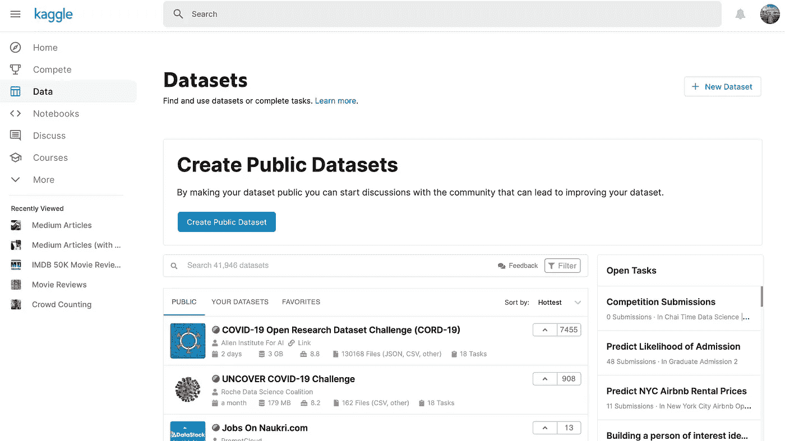
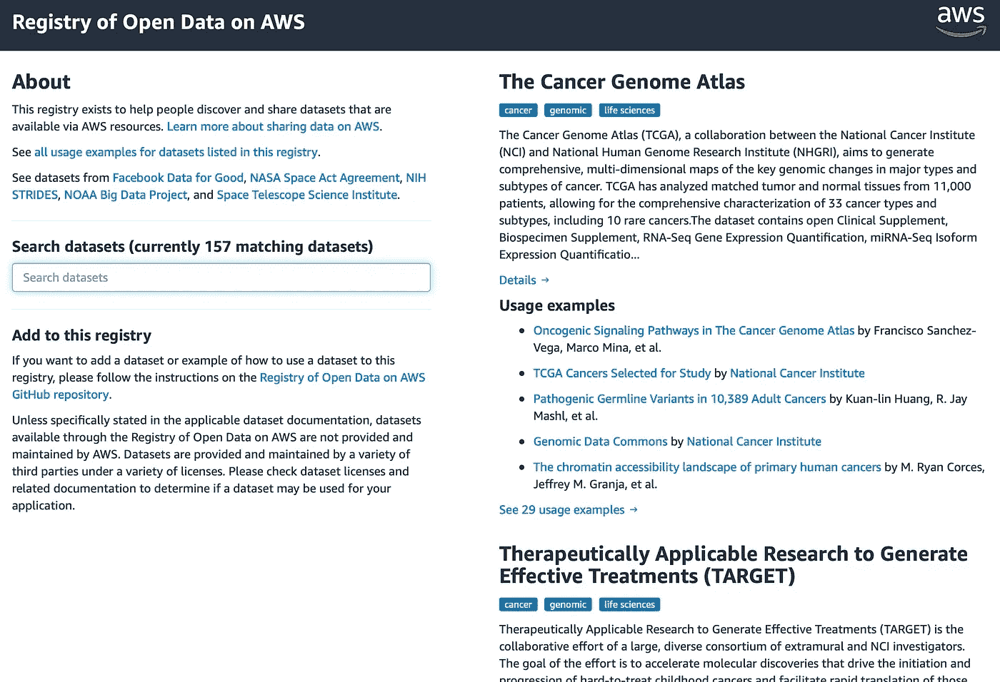
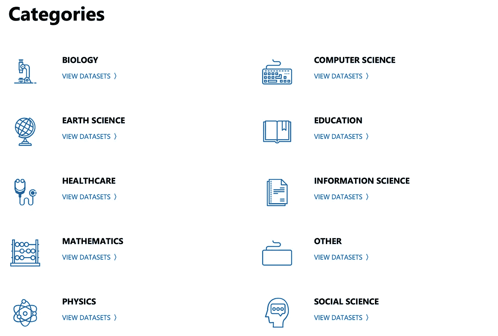

# 10 多种免费资源，用于下载机器学习数据集

> 原文：<https://towardsdatascience.com/10-free-resources-to-download-datasets-for-machine-learning-2acfff33822?source=collection_archive---------15----------------------->

## 为您的机器学习和人工智能项目搜索和下载数据集的在线资源列表

我们可以这样说:这篇文章是数据集的集合[图片来自维基媒体的莫恩图书馆]。]

如果您正在从事机器学习(ML)项目，您可能知道为您的模型找到正确的数据集有多难。你可能致力于你的问题，把它定义为一个 ML 问题，但是现在没有数据来训练你的模型。也许你确实有一些数据，但不足以养活那些渴求数据的神经网络。或者也许你有很多数据，但是没有正确标记。谁说 ML 容易？

我去过那里很多次，一路上我发现了很多在线资源，这些资源帮助我找到了这些珍贵的数据。为了让你的工作更容易，我列出了这个免费的在线资源列表，你可以用它来获取你的 ML 项目的数据，任何你喜欢的主题。希望你觉得有用！

> 如果你正在寻找强化学习环境，我建议你查看一下[我的文章，里面有一个列表](https://medium.com/@mauriciofadelargerich/reinforcement-learning-environments-cff767bc241f)。

# 谷歌数据集搜索

你可能已经知道了。它于 2018 年首次发布为测试版，最终在今年 1 月正式发布。没有它我们怎么活了这么久？我不确定，但我知道现在，当你寻找一个数据集时，它是第一个要去的地方。

[谷歌数据集搜索](https://datasetsearch.research.google.com)首页。

这个搜索引擎实际上搜索了我下面列出的许多其他资源，并把你引导到数据集的下载页面。一旦你输入了你的关键词，你也可以使用许多选项来过滤你的搜索:最后更新，下载格式，使用权，主题和免费(或不免费)。这是非常有用的，是任何人在 ML，AI 或数据科学的必备。

链接:[https://datasetsearch.research.google.com](https://datasetsearch.research.google.com)

# 卡格尔

Kaggle 是一个数据科学和 ML 实践者的在线社区(有趣的事实:它是 Google 的子公司。)Kaggle 非常适合学习和提高你的 ML 技能，事实上，我进入 ML 的第一步就是在 Kaggle 上。你可以找到几个比赛，在这些比赛中你可以比较和分享你的 ML 算法，如果你取得了最好的成绩，你甚至可以赢得金钱。

[ka ggle 中的数据集页面。](https://www.kaggle.com/datasets)

但除此之外，Kaggle 还有自己的[数据集页面](https://www.kaggle.com/datasets)，你可以用它来搜索 Kaggle 上目前托管的超过 40，000 个数据集。您还可以根据许可证、数据集大小和文件类型过滤您的搜索。尽管许多数据集质量非常高，但要注意的是，大多数数据集是由像你我这样的人提供的，很多时候数据的质量可能不是最好的。

链接:【https://www.kaggle.com/datasets 

# 令人惊叹的公共数据集

由 Github 贡献者维护的大量免费数据集。该列表目前相当大，涉及许多不同的主题。正如你所料，搜索不像这个网站的其他选项那么容易，因为它只是一个。md 文件，其中包含数据集及其链接的列表，但它包含每个数据集的总体状态信息。

这是一个伟大的贡献，它拥有网络社区的温暖，所以至少对我来说，这增加了一些特别的东西。你也可以加入他们的[休闲频道](https://awesomedataworld.slack.com/)，如果你想为这个不断增长的列表做贡献的话。

链接:[https://github.com/awesomedata/awesome-public-datasets](https://github.com/awesomedata/awesome-public-datasets)

# 全球开放数据倡议

世界上有几个国家已经免费发布了各种主题的可用数据，如人口统计、领土、预算、法律、环境等。这些是非常宝贵的资源，我们必须感谢开放数据倡议。

全球开放数据指数地图视图【来自[官网](https://index.okfn.org/place/)。]

在[全球开放数据指数](https://index.okfn.org/place/)中，你可以找到一个国家及其开放数据指数的列表，该指数根据它们发布的数据源数量以及更新和管理的程度对它们进行排名。你也可以找到官方网站的链接，在那里你可以找到下载的数据资源。

链接:[https://index.okfn.org/](https://index.okfn.org/place/)

你还可以在欧盟最近推出的[开放数据门户](https://data.europa.eu/euodp/en/data/)中找到几个由欧盟发布的数据集。

嗯，这是谷歌在这个列表中的第三个，我保证这是最后一个。另一种找到数据集的方法是在 Google scholar 上搜索发表这些数据集的论文。这不是那么直接，事实上，这是一个有点老的学校，但它可以取得很大的成果。只需输入你喜欢的数据，然后输入“数据集”，幸运的话，一些研究人员可能已经发布了你可以使用的数据集。

你还可以在欧盟最近推出的 [**开放数据门户**](https://data.europa.eu/euodp/en/data/) 中找到几个由欧盟发布的数据集。

# 谷歌学术

[谷歌学术](https://scholar.google.com)的标志【来自[维基媒体](https://de.m.wikipedia.org/wiki/Datei:Google_Scholar_logo.svg)。]

嗯，这是谷歌在这个列表中的第三个，我保证这是最后一个。另一种找到数据集的方法是在 Google scholar 上搜索发表这些数据集的论文。这不是那么直接，事实上，这是一个有点老的学校，但它可以取得很大的成果。只需输入你喜欢的数据，然后输入“数据集”，幸运的话，一些研究人员可能已经发布了你可以使用的数据集。

尽管不像前两个选项那么容易，但你能找到的数据集的质量通常非常好，因为论文通常由同行评审，并且必须达到一定的质量标准才能发表。此外，像这样发布的数据集几乎总是可以免费获得，并且可以以任何方式重用，只要你引用了正确的出版物。

链接:[https://scholar.google.com](https://scholar.google.com)

# AWS 开放数据

AWS 上[开放数据注册中心的主页](https://registry.opendata.aws)。

亚马逊已经推出了自己的公开数据集存储库，你可以从[这里](https://registry.opendata.aws)进行搜索。亚马逊将这些数据集免费存储在亚马逊网络服务中，供所有公众使用，这使我认为这里的数据集列表将随着时间的推移继续增长。在撰写本文时，这个存储库中有 157 个数据集，因此没有太多选项可供选择。然而，发布的数据集质量非常高，因为亚马逊在发布之前会对其进行审查。

# **加州大学欧文分校机器学习知识库**

加州大学欧文分校也拥有大约 500 个面向 ML 从业者的数据集。你可以找到各种各样的数据集:从最基本和最流行的如虹膜，到更复杂和新的如用于**肩**植入 X 射线制造商分类。

尽管数据集是由用户在其网站上捐赠的，但数据的质量总体来说似乎相当不错。我猜有一些来自 UCI 的人提供的数据集的“策展”,所以质量应该普遍良好。你可以在这里看到数据集[的完整列表，并通过名称、默认任务和其他属性搜索它们。](https://archive.ics.uci.edu/ml/datasets.php)

链接:【https://archive.ics.uci.edu/ml/index.php 

# 微软研究院开放数据

微软也加入了开放数据的行列，现在正在为研究人员和 ML 从业者共享几个有趣的数据集。他们目前托管着大约 100 个不同主题的数据集，如生物学、计算机科学、信息科学、教育等。

[微软研究院开放数据网站中包含的数据类别](https://msropendata.com/categories)。

数据的质量非常好，因为所有的数据集在发布到这里之前都是由微软策划的。他们可能会继续发布更多的数据集，所以这个知识库有很大的潜力。

链接:[https://msropendata.com](https://msropendata.com)

# 学术洪流

[学术洪流](http://academictorrents.com/browse.php)是一个很不错的网站，几周前才知道。它拥有一个非常大的数据集目录，用于研究目的，但你也可以用它们来学习和尝试。

您可以按名称或描述搜索数据集，并按大小排序。每个数据集都有一个很长的描述页面，您还可以在其中找到注释、许可条款以及在使用数据集时应该在出版物中使用的引用。顾名思义，你需要一个 BitTorrent 客户端来下载数据集，所以这有点复杂。

链接:[http://academictorrents.com/browse.php](http://academictorrents.com/browse.php)

# 五三八

FiveThirtyEight 是一个专注于民意调查分析、政治、经济和体育博客的网站。我是通过查看他们的民意调查了解到这一点的，大部分是关于政治的，也用简单的情节进行了总结。但是 FiveThirtyEight 有一个不太为人知的功能:你可以从它的民意调查中下载数据。

数据的质量并不总是最好的，许多民意调查只有摘要，通常对 ML 来说是不够的。然而，你可以找到一些非常有趣的民意调查，你可以结合其他来源，我认为这是值得一提的。

链接:[https://fivethirtyeight.com](https://fivethirtyeight.com)

# 股票数据:羊驼

好的，这不是一个真正的数据集资源，但是它给了你从股票市场下载历史数据和免费实时数据的可能性。多酷啊。

[**羊驼**](https://alpaca.markets) 是一家公司，其使命是为所有人提供使用算法进行交易的可能性。这意味着你不仅可以实时访问股票市场的数据，还可以用真钱或在模拟环境中进行交易。如果你想下载任何交易或投资 ML 项目的历史数据，你可以按照我上一篇文章中的步骤进行:

 [## 如何在 Python 上访问股票市场数据进行机器学习

### 如果您想使用 ML 进行股票交易，您需要创建一个股票市场数据的数据集。了解如何…

towardsdatascience.com](/how-to-access-stocks-market-data-for-machine-learning-on-python-c69db51e7a0d) 

# 包裹

老规矩，感谢阅读！我会试着用我发现的新资源来更新这个列表。如果你有任何其他的建议，请让我在回复中知道，这样我就可以把它添加到这个列表中。