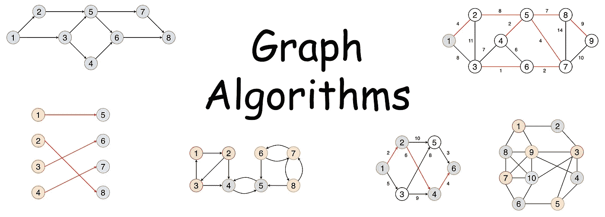
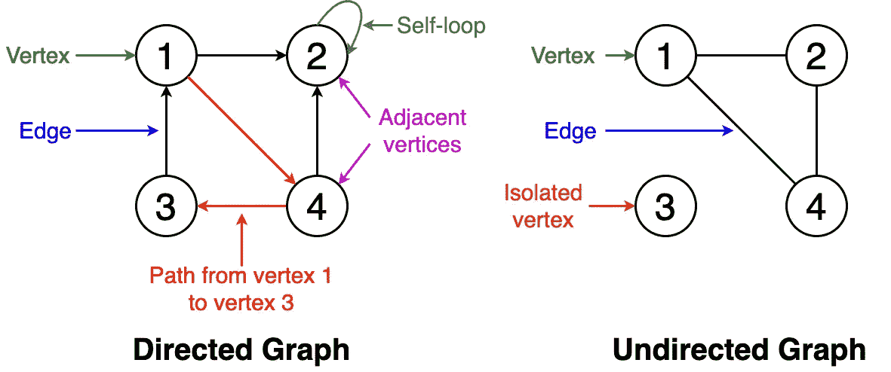
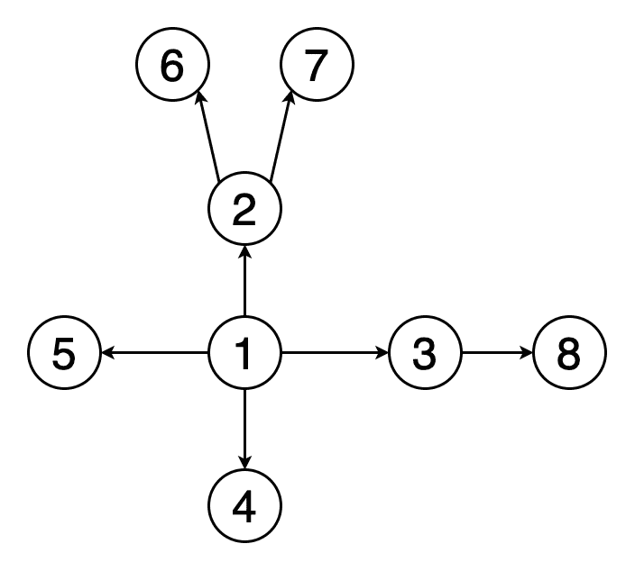
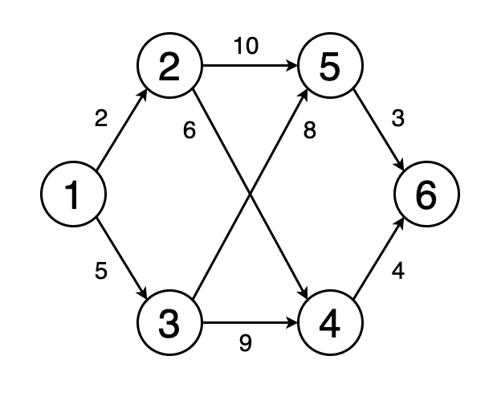
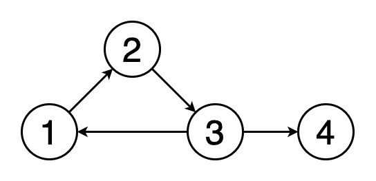
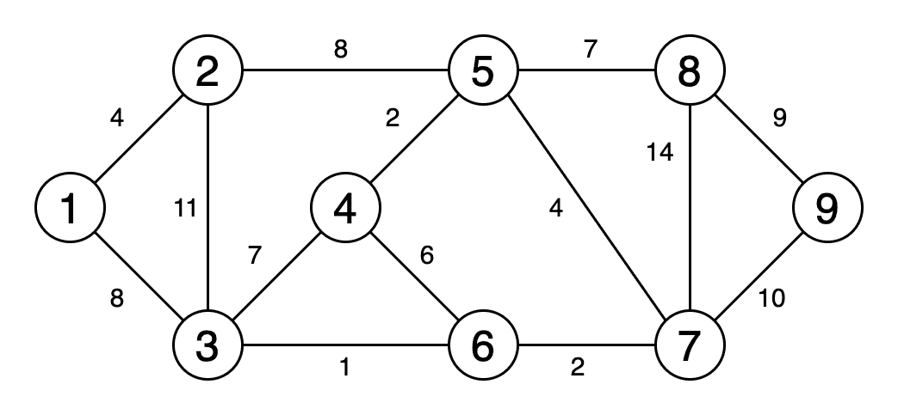
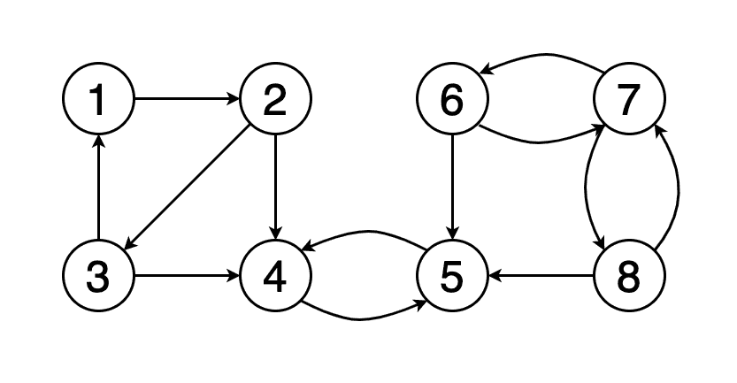
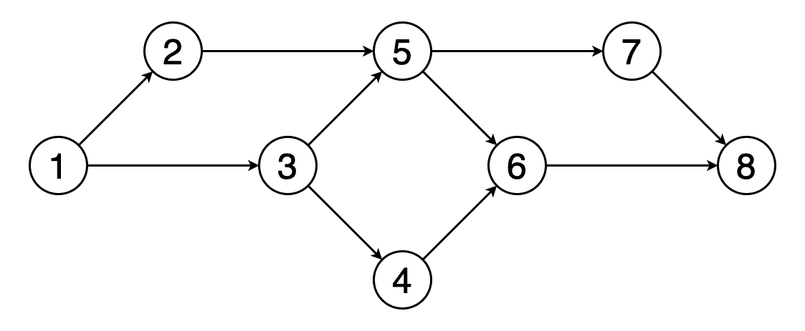
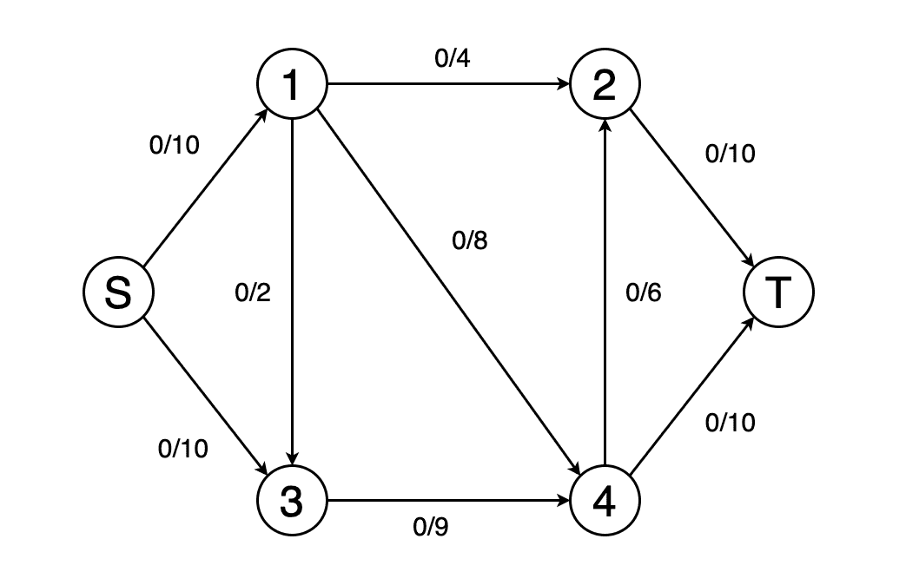
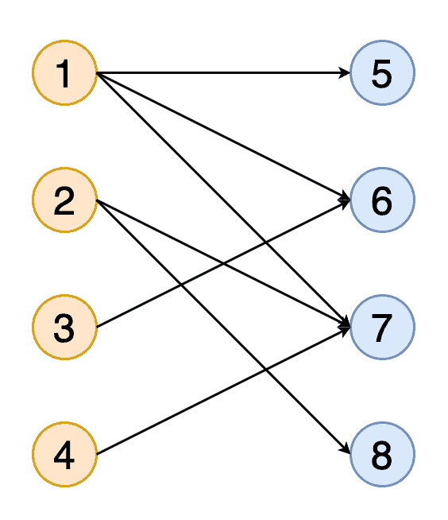

# 直观解释的 10 种图形算法

> 原文：<https://towardsdatascience.com/10-graph-algorithms-visually-explained-e57faa1336f3?source=collection_archive---------0----------------------->

## 10 种基本图形算法的快速介绍，包括示例和可视化

图形已经成为现实世界场景中建模和捕捉数据的强大手段，如社交媒体网络、网页和链接，以及 GPS 中的位置和路线。如果您有一组彼此相关的对象，那么您可以使用图形来表示它们。

作者图片

在这篇文章中，我将简要地解释 10 个基本的图形算法，它们对于分析和它们的应用变得非常有用。

首先，我们来介绍一张图。

# 什么是图？

一个**图**由一组有限的**顶点**或节点和一组连接这些顶点的**边**组成。如果两个顶点通过同一条边相互连接，则称它们为**相邻**。

下面给出了一些与图形相关的基本定义。您可以参考图 1 中的示例。

*   **顺序:**图中顶点的数量
*   **尺寸:**图中的边数
*   **顶点度数:**与一个顶点关联的边的数目
*   **孤立顶点:**图中不与任何其它顶点相连的顶点
*   **自循环**:从顶点到自身的边
*   **有向图:**所有边都有一个方向的图，指示什么是起始顶点，什么是结束顶点
*   **无向图:**边没有方向的图
*   **加权图:**图的边有权重
*   **未加权图:**图的边没有权重

图一。图形术语的可视化(图片由作者提供)

# 1.广度优先搜索

图二。BFS 遍历图形的动画(图片由作者提供)

*遍历*或*搜索*是可以在图形上执行的基本操作之一。在 ***广度优先搜索***【BFS】中，我们从一个特定的顶点开始，在移动到下一层的顶点之前，在当前深度探索它的所有邻居。与树不同，图可以包含循环(第一个和最后一个顶点相同的路径)。因此，我们必须跟踪访问过的顶点。当实现 BFS 时，我们使用队列数据结构。

图 2 表示示例图的 BFS 遍历的动画。注意顶点是如何被发现的(黄色)和被访问的(红色)。

## 应用程序

*   用于确定最短路径和最小生成树。
*   由搜索引擎爬虫用来建立网页的索引。
*   用于在社交网络上搜索。
*   用于在对等网络(如 BitTorrent)中查找可用的邻居节点。

# 2.深度优先搜索

图三。图的 DFS 遍历动画(图片由作者提供)

在 ***深度优先搜索*** (DFS)中，我们从一个特定的顶点开始，沿着每个分支尽可能远地探索，然后往回追溯(回溯)。在 DFS 中，我们也必须跟踪访问过的顶点。在实现 DFS 时，我们使用堆栈数据结构来支持回溯。

图 3 表示图 2 中使用的相同示例图的 DFS 遍历的动画。注意它是如何穿越到深处并返回的。

## 应用程序

*   用于查找两个顶点之间的路径。
*   用于检测图形中的循环。
*   用于拓扑排序。
*   用于解决只有一个解的谜题(例如迷宫)

# 3.最短路径

图 4。动画显示从顶点 1 到顶点 6 的最短路径(图片由作者提供)

从一个顶点到另一个顶点的 ***最短路径*** 是图中应该行进的边的权重之和最小的路径。

图 4 显示了一个动画，其中确定了从图中的顶点 1 到顶点 6 的最短路径。

## 算法

1.  Dijkstra 最短路径算法
2.  贝尔曼-福特算法

## 应用程序

*   用于在谷歌地图或苹果地图等地图软件中查找从一个地点到另一个地点的路线。
*   在网络中用于解决最小延迟路径问题。
*   在抽象机器中使用，以确定通过在不同状态之间转换来达到某个目标状态的选择(例如，可用于确定赢得游戏的最小可能移动次数)。

图片来自 [Pixabay](https://pixabay.com/?utm_source=link-attribution&utm_medium=referral&utm_campaign=image&utm_content=4814456) 的[丹尼尔·迪诺-斯洛弗](https://pixabay.com/users/Lucent_Designs_dinoson20-1455439/?utm_source=link-attribution&utm_medium=referral&utm_campaign=image&utm_content=4814456)

# 4.循环检测

图五。一个循环(作者图片)

*循环*是图中第一个和最后一个顶点相同的路径。如果我们从一个顶点出发，沿着一条路径行进，最后到达起始顶点，那么这条路径就是一个循环。 ***周期检测*** 就是检测这些周期的过程。图 5 显示了遍历一个循环的动画。

## 算法

1.  弗洛伊德循环检测算法
2.  布伦特算法

## 应用程序

*   用于分布式基于消息的算法。
*   用于在集群上使用分布式处理系统处理大规模图形。
*   用于检测并发系统中的死锁。
*   在加密应用程序中用于确定消息的密钥，这些密钥可以将该消息映射到相同的加密值。

# 5.最小生成树

图六。显示最小生成树的动画(图片由作者提供)

***最小生成树*** 是一个图的边的子集，它连接所有顶点，边权重之和最小，并且不包含圈。

图 6 是显示获得最小生成树的过程的动画。

## 算法

1.  普里姆算法
2.  克鲁斯卡尔算法

## 应用程序

*   用于构建在计算机网络中广播的树。
*   用于基于图形的聚类分析。
*   用于图像分割。
*   用于社会地理区域的区域化，其中区域被分组为连续的区域。

# 6.强连通分量

图 7。强连接组件(图片由作者提供)

如果一个图中的每个顶点都可以从其他每个顶点到达，则称该图为 ***强连通的*** 。

图 7 显示了一个示例图，它有三个强连接的组件，顶点用红色、绿色和黄色表示。

## 算法

1.  Kosaraju 算法
2.  Tarjan 的强连通分量算法

## 应用程序

*   用于计算[du lmage–Mendel Sohn 分解](https://en.wikipedia.org/wiki/Dulmage%E2%80%93Mendelsohn_decomposition)，这是二分图边的分类。
*   在社交网络中用于查找一组联系紧密的人，并根据共同兴趣提出建议。

图片由 [Gerd Altmann](https://pixabay.com/users/geralt-9301/?utm_source=link-attribution&utm_medium=referral&utm_campaign=image&utm_content=3064515) 来自 [Pixabay](https://pixabay.com/?utm_source=link-attribution&utm_medium=referral&utm_campaign=image&utm_content=3064515)

# 7.拓扑排序

图 8。图中顶点的拓扑排序(图片由作者提供)

***图的拓扑排序*** 是对其顶点的线性排序，使得对于排序中的每条有向边(u，v)，顶点 u 在 v 之前。

图 8 显示了顶点(1，2，3，5，4，6，7，8)的拓扑排序示例。你可以看到顶点 5 应该在顶点 2 和 3 之后。同样，顶点 6 应该在顶点 4 和 5 之后。

## 算法

1.  卡恩算法
2.  基于深度优先搜索的算法

## 应用程序

*   用于指令调度。
*   用于数据序列化。
*   用于确定编译任务在 makefiles 中的执行顺序。
*   用于解析链接器中的符号依赖关系。

# 8.图形着色

图九。顶点着色(图片由作者提供)

***图形着色*** 在保证一定条件的情况下，给图形的元素分配颜色。*顶点着色*是最常用的图形着色技术。在顶点着色中，我们尝试用 k 种颜色给一个图的顶点着色，任何两个相邻的顶点都不应该有相同的颜色。其他着色技术包括*边缘着色*和*表面着色*。

图的*色数*是给图着色所需的最小颜色数。

图 9 显示了使用 4 种颜色的示例图的顶点着色。

## 算法

1.  使用广度优先搜索或深度优先搜索的算法
2.  贪婪着色

## 应用程序

*   用于安排时间表。
*   用于分配移动无线电频率。
*   用于建模和解决数独等游戏。
*   用于检查一个图是否是二分的。
*   用于给相邻国家或州具有不同颜色的国家或州的地理地图着色。

图片来自 [Pixabay](https://pixabay.com/?utm_source=link-attribution&utm_medium=referral&utm_campaign=image&utm_content=1264062) 的 [TheAndrasBarta](https://pixabay.com/users/TheAndrasBarta-2004841/?utm_source=link-attribution&utm_medium=referral&utm_campaign=image&utm_content=1264062)

# 9.最大流量

图 10。确定最大流量(图片由作者提供)

我们可以将一个图建模为一个流网络，用边权重作为流容量。在 ***最大流量*** 问题中，我们要找到一条可以获得最大可能流量的流路。

图 10 显示了确定网络最大流量和最终流量值的动画示例。

## 算法

1.  福特-富尔克森算法
2.  埃德蒙兹-卡普算法
3.  迪尼奇算法

## 应用程序

*   在航空公司排班中用来安排机组人员。
*   用于图像分割，以找到图像中的背景和前景。
*   用于淘汰那些无法赢得足够比赛以赶上其分区中当前领先者的棒球队。

# 10.相称的

图 11。二分图的匹配(图片由作者提供)

图中与 匹配的 ***是一组没有公共顶点的边(即没有两条边共享一个公共顶点)。如果一个匹配包含与尽可能多的顶点匹配的最大可能数量的边，则称之为*最大匹配*。***

图 11 显示了获得二分图的完全匹配的动画，其中两组顶点用橙色和蓝色表示。

## 算法

1.  霍普克罗夫特-卡普算法
2.  匈牙利算法
3.  开花算法

## 应用程序

*   用于做媒，撮合新娘和新郎(稳定的婚姻问题)。
*   用于确定顶点覆盖。
*   在运输理论中用于解决旅行中的资源分配和优化问题。

# 最后的想法

我希望您发现这篇文章作为简单而概括的图算法介绍是有用的。我很想听听你的想法。😇

您可以查看在 [**networkx**](https://networkx.github.io/) 和 [**igraph**](https://igraph.org/python/) python 模块中找到的图形算法的实现。你可以在我之前的文章[python-igraph 新手指南](/newbies-guide-to-python-igraph-4e51689c35b4)中读到关于 Python-igraph 的内容。

 [## Python-igraph 新手指南

### python-igraph 常用函数的简单指南，包含示例和代码

towardsdatascience.com](/newbies-guide-to-python-igraph-4e51689c35b4) 

你也可以看看我以前写的关于数据结构的文章。

 [## 每个程序员都必须知道的 8 种常见数据结构

### 数据结构是一种在计算机中组织和存储数据的专门方法，以这种方式我们可以执行…

towardsdatascience.com](/8-common-data-structures-every-programmer-must-know-171acf6a1a42)  [## C++中的数据结构—第 1 部分

### 在 C++中实现通用数据结构

towardsdatascience.com](/data-structures-in-c-part-1-b64613b0138d)  [## 值得了解的 8 种有用的树数据结构

### 8 种不同树形数据结构的概述

towardsdatascience.com](/8-useful-tree-data-structures-worth-knowing-8532c7231e8c)  [## 自平衡二分搜索法树 101

### 自平衡二分搜索法树简介

towardsdatascience.com](/self-balancing-binary-search-trees-101-fc4f51199e1d) 

非常感谢您的阅读。😊

干杯！😃