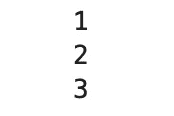

# 让你大吃一惊的 10 个有趣的 Python 技巧

> 原文：<https://towardsdatascience.com/10-interesting-python-tricks-to-knock-your-socks-off-1dd4d8e82101?source=collection_archive---------14----------------------->

提高代码效率的 10 个 python 代码片段的重要列表


安德烈·格拉在 [Unsplash](https://unsplash.com?utm_source=medium&utm_medium=referral) 上拍摄的照片

Python 被认为是迄今为止最通用的编程语言，在不同领域有着广泛的应用。如果您已经掌握了 Python 的基础知识，那么是时候探索可以在日常工作中帮助您的独特代码片段了。

以下是 10 个特性或片段，它们可能会给你留下深刻印象，并有助于提高代码效率。

# 将不常用的类别合并成一个

有时你会得到一个元素分布不均匀的列。仅仅存在几个类别。您通常希望将这些类别合并成一个类别。

```
df.artists.value_counts()
```


这里，我们希望将 Coldplay 和 Weekend 合并到一个类别中，因为它们仅对数据集有影响。

首先，我们需要找到我们不想改变的元素，即阿姆、泰勒·斯威夫特和布鲁诺·马斯

```
myList = df.artists.value_counts().nlargest(3).index
```

我们将使用 where()函数来替换其他元素

```
df_new = df.where(df.artists.isin(myList),other='other artists')
df_new.artists.value_counts()
```


这就是我们需要修改的更新专栏。

# 查找列表中的新元素

当我们有两个不同的列表，我们需要找到在一个列表中出现但在另一个列表中不出现的元素

考虑两个列表

```
A = [ 1, 3, 5, 7, 9 ]
B = [ 4, 5, 6, 7, 8 ]
```

为了找到列表 A 的新元素，我们取 A 与 B 的集合差

```
set(A) - set(B)
```


值 1、3 和 9 只出现在列表 A 中，而不在列表 b 中。

# Map()函数

Map 函数接受两个参数 function 和 iterable，并返回结果的映射

```
map(func,itr)
```

**func** 是一个函数，map 将给定 iterable 的每个元素传递给它。
**itr** 是要映射的可迭代对象。

```
def product(n1,n2): 
    return n1 *n2 list1 = (1, 2, 3, 4) 
list2 = (10,20,30,40)result = map(product, list1,list2) 
list(result)
```


让我们来分解代码

**product** 函数接受两个列表并返回两个列表的乘积。

**列表 1** 和**列表 2** 是两个列表，它们将作为我们地图函数的可迭代列表

**map** ()取乘积函数和 iterable → list1 和 list2，最后返回两个列表的乘积作为结果。

# Map + Lambda 组合

可以使用 lambda 函数替换 product 函数来修改上面的代码

```
list1 = (1, 2, 3, 4) 
list2 = (10,20,30,40)
result = map(lambda x,y: x * y, list1,list2) 
print(list(result))
```

Lambda 函数有助于避免单独编写函数的开销。

# 开始、停止和设置


照片由[布鲁诺·纳西门托](https://unsplash.com/@bruno_nascimento?utm_source=medium&utm_medium=referral)在 [Unsplash](https://unsplash.com?utm_source=medium&utm_medium=referral) 上拍摄

**slice(start:stop[:step])** 是通常包含一部分序列的对象。

*   如果只提供了 stop，它将生成从索引 0 到 stop 的序列部分。
*   如果只提供 start，它将生成从索引开始到最后一个元素的序列部分。
*   如果同时提供了 start 和 stop，它将生成从索引开始到停止的序列部分。
*   如果提供了 start、stop 和 step 这三个参数，它将在索引开始后生成序列的一部分，直到以索引步长的增量停止。

```
x = [ 1, 2, 3, 4, 5, 6, 7, 8 ]
x[ 1: 6: 2]
```


从上面的代码来看，1 是我们的开始索引，6 是我们的停止索引，2 是我们的步进索引。这意味着我们从索引 1 到索引 6 开始，步长为 2。

您也可以使用[::-1]操作翻转列表

```
x[::-1]
```


是的，用开始、停止和步进操作来反转整个列表是很容易的。

# 一起压缩和枚举

您可能听说过 zip 和 enumerate 函数。它们主要与**一起用于循环**。但是把它们放在一起使用更酷。它不仅允许您在一个循环中迭代多个值，还可以同时获得索引。

```
NAME = ['Sid','John','David']
BIRD = ['Eagle','Sparrow','Vulture']
CITY =['Mumbai','US','London']for i,(name,bird,city) in enumerate(zip(NAME,BIRD,CITY)):
    print(i,' represents ',name,' , ',bird,' and ',city)
```


**Zip** 函数帮助你把所有的列表放在一起，这样你就可以同时遍历每一个列表，而 **Enumerate** 函数帮助你获取索引以及附加到该索引的元素。

# 随意采样

有时，当您遇到非常大的数据集时，您决定处理数据的随机子集。pandas dataframe 的**示例**功能可帮助您实现更多功能。

让我们考虑一下上面已经创建的艺术家数据帧

```
df.sample(n=10)
```

这有助于获得数据集的 10 个随机行。

```
df.sample(frac=0.5).reset_index(drop=True)
```

让我们分解上面的代码，

**frac** 参数取 0 到 1 之间的值，包括 1。它取分配给它的数据帧的一部分。在上面的代码片段中，我们指定了 0.5，因此它将返回大小为→ 0.5 *原始大小的随机子集

你可以注意到它前面的 reset_index 函数。这有助于正确重置索引，因为当我们获取随机子集时，索引也会被打乱。

# 消除警告


由 [Christian Erfurt](https://unsplash.com/@christnerfurt?utm_source=medium&utm_medium=referral) 在 [Unsplash](https://unsplash.com?utm_source=medium&utm_medium=referral) 上拍摄的照片

在运行代码时，您经常会收到很多警告。过了一点，它开始激怒我们。例如，每当您导入纪元时，您可能会收到一条未来警告消息


您可以用下面的代码隐藏所有警告。请确保将这一点写在代码的顶部。

```
import warnings 
warnings.filterwarnings(action='ignore')
import keras
```

这将有助于隐藏整个代码中的所有警告。

# 保存你的记忆

随着对编码的深入研究，您开始意识到高效内存代码的重要性。生成器是一个函数，它返回一个我们可以迭代的对象。这有助于有效地利用内存，因此主要在我们迭代无限长的序列时使用。

```
def SampleGenerator(n):
    yield n
    n = n+1
    yield n
    n = n+1
    yield ngen = SampleGenerator(1)
```

**Yield** 语句暂停保存所有状态的函数，稍后在后续调用中继续。

```
print(next(gen))
print(next(gen))
print(next(gen))
```



正如你所看到的，yield 保存了前一个状态，每当我们调用下一个函数时，它就转移到下一个 yield，返回新的输出。

您可以通过添加一个在生成器函数中无限运行的 while 循环来迭代单个 yield。

```
def updatedGenerator(n):
    while(1):
        yield n
        n = n + 1
a = updatedGenerator(1)for i in range(5):
    print(next(a))
```


while 语句帮助我们一遍又一遍地迭代相同的 yield 语句。

# 小艇——救星

终于把最好的留给了我的最后一次。有没有遇到过读取一个 csv 文件太大，以至于你的内存无法容纳它的情况？Skiprows 帮你轻松应对。

它允许您指定数据帧中要跳过的行数。

考虑一个 100 万行的数据集，它不适合您的内存。如果您指定 skiprows = 0.5 百万，它会在读取数据时跳过数据集中的 0.5 百万行，从而使您可以轻松地读取数据帧的子集。

```
df = pd.read_csv('artist.csv')
df_new = pd.read_csv('artist.csv',skiprows=50)
df.shape, df_new.shape
```


在上面的代码片段中，df 表示一个 112 行的数据集。在添加 skiprows=50 之后，它从您的数据集中跳过了 50 行，因此读取 62 行作为我们的新数据集。


由[保罗·花冈](https://unsplash.com/@paul_?utm_source=medium&utm_medium=referral)在 [Unsplash](https://unsplash.com?utm_source=medium&utm_medium=referral) 上拍摄的照片

感谢您阅读文章。希望你喜欢！