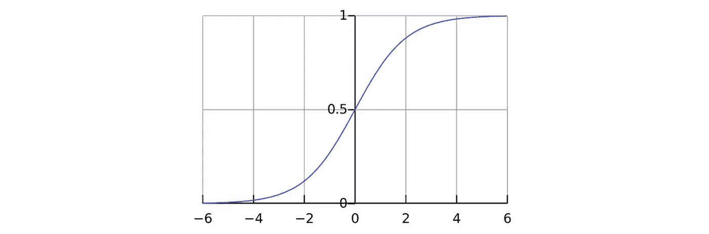
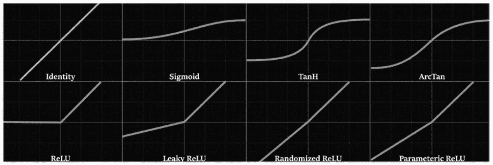
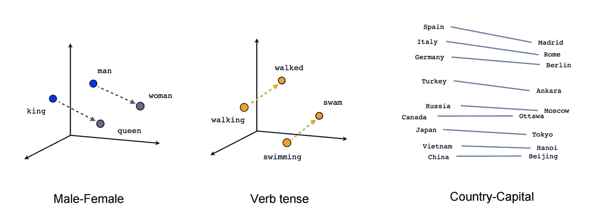
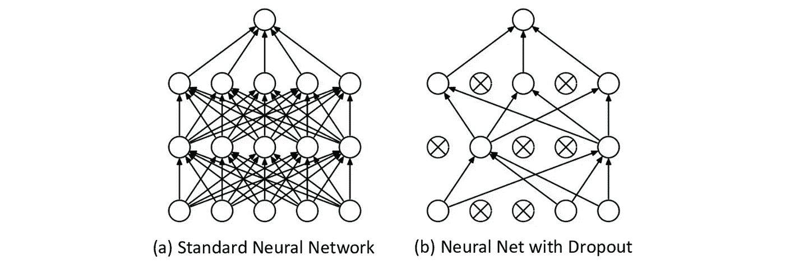
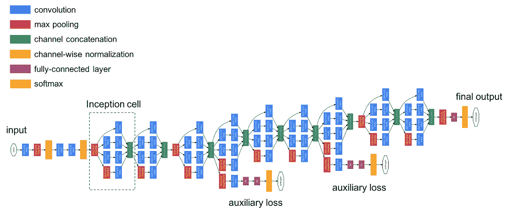

# 构建成功神经网络的 10 个宝贵技巧和诀窍

> 原文：<https://towardsdatascience.com/10-invaluable-tips-tricks-for-building-successful-neural-networks-566aca17a0f1?source=collection_archive---------38----------------------->

来源: [Unsplash](https://unsplash.com/photos/11KDtiUWRq4)

## 给非结构化的任务带来结构化

建立神经网络很困难，因为涉及到太多的可变性。有了这 10 个技巧和诀窍，你不仅会有具体的改变尝试，而且会有一个策略和心态来处理建立一个成功的神经网络的模糊任务。

## 输出层的激活功能

神经网络的最后一层对于获得正确的结果非常重要，因为它是预测过程的最后一步。此外，最后一层的激活函数是网络的信息流作为预测输出之前的最后一个函数。获得正确的功能很重要。

sigmoid 函数用于二进制输出。例如，如果一个网络要预测一个图像是一只猫还是一只狗，sigmoid 将是正确的选择。sigmoid 函数(数学上定义为`1/(1+e^(-x))`)是 logit 函数的反函数，这就是为什么它是建模概率的自然选择。

来源:乙状结肠函数。来源:[维基媒体](https://upload.wikimedia.org/wikipedia/commons/thumb/8/88/Logistic-curve.svg/1200px-Logistic-curve.svg.png)。图片免费分享。

另一方面，如果您有多个输出，例如将图像分类为 10 个可能的数字，我们将使用 SoftMax 函数，这是 sigmoid 函数针对多个类别的扩展，限制所有概率必须加到 1。例如，如果对四个类别的预测是`[0.48, 0.23, 0.56,0.03]`，这是一个非法的结果，因为概率集中在它们总和总是 100%的事实上。

由于 sigmoid 和 SoftMax 都是有界函数，这意味着它们的*y*-值不能高于或低于某个值(0 和 1)，因此它们无法处理回归问题，回归问题是连续值，而不是概率。

取而代之的是使用线性激活函数(`y=x`)，它是没有边界的。此外，如果所有的*y*-值都大于 0，使用 ReLU 也是可以接受的，因为线的斜率(`max(0, ax)`中的`a`)是可调参数。或者，可以使用像漏 ReLU 或 eLU(指数线性单位)这样的两侧无界的激活。

来源: [ML 从零开始](https://mlfromscratch.com/activation-functions-explained/#/)。图片免费分享。

## 使用预训练模型

从头开始学习一切是很困难的——即使作为人类也是如此——这就是为什么拥有一些通用知识作为进一步学习的基础是有益的。在图像识别领域，可以访问和进一步微调几个预先训练的模型，如 VGG16 和 Inception，它们被设计和训练来识别对象。

例如，考虑在图像中识别一只狗或一只猫的任务；虽然人们可以从头开始构建神经网络，但为什么不使用已经证明可以完成类似任务的架构和权重呢？提供预训练模型的库还允许用户在模型之前或之后叠加额外的层，以实现一定的可定制性。

在自然语言处理中，嵌入被用于将单词或其他标记从它们的高维矢量化形式映射到较低维空间。相对于数据集的上下文具有相似含义或处于相似类别的单词(例如，`water` & `liquid`、`king` & `man`、`queen` & `woman`)在物理上被放置得更近。

嵌入是有价值的，因为它们是在昂贵的神经网络操作之前提取单词的更深层次含义的成本较低的方法。它们有效地降低了数据的维度，可以使用 t-SNE 等多种学习技术进行可视化和解释，以确保网络处于正确的学习轨道上。

像 GloVE 这样的预训练嵌入，或者单词表示的全局向量，是在世界上最大的文本存储库，比如维基百科上创建的。在你的模型中加入预先训练的元素增加了它的能力并减少了猜测。

嵌入的能力。来源: [Tensorflow](https://www.tensorflow.org/images/linear-relationships.png) 。免费分享图片

查看这些资源:[在 Keras 中使用预训练图像识别模型](https://keras.io/api/applications/)，在 Keras 中使用预训练嵌入的[指南](https://keras.io/examples/nlp/pretrained_word_embeddings/)，在 Keras 中使用嵌入的[指南](/a-comprehensive-guide-to-working-with-recurrent-neural-networks-in-keras-f3b2d5e2fa7f?source=---------4------------------)。

## 刺激健康的梯度流动

尤其是对于深度网络，优先考虑健康的梯度流总是很重要的。只有当架构的构建方式使得信号可以通过整个网络时，反向传播才能有效工作。如果它逐渐变小，前面的层不会改变(消失梯度问题)，如果它被放大太多，随着时间的推移，重量转移变得如此极端，以至于它们变成 NaN。

*   *采用跳过连接*。这些是跨越层的连接，这意味着梯度即使被有问题的层阻挡也可以继续。这些联系是成功的 ResNet 架构的核心(这是一个预训练的模型，可以在大多数深度学习库中访问)。
*   *使用批量归一化图层*。这些不仅使输入标准化以确保最佳训练，还平滑了误差空间，允许优化器更容易地工作。
*   *尝试使用无限激活*。消失梯度问题通常是由 tanh、sigmoid 和 softmax 等有界函数引起的，因为在训练的早期阶段自然移动的输入最终具有逐渐减小的相对重要性。
    一边无界的 ReLU，通常是默认；有时候，像 Leaky ReLU 这样的替代品表现更好；一般来说，除了最后一个输出层，有界函数不会被广泛使用。
    阅读[这篇](https://medium.com/analytics-vidhya/if-rectified-linear-units-are-linear-how-do-they-add-nonlinearity-40247d3e4792)可以直观地了解 ReLU 为何如此有效，以及线性单元如何增加宝贵的非线性。

## 谨记监管

训练神经网络是一项艰巨的任务，它高度依赖于各种参数和初始化。监管可以起到护栏的作用，防止神经网络偏离其目的太远，这个目的相当抽象:不要对数据过拟合，也不要对数据过拟合。

当然，实际目标是在测试集上表现良好，但是神经网络不应该暴露于它，否则它首先就不是测试集。自然地，一个神经网络——被设计来近似函数——将适合这些数据。监管可以防止它过度拟合，或者通过记忆数据点而不是实际学习概括来采取简单的方法。

添加漏失层可能是在神经网络中添加规则的最简单方法。Dropout 随机阻止一小部分神经元连接到下一层，因此直观上它可以防止网络传递过多的特定信息。有许多其他的角度来理解为什么辍学工作得这么好——例如，它可以被认为是一个整体或渐进的更新。在这里阅读更多。

[来源](https://www.researchgate.net/figure/9-An-illustration-of-the-dropout-mechanism-within-the-proposed-CNN-a-Shows-a_fig23_317277576)。图片免费分享。

此外，L2 正则化是另一种控制权重的方法，尽管这可能是一种不太“自然”的方法。不管用什么方法来实现它，正则化和梯度流应该是建筑设计的前沿。

## 不要太在意确切的数字。

构建神经网络可能令人望而生畏，因为这个过程中有太多可变因素——层数、每层中神经元的数量、层的类型等。然而，有可能改变神经元的数量并不会真正改变预测能力。

在教程中，您可能经常会看到每层中的神经元数量或批量大小被写成 2 的幂。虽然有一些研究声称使用 2 的幂更有效(这与高效的 GPU 使用和位有关……？)，它们很可能不是通用的。对于超参数的选择，使用 2 的幂在任何方面都是最优的，这一点还没有得到决定性的证明。

但是，这是一个很好的方法，原因如下:

*   它为一个过程提供了结构。如果一层中的神经元应该是 25 或 26，而不是坐立不安，只要确定在 32。这是一个选择神经元大小的方便模板。
*   这是一种对数搜索方法。由于 32 到 33 个神经元之间的变化远小于从 1 到 2 的变化，所以我们每次都将神经元的数量增加一倍，以搜索下一个似乎合理的神经元是有道理的。如果你发现你想改变一层中神经元的数量，将它减半或加倍，以观察任何真正的潜在变化。

当然，通过网络的信息流来思考是好的，但层数或神经元数在一定范围内是相对任意的。为了更直观的解释，探索一下[通用近似定理](https://medium.com/analytics-vidhya/you-dont-understand-neural-networks-until-you-understand-the-universal-approximation-theorem-85b3e7677126?source=your_stories_page---------------------------)，它展示了神经网络如何处理任务以及单个神经元在预测中扮演的角色。

## 尽量少设置常量

一般来说，建模的哲学是遵循数据，尽可能减少对硬编码常数的依赖。这对于神经网络来说尤其如此，但却很困难。虽然某些常数(如层中神经元的数量或过滤器的大小)必须是硬编码的*，但如果可以的话，尽量不要自己设置常数，因为这些是潜在的错误来源。

例如，不要硬编码学习率。您可以设置一个较高的初始学习率，并使用类似于[的工具在平稳期](/a-short-practical-guide-to-callbacks-in-neural-network-training-3a4d69568aef?source=your_stories_page---------------------------)降低学习率，以便在性能停滞时自动调整学习率。对于神经网络的许多其他复杂参数来说也是如此——作为一种非常动态的算法，一些参数根本无法保持固定。

*然而，通常使用非常少的常量硬编码和机器学习算法自动选择神经网络架构的开发是[非常新且有前途的](/if-youre-hyped-about-gpt-3-writing-code-you-haven-t-heard-of-nas-19c8c30fcc8a?source=your_stories_page---------------------------)。

## 利用预处理层

Keras 和其他几个深度学习库提供了预处理库，可以作为神经网络的前几层添加，例如在向量化文本、标准化图像或标准化数据方面。为了使您的模型易于移植和使用，使用预处理层进行部署总是一个好主意。

点击这里，阅读 Keras [中的预处理图层。](https://keras.io/guides/preprocessing_layers/)

## 数据扩充

如果您没有在图像识别任务中使用数据扩充，那么您就是在浪费数据集。

图像数据很难获得，如果一个网络只能从如此昂贵的信息中提取有限的学习内容，那将是一种耻辱。数据扩充通过将图像通过随机生成的过滤器来人为地增加数据集的大小，过滤器可以应用缩放、旋转、翻转、变暗、变亮、变白、颜色变化等。

数据扩充的示例结果。来源: [Keras](https://blog.keras.io/building-powerful-image-classification-models-using-very-little-data.html) 。图片免费分享。

当数据增强被正确应用时，它可以提高网络归纳到图像的能力，并更好地解决对象识别中的现实问题，如[敌对/恶意输入](https://medium.com/swlh/machine-learning-algorithms-are-much-more-fragile-than-you-think-25fdb3939fee?source=your_stories_page---------------------------)，例如，它可以欺骗识别标志的自动驾驶汽车以致命的速度加速。

了解数据生成器中的各种参数，以及为什么您需要小心使用哪些参数[这里是](/you-shouldnt-ignore-all-these-parameters-in-keras-s-imagedatagenerator-eaa0530c76db?source=your_stories_page---------------------------)。

## 更多数据！

更多的数据当然是最好的解决方案。最花哨的算法甚至无法与一批好数据带来的好处相提并论:数据是有价值的，因此也是昂贵的商品。简单地加入额外的数据可以拓宽模型的视野，这比花费数小时来微调模型的技术参数要好得多。

在本文的[中，我使用简单的随机森林回归模型，通过添加按国家统计的维基百科数据，将冠状病毒预测的平均绝对误差降低了十倍以上。](https://medium.com/analytics-vidhya/the-strategy-that-increases-model-accuracy-every-time-guaranteed-6ee5e476262d)

## 利用现有模型的灵感。

要构建一个伟大的神经网络，就要向大师们看齐！像伯特、[、谷歌神经机器翻译](https://medium.com/analytics-vidhya/breaking-down-the-innovative-deep-learning-behind-google-translate-355889e104f1?source=your_stories_page---------------------------) (GNMT)和盗梦空间这样的现有模型是出于某些原因以某些方式构建的。

Inception 以模块化格式构建，具有多个堆叠的 Inception 单元。它在其他卷积之前使用 [1x1 卷积](/the-clever-trick-behind-googles-inception-the-1-1-convolution-58815b20113?source=your_stories_page---------------------------)，并出于某些原因对汇集和卷积进行排序。GNMT 在 Google Translate 的编码器和解码器中各堆叠了八个 LSTMs，虽然你可能不关心翻译是如何工作的，但探索该架构如何处理这样一个深度循环架构并将其应用到你的 [RNN 设计](/a-comprehensive-guide-to-working-with-recurrent-neural-networks-in-keras-f3b2d5e2fa7f?source=your_stories_page---------------------------)中是值得的。

创新的 Inception v3 架构，充满了出色的架构决策。资料来源:杰瑞米·乔登。图片免费分享。

最好的技巧和诀窍来自顶级公司和研究部门的创新，开发最新的方法和培养最新的概念。花时间去探索和理解想法。

感谢阅读！

 [## 11 个基本的神经网络架构，可视化和解释

### 标准、循环、卷积和自动编码器网络

medium.com](https://medium.com/analytics-vidhya/11-essential-neural-network-architectures-visualized-explained-7fc7da3486d8)