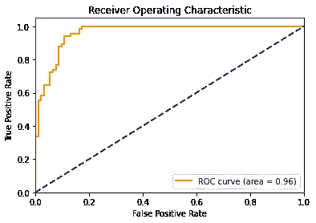
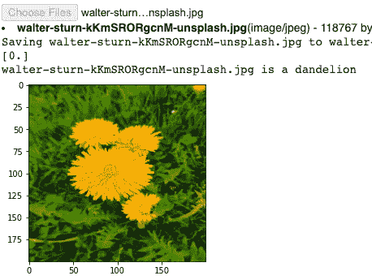

# 通过在 TensorFlow 中将迁移学习应用到 MobileNet，用 10 分钟时间构建一个二值图像分类器

> 原文：<https://towardsdatascience.com/10-minutes-to-building-a-binary-image-classifier-by-applying-transfer-learning-to-mobilenet-eab5a8719525?source=collection_archive---------30----------------------->


莎拉·多维勒在 [Unsplash](https://unsplash.com?utm_source=medium&utm_medium=referral) 上的照片

## 如何通过在 MobileNet 模型上训练来构建二值图像分类器

这是对计算机视觉的简短介绍，即如何在 MobileNet 模型上使用转移学习来构建二值图像分类器，主要面向新用户。这份简单易懂的教程分为 3 个部分:

1.  数据
2.  模型架构
3.  准确性、ROC 曲线和 AUC

要求:没事！按照本教程，你所需要的就是这个包含数据和代码的 [Google Colab 笔记本](https://colab.research.google.com/drive/1XYAXOHiXNWqmKedCj1WRcJ6mGpr4aVC0?usp=sharing)。Google Colab 允许您在浏览器中编写和运行 Python 代码，无需任何设置，并且包括免费的 GPU 访问！要运行此代码，只需转到`File -> Make a copy`创建一个您可以运行和编辑的笔记本副本。

# 1.数据

我们将建立一个蒲公英和草的图像分类器。我已经使用 Google Images 中的图片创建了一个小的图片数据集，您可以在本教程的前 8 个单元格中下载并解析它。

在这 8 行结束时，可视化图像数据集的样本将如下所示:


请注意，数据集中的一些图像并不是草地或蒲公英的完美代表。为了简单起见，让我们把它做好，然后继续讨论如何轻松地创建我们的训练和验证数据集。

我们之前获取的数据被分成两个文件夹，`train`和`valid`。在这些文件夹中，文件夹`dandelion`和`grass`包含每个班级的图像。为了创建数据集，让我们使用`keras.preprocessing.image.ImageDataGenerator`类来创建我们的训练和验证数据集，并规范化我们的数据。这个类所做的是创建一个数据集，并自动为我们做标记，允许我们只用一行就创建一个数据集！

# 2.模型架构

在本节的开始，我们首先导入 TensorFlow。

现在，让我们添加 MobileNet 模型。请确保包含 include_top 参数，并将设置为 False。这将减去模型的最后一层，以便我们可以添加我们自己的层，我们将在其上训练。这叫迁移学习！然后，我们将添加一个 GlobalAveragePooling2D 层，以减少我们将输入到最后一层的输出的大小。对于最后一层，我们将添加一个 Sigmoid 层用于二进制分类。这一点很重要:我们必须将 MobileNet 层的可训练参数设置为 False，这样我们就不会训练整个模型——我们只需要训练最后一层！

这是我们建立的模型:

```
model = Sequential()model.add(MobileNetV2(include_top = False, weights="imagenet", input_shape=(200, 200, 3)))model.add(tf.keras.layers.GlobalAveragePooling2D())model.add(Dense(1, activation = 'sigmoid'))model.layers[0].trainable = False
```

让我们来看看我们构建的模型的摘要:

```
Model: "sequential" _________________________________________________________________ Layer (type)                 Output Shape              Param #    ================================================================= mobilenetv2_1.00_224 (Model) (None, 7, 7, 1280)        2257984    _________________________________________________________________ global_average_pooling2d (Gl (None, 1280)              0          _________________________________________________________________ dense (Dense)                (None, 1)                 1281       ================================================================= Total params: 2,259,265 Trainable params: 1,281 Non-trainable params: 2,257,984
```

接下来，我们将配置模型训练的规范。我们将用`binary_crossentropy`损失来训练我们的模型。我们将使用`RMSProp`优化器。 [RMSProp](https://wikipedia.org/wiki/Stochastic_gradient_descent#RMSProp) 是一个明智的优化算法，因为它为我们自动化了学习率调整(或者，我们也可以使用 [Adam](https://wikipedia.org/wiki/Stochastic_gradient_descent#Adam) 或 [Adagrad](https://developers.google.com/machine-learning/glossary/#AdaGrad) 获得类似的结果)。我们将增加`metrics`的准确性，这样模型将在训练过程中监控准确性。

```
model.compile(optimizer=RMSprop(lr=0.01), loss = 'binary_crossentropy', metrics = 'accuracy')
```

让我们训练 15 个纪元:

```
history = model.fit(train_generator,steps_per_epoch=8,epochs=15,verbose=1,validation_data = validation_generator,validation_steps=8)
```

# 3.准确性、ROC 曲线和 AUC

让我们评估一下我们模型的准确性:

```
model.evaluate(validation_generator)
```

现在，让我们计算我们的 ROC 曲线并绘制它。

首先，让我们对我们的验证集进行预测。当使用生成器进行预测时，我们必须首先关闭 shuffle(正如我们在创建 validation_generator 时所做的那样)并重置生成器:

```
STEP_SIZE_TEST=validation_generator.n//validation_generator.batch_sizevalidation_generator.reset()preds = model.predict(validation_generator,verbose=1)
```

为了创建 ROC 曲线和 AUC，我们需要计算假阳性率和真阳性率:

```
fpr, tpr, _ = roc_curve(validation_generator.classes, preds)roc_auc = auc(fpr, tpr)plt.figure()lw = 2plt.plot(fpr, tpr, color='darkorange',lw=lw, label='ROC curve (area = %0.2f)' % roc_auc)plt.plot([0, 1], [0, 1], color='navy', lw=lw, linestyle='--')plt.xlim([0.0, 1.0])plt.ylim([0.0, 1.05])plt.xlabel('False Positive Rate')plt.ylabel('True Positive Rate')plt.title('Receiver operating characteristic example')plt.legend(loc="lower right")plt.show()
```



我们模型的 ROC 曲线

ROC 曲线是绘制真阳性率(TPR)对假阳性率(FPR)的概率曲线。在这条曲线中，对角线是随机猜测的曲线，例如抛硬币，所以上面的 ROC 曲线表明我们的模型在分类上做得很好！

类似地，AUC(曲线下面积)如上面的图例所示，测量我们的模型在多大程度上能够区分我们的两个类别，蒲公英和草。AUC 越高，我们的模型在分类上就越好。AUC 为 0.96 被认为相当不错！

最后，在笔记本的最后，你将有机会对你自己的图像进行预测！



你现在可以在你自己的图像上做预测了！

我希望这能让您对在 MobileNet 模型上使用迁移学习构建一个简单的二值图像分类器有一个温和的了解！如果你对类似的教程感兴趣，请看看我的其他故事。