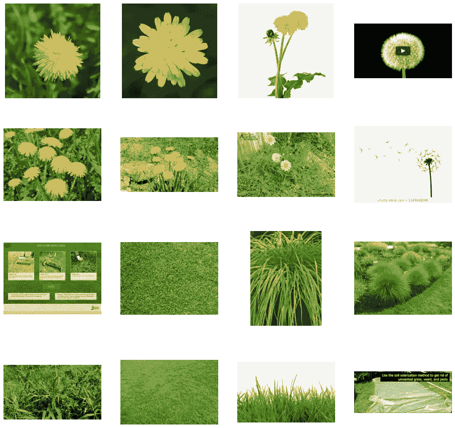
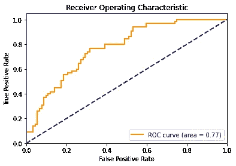

# 用 10 分钟在 TensorFlow 中构建 CNN 二值图像分类器

> 原文：<https://towardsdatascience.com/10-minutes-to-building-a-cnn-binary-image-classifier-in-tensorflow-4e216b2034aa?source=collection_archive---------3----------------------->


照片由 [Kara Eads](https://unsplash.com/@karaeads?utm_source=medium&utm_medium=referral) 在 [Unsplash](https://unsplash.com?utm_source=medium&utm_medium=referral) 上拍摄

## 如何在 TensorFlow/Keras 中使用卷积神经网络层构建二值图像分类器

这是对计算机视觉的简短介绍，即如何在 TensorFlow/Keras 中使用卷积神经网络层构建二值图像分类器，主要面向新用户。这份简单易懂的教程分为 3 个部分:

1.  数据
2.  模型架构
3.  准确性、ROC 曲线和 AUC

要求:没事！按照本教程，你所需要的就是这个包含数据和代码的 [Google Colab 笔记本](https://colab.research.google.com/drive/1nseete5huZlWM7Ak0qL-T75Dbk0mdr-Z?usp=sharing)。Google Colab 允许您在浏览器中编写和运行 Python 代码，无需任何设置，并且包括免费的 GPU 访问！

# 1.数据

我们将建立一个蒲公英和草的图像分类器。我已经使用 Google Images 中的图片创建了一个小的图片数据集，您可以在本教程的前 8 个单元格中下载并解析它。

在这 8 行结束时，可视化图像数据集的样本将如下所示:



请注意，数据集中的一些图像并不是草地或蒲公英的完美代表。为了简单起见，让我们把它做好，然后继续讨论如何轻松地创建我们的训练和验证数据集。

我们之前获取的数据被分成两个文件夹，`train`和`valid`。在这些文件夹中，`dandelion`和`grass`文件夹包含每个班级的图像。为了创建数据集，让我们使用`keras.preprocessing.image.ImageDataGenerator`类来创建我们的训练和验证数据集，并规范化我们的数据。这个类所做的是创建一个数据集，并自动为我们做标记，允许我们只用一行就创建一个数据集！

# 2.模型架构

在本节开始，我们首先导入 TensorFlow。

让我们然后添加我们的 CNN 层。我们将首先添加一个卷积 2D 层，有 16 个过滤器，一个 3x3 的内核，输入尺寸为我们的图像尺寸，200x200x3，激活为 ReLU。

```
tf.keras.layers.Conv2D(16, (3,3), activation='relu', input_shape=(200, 200, 3))
```

之后，我们将添加一个最大池层，将图像尺寸减半，因此在这一层之后，输出将是 100x100x3。

```
tf.keras.layers.MaxPooling2D(2, 2)
```

我们将这些层中的 5 层堆叠在一起，随后 CNN 会添加更多的过滤器。

最后，我们将使 CNN 层的输出变平，将其输入到一个全连接层，然后输入到一个 sigmoid 层进行二进制分类。

这是我们建立的模型:

```
model = tf.keras.models.Sequential([# Note the input shape is the desired size of the image 200x200 with 3 bytes color# This is the first convolutiontf.keras.layers.Conv2D(16, (3,3), activation='relu', input_shape=(200, 200, 3)),tf.keras.layers.MaxPooling2D(2, 2),# The second convolutiontf.keras.layers.Conv2D(32, (3,3), activation='relu'),tf.keras.layers.MaxPooling2D(2,2),# The third convolutiontf.keras.layers.Conv2D(64, (3,3), activation='relu'),tf.keras.layers.MaxPooling2D(2,2),# The fourth convolutiontf.keras.layers.Conv2D(64, (3,3), activation='relu'),tf.keras.layers.MaxPooling2D(2,2),# # The fifth convolutiontf.keras.layers.Conv2D(64, (3,3), activation='relu'),tf.keras.layers.MaxPooling2D(2,2),# Flatten the results to feed into a DNNtf.keras.layers.Flatten(),# 512 neuron hidden layertf.keras.layers.Dense(512, activation='relu'),# Only 1 output neuron. It will contain a value from 0-1 where 0 for 1 class ('dandelions') and 1 for the other ('grass')tf.keras.layers.Dense(1, activation='sigmoid')
```

让我们来看看我们构建的模型的摘要:

```
Model: "sequential" _________________________________________________________________ Layer (type)                 Output Shape              Param #    ================================================================= conv2d (Conv2D)              (None, 198, 198, 16)      448        _________________________________________________________________ max_pooling2d (MaxPooling2D) (None, 99, 99, 16)        0          _________________________________________________________________ conv2d_1 (Conv2D)            (None, 97, 97, 32)        4640       _________________________________________________________________ max_pooling2d_1 (MaxPooling2 (None, 48, 48, 32)        0          _________________________________________________________________ conv2d_2 (Conv2D)            (None, 46, 46, 64)        18496      _________________________________________________________________ max_pooling2d_2 (MaxPooling2 (None, 23, 23, 64)        0          _________________________________________________________________ conv2d_3 (Conv2D)            (None, 21, 21, 64)        36928      _________________________________________________________________ max_pooling2d_3 (MaxPooling2 (None, 10, 10, 64)        0          _________________________________________________________________ conv2d_4 (Conv2D)            (None, 8, 8, 64)          36928      _________________________________________________________________ max_pooling2d_4 (MaxPooling2 (None, 4, 4, 64)          0          _________________________________________________________________ flatten (Flatten)            (None, 1024)              0          _________________________________________________________________ dense (Dense)                (None, 512)               524800     _________________________________________________________________ dense_1 (Dense)              (None, 1)                 513        ================================================================= Total params: 622,753 Trainable params: 622,753 Non-trainable params: 0
```

接下来，我们将配置模型训练的规范。我们将用`binary_crossentropy`损失来训练我们的模型。我们将使用`RMSProp`优化器。 [RMSProp](https://wikipedia.org/wiki/Stochastic_gradient_descent#RMSProp) 是一个明智的优化算法，因为它为我们自动化了学习率调整(或者，我们也可以使用 [Adam](https://wikipedia.org/wiki/Stochastic_gradient_descent#Adam) 或 [Adagrad](https://developers.google.com/machine-learning/glossary/#AdaGrad) 获得类似的结果)。我们将增加`metrics`的准确性，这样模型将在训练过程中监控准确性。

```
model.compile(loss='binary_crossentropy',optimizer=RMSprop(lr=0.001),metrics='accuracy')
```

让我们训练 15 个纪元:

```
history = model.fit(train_generator,steps_per_epoch=8,epochs=15,verbose=1,validation_data = validation_generator,validation_steps=8)
```

# 3.准确性、ROC 曲线和 AUC

让我们评估一下我们模型的准确性:

```
model.evaluate(validation_generator)
```

现在，让我们计算我们的 ROC 曲线并绘制它。

首先，让我们对我们的验证集进行预测。当使用生成器进行预测时，我们必须首先关闭 shuffle(正如我们在创建 validation_generator 时所做的那样)并重置生成器:

```
STEP_SIZE_TEST=validation_generator.n//validation_generator.batch_sizevalidation_generator.reset()preds = model.predict(validation_generator,verbose=1)
```

为了创建 ROC 曲线和 AUC，我们需要计算假阳性率和真阳性率:

```
fpr, tpr, _ = roc_curve(validation_generator.classes, preds)roc_auc = auc(fpr, tpr)plt.figure()lw = 2plt.plot(fpr, tpr, color='darkorange',lw=lw, label='ROC curve (area = %0.2f)' % roc_auc)plt.plot([0, 1], [0, 1], color='navy', lw=lw, linestyle='--')plt.xlim([0.0, 1.0])plt.ylim([0.0, 1.05])plt.xlabel('False Positive Rate')plt.ylabel('True Positive Rate')plt.title('Receiver operating characteristic example')plt.legend(loc="lower right")plt.show()
```



我们模型的 ROC 曲线

ROC 曲线是绘制真阳性率(TPR)对假阳性率(FPR)的概率曲线。

类似地，AUC(曲线下面积)如上面的图例所示，测量我们的模型在多大程度上能够区分我们的两个类别，蒲公英和草。它还用于比较不同的模型，我将在未来的教程中介绍如何使用全连接层构建图像分类器，以及如何使用 ResNet 进行迁移学习。

最后，在笔记本的最后，你将有机会对你自己的图像进行预测！


你现在可以在你自己的图像上做预测

我希望这给你一个温和的介绍，建立一个简单的使用 CNN 层的二值图像分类器。如果你对类似的简单易懂的教程感兴趣，请看看我的其他故事！