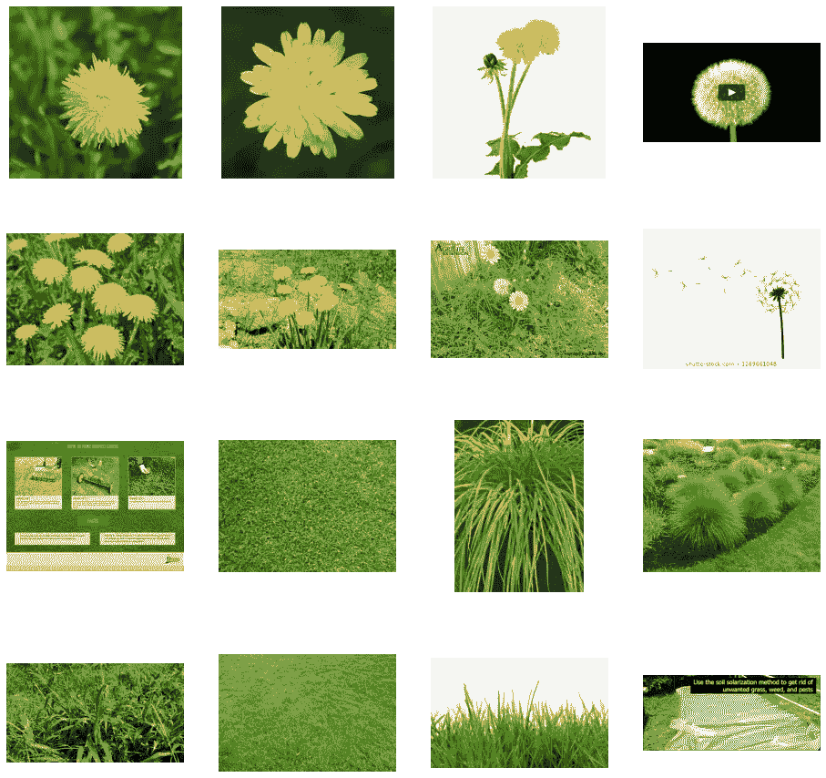
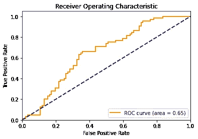
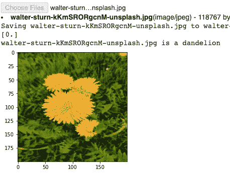

# 在 TensorFlow 中用 10 分钟构建一个全连接的二值图像分类器

> 原文：<https://towardsdatascience.com/10-minutes-to-building-a-fully-connected-binary-image-classifier-in-tensorflow-d88062e1247f?source=collection_archive---------29----------------------->


照片由 [Waranont (Joe)](https://unsplash.com/@tricell1991?utm_source=medium&utm_medium=referral) 在 [Unsplash](https://unsplash.com?utm_source=medium&utm_medium=referral) 上拍摄

## 如何在 TensorFlow/Keras 中使用全连通层构建二值图像分类器

这是对计算机视觉的简短介绍，即如何在 TensorFlow/Keras 中仅使用全连接层来构建二值图像分类器，主要面向新用户。这份简单易懂的教程分为 3 个部分:

1.  数据
2.  模型架构
3.  准确性、ROC 曲线和 AUC

要求:没事！按照本教程，你所需要的就是这个包含数据和代码的 [Google Colab 笔记本](https://colab.research.google.com/drive/1HgaywLtvIJZ8B9F8oWML772CfxL6UB0p?usp=sharing)。Google Colab 允许您在浏览器中编写和运行 Python 代码，无需任何设置，并且包括免费的 GPU 访问！只需点击文件- >在驱动器中保存一份副本即可。

# 1.数据

我们将建立一个蒲公英和草的图像分类器。我已经使用 Google Images 中的图片创建了一个小的图片数据集，您可以在本教程的前 8 个单元格中下载并解析它。

在这 8 行结束时，可视化图像数据集的样本将如下所示:



请注意，数据集中的一些图像并不是草地或蒲公英的完美代表。为了简单起见，让我们把它做好，然后继续讨论如何轻松地创建我们的训练和验证数据集。

我们之前获取的数据被分成两个文件夹，`train`和`valid`。在这些文件夹中，`dandelion`和`grass`文件夹包含每个班级的图像。为了创建数据集，让我们使用`keras.preprocessing.image.ImageDataGenerator`类来创建我们的训练和验证数据集，并规范化我们的数据。这个类所做的是创建一个数据集，并自动为我们做标记，允许我们只用一行就创建一个数据集！

# 2.模型架构

在本节的开始，我们首先导入 TensorFlow。

然后，让我们添加一个展平层来展平输入图像，然后输入到下一层，一个密集层，或完全连接层，有 128 个隐藏单元。最后，因为我们的目标是执行二进制分类，所以我们的最终层将是一个 sigmoid，因此我们网络的输出将是 0 和 1 之间的单个标量，编码当前图像属于 1 类(1 类是草，0 类是蒲公英)的概率。

```
model =
tf.keras.models.Sequential([tf.keras.layers.Flatten(input_shape = (200,200,3)),
tf.keras.layers.Dense(128, activation=tf.nn.relu),
tf.keras.layers.Dense(1, activation=tf.nn.sigmoid)])
```

让我们来看看我们构建的模型的摘要:

```
Model: "sequential" _________________________________________________________________ Layer (type)                 Output Shape              Param #    ================================================================= flatten (Flatten)            (None, 120000)            0          _________________________________________________________________ dense (Dense)                (None, 128)               15360128   _________________________________________________________________ dense_1 (Dense)              (None, 1)                 129        ================================================================= Total params: 15,360,257 Trainable params: 15,360,257 Non-trainable params: 0
```

注意，因为我们使用的是全连接层，*一层中的每个单元都连接到它旁边的层中的每个单元*。参数真多啊！

接下来，我们将配置模型训练的规范。我们将用`binary_crossentropy`损失来训练我们的模型。我们将使用`Adam`优化器。 [Adam](https://wikipedia.org/wiki/Stochastic_gradient_descent#Adam) 是一个明智的优化算法，因为它为我们自动化了学习率调整(或者，我们也可以使用 [RMSProp](https://wikipedia.org/wiki/Stochastic_gradient_descent#RMSProp) 或 [Adagrad](https://developers.google.com/machine-learning/glossary/#AdaGrad) 获得类似的结果)。我们将增加`metrics`的准确性，这样模型将在训练过程中监控准确性。

```
model.compile(optimizer = tf.optimizers.Adam(),loss = 'binary_crossentropy',metrics=['accuracy'])
```

让我们训练 15 个纪元:

```
history = model.fit(train_generator,steps_per_epoch=8,epochs=15,verbose=1,validation_data = validation_generator,validation_steps=8)
```

# 3.准确性、ROC 曲线和 AUC

让我们评估一下我们模型的准确性:

```
model.evaluate(validation_generator)
```

现在，让我们计算我们的 ROC 曲线并绘制它。

首先，让我们对我们的验证集进行预测。当使用生成器进行预测时，我们必须首先关闭 shuffle(正如我们在创建 validation_generator 时所做的那样)并重置生成器:

```
STEP_SIZE_TEST=validation_generator.n//validation_generator.batch_sizevalidation_generator.reset()preds = model.predict(validation_generator,verbose=1)
```

为了创建 ROC 曲线和 AUC，我们需要计算假阳性率和真阳性率:

```
fpr, tpr, _ = roc_curve(validation_generator.classes, preds)roc_auc = auc(fpr, tpr)plt.figure()lw = 2plt.plot(fpr, tpr, color='darkorange',lw=lw, label='ROC curve (area = %0.2f)' % roc_auc)plt.plot([0, 1], [0, 1], color='navy', lw=lw, linestyle='--')plt.xlim([0.0, 1.0])plt.ylim([0.0, 1.05])plt.xlabel('False Positive Rate')plt.ylabel('True Positive Rate')plt.title('Receiver operating characteristic example')plt.legend(loc="lower right")plt.show()
```



我们模型的 ROC 曲线

ROC 曲线是绘制真阳性率(TPR)对假阳性率(FPR)的概率曲线。

类似地，AUC(曲线下面积)如上面的图例所示，测量我们的模型在多大程度上能够区分我们的两个类别，蒲公英和草。它还用于比较不同的模型，在未来的教程中，当我介绍如何使用卷积神经网络构建图像分类器和使用 ResNet 进行迁移学习时，我会这样做！

最后，在笔记本的最后，你将有机会对你自己的图像进行预测！



你现在可以在你自己的图像上做预测

我希望这给你一个温和的介绍，建立一个简单的二值图像分类器只使用全连接层。如果你对类似的简单易懂的教程感兴趣，请看看我的其他故事！