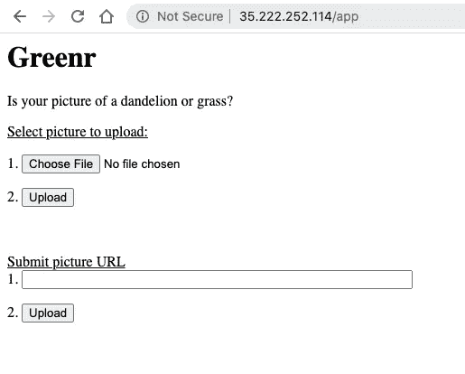

# 10 分钟用 Apache Airflow 建立机器学习管道

> 原文：<https://towardsdatascience.com/10-minutes-to-building-a-machine-learning-pipeline-with-apache-airflow-53cd09268977?source=collection_archive---------3----------------------->

## 为什么 ML 管道很重要，以及如何使用 Apache AirFlow 构建一个简单的 ML 管道


杰米·菲利普斯在 [Unsplash](https://unsplash.com?utm_source=medium&utm_medium=referral) 上拍摄的照片

*通常，当你想到机器学习时，你往往会想到你现在可以创建的伟大模型。如果你想把这些令人惊奇的模型公之于众，你就必须超越仅仅训练模型，并融入数据收集、特征工程、训练、评估和服务。*

最重要的是，你还必须记住，你是在将一个软件应用程序投入生产。这意味着您将拥有任何生产软件所拥有的所有需求，包括可伸缩性、一致性、模块化、可测试性和安全性。


ML 代码只是 ML 系统的一部分

**ML 管道允许你自动运行机器学习系统的步骤，从数据收集到模型服务(如上图所示)。它还将** [**减少机器学习系统**](https://papers.nips.cc/paper/5656-hidden-technical-debt-in-machine-learning-systems) 的技术债务，正如这篇链接论文所描述的。这就进入了 [**MLOps**](https://cloud.google.com/solutions/machine-learning/mlops-continuous-delivery-and-automation-pipelines-in-machine-learning) 的领域，这是一个快速发展的领域，与 DevOps 类似，(**旨在自动化和监控 ML 系统的所有步骤。**

本教程将向您展示如何构建一个简单的 ML 管道，该管道可以自动化使用 [FastAI](https://github.com/fastai/fastai) 构建的蒲公英和草的深度学习图像分类器的工作流程，然后使用 [Starlette](https://www.starlette.io/) 作为 web 应用。我们将使用众多工作流工具中的 [Apache AirFlow](https://airflow.apache.org/) ，如 [Luigi](https://github.com/spotify/luigi) 、 [MLFlow](https://mlflow.org/) 和 [KubeFlow](https://www.kubeflow.org/) ，因为它提供了广泛的特性和漂亮的 UI。 **AirFlow 是一款开源软件，允许您使用有向无环图(DAG)以编程方式创作和调度工作流，并通过内置的 AirFlow 用户界面对其进行监控。**在本教程的最后，我将向您展示使您的管道生产就绪的进一步步骤。

**需求**:由于您将在一个虚拟机实例上运行本教程，您需要的只是一台运行任何操作系统的计算机和一个 Google 帐户。

本教程将分为以下步骤:

1.  注册谷歌云平台并创建一个计算实例
2.  从 Github 获取教程内容
3.  气流中的 ML 管道概述
4.  使用 nginx 安装 Docker 并设置虚拟主机
5.  构建并运行 Docker 容器
6.  打开气流 UI 并运行 ML 管道
7.  运行部署的 web 应用程序

# 1.登录 Google 云平台并创建一个计算实例


注册 GCP 是免费的！

如果你还没有，通过你的谷歌账户注册[谷歌云平台](http://cloud.google.com/)。你必须输入你的信用卡，但注册时不会收取任何费用。您还将获得价值 300 美元的免费积分，有效期为 12 个月！如果你用完了积分，不要担心——运行本教程将花费几分钱，只要你之后停止你的虚拟机实例！

进入控制台后，转到[计算引擎并创建一个实例](https://cloud.google.com/compute/docs/instances/create-start-instance)。然后:

1.  将实例命名为`greenr-airflow`
2.  将计算实例设置为`n1-standard-8`
3.  将操作系统设置为 Ubuntu 18.04
4.  将硬盘内存提升至 30GB
5.  允许云访问 API 和 HTTP/HTTPS 流量

如何创建虚拟机实例

当您的实例已经创建并正在运行时，通过单击屏幕右侧的 SSH 按钮进入您的实例。

# 2.从 Github 中提取训练好的模型

我们从 Github 上拉一下教程内容。通过在 VM 实例中键入以下命令，从 Github 克隆 repo:

```
git clone [https://github.com/btphan95/greenr-](https://github.com/btphan95/greenr-tutorial)airflow
cd [greenr-](https://github.com/btphan95/greenr-tutorial)airflow
```

# 3.ML 管道组件概述

让我们探索一下这个 Git 存储库的内容。首先，让我们探索气流配置文件，`/config/airflow.cfg`。它设置气流管道的所有配置选项，包括气流管道的位置(在本例中，我们将该文件夹设置为`/dags/`，以及我们连接到元数据数据库`sql_alchemy_conn`的位置)。Airflow 使用一个数据库来存储关于 Dag、它们的运行以及其他 AirFlow 配置(如用户、角色和连接)的元数据。就像在电子游戏中保存你的进度一样。

接下来，让我们探索 ML 管道，它在`/dags/ml_pipeline.py`中定义。

ml_pipeline.py

这个 Python 脚本所做的是*将我们的有向无环图结构定义为代码*，包括我们想要执行的任务及其顺序。

我们来分解一下 ml_pipeline.py 中的代码:

1.  `default_args = …` default_args 定义了将被送入 DAG 函数的参数。这包括所有者名称`owner`，失败的实例之后 DAG 是否应该再次运行`depends_on_past`，以及开始日期`start_date`。注意:AirFlow 将在 DAG 定义下的`start_date`和`schedule_interval`的一个实例之后启动 DAG。这意味着在我们的例子中，我们从(31 天前)+ (30 天间隔)=昨天开始。
2.  `dag = DAG …` DAG 与 default_args 和`schedule_interval`一起实例化有向非循环图。
3.  `download_images = BashOperator…`记住 Apache AirFlow *将我们的有向无环图结构定义为代码*，DAGS 由任务组成。任务是使用执行代码的操作符定义的。这里，我们使用 BashOperator 为我们的任务运行 Python 文件，这些文件位于`scripts/.`中，例如，在我们的 download_images 任务中，我们从 Google Images 下载图像，BashOperator 调用`python3 /usr/local/airflow/scripts/download_images.py`。
4.  在这里，我们设置 DAG 中任务的顺序。第一个任务完成后，`>>`命令运行第二个任务。这意味着在管道中，download_images 将在 train 之前运行，train 将在 serve 之前运行。

我鼓励您看一看每个任务的 python 脚本！

# 4.安装 Docker 并使用 nginx 设置虚拟主机

[Docker](http://docker.com/) 允许你在容器中运行软件，容器是运行自己操作系统的虚拟环境，让你轻松可靠地捆绑软件及其所需的软件包。这就是为什么我们要使用 Docker 来运行我们的教程。首先，让我们通过运行 Docker 网站上的 Bash 脚本在我们的虚拟机上安装 Docker(或者您可以在这里手动安装 Docker):

```
bash <(curl -s [https://get.docker.com/](https://get.docker.com/))
```

然后，你需要使用一个开源网络服务器软件 [nginx](http://nginx.org/) 来设置虚拟主机。因为我计划在 Docker 容器中使用两个端口，一个用于 AirFlow UI，一个用于最终的 web 应用程序，并且只有一个公共 IP 地址(我们的计算实例的外部地址)，所以您将使用 nginx 将 HTTP 请求路由到我们的外部 IP 地址。使用以下脚本从端口 8080 上的气流路由到我们的默认端口 80:

```
bash scripts/nginx-airflow.sh
```

# 5.构建并运行 Docker 容器

现在，让我们使用以下命令构建 Docker 容器:

```
sudo docker build -t greenr-airflow:latest .
```

这将运行我们目录中的 Dockerfile，并为我们的容器下载和安装必要的库。

请耐心等待——这大约需要 10 分钟。

然后，运行 Docker 容器:

```
sudo docker run -d -p 8080:8080 -p 8008:8008 greenr-airflow
```

几秒钟后，访问您机器的外部 IP 地址，您可以在 GCP 控制台的计算引擎中找到该地址。确保在浏览器中输入时，在 IP 地址前加上 http://前缀，如:http://34.68.160.231/

现在，您应该会看到气流用户界面:


您现在应该会看到气流用户界面

现在，单击关闭开关，然后单击最左边的按钮，触发 DAG。管道现在将运行，当您单击 ml_pipeline 并转到树部分时，您将看到有向非循环图以及管道的状态:


几分钟后，最后一个任务 serve 将会运行。您的 ML 管道已成功执行！现在，让 nginx 将我们的应用从端口 8008 路由到我们的外部 IP 地址:

```
bash scripts/nginx-app.sh
```

此时，转到你的外部 IP 地址，在后面加上`/app`，就像这样:http://34.68.160.231/app

您现在将看到最终的 web 应用程序 greenr 正在运行！如果你有兴趣学习如何构建和部署 greenr，可以看看我的[教程](/10-minutes-to-deploying-a-deep-learning-model-on-google-cloud-platform-13fa56a266ee?source=friends_link&sk=a863a2489ef040af125526669097d57d)关于在 Google 云平台上部署深度学习模型！



部署的 web 应用程序！上传一张图片，看看它是蒲公英还是草


最后的结果！

在本教程中，您学习了如何在 Apache AirFlow 中构建一个简单的机器学习管道，该管道由三个任务组成:下载图像、训练和服务。当然，这还可以改进，使其更适合生产和可伸缩。以下是一些关于如何进一步拓展渠道的建议:

1.  考虑使用[kubernetoperator](https://airflow.apache.org/docs/stable/kubernetes.html)来创建在 Kubernetes 中运行的任务，允许更大的可伸缩性
2.  考虑使用另一个执行器，比如 [CeleryExecutor](https://airflow.apache.org/docs/stable/executor/celery.html) ，它支持并行和扩展工作器(我们使用了基本的 SequentialExecutor)
3.  考虑使用 KubeFlow，它允许在 Kubernetes 中编排任务的大规模、生产就绪的 ML 管道，类似于 1。

我希望这给你一个关于在 Apache AirFlow 上构建 ML 管道的温和介绍，并且这可以作为你工作的模板！

不要忘记关闭您的计算实例，以确保您不会因使用 Google Cloud 而被收费！