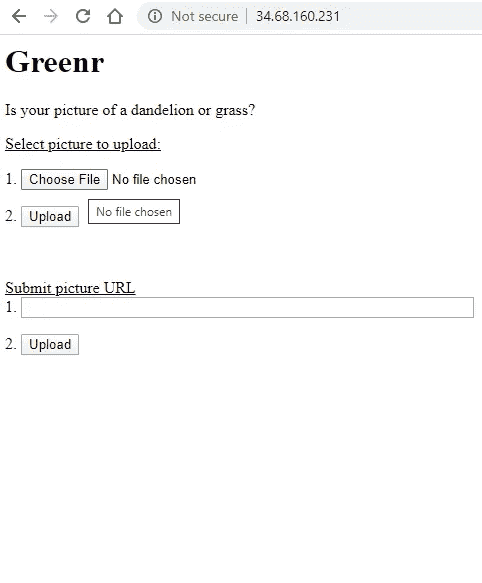
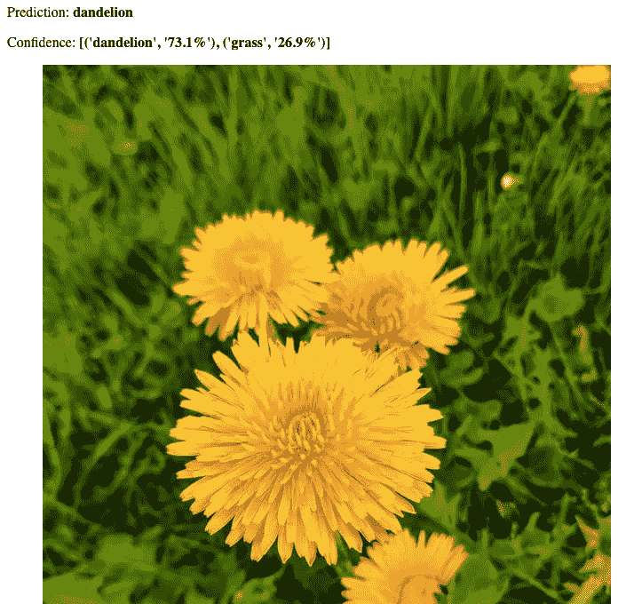

# 10 分钟在谷歌云平台上部署深度学习模型

> 原文：<https://towardsdatascience.com/10-minutes-to-deploying-a-deep-learning-model-on-google-cloud-platform-13fa56a266ee?source=collection_archive---------9----------------------->

## 如何在 GCP 部署深度学习模型，完全免费，永远免费


部署一个蒲公英和草的图像分类器到网络上，通过谷歌云平台！来源: [Pixabay](https://pixabay.com/photos/dandelion-sky-flower-nature-seeds-463928/)

所以你训练了一个令你欣喜若狂的机器学习模型，现在，你想和全世界分享它。所以你建立了一个 web 应用程序来服务这个模型，却发现你不知道如何在互联网上 24/7 托管这个 web 应用程序。*毕竟，如果没有人能看到你生产的 ML 模型，它真的存在吗？*本教程源于分享一种简单且**免费的**方法的需求，该方法使用其*始终免费的*计算服务、f1-micro 在[谷歌云平台上将深度学习模型部署到生产中。例如，我们将部署一个使用](https://cloud.google.com/free) [FastAI 深度学习库](https://github.com/fastai/fastai)构建的蒲公英和草分类器。我希望你能够在 30 分钟之内，无缝地、毫不费力地将你训练好的模型部署到世界上。

**要求**:你只需要你现在拥有的电脑和一个谷歌账户！

本教程将分为 4 个步骤:

1.  登录 Google Cloud 并在计算引擎上创建一个 f1-micro 实例
2.  从 Github 中提取训练好的模型
3.  添加交换内存
4.  使用 Starlette 将模型发布到 web 上
5.  在 Docker 容器中构建 web 应用程序
6.  运行 Docker 容器

# 1.登录 Google Cloud 并创建 f1-micro 实例


注册谷歌云平台是免费的

如果你还没有，通过你的谷歌账户注册谷歌云平台。你必须输入你的信用卡，但注册时不会收取任何费用。您还将获得价值 300 美元的免费积分，有效期为 12 个月！你将利用 GCP 的免费层，所以你不必支付遵循本教程。

进入控制台后，转到计算引擎并创建一个实例。您需要:

1.  将实例命名为`greenr`
2.  将计算实例设置为`f1-micro`
3.  将操作系统设置为 Ubuntu 16.04
4.  将硬盘内存提升至 25GB
5.  允许云访问 API 和 HTTP/HTTPS 流量

如何创建虚拟机实例

当您的实例已经创建并正在运行时，通过单击屏幕右侧的 SSH 按钮进入您的实例。

# 2.从 Github 中提取训练好的模型

首先，让我们从 Github 获取已经训练过的导出模型。如果你有兴趣学习如何使用 FastAI 训练一个蒲公英和草的图像分类器，[跟随 Kaggle 上的这个笔记本](https://www.kaggle.com/btphan/greenr-an-image-classifier-in-fastai?scriptVersionId=33945487)！如果你对深度学习感兴趣，我建议你使用图书馆并学习 FastAI 课程。

从包含导出模型的 Github 上的 [greenr repo 中克隆这个存储库，`export.pkl`:](https://github.com/btphan95/greenr)

```
git clone [https://github.com/btphan95/greenr-tutorial](https://github.com/btphan95/greenr-tutorial)
```

# 3.向我们的计算实例添加交换内存

这是它变得有点 hacky。我们的`f1-micro`实例只支持高达 *0.6GB* 的 RAM，这意味着它非常脆弱，无法安装我们所需的所有深度学习库，这些库的大小超过 750MB。我们将为我们的小朋友添加交换内存，以利用其现有的硬盘空间作为 RAM 来实现这一切。幸运的是，我把所有这些都放到了一个脚本中，所以只需从我们的 greenr repo 运行`swap.sh`,向我们的机器添加 4GB 的交换内存:

```
cd greenr-tutorial
sudo bash swap.sh
```

注意，如果您使用的是一个更强的 VM 实例，那么您就不必遵循这个步骤

# 4.使用 Starlette 将模型发布到 Web 上

现在，我们将使用 Starlette ASGI web 框架构建一个 Python 脚本来为我们的模型提供推理服务。为什么是斯达莱特而不是弗拉斯克？两者都是用 Python 编写的 web 框架，但是 Starlette 和 Uvicorn 比 Flask 快得多，并且在生产中更具可伸缩性。

使用您最喜欢的文本编辑器，将以下代码复制到 greenr-tutorial 目录下名为 app.py 的 python 脚本中。

这将在端口 8008 上创建一个 Starlette 服务器，其中有一个用户可以上传图像并获得结果的网页(是蒲公英还是草？)

在继续之前，我们还将添加一个名为`requirements.txt`的文件，它将允许 Docker 在构建容器时安装我们需要的所有库。并将以下文本复制到 greenr-tutorial 文件夹中的`requirements.txt`:

# 5.使用 Docker 容器化应用程序

使用 Docker 可以让我们构建紧凑的容器化环境，只包含我们需要的库和数据。

首先，我们将使用 Docker 构建一个容器，我们的应用程序将在其中运行。这让我们可以在任何地方，在自己的环境中运行应用程序。

首先，[安装 Docker](https://docs.docker.com/engine/install/ubuntu/) :

卸载旧版本:

```
sudo apt-get remove docker docker-engine docker.io containerd runc
```

设置存储库:

```
sudo apt-get update
sudo apt-get install \
    apt-transport-https \
    ca-certificates \
    curl \
    gnupg-agent \
    software-properties-common
```

添加 Docker 官方 GPG 键:

```
curl -fsSL https://download.docker.com/linux/ubuntu/gpg | sudo apt-key add -
```

添加稳定存储库:

```
sudo add-apt-repository \
   "deb [arch=amd64] https://download.docker.com/linux/ubuntu \
   $(lsb_release -cs) \
   stable"
```

安装 Docker 引擎:

```
sudo apt-get update
sudo apt-get install docker-ce docker-ce-cli containerd.io
```

通过运行 hello-world 映像来验证安装(它应该打印一条信息性消息，验证安装成功):

```
sudo docker run hello-world
```

现在，在 greenr-tutorial 目录中，您将需要创建一个 Docker 文件，为 Docker 提供构建容器的指令。首先，vim 进入`Dockerfile`并添加以下几行:

这个 Dockerfile 将在 Python3.6 环境中安装所需的库，向容器中添加必要的文件，并在 app.py 中运行 Starlette 服务器。

在 greenr 目录中，使用以下命令构建 Docker 容器:

```
sudo docker image build -t app:latest .
```

# 6.运行 Docker 容器

现在，我们要做的就是运行我们的 Docker 容器！

```
sudo docker run -d -p 80:8008 app:latest
```

现在，让我们访问我们机器的外部 IP 地址，您可以在 Compute Engine 上找到它。确保当你在你的浏览器中输入它时，它的格式是这样的(对于我的例子):[http://34.68.160.231/](http://34.68.160.231/)



最终部署在网上的模型！



最后的结果！

如果你看到了以上内容，那么你已经坚持到了最后。恭喜你。🎉现在，你可以永远运行你的机器，因为它是谷歌永远免费层的一部分。