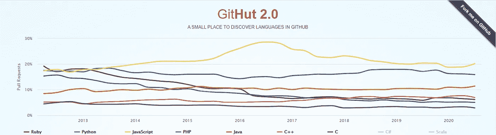

# 2020 年及以后最受欢迎的 10 种编程语言

> 原文：<https://towardsdatascience.com/10-most-popular-programming-languages-for-2020-and-beyond-67c512eeea73?source=collection_archive---------7----------------------->

## 讨论当今 10 种最流行的编程语言的范围、优缺点

图片由[皮克斯拜](https://pixabay.com/?utm_source=link-attribution&utm_medium=referral&utm_campaign=image&utm_content=3866140)的 Gerd Altmann 提供

在编程领域，大约有 700 种编码语言。

理解每种编程语言的意义以及它们如何影响我们需要执行的特定任务是至关重要的。

因为我们不可能坐在这里看 700 多种编码语言(即使我们可以，也可能不是世界上最足智多谋的活动！)简单回顾一下 2020 年及以后最流行的一些语言是个好主意。

我们将分析这 10 篇文章的特点、优点、缺点和未来的范围，并确定它是否值得学习。有些选择可能是自以为是的，但观众可以在查看所有事实后自己决定什么最适合他们。让我们从零开始，按照降序来分析这些语言！

图片来自 [GitHub](https://madnight.github.io/githut/#/pull_requests/2020/3)

## 10.C

c 是一种通用的、过程化的计算机编程语言，支持结构化编程、词法变量范围和递归，具有静态类型系统。通过设计，C 提供了有效映射到典型机器指令的结构。尽管它是大多数编程语言存在的原因，但它在各种领域仍有一席之地，如嵌入式系统、微控制器和嵌入式操作。

**未来范围:**

> 在某些应用程序中，c 可能已经过时了，但是它决不会在短时间内消失。这是一个广泛的用途和现实世界的应用，并将在未来几年应用于行业。这可能很难学，但最终，如果你有时间和资源，这可能是值得的。

**优点:**

1.  这是一种极其灵活的语言。
2.  对基于嵌入式系统的应用非常有用。
3.  整体强大而高效的语言。

**缺点:**

1.  稍微过时的语言。
2.  初级阶段学习起来很复杂。

## 9.C#

C#是本文将要讨论的第一个 C 克隆。C#是一种通用的多范例编程语言，包括强类型、词汇范围、命令式、声明式、函数式、泛型、面向对象和面向组件的编程原则。C#专门用于游戏行业。像 Unity 这样的软件工具也使用 C#来创建游戏。

**未来范围:**

C#是一种越来越受欢迎的语言，由于它在创建游戏方面的有效能力和对游戏行业有帮助的健壮性，它可能会在未来几年继续流行下去。它在企业应用程序中也非常有用。

**优点:**

1.  与 Windows 平台集成得非常好。
2.  与 c 语言相比更容易学习的语言。
3.  因为 C#是一种编译语言，所以它是安全的。

**缺点:**

1.  已知在某些 Linux 框架上有问题。
2.  每次都必须编译代码，这导致了某些限制。

## 8.服务器端编程语言（Professional Hypertext Preprocessor 的缩写）

PHP 是一种通用的脚本语言，特别适合 web 开发。它最初是由丹麦裔加拿大程序员拉斯马斯·勒德尔夫在 1994 年创建的；PHP 参考实现现在是由 PHP 小组开发的。它更适合服务器端的 web 开发，但不幸的是，它被认为是一种垂死的语言，有更好的替代方法来执行类似的任务。

**未来范围:**

> PHP 现在被认为是一种总体上很枯燥的语言，并不令人印象深刻。与 PHP 相比，有更好的编程语言可供选择。然而，它确实在道德黑客和网络安全以及网站设计领域找到了用途。

**优点:**

1.  自动化常见的 web 开发任务。
2.  用于道德黑客和网络安全。

**缺点:**

1.  学习 PHP 的要求写 PHP 代码的要求。
2.  缺少修改核心行为的选项

## 7.红宝石

Ruby 是一种解释型的高级通用编程语言。它是由日本的松本幸宏(Yukihiro“Matz ”)在 20 世纪 90 年代中期设计和开发的。Ruby 是动态类型的，使用垃圾收集。Ruby 是一种典型的脚本语言，在 GitHub、Fiverr 等网站上有着广泛的实际应用。

**未来范围:**

> 在当今世界，Ruby 仍然被大量的应用程序使用。因此，考虑学习它可能是一种很好的语言，因为你很快就能开发复杂的应用程序。它也是很好的技术，即使在今天也能保持其相关性。

**优点:**

1.  它有大量有用的工具和库。
2.  Ruby 的社区非常大而且非常活跃。

**缺点:**

1.  缺乏灵活性和一个简单的错误可能会付出巨大的代价。
2.  性能时间是一个问题，因为框架的启动时间相当长，尤其是当您处理大型项目时，

## 6.C++

C++是一种面向对象的编程语言。C++是 C 的超集。我们已经知道的关于 C 的大部分知识也适用于 C++。所以几乎所有的 C 程序也都是 C++程序。然而，有一些微小的差异会阻止 C 程序在 C++编译器下运行。C++添加到 C 中的最重要的功能是类、继承、函数重载和构造函数重载。它广泛用于 AAA 游戏和 3-D 模型的开发。

**未来范围:**

> 类似于前面提到的 C 和 C#的 C++仍然很流行，学习它绝对不是一个坏主意。尤其是 C++，因为它相对来说是一种更容易掌握和学习的语言。它在工业中有广泛的应用。也用于 AAA 游戏以及图形设计和 3d 模型。

**优点:**

1.  C++被认为是一种可移植性极强的语言。
2.  它允许对代码进行低级操作。
3.  C++是非常可扩展的，因为 C++程序能够在小规模和大规模数据上运行。

**缺点:**

1.  C++中存在轻微的安全问题。
2.  在 C++中，指针消耗大量内存。

## 5.以打字打的文件

Typescript 是一种较新的编程语言。TypeScript 是一种由微软开发和维护的编程语言。它是 JavaScript 的一个严格的语法超集，并为该语言添加了可选的静态类型。TypeScript 是为开发大型应用程序而设计的，可以转换为 JavaScript。它为编码人员提供了更好的接口模块、更简单的编码、导航、错误管理等。

**未来范围:**

> TypeScript 的未来似乎特别强劲，因为它是由微软开发的，并且正在添加许多附加功能，以使编码、导航、编程接口和其他东西更加用户友好，并使程序员的生活更加轻松。

**优点:**

1.  更好的类型注释和整体界面。
2.  使代码管理更容易。
3.  人气和信任度上升。

**缺点:**

1.  对于某些用户来说，与 JavaScript 相比，过于复杂的输入系统。
2.  编译的强制性要求。

## 4.去

2012 年，谷歌只有 2 名员工开发了 Go 或 Golan。Go 是一种静态类型的编译编程语言，由 Robert Griesemer、Rob Pike 和 Ken Thompson 在 Google 设计。Go 在语法上类似于 C，但是具有内存安全、垃圾收集、结构化类型和 CSP 风格的并发性。Go 是一种开源编程语言，可以轻松构建简单、可靠、高效的软件。

**未来范围:**

> 围棋是一门极其流行的新兴语言。围棋的潜力很大，它绝对是一门值得深入学习的语言。最近，围棋甚至开始与许多其他应用一起用于人工智能和机器学习。所以，总体来说，围棋是一门很好的开始学习的语言。

**优点:**

1.  坚固且极其简单。
2.  它有一个智能库来完成复杂的任务。
3.  强大的内置安全性。

**缺点:**

1.  缺少虚拟机。
2.  有时过于简单——Go 可能是一种容易掌握的语言，但这也带来了通用性的缺乏。

## 3.Java 语言(一种计算机语言，尤用于创建网站)

Java 是一种基于类的、面向对象的编程语言，它被设计成具有尽可能少的实现依赖性。Java 是一种通用语言，非常适合游戏和移动应用程序开发。它在企业级应用程序和 web 应用程序中也很有用。它提供了代码的结构和可维护性。

**未来范围:**

> Java 被认为是一种慢慢消亡的语言，类似于 PHP，但不同于后者，它仍然被许多公司广泛使用。它还可以用于创建多种产品，具有广泛的应用。它足够相关和受欢迎，可以被认为是一种需要学习的编程语言。

**优点:**

1.  提供代码的结构和可维护性。
2.  它简单且独立于平台。
3.  它是安全的，也是多线程的，因为它允许程序在任何情况下执行多个任务。

**缺点:**

1.  内存消耗高。
2.  与其他语言相比，性能较慢。

## 2.计算机编程语言

Python 是一种面向对象的高级编程语言，早在 1991 年就发布了。Python 具有高度的可解释性和高效性。简单来说——Python 很神奇。我最初是从 C、C++和 Java 这样的语言开始的。当我终于遇到 python 的时候，我发现它相当优雅，简单易学，易于使用。对于任何人来说，Python 都是开始机器学习的最佳方式，甚至对于以前没有编程或编码语言经验的人也是如此。尽管有一些缺陷，比如被认为是一种“慢”语言，python 仍然是人工智能和机器学习的最佳语言之一。

**未来范围:**

> 不用说，python 在编程语言的开发领域有着光明的前景，尤其是在数据可视化、人工智能、数据科学、探索性数据分析和机器学习等领域。

在下面两篇文章中了解关于 python 的更多信息:

 [## 开始使用 Python 掌握机器学习的旅程

### 了解精通机器学习的基本要求

towardsdatascience.com](/starting-your-journey-to-master-machine-learning-with-python-d0bd47ebada9)  [## 机器学习所需的 Python 基础知识及其库模块

### 学习 python 数据结构的基础知识，对机器所需的每个库有直观的理解…

towardsdatascience.com](/basics-of-python-and-its-library-modules-required-for-machine-learning-51c9d26026b8) 

**优点:**

1.  python 非常简单和一致。
2.  与各种库和框架相关的丰富资源。
3.  伟大的社区和持续更新。总的来说，python 社区充满了令人惊奇的人，并且不断更新以改进 python。
4.  多功能性和平台独立性。这意味着 python 也可以导入用其他编程语言构建的基本模块。

**缺点:**

1.  由于某些算法的实现时间比其他编程语言慢，所以它有时被认为是一种很慢的语言。

## 1.Java Script 语言

JavaScript 通常缩写为 JS，是一种符合 ECMAScript 规范的编程语言。JavaScript 是高级的，通常是即时编译的，并且是多范例的。它有花括号语法、动态类型、基于原型的面向对象和一流的功能。它是一种非常流行的语言，在网络上随处可见。它是一种非常通用的语言，用于构建交互式前端用户界面。

**未来范围:**

> JavaScript 是一种非常流行的语言。它被如此广泛地使用，以至于要用另一种编程语言来取代它可能需要相当长的时间。它不仅可以应用于网络开发，还可以应用于人工智能和其他应用。这门语言应该是任何人学习的首选语言。

**优点:**

1.  非常简单和通用的语言。
2.  速度快，因为它是一种解释型语言。
3.  高度可解释性，并与其他语言也很好地工作。
4.  人气上升，界面好。

**缺点:**

1.  客户端安全性有时会受到损害。
2.  缺少调试设备。

照片由 [Clément H](https://unsplash.com/@clemhlrdt?utm_source=medium&utm_medium=referral) 在 [Unsplash](https://unsplash.com?utm_source=medium&utm_medium=referral) 上拍摄

# 结论:

本文涵盖了撰写本文时使用的前 10 种编程语言的简明列表。但是，这并不意味着其中一个比另一个更好，或者排名较低的那些没有那么有用。

每种编程语言都有自己独特的方式，可以用于各种目的。所以，如果你有时间、资源和机会，不要停止学习一门新的编程语言！

我强烈鼓励你们所有人研究这些编程语言，看看它们对编码的未来意味着什么，以及它们对人工智能、机器学习和数据科学作为一个整体的资源贡献。

> 本文的主要来源和参考资料是 2020 年第三季度的 [GitHub](https://madnight.github.io/githut/#/pull_requests/2020/3) 。

如果你喜欢这篇文章，那么看看其他你可能也喜欢阅读的文章吧！

 [## 聚类无监督学习简明指南！

### 借助聚类算法详细理解无监督学习的概念。

towardsdatascience.com](/concise-guide-to-unsupervised-learning-with-clustering-4924cdbb27cb)  [## 4 个基本正则表达式操作符使自然语言处理变得更简单！

### 了解四种基本的常规操作，以清理几乎任何类型的可用数据。

towardsdatascience.com](/natural-language-processing-made-simpler-with-4-basic-regular-expression-operators-5002342cbac1)  [## 带有完整代码片段和有用链接的 5 个最佳 Python 项目创意！

### 为 Python 和机器学习创建一份令人敬畏的简历的 5 个最佳项目想法的代码片段和示例！

towardsdatascience.com](/5-best-python-project-ideas-with-full-code-snippets-and-useful-links-d9dc2846a0c5)  [## 人工智能是破解宇宙奥秘的关键，下面是原因！

### 人工智能、数据科学和深度学习的工具是否先进到足以破解人类大脑的秘密

towardsdatascience.com](/artificial-intelligence-is-the-key-to-crack-the-mysteries-of-the-universe-heres-why-56c208d35b62)  [## OpenCV:用代码掌握计算机视觉基础的完全初学者指南！

### 包含代码的教程，用于掌握计算机视觉的所有重要概念，以及如何使用 OpenCV 实现它们

towardsdatascience.com](/opencv-complete-beginners-guide-to-master-the-basics-of-computer-vision-with-code-4a1cd0c687f9) 

谢谢你们坚持到最后。我希望你们喜欢阅读这篇文章。我希望你们都有美好的一天！