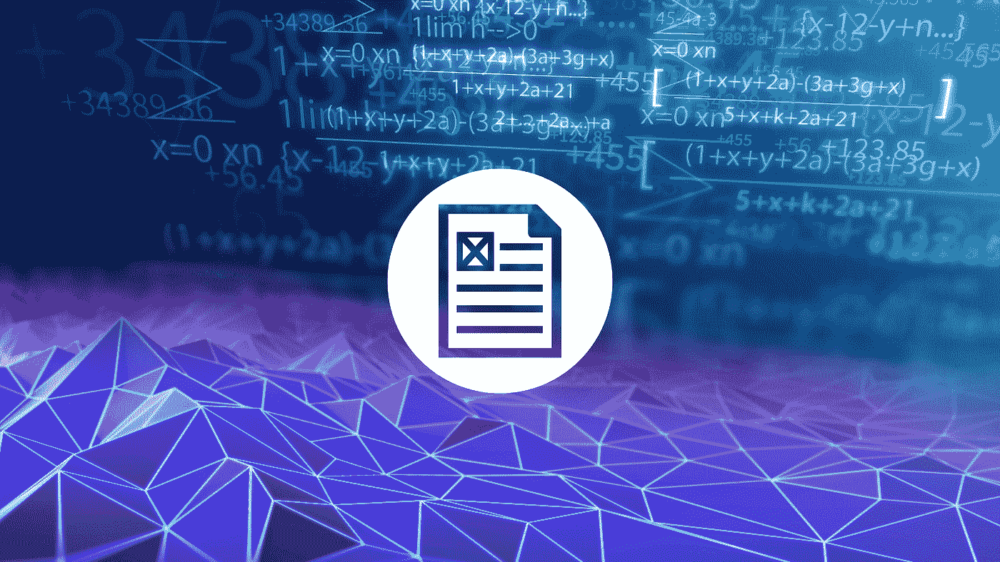
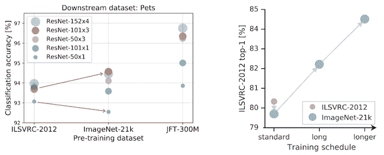
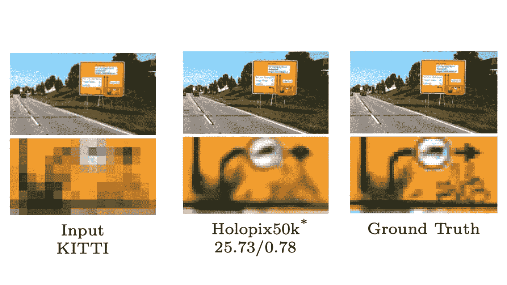
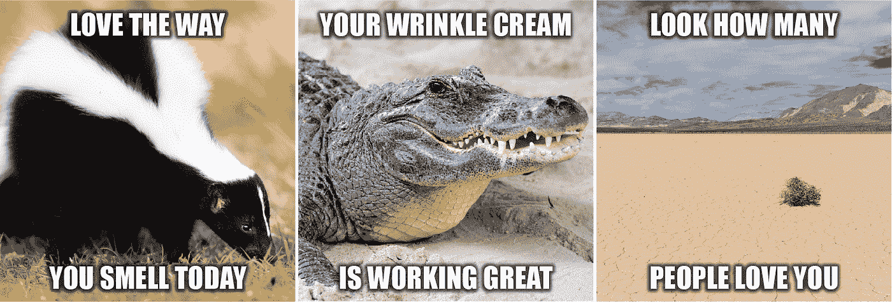
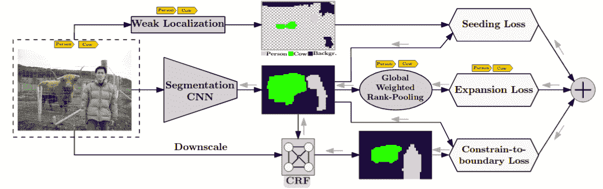

# 10 篇必读的机器学习文章(2020 年 4 月—5 月)

> 原文：<https://towardsdatascience.com/10-must-read-machine-learning-articles-april-may-2020-d490960dd851?source=collection_archive---------51----------------------->

作者图片

在机器学习方面已经完成了许多令人惊叹的工作，以及 2020 年 4 月和 5 月发布的有趣的数据集。在这篇文章中，我们将浏览一些最大的人工智能新闻、研究论文和来自世界上一些最大的科技公司的公开数据集，包括微软、脸书、谷歌和优步。

无论您认为自己是数据科学初学者、中级还是专家，无论您的技能水平如何，都可以从下面的文章中获得有趣的信息。

# 机器学习新闻

1.  [开源 BiT:探索大规模计算机视觉前期训练](https://ai.googleblog.com/2020/05/open-sourcing-bit-exploring-large-scale.html)

从谷歌人工智能博客中，研究人员介绍了大转移(BiT):通用视觉表示学习，这是一种在大规模图像数据集上进行预训练的新方法。

图片来自 ai.googleblog.com

模型和数据集是开源的，文章中有下载链接。有趣的是，该团队表示，仅在更大的数据集上进行预训练并不总是会导致更高的模型准确性。为了从较大数据集的预训练中获得最大收益，必须扩展较小的模型架构，必须增加计算预算，以及更长的训练时间。

2.[优步放松其人工智能实验室:看看他们的一些顶级作品](https://analyticsindiamag.com/uber-ai-labs-layoffs/)

许多公司受到了新冠肺炎危机的负面影响，优步的拼车服务无疑受到了很大冲击。由于这些挫折，该公司已经决定关闭他们的人工智能实验室。他们发表了官方声明:

> “鉴于必要的成本削减和对核心的日益关注，我们决定逐步关闭孵化器和人工智能实验室，以寻求优步工厂的战略替代方案。”

本文通过回顾优步人工智能团队所做的一些最好的工作，向该公司的人工智能实验室致敬，包括人工智能生成算法、POET(成对的开放式开拓者)、PLATO 平台等等。

3.物体是揭示视觉和语言之间世界的秘密钥匙

图片来自[microsoft.com](https://www.microsoft.com/en-us/research/blog/objects-are-the-secret-key-to-revealing-the-world-between-vision-and-language/)

这篇文章来自微软研究博客，解释了视觉和语言预训练(VLP)的巨大进步及其在图像-文本对数据上训练大型模型的潜力。在文章中，研究团队还引入了 Oscar(对象语义对齐预训练),以展示如何将对象用作锚点，以绘制图像和文本之间的语义连接。

4.[介绍 Holopix50k:图像超分辨率的新基准数据集](https://lionbridge.ai/articles/holopix50k-a-new-benchmark-for-stereo-image-super-resolution-and-depth-estimation/)

图像超分辨率有可能改善虚拟现实、视频监控和许多其他技术。

图片来自 leiainc.com

为了给研究人员提供高质量的图像超分辨率和深度估计训练数据，Leia Inc .最近发布了 Holopix50k，这是世界上最大的“野外”立体图像对数据集。

5.[亚马逊科学家作者热门深度学习书籍](https://www.amazon.science/latest-news/amazon-scientists-author-popular-deep-learning-book)

作为世界上最大的科技公司之一，亚马逊一直处于将机器学习应用于企业目的的前沿。通过 Amazon SageMaker，他们为数据科学家提供了一个大规模构建和部署 ML 模型的平台。现在，亚马逊一些最伟大的数据科学家发布了一本名为《深入学习》的开源书籍。这本书教授深度学习背后的思想、数学和代码。此外，作者计划根据用户的评论和反馈不断更新这本书。

6.[脸书发布仇恨迷因数据集并发起挑战](https://ai.facebook.com/blog/hateful-memes-challenge-and-data-set/)

图片经由[ai.facebook.com](https://ai.facebook.com/blog/hateful-memes-challenge-and-data-set/)

脸书的人工智能团队建立并开源了一个新的数据集，以帮助研究人员创建检测仇恨言论的模型。“仇恨迷因”数据集有超过 10，000 个多模态示例。除了数据集，他们还发起了一项名为“仇恨迷因挑战”的比赛，由 DrivenData 主办，总奖金为 10 万美元。

如果你对仇恨言论检测感兴趣，你也应该看看这篇文章[重点介绍了脸书·艾在该领域的进展。](https://ai.facebook.com/blog/ai-advances-to-better-detect-hate-speech)

# 机器学习指南和专题文章

7.[如何用 WSL 使用不准确的数据进行机器学习](https://lionbridge.ai/articles/how-to-use-inaccurate-data-for-machine-learning-with-weakly-supervised-learning/)

对于预算较少的独立研究人员和团队来说，很难获得大量的训练数据。解决这个问题的一个方法是使用更容易收集的低质量注释。

图片来自 lionbridge.ai

在本文中，作者通过几种基于图像的数据的弱监督学习(WSL)技术，解释了利用弱注释进行机器学习的方法。

8.[人工智能如何改变谷歌地图的故事](https://medium.com/swlh/ai-google-maps-79237f8946e3)

谷歌地图在过去二十年里发展迅猛，用户界面不断发展，对现有的设计和功能进行了调整。这篇文章讲述了谷歌地图如何发展的故事，特别是谷歌如何使用机器学习来改善他们的平台。

此外，文章还解释了谷歌为使地图平台达到今天的水平而进行的所有收购，以及谷歌地图的未来扩张计划。

9.[如何使用数据增强技术将图像数据集放大 10 倍](https://lionbridge.ai/articles/data-augmentation-with-machine-learning-an-overview/)

该指南由 AI Summer 的创始人撰写，解释了什么是数据增强，以及如何使用数据增强来增加影像数据集大小的指南和提示。从基本的图像操作到基于 GAN 的数据增强，本指南为该领域的初学者和中间用户提供了有趣的信息。

10.疫情正在清空呼叫中心，人工智能聊天机器人正在涌入

由于许多国家实行隔离和封锁，许多公司被迫关闭了大部分呼叫中心。然而，对于政府组织来说，在疫情期间，来电者的数量增加了，大多数团队没有人员来处理增加的数量。

这篇文章讲述了纽约州 Ostego 县的 IT 主管如何实现 IBM Watson chatbot 来处理新冠肺炎的查询，尽管大量裁员。

# 新冠肺炎文章和资源

已经发布了大量关于新冠肺炎的文章，所以我们没有在上面的章节中包括任何与 COVID 相关的文章。然而，如果你正在寻找这样的文章或新冠肺炎数据集，下面是一些可能对你有用的资源。

*   [新冠肺炎开发者资源中心](https://www.programmableweb.com/coronavirus-covid-19)
*   [全球冠状病毒数据集库](https://lionbridge.ai/datasets/coronavirus-datasets-from-every-country/)
*   [人工智能技术如何对抗冠状病毒](https://lionbridge.ai/articles/how-ai-technology-is-fighting-the-coronavirus/)

希望您从上面的一篇文章中学到了一些新的东西，可以应用到您自己的项目中。尽管由于新冠肺炎，全球遭遇挫折，但我们已经看到在 2020 年初，在机器学习方面做了很多伟大的工作。在今年剩下的时间里，我们可能会看到更多令人惊叹的文章。

为了跟上人工智能和机器学习的所有最新动态，请务必在 [Twitter](https://twitter.com/AmbalinaLimarc) 和 [Medium](https://medium.com/@LimarcA) 上关注我。