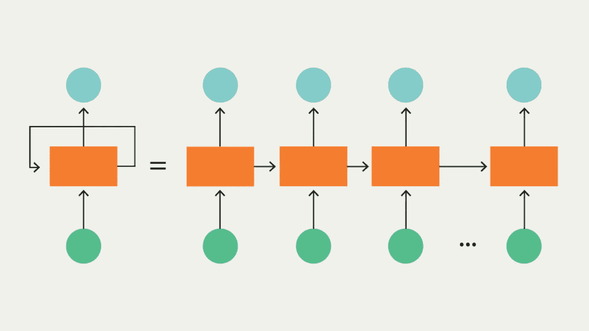

# 10 篇必读的机器学习文章(2020 年 3 月)

> 原文：<https://towardsdatascience.com/10-must-read-machine-learning-articles-march-2020-80da9c380981?source=collection_archive---------8----------------------->

虽然新冠肺炎占据了全世界的头条，但值得注意的是，在机器学习的世界里，许多公司都在照常运营。当然，现在几乎每个人都采取了一些措施来对抗冠状病毒的传播。然而，许多研究人员正在努力工作，以保持人工智能世界的进步和创新。

这个列表将展示机器学习领域最近的一些工作和发现，以及初学者和中级数据科学家的指南和资源。

# 机器学习新闻

1.[谷歌推出云人工智能平台管道](https://venturebeat.com/2020/03/11/google-launches-cloud-ai-platform-pipelines-in-beta-to-simplify-machine-learning-development/) —本文解释了谷歌云人工智能平台的测试版，以帮助机器学习开发。该公司将他们的平台描述为一个简单且易于安装的机器学习工作流环境。

2.[人工智能植入物让截肢者能够控制假肢手](https://www.technologyreview.com/s/615311/implant-machine-learning-amputees-control-prosthetic-hands-ai/)——来自《麻省理工科技评论》，这篇文章概述了一项惊人的研究，旨在帮助截肢者更好地控制假肢的运动。保罗·塞德娜教授(该研究的共同领导者)声称，在最初的校准后，“思想和行动之间没有差距。”

3.[人工智能正在改变视频游戏行业——一个增强和合成媒体的时代](https://aibusiness.com/how-ai-is-changing-the-video-game-industry-an-era-of-augmentation-and-synthetic-media/)——正如标题所示，这篇文章解释了人工智能和游戏行业的现状。它详细介绍了人工智能中对改善视频游戏具有巨大潜力的领域，如增强现实和生成式人工智能模型。

4.[人工智能的突破可能会显著改善 Oculus Quest](https://www.androidcentral.com/ai-breakthrough-could-significantly-improve-oculus-quest-rendering-power)——作为虚拟现实消费市场的先驱之一，Oculus 自 2014 年被脸书收购以来已经显著增长。他们的增长很大一部分可能要归功于 Oculus Quest，这是有史以来第一款无绳独立 VR 游戏系统。这篇文章解释了人工智能的突破如何在不改变硬件的情况下将 Quest 的图形功能提高 67%。

# ML 指南和专题文章

5.[FastAI 简介](/intro-to-fastai-installation-and-building-our-first-classifier-938e95fd97d3) —在本指南中，数据科学学生[达里奥·拉德契奇](https://towardsdatascience.com/@radecicdario?source=post_page-----938e95fd97d3----------------------)对 Fast AI 进行了很好的概述，这是一个广泛用于机器学习的库。本指南详细解释了如何使用 Fast AI 处理 MNIST 数据集，一步一步地介绍了整个过程。

6.[CNN 和 RNN 有什么区别？](https://lionbridge.ai/articles/difference-between-cnn-and-rnn/) —本机器学习基础知识指南对卷积神经网络和递归神经网络进行了简要介绍。它解释了如何在计算机视觉和 NLP 中使用它们，以及两种类型的人工神经网络之间的基本差异。

7.[数据分析的未来](https://blog.getcangler.com/the-future-of-data-analytics-5-predictions-for-where-we-are-headed) —公司将如何经营我们的数据？我们能利用数据来改善教育系统吗？从规范分析的道德伦理到教育和虚拟助手，这篇文章让我们一瞥数据分析的未来。

8.[社交媒体数据挖掘技术](https://hackernoon.com/4-social-media-data-mining-techniques-to-help-grow-your-online-business-o6ch32q4) —数据挖掘和数据收集是当今许多企业正在使用的非常广泛的研究领域。本文简要介绍了社交媒体中的数据挖掘，以及如何使用它来发展在线业务。

# 机器学习资源

9.[谷歌数据集搜索](https://datasetsearch.research.google.com/)——尽管这个专门的数据集搜索引擎已经在谷歌的开发日历上出现了一段时间，但它最终在今年年初退出了测试。正如[在《走向数据科学](/google-just-published-25-million-free-datasets-d83940e24284)中报道的，谷歌数据集搜索让你可以访问超过 2500 万个开放数据集。

10.[来自每个国家的冠状病毒数据集](https://lionbridge.ai/datasets/coronavirus-datasets-from-every-country/) —几乎每个人都想到了新冠肺炎，这个数据集聚合器每周更新一次，当新的数据集可用时就会添加进来。这个列表中的许多数据集每天都在更新。

正如你所看到的，每天仍然有大量的机器学习工作在进行。我们希望你从这些人工智能新闻文章中获得一些新的见解，或者从某个指南中学到一些新的东西。

更多机器学习新闻和指南，别忘了关注我的[黑客正午](https://hackernoon.com/@limarc2000)、[推特](https://twitter.com/AmbalinaLimarc)、[我的个人博客](http://jpbound.com)。