# 你应该知道的 10 个数字函数

> 原文：<https://towardsdatascience.com/10-numpy-functions-you-should-know-1dc4863764c5?source=collection_archive---------2----------------------->

## 数据科学和人工智能的例子

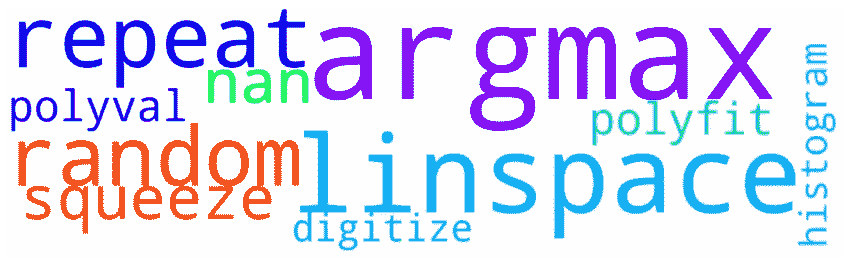

[**Numpy**](https://numpy.org/) 是一个用于科学计算的 python 包，提供了高性能的多维数组对象。这个库广泛用于数值分析、矩阵计算和数学运算。在本文中，我们展示了 10 个有用的 numpy 函数以及数据科学和人工智能应用。我们开始吧！🍀

# 1.numpy.linspace

[**numpy . Lin space**](https://docs.scipy.org/doc/numpy/reference/generated/numpy.linspace.html)**(*start*， *stop* ， *num=50* ， *endpoint=True* ， *retstep=False* ， *dtype=None* ， *axis=0* )** 函数返回由函数的前两个参数定义的指定间隔内均匀分布的数字生成的样本数量由第三个参数 ***num*** 指定。如果省略，将生成 50 个样本。在使用这个函数时要记住的一件重要事情是，停止元素是在返回的数组中提供的(默认情况下 ***【端点=真】*** ，不像在内置的 python 函数 [***范围***](https://www.geeksforgeeks.org/python-range-function/) 中那样。

# 例子

**Linspace 函数**可用于为 x 轴生成均匀间隔的样本。例如，如果我们想要绘制一个数学函数，我们可以通过使用 **numpy.linspace** 函数轻松地为 x 轴生成样本。在强化学习中，我们可以使用该函数进行离散化，提供连续空间(状态或动作)的最高和最低值，生成一致的离散空间。

下图显示了 4 个数学函数:(1)正弦，(2)余弦，(3)指数，以及(4)对数函数。为了生成 x 轴数据，我们使用 linspace 函数，生成从 0 到 100 的 111 个数据点，包括 0 和 100。你可能会注意到，为了生成数学函数，我们再次使用了 **Numpy** 。我们可以参考[文档](https://docs.scipy.org/doc/numpy-1.13.0/reference/routines.math.html)来观察 **Numpy** 提供的大量数学函数:)

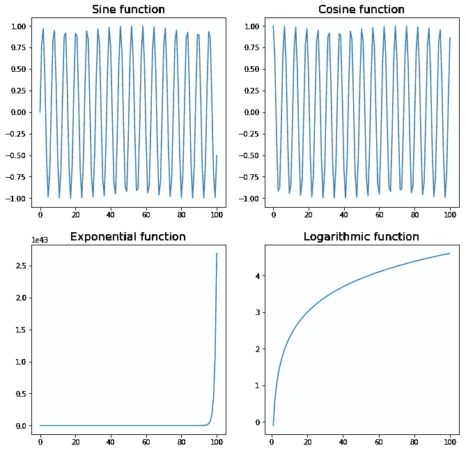

# **2。numpy . digital**

也许你从来没有听说过这个函数，但是在强化学习中使用连续空间确实很有用。[**numpy . digitize**](https://docs.scipy.org/doc/numpy/reference/generated/numpy.digitize.html)**(*x*，*bin*， *right=False* )** 函数有两个参数:(1)一个输入数组***x***；以及(2)一个数组****bin*，**返回每个值所在 bin 的索引迷惑？让我们看一个例子👌*

## *例子*

*在上面的代码中，我们总共有 5 个 bin:*

*   *x < 0 → Index 0*
*   *0≤ x < 1 → Index 1*
*   *1≤ x < 2 → Index 2*
*   *2≤ x < 3 → Index 3*
*   *3≤ x → Index 4*

*Therefore, if we provide as an input 0.5, the function returns 1, since that is the index of the bin to which 0.5 belongs.*

*In **强化学习**，我们可以用等间距网格离散化状态空间。**离散化**允许我们将为离散空间设计的算法，如 **Sarsa** 、 **Sarsamax** 或**预期 Sarsa** 应用于连续空间。*

*想象我们有下面的**连续空间**。**代理**可以在任意位置(x，y)，其中 0≤x≤5，0≤y≤5。我们可以通过提供一个**元组**来离散化代理的位置，表示代理所在的网格。*

**

*我们可以通过使用 **numpy.digitize** 函数轻松实现这种离散化，如下所示:*

*我们将考虑任何小于 1 的值属于库索引 0，任何大于或等于 4 的值属于库索引 4。瞧！我们已经把一个连续的空间变成了一个离散的空间。*

# ***3。numpy.repeat***

***[**numpy . repeat**](https://docs.scipy.org/doc/numpy/reference/generated/numpy.repeat.html)**(*a*， *repeats* ， *axis=None* )** 函数repeats 数组的元素。重复次数由第二个参数**指定*重复*。*****

## ***例子***

***假设我们有两个不同的数据框，包含 2017 年和 2018 年的销售额，但我们只想要一个数据框，包括所有信息。***

***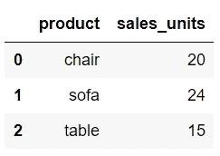***

***2017 年销售额***

***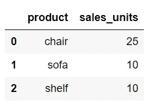***

***2018 年销售额***

***在合并两个数据框之前，我们需要添加一列，指定产品销售的年份。我们可以通过使用 **numpy.repeat** 函数来添加这些信息。随后，我们使用 **pandas.concat** 函数连接两个数据帧。***

***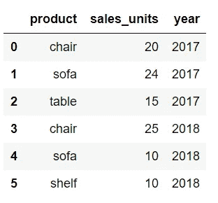***

***销售***

# ***4.numpy.random***

## ***4.1.numpy.random.randint***

***[**numpy . random . randint**](https://docs.scipy.org/doc/numpy-1.15.0/reference/generated/numpy.random.randint.html#numpy.random.randint)**(*low*， *high=None* ， *size=None* ， *dtype='l'* )** 函数返回区间[low，high]中的随机整数。如果 ***高*** 参数缺失(无)，则从区间[0，低]中选取随机数。默认情况下，返回一个随机数(int)。为了生成一个随机整数数组，数组的形状在参数 ***size*** 中提供。***

## ***例子***

***该函数可用于模拟随机事件，如抛硬币或掷骰子，如下所示。***

## *****4.2。numpy.random.choice*****

***[**numpy . random . choice**](https://docs.scipy.org/doc/numpy-1.15.0/reference/generated/numpy.random.choice.html)**(*a*， *size=None* ， *replace=True* ， *p=None* )** 从给定数组中返回一个随机样本。默认情况下，返回单个值。要返回更多的元素，可以在参数 ***size*** 中指定输出形状，就像我们之前使用 numpy.random.randint 函数一样。***

## ***例子***

***上面显示的随机事件也可以通过使用 numpy.random.choice 来模拟。***

***默认情况下，元素被选中的概率相等。为了给每个元素分配不同的概率，可以提供概率数组*。使用这个参数 ***p*** ，我们可以模拟一个有偏的硬币翻转如下:****

## ****4.3.数字随机二项式****

****我们可以使用 numpy 来模拟各种各样的统计分布，如正态分布、贝塔分布、二项式分布、均匀分布、伽玛分布或泊松分布。****

****[**numpy . random . binomial**](https://docs.scipy.org/doc/numpy-1.15.0/reference/generated/numpy.random.binomial.html#numpy.random.binomial)**(*n*， *p* ， *size=None* )** 从二项分布中抽取样本。当有两个相互排斥的结果时，使用二项分布，提供 ***n*** 次试验的成功次数以及单次试验的成功概率****

*****我建议阅读文档并发现 numpy.random 库提供的广泛功能。*****

# *****5.numpy.polyfit*****

*******numpy.polyfit( *x* ， *y* ， *deg* ， *rcond=None* ， *full=False* ， *w=None* ， *cov=False* )** 函数输出一个 ***deg*** 的多项式，即【T50*****

****这个函数在线性回归问题中非常有用。**线性回归**模拟**因变量**和**自变量之间的关系，**获得最符合数据的直线。****

> ******y =a+bx******

****其中 **x** 为**自变量**， **y** 为**因变量**， **b** 为**斜率**， **a** 为**截距。**要获得系数 a 和 b，我们可以使用 **numpy.polyfit** 函数，如下所示。****

## ****例子****

****假设我们有一个包含 5000 名男性身高和体重的数据框。****

****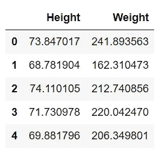****

****正如我们所观察到的，两个变量呈现线性关系。****

****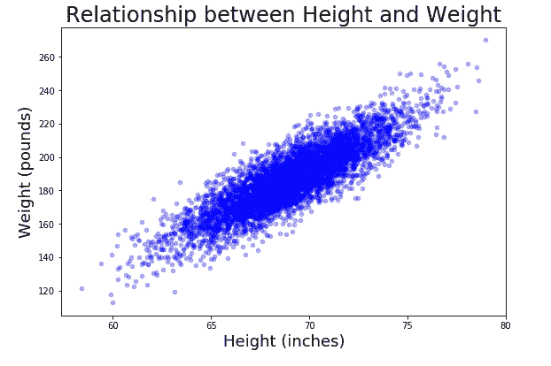****

****我们通过以下方式用 **numpy.polyfit** 函数获得最佳拟合线性方程:****

****该函数返回线性模型的斜率( **5.96** )和截距( **-224.50** )。现在，我们可以利用得到的模型( **y=5.96x-224.50** )来预测一个人的体重(看不见的数据)。这个预测可以通过使用 **numpy.polyval** 函数来获得。****

# ****6.numpy.polyval****

****[**numpy . polyval**](https://docs.scipy.org/doc/numpy/reference/generated/numpy.polyval.html)**(*p*， *x)*** 函数计算特定值的多项式。之前我们已经通过使用 **numpy.polyfit** 函数得到了一个预测一个人**(体重= 5.96 *身高-224.50)** 体重的线性模型。现在，我们使用这个模型通过 **numpy.polyval** 函数进行预测。假设我们想预测一个 70 英寸高的男人的体重。作为参数，我们提供从最高次到常数项( **p=[5.96，-224.49]** )的多项式系数(用 polyfit 获得)，以及一个用来计算***p***(**x = 70**)的数。****

****下图显示了回归线和预测重量。****

****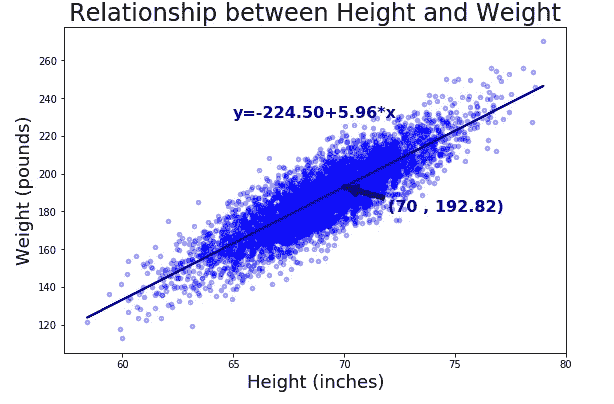****

# ****7.numpy .楠****

****Numpy 库包括几个 [**常量**](https://numpy.org/devdocs/reference/constants.html#numpy.nan) 如非数字(Nan)、无穷大(inf)或 pi。在计算中，not number 是一种可以解释为未定义值的数字数据类型。在 Pandas 中，我们可以使用 not 数字来表示缺失值或空值。不幸的是，脏数据集包含具有其他名称的空值(例如 Unknown、—、n/a ),因此很难检测和丢弃它们。****

## ****例子****

****假设我们有以下数据集，其中包含马德里市的房屋信息(出于解释目的，此数据集有所缩减)。****

****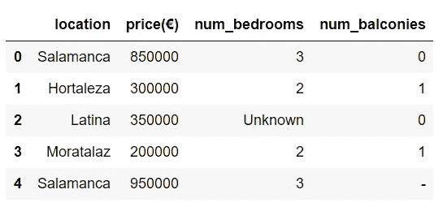****

****具有非标准缺失值的数据框****

****通过使用 [**熊猫，我们可以很容易地分析缺失值。data frame . info**方法。此方法打印有关数据框的信息，包括列类型、非空值的数量和内存使用情况。](https://pandas.pydata.org/pandas-docs/stable/reference/api/pandas.DataFrame.info.html)****

****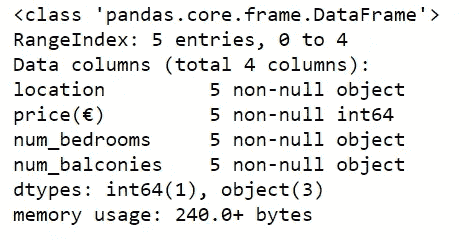****

****info 方法的输出****

****正如我们所观察到的，info 函数没有检测到意外的空值(Unknown 和-)。我们必须将这些值转换成熊猫可以检测到的空值。我们可以通过使用 **numpy.nan** 常量来实现这一点。****

****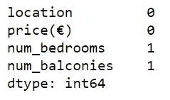****

****在分析数据之前，我们必须处理缺失值。为此，有不同的方法:(1)手动分配缺失值(如果我们知道数据)，(2)用平均值/中值替换缺失值，或(3)删除有缺失数据的行，以及其他方法。****

****在用标准空值替换(Unknown 和-)之后，在 num _ bedrooms 和 num _ balconies 列中检测到两个缺失值。现在，通过使用**熊猫可以很容易地删除那些丢失的值。DataFrame.dropna** 函数(方法 3)。****

****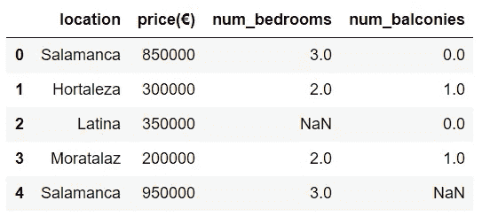****

****删除空值之前的数据帧****

****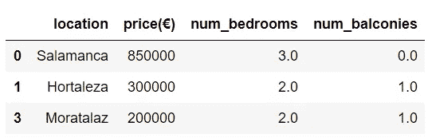****

****删除空值后的数据帧****

# ****8.numpy.argmax****

****[**numpy . arg max**](https://docs.scipy.org/doc/numpy/reference/generated/numpy.argmax.html)**(*a*， *axis=None* ， *out=None* )** 函数返回一个轴上最大值的索引。****

****在 2d 数组中，我们可以很容易地获得最大值的索引，如下所示:****

****我们可以获得沿指定轴的最大值的索引，为 ***轴*** 属性提供 0 或 1。****

## ****例子****

****在强化学习任务中， **numpy.argmax** 非常有用。 **Q 表**是一个动作值函数估计，包含每个状态-动作对的*，假设代理处于状态 s，并采取动作 a，遵循策略 **π** 直到剧集结束。*****

*****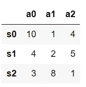*****

*****q 表*****

*****我们可以通过选择为每个状态*提供最大 ***期望回报*** 的动作 ***a*** 来容易地获得策略******

********

****Q 表中的策略****

****在上面的例子中， **numpy.argmax** 函数返回策略:状态 0 →动作 0，状态 1 →动作 2，状态 2 →动作 1。****

# ****9.numpy .挤压****

****[**numpy . squeeze**](https://docs.scipy.org/doc/numpy/reference/generated/numpy.squeeze.html)**(*a*， *axis=None* )** 从数组的形状中删除一维条目。参数 ***轴*** 指定了我们要挤出的轴。如果所选轴的形状大于 1，则出现 ***值错误*** 。如何使用 numpy.squeeze 函数的示例如下所示。****

****正如我们所观察到的，只有轴 0 和轴 2 可以被删除，因为它们的长度都是 1。轴 1 有 3 个元素；因此，会引发 ValueError。****

## ****例子****

******Pytorch** 是基于 torch 库的开源机器学习库。该库提供了多个数据集，如 MNIST、Fashion-MINST 或 CIFAR，我们可以用它们来训练神经网络。首先，我们用 **torchvision.datasets** 函数下载数据集(例如 MNIST)。然后，我们通过使用**torch . utils . data . data loader**创建一个 iterable。这个 iterable 被传递给 **iter()** 方法，生成一个迭代器。最后，我们通过使用 **next()** 方法获得迭代器的每个元素。这些元素是形状为[N，C，H，W]的张量，其中 N 表示批量大小，C 表示通道数量，H 表示输入平面的高度(以像素为单位), W 表示宽度(以像素为单位)。****

****为了可视化前一批元素，我们必须删除第一个轴，因为[**matplotlib . py plot . im show**](https://matplotlib.org/3.1.1/api/_as_gen/matplotlib.pyplot.imshow.html)函数接受 shape (H，W)的图像作为输入。****

****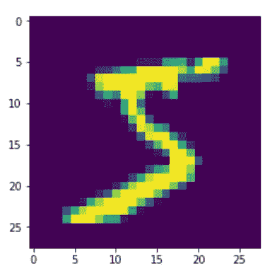****

****批次的第一个图像****

# ****10.数字直方图****

****[**numpy . histogram**](https://docs.scipy.org/doc/numpy/reference/generated/numpy.histogram.html)**(***a***，***bin = 10***，** *range=None* **，** *normed=None* **，** *weights=None* **，** *密度=None* 该函数返回 2 个值:(1)频率计数，以及(2)箱边缘。****

## ****例子****

****以下数据框包含 5000 名男性的身高。我们创建一个直方图，将 ***kind='hist'*** 传递给 ***plot*** 方法。****

****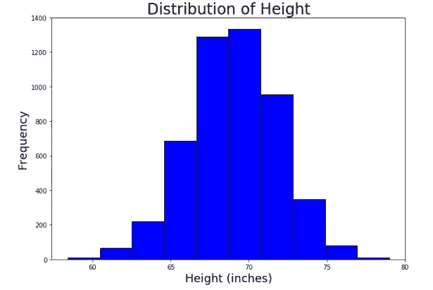****

****默认情况下，直方图方法将数据集分成 10 个箱。请注意，x 轴标签与箱子尺寸不匹配。这可以通过传入一个包含箱子尺寸列表的 ***xticks*** 参数来解决，方式如下:****

****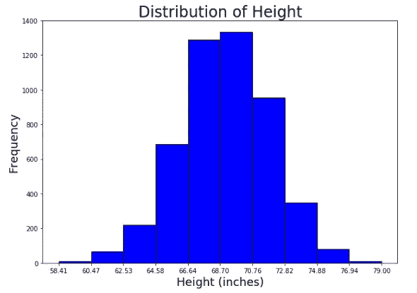****

****感谢阅读！！🍀 🍀 💪并且使用 Numpy！****