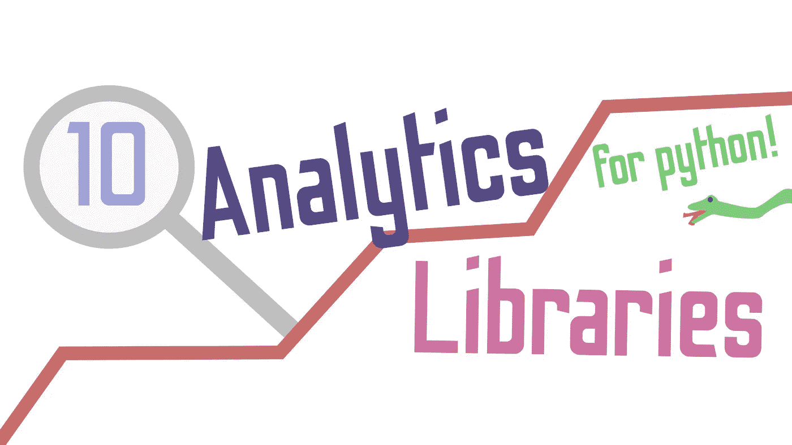

# 用于数据分析的 10 个我最喜欢的 Python 库

> 原文：<https://towardsdatascience.com/10-of-my-favorite-python-libraries-for-data-analysis-597e09cca026?source=collection_archive---------3----------------------->

## 一些你应该在 Python 中使用的优秀分析包的快速概要。



(图片由作者提供)

# 介绍

目前地球上最流行的通用编程语言是 Python 编程语言。这不仅是因为 Python 非常简单，而且相对较快，而且 Python 有一个杀手级的生态系统，其中的工具适合从商业到金融和科学的各个学科。在数据科学的奇妙世界中，有一个领域肯定证明了这一点。

当然，Python 也是当今用于数据科学的最流行的编程语言。虽然大多数使用这种语言的科学家可能都熟悉许多广为人知且广泛使用的软件包，如 Scipy、Sklearn 和 Matplotlib，但也有一些大多数数据科学家从未听说过的软件包非常棒！

# №1: Plot.ly

首先，我将介绍一个非常有名的数据可视化库，但有些人可能从未听说过。Plot.ly 是一个图形库，将交互性提升到了一个全新的水平。我真心建议使用 Plot.ly，而不是 Matplotlib 或 Seaborn。这是因为 Plot.ly 附带了许多不同的工具，大多数科学家肯定会喜欢这些工具。Plot.ly 里到底有多少？

> 嗯…

## 基本制图

Plot.ly 预装了普通数据科学家甚至只是计算机程序员可能期望的所有奇妙工具。散点图、条形图和折线图都是 Plot.ly 模块的主要内容。虽然 Matplotlib 可以实现类似的目标，但 Plot.ly 具有相同的功能，同时还具有默认样式和 Java-script 交互性，这使得探索数据变得更加有趣和容易。除此之外，使用 Plot.ly 比使用许多竞争对手的产品更有利于展示。

除此之外，Plot.ly 还有一些鲜为人知的图表，你很难在大多数其他数据可视化包中找到。漏斗图、饼图、小提琴图和树状图只是使用 Plot.ly 库探索数据的一些独特而有趣的方法的几个例子。

## 三维（three dimension 的缩写）

除了基本情节的漂亮造型之外，Plot.ly 还配备了功能齐全的 3D 可视化系统，可与现代技术的一些最佳产品相媲美。Plot.ly 处理 3D 的一大优势是性能。虽然 3D 可视化当然非常复杂和密集，但 Plot.ly 似乎可以相对轻松地处理许多这些应用程序。3D 可视化也很棒，因为新的轴通过探索数据在 3D 空间中的位置值，允许更多的理解。此外，Z 轴还可以表示各种特征，从而可以一次查看多种不同的相关性。

## 地图

在最近的技术发展中，一件令人惊讶的事情是地理数据。地理数据在 FIPS 发展到如此程度，主要是因为智能手机和全球定位系统(GPS)，这为数据科学奠定了坚实的基础。这当然是因为现在的数据比以往任何时候都更容易获得，包括地理数据在内。

也很难否认 Plot.ly 对地图的漂亮处理。特别是 Plot.ly 的 clorepleths，使用起来绝对是一种享受，可以在几秒钟内实现引人注目的可视化。

## 金融的

虽然金融方面的东西肯定不是我的大部分领域知识，但 Plot.ly 对一些金融可视化有很大的支持。这也显示了 Plot.ly 的多功能性，因为可视化依赖于许多科学家的领域内外。就像 Plot.ly 中的所有东西一样，金融图表易于使用，也很漂亮——不久前，我参与了一个项目，在这个项目中，我们跟踪货币的价值，并使用 LSTM 模型创建了一个完整的网络应用程序，该应用程序将重新训练自己，并根据它所学的知识预测新数据。在这种情况下，Plot.ly 因其易于使用和 Javascript 集成的烛台数据可视化而真正派上了用场。

## 统计的

为了增加 Plot.ly 的不合理功能，Plot.ly 还支持几种不同类型的统计图。此外，Plot.ly 的统计绘图非常成熟，使得绘制分布图等事情变得相对简单和容易。

## 多语言

Plot.ly 的另一个优点是它是用 c 编写的，因此，它使用 LLVM 编译器库，并且只需一个简单的 API 就可以兼容一系列编程语言。Plot.ly 不仅适用于 Python 用户，还适用于 R 用户、C 用户以及任何愿意实现它的其他语言的用户群。甚至有一个使用 Plots.jl 包的 Julia 语言实现。

## 开源

Plot.ly 的最后一个优点是它是开源的。虽然这对某些人来说好处不大，但是如果需要的话，能够进行更改或者理解代码在您的机器上是如何运行的，总是一个优势。作为开源软件还意味着 Plot.ly 可以用于实际的商业应用程序，不仅对那些将编程作为业余爱好的人来说是有价值的，对现实世界的专业人士来说也是如此。

# №2:gg 图

我推荐的第二个使用 Python 进行数据分析的工具是 GGPlot.py。任何有 R 编程语言经验的科学家都可能使用过 GGPlot 或 GGPlot2。R 和 Python 包都很棒，让绘图变得轻而易举，而且更加深入。虽然 R 实现确实值得一试，但是 Pythonic 版本也确实非常棒。

## 注重统计的

GGPlot 包和 Python 的 Plot.ly 包之间的一个显著区别是，GGPlot 更加注重统计。Plot.ly 是一个很好的数据可视化工具，但也是针对更典型的数据可视化，而不是专门的统计绘图。

## 基于几何图形

关于 GGPlot 另一个值得注意的重要事情是它的图形和可视化方法。一般来说，GGPlot 在几何上更加模块化。这意味着可以很容易地添加或更改成分。这对数据科学更有利，因为通常有某个想法或数据点可能比其他的更需要强调。

# №3:散景

Bokeh 是另一个交互式绘图库，它是基于现代网络浏览和计算而构建的。与 Plot.ly 类似，Bokeh 可能不像 GGPlot 那样可扩展，但通过与 Javascript 的难以置信的集成，它提供了许多优于前者的好处。每个数据科学家都喜欢交互式可视化，Bokeh 经常将这一点带到一个非常高级和简单的 API，并带来令人惊叹的结果。

## 类似于 Plot.ly

作为一种可视化工具，散景与 Plot.ly 非常相似，这并不是一件坏事。这意味着使用散景可以非常容易地创建漂亮的交互式可视化效果。

## 图表

虽然散景在许多方面与 Plot.ly 相似，但散景肯定不是这种情况。不仅支持所有典型的可视化技术，而且散景还允许用户创建几乎任何东西的有趣的交互式可视化。散景的一个相对常见的用途是网络图的可视化，这真的很酷！除此之外，它还提供了人们可能从 Plot.ly 库中期待的地理数据可视化。

# 第四名:交响乐

脱离可视化世界的是一个奇妙的 Python 包，叫做 SymPy。MATLAB、Mathematica 和 Julia 程序员们，抓紧你们的帽子——SymPy 是一个 Python 模块，它允许 Python 程序员和科学家使用更多的数学绑定。这使得这种语言从一种更典型的软件工程方法转向数学，而在另一端，代码经常被写成数学。

## 酷图书馆

Pythonic 代码和数学的许多令人惊叹的实现使用 SymPy 进行后端数学计算。以下是一些直接从他们主页上摘下来的著名例子:

*   [**Cadabra**](https://cadabra.science/) :张量代数和(量子)场论体系使用 SymPy 作标量代数。
*   [**ChemPy**](https://github.com/bjodah/chempy) :用 Python 写的对化学有用的包。
*   [**Lcapy**](https://lcapy.elec.canterbury.ac.nz/) :教学线性电路分析实验 Python 包。
*   [**Spyder**](https://www.spyder-ide.org/) :科学的 Python 开发环境，相当于 Rstudio 或 MATLAB 的 Python；Spyder 的 [IPython 控制台](https://docs.spyder-ide.org/ipythonconsole.html)可以启用完整的 SymPy 支持。

## 兰比菲

很容易，SymPy 必须提供的最酷的东西是修改语言内部的任何表达或功能的能力。我之前谈过为什么我认为 Lambda 是 Python 开发人员可用的最好工具之一。如果你想读一篇关于这个话题的文章，你可以在这里查阅:

[](/scientific-python-with-lambda-b207b1ddfcd1) [## 带 Lambda 的科学 Python

### 在过去的十年中，Python 编程语言已经进入了许多领域的人的脑海…

towardsdatascience.com](/scientific-python-with-lambda-b207b1ddfcd1) 

虽然 Python 的 lambda 本身就是一个很好的内联参数，但是使用 SymPy 的 Lambdify 函数，它变得更加强大。它是这样工作的:

首先，您可以创建一个用作数学函数的表达式，在本例中为 sin(x)。

```
**import** **numpy**a = numpy.arange(10)expr = sin(x)
```

然后，该函数可以通过 lambdify，成为其自身的一个非常实用的版本:

```
f = lambdify(x, expr, "numpy")
```

这是所有 SymPy 的基础，并使使用 Python 编程语言进行科学计算变得更加容易。使用这个函数实际上可以让 Python 探索 Julia 语言的一个好处，语法表达式。如果你想学习更多关于 Julia 语言如何使用表达式的知识，你可以在这里查看完整的教程:

[](/how-to-use-syntactical-expressions-and-dispatch-in-julia-67ce155e4af9) [## 如何在 Julia 中使用语法表达式和调度

### 朱莉娅的面包和黄油:句法表达和多重调度

towardsdatascience.com](/how-to-use-syntactical-expressions-and-dispatch-in-julia-67ce155e4af9) 

# №5:火焰

Blaze 生态系统是一组 Python 库，使得用 Python 编程语言查询和处理数据变得容易得多。Blaze 生态系统实际上由几个不同的包组成:

*   火焰
*   达斯克
*   数据形状
*   DyND
*   奥多

对于 Python 编程语言来说，这些都是极好的、有用的、制作精良的工具。然而，我将把重点放在我用得最多并且发现最有价值的两个方面，因为它与科学计算有关。

## 火焰

Blaze 是一个在完全不同的存储系统上查询各种数据的界面。这对于检索和分析大数据转储非常有用，这些大数据转储可能需要通过算法进行分解，而且可能位于不同存储介质的不同部分。对于那些在特殊环境下工作的人来说，这是一个非常有用的工具，并多次拯救了我的生命。

## 达斯克

Dask 是一个非常独特的包，它允许在 Python 中进行简单和大多数可变的并行计算。Python 中的并行计算在某种程度上一直是该语言的一个挑战，此外，对于该语言可用的许多最大的包来说，优化已经变得难以置信地困难，因为该语言并没有考虑到并行计算的思想。

也就是说，随着语言本身朝着这个方向发展，Dask 是一个很好的工具，可以与 GPU 支持保持一致，并与 CuArrays 一起工作。Dask 还具有由相关程序员明确编码的动态任务调度和大数据收集功能。

# №6:橙色

Orange 是一个用于数据挖掘的 Python 库。这与数据分析有什么关系？Orange 有一整套收集数据的工具，这些数据以后可以用于分析，而分析离不开数据。也就是说，数据争论是数据科学过程中非常重要的一步，Orange 有助于使这一过程更加简单。

更酷的是，该模块附带了一些分类和回归模型，您可以在新挖掘的数据上使用它们！

# №7: Gensim

Genism 是一个用于主题建模的 Python 库。Genism 的伟大之处在于它既易于使用，又非常强大。使用 Gensim，您可以创建比您的计算机占用更多内存的可扩展统计语义，也可以部署到真实的生产环境中。此外，Genism 可以很容易地实现来执行自然语言处理。

# №8: Theano

Theano 是另一个数学 Python 库，它允许程序员高效地处理大量数据。虽然它可能比不上 SymPy 之类的以数学为中心的东西，但它做了许多非常酷和有趣的事情，使 Python 中的线性代数变得有趣多了。最重要的是，与许多类似的解决方案相比，Theano 非常准确，而且相对较快。最重要的是，该包与 Numpy 紧密集成，并动态集成 C 代码，使 Python 运行更快。

# №9: SciPy

如果您已经使用 Python 进行了一周的统计，那么您很可能已经使用了 SciPy。SciPy 是 Python 语言中统计测试的首选包。SciPy 不仅通常是一个使用起来很快的包，而且它也是一个值得尊敬的包，并且已经被证明超时工作效果非常好。SciPy、Pandas 和 Numpy 的结合使 Python 成为普通科学家甚至更多数据科学家工作的伟大语言。

## 包括的

关于 SciPy，可以肯定的一点是，该模块具有很强的包容性。虽然这可能意味着有时很难找到你到底需要什么，但这也意味着你需要的一切都唾手可得——在我看来，这是一笔不错的交易。SciPy 库将从统计到分布，甚至微分方程的所有内容都变成了任何人都可以使用的简单易懂的函数！

# №10:海风

我推荐的最后一个用于 Python 编程语言数据分析的工具是 Python 经典之作:

> 海博恩。

Seaborn 是 MatPlotLib 的扩展。将统计绘图集成到模块中的 PyPlot。Seaborn 为绘制、操作和使用漂亮的统计图形提供了一个高级界面。虽然与 Bokeh 或 Plot.ly 相比，Seaborn 的外观可能会显得苍白，但它在速度方面的重要性令人难以置信。当处理具有大量观测值的数据集时，尝试使用 Seaborn 而不是 Plot.ly 或 Bokeh 进行数据可视化可能是个好主意。Seaborn 的简单性是其最大的好处，因为它使 MatPlotLib 中熟悉的绑定变得快速而容易使用。

# 结论

如果现代开发人员使用的一种语言拥有数据分析和可视化的最佳生态系统，它很可能是 Python。Python 有很多工具，这些工具不仅对统计观察很有用，而且对使语言本身更具统计性也很有用。此外，就可视化而言，很少有语言能与 Python 编程语言提供给基于 Python 的科学家的惊人模块相媲美。也就是说，这些是我真正喜欢的模块——但是还有更多，所以在回复中了解更多肯定会很有趣！