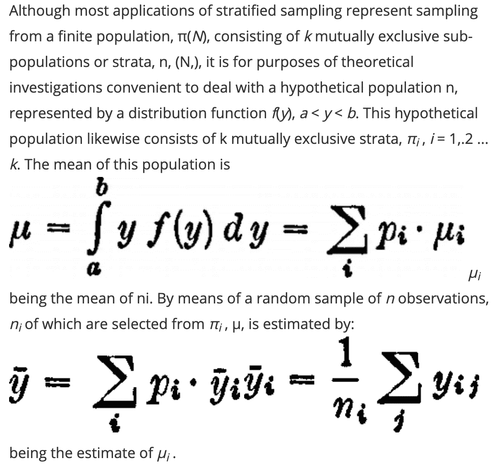
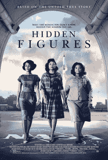

# 过去 10 年中被忽视的 10 项机器学习进展

> 原文：<https://towardsdatascience.com/10-overlooked-machine-learning-advances-in-the-last-10-decades-2e9fe9f2f073?source=collection_archive---------23----------------------->

今天的机器学习是建立在近一个世纪的科技进步之上的。一些最重要的进步在当时被低估了，大多数今天仍然被忽视。这篇文章分享了过去十年中机器学习的一个被忽视的进步。

人工智能和机器学习领域最著名的进展已经受到了*太*多的关注，看看那些被忽视的东西往往更有意思。考虑到这一点，本文描述了每个十年的机器学习趋势，并确定了每个十年中一个重要但被忽视的发展。

# 1920 年代:我们想象机器学习

20 世纪 20 年代是唯一一个《T2》十年来最著名的电影是关于人工智能的十年。也是在这里，一部[成功的国际戏剧将“机器人”一词引入英语](https://en.m.wikipedia.org/wiki/R.U.R.)。

雅科夫·普罗塔扎诺夫(я́ков·протазааззно)导演的电影《阿丽塔》(аэли́та)是 20 世纪 20 年代最被忽视的进步:一部无声的俄罗斯科幻电影，它是根据阿列克谢的一本书改编的，该书是托尔斯泰的作品，也以《阿丽塔:机器人的反抗》和《阿丽塔:火星女王》的形式发行

Aelita 想象了不同星球上人和机器之间的关系，这有助于它比当代科幻电影更好地经受住时间的考验，后者想象了一个没有实现的未来世界。当时有更多有影响力的电影制作人，甚至在俄罗斯也有，但没有一个人如此深刻地关注艾。虽然一些内容在今天已经站不住脚了，但大部分(尽管不是全部)都是电影中工程师的想象，而不是真实的事件。

一个世纪前 Aelita 的核心经验是我们今天仍然需要学习的:*人类和机器的理想组合不应该由一个过于专注于自己的工作而无法与社会互动的特权工程师来幻想。*

你可以在线免费观看这部电影:

二十世纪二十年代俄罗斯的无声电影《艾丽塔》

# 20 世纪 30 年代:第一个机器学习产品

第一台电子计算机建于 20 世纪 30 年代，第一台计算机的复制品正在计算机历史博物馆展出。

由 [Homer Dudley](https://en.wikipedia.org/wiki/Homer_Dudley) 开创的 [Voder](https://en.wikipedia.org/wiki/Voder) 是 20 世纪 30 年代一项被忽视的机器学习进步:一种可以从键盘发出逼真人声的语音合成器。令人难以置信的是，在电子计算机发明的同一十年里，达德利试图将一台电子计算机变成一种商业产品。我尤其喜欢他看到了它对语言障碍者的影响。虽然 Voder 在纽约的世界博览会和旧金山的金门国际博览会上进行了演示，但像后来许多来到湾区的人工智能初创公司一样，它并不成功。

然而，Dudley 使用的压缩技术被通信社区所采用，并且相同类型的表示仍然是今天语音识别技术的基础。后来，他发现在 20 世纪 60 年代发布的语音合成技术套件产品获得了成功。

Voder 的早期演示视频可以在这里看到:

# 20 世纪 40 年代:概率模型

20 世纪 40 年代最著名的进步发生在第二次世界大战期间，包括美国爱国好战的计算机建造者和英国爱国但受压迫的密码破译者。

Stanislaw Ulam 在 20 世纪 40 年代开发的[蒙特卡罗方法](https://en.wikipedia.org/wiki/Monte_Carlo_method)被忽视了。在蒙特卡罗方法发展之前，所有的模型都被认为是确定性的，概率是用来衡量置信度的。使用蒙特卡罗方法，概率第一次被融入到模型中。

我们今天使用的几乎每一种机器学习算法都是基于概率分布的，Ulam 在 20 世纪 40 年代将其作为当时流行的组合方法的替代方法。但是，这些方法中的许多方法在几十年里都没有在机器学习中得到普及，Ulam 在那个时候已经被更著名的合作者所掩盖。这项工作还受到了第二次世界大战期间的事实的阻碍:最初的蒙特卡罗方法论文/备忘录可能是一份永远不会公开的机密文件。

这种方法的名字来源于蒙特卡洛赌场，该赌场经常公开，不像战争时期的备忘录/文件，它是在那里首次公布的。

# 20 世纪 50 年代:无监督的机器学习

20 世纪 50 年代是名人统计学家的十年，他们在其他社会影响中宣布[吸烟和肺癌之间的关系是相关的，而不是因果关系，所以每个人都应该继续吸烟](https://www.nature.com/articles/182596a0)(在*自然*！).与机器学习最相关的是*第二著名的*无监督机器学习算法[期望最大化](https://scholar.google.com/scholar?cluster=11741766459931279286&hl=en) (EM)，该算法首次发表后被引用超过 10，000 次。

20 世纪 50 年代一个被忽视的进步是 Tore Dalenius 发明的*第一个最著名的*无监督机器学习算法 [K-Means](https://en.wikipedia.org/wiki/K-means_clustering) 。与期望最大化的 10，000+引用不同，最初的 K-Means 论文今天还没有 300 次引用:

[最优分层的问题](https://scholar.google.com/scholar?cluster=13937059071852888784)。托雷·达勒纽斯。*斯堪的纳维亚精算杂志*，1950 年。泰勒&弗朗西斯。

与本文中几乎所有其他被忽略的人不同，Dalenius 没有维基百科页面，这一事实凸显了这项工作是如何被忽略的，并且 Dalenius 被错误地从维基百科的[K-Means 的历史](https://en.wikipedia.org/wiki/K-means_clustering#History)部分中忽略也没有帮助，该部分只引用了 5 年多后发表的工作。不可思议的是，dale nius*在维基百科的[差分隐私](https://en.wikipedia.org/wiki/Differential_privacy#History)历史条目中被提及:*

*"[迈向统计披露控制的方法学](https://scholar.google.com/scholar?cites=10306752563140424017)"。托雷·达勒纽斯。*Statistik tidskrft*。1977.*

*另一篇文章被引用的次数稍微多一点，但是引用次数仍然不到 500 次。“差分隐私”允许像你的手机这样的智能设备使用机器学习来根据你的需求定制其行为，而不会泄露你的身份。这可能是未来十年机器学习进步最重要的领域之一，如果 Dalenius 在这两个领域都有第一篇论文，那将令人印象深刻！*

*这是 1950 年 K-Means 论文的摘要，如果你自己知道，你可以判断达伦纽斯是否值得被认为是最早的发明者:*

**

*把“strata”换成“cluster”，自己决定这看起来是不是像 K-Means。一个有趣的观察:[斯堪的纳维亚精算杂志仍然存在](https://www.tandfonline.com/loi/sact20)，并且从 1918 年开始出版！*

# *60 年代:合作*

*60 年代举办了[至今仍在运行的首届 AI 大会](https://en.wikipedia.org/wiki/International_Joint_Conference_on_Artificial_Intelligence)；毕业了第一批纯粹专注于人工智能的博士生；并介绍了第一个机器学习模型，其中不同的组件相互作用，而不是独立行动。在计算机为人的时代，美国授予了第一批计算机科学学科的博士学位。专注于机器学习的人从(硬件)工程、数学、语言学和心理学等领域的背景走到一起，进行合作，形成了我们今天所知的机器学习领域。*

*最被忽视的进步也是在合作方面:当时最大的技术合作是太空竞赛，其中最被忽视的人是[凯瑟琳·戈布尔](https://en.wikipedia.org/wiki/Katherine_Johnson)、[玛丽·杰克森](https://en.wikipedia.org/wiki/Mary_Jackson_(engineer))和[多萝西·沃恩](https://en.wikipedia.org/wiki/Dorothy_Vaughan)，所有的有色人种女性都是在美国种族隔离仍然合法的时候开始职业生涯的，她们都对美国宇航局最早的太空任务的成功至关重要。一部关于他们在美国宇航局工作的电影不足以弥补他们当时没有得到的认可，包括只允许男性名字出现在研究论文上的政策。如果不是他们的一位 NASA 同事有一个女儿，后来成为了一名作家，他们的故事可能不会为人所知。*

*戈贝尔、杰克逊和沃恩是一个重要的提醒，即使多年后被认为“被忽视”，大多数人已经有特权把他们的名字印在(后来被忽视的)纸张、艺术品或产品上。对于历史上大多数被忽视的人来说，他们所取得的成就没有留下任何记录。*

**

*电影《隐藏的人物》:看看这部电影，想想我们改变了多少。例如，有多少其他“十年总结”文章忽略了数据注释社区的多样性？*

# *20 世纪 70 年代:人机界面*

*除了现代搜索引擎的一些统计基础之外，20 世纪 70 年代是当今最流行的数据驱动的机器学习的“人工智能冬天”。尽管如此，人机交互和人工智能在这段时间里走到了一起，最著名的是十年前的第一款街机游戏，并在十年后的第一款家用游戏机中达到高潮。*

*电脑游戏激发了我们对与智能机器互动的想象:历史上第一次，人们开始普遍考虑超越智能电脑，即使当时的游戏没有使用我们今天所说的机器学习。*

*当电脑游戏告诉我们人类如何解读机器的智能时，社会科学家正在研究电脑如何帮助我们理解人类的智能。*

*20 世纪 70 年代最被忽视的进步仍然是创建精确训练数据最广泛使用的指标，Krippendorff 的 alpha。原始论文今天只有大约 250 次引用:*

*[估计区间数据的可靠性、系统误差和随机误差](https://scholar.google.com/scholar?cluster=13671586773356607827)。克劳斯·克里本多夫。*教育与心理测量，30* (1)，1970 年*

*今天，大多数机器学习训练数据是由多个人并行注释相同的数据来创建的，以避免任何一个人的错误。例如，当自动驾驶汽车得知某个物体是“骑自行车的人”时，这是因为*多个*人对同一视频进行了注释，并同意某个物体是“骑自行车的人”，从而克服了任何个人可能将骑自行车的人错误地分类为“摩托车”或“行人”的错误。假设不是所有的注释者都能看到训练数据中的每一幅图像，也不是所有的对象都彼此一样频繁，那么我们如何准确地计算出*人们彼此有多少*一致呢？Krippendorff 的 alpha，现在已经有半个世纪的历史了，仍然是计算我们的数据集中整体一致性水平最常用的指标。*

*Krippendorff 的 alpha 应该被称为“Krippendorff 的公牛”，因为像公牛一样，它是机器学习中最努力但不被重视的指标之一。它被广泛应用于各种数据类型——比任何一种算法都要广泛。因此，Krippendorff 的 alpha 对当今更多机器学习应用的准确性的影响可能比任何其他算法都要大。*

**

*Krippendorff 的 alpha 也叫“Krippendorff 的公牛”，因为这个算法非常有效，也可能是因为“alpha”的字面意思是“公牛”*

# *80 年代:机器超越人*

*20 世纪 80 年代见证了第一次真正的人工智能繁荣，主要是人工智能的符号方法，但也有统计方法，如 T2 神经网络和结合统计和符号方法的方法，如 T4 决策树。虽然大多数算法都有更早的前身，有些甚至更早，但到了 20 世纪 80 年代，硬件已经足够先进，通用的机器学习算法可以针对任何有数据的问题进行训练。*

*虽然当时几乎没有任何一种机器学习进步进入第一台个人计算机，但计算能力的进步意味着计算机可以在简单的任务中超过人类。人们也开始理解分布在全球网络上的信息的内在力量。正是这种对智能、联网计算机的理解，导致艺术家们思考人工智能和人类之间的新关系，发表在现在著名的[小说](https://en.wikipedia.org/wiki/Neuromancer)、[漫画](https://en.wikipedia.org/wiki/Ghost_in_the_Shell)和[电影](https://en.wikipedia.org/wiki/The_Terminator)中，所有这些都是联网人工智能对人类的操作。*

*在 20 世纪 80 年代，我们如何想象人工智能的一个被忽视的进步是伊恩·M·班克斯的小说《游戏玩家》。班克斯没有想象一个人工智能刚刚超过我们的崩溃社会，而是想象一个人工智能已经远远超过人类能力的先进社会，以至于人们处于后匮乏社会，过着休闲和星际旅行的生活。*

*虽然将小说设定在一个近乎完美的社会听起来很无聊，但班克斯发现了托尔斯泰(是的，就是那个托尔斯泰)关于人际关系的观察的完美补充:“幸福的家庭都是相似的，不幸的家庭各有各的不幸”。班克斯发现人工智能恰恰相反，可以总结为:*不快乐的人工智能都试图以同样的方式毁灭人类，每一个快乐的人工智能都以自己的方式破坏人类”。人工智能(小说中的“思想”)破坏人类个体的无数方式是一个广阔的画布，比一部机器异常专注于杀死所有人的小说更有趣。银行的世界在大范围内同样可怕，这些社会的底层比当时许多更直接的反乌托邦小说、漫画和电影更黑暗、更坚韧。**

*游戏的玩家以人类(或类似人类的生物，对[乌苏拉·勒奎恩](https://en.wikipedia.org/wiki/Ursula_K._Le_Guin)大加赞赏)为中心，玩着可能更容易被人工智能赢得的棋盘游戏。它被公开质疑:为什么人类会选择继续玩一个人工智能可以击败他们的游戏？*

*这个故事与今天非常相关，在 AI 超越特级大师之后，一位著名的围棋选手[最近退出了。尽管这与国际象棋大师们早先做出的将人类和机器玩家结合起来的决定形成了对比。我们显然需要花更多的时间来思考我们与人工智能的未来关系，以防它不试图杀死我们所有人。当我们把所有需要的东西都自动化后，我们还剩下什么角色？](https://www.theguardian.com/world/2019/nov/27/go-game-master-quits-saying-machines-cannot-be-defeated)*

**

*银行的另一本文化书籍正被拍成电视剧，因此它可能不会被忽视太久。*

# *90 年代:AI 在你手中*

*20 世纪 90 年代是人们开始定期与人工智能互动的时候，最著名的是基于智能新算法的搜索引擎得到广泛传播。*

*一个被忽视的进步是[马自达 Cosmo Eunos。](https://en.wikipedia.org/wiki/Mazda_Cosmo#Series_JC_(Eunos_Cosmo,_1990%E2%80%931996))是的，汽车是机器学习中最被忽视的进步之一。这是第一辆拥有 GPS 导航的汽车，并且只配备了自动变速器，这在今天的跑车中几乎是闻所未闻的。它还有一个一次性的旋转发动机，这使它比任何汽车都安静，直到几十年后电动汽车出现。*

*全球定位系统、触摸屏和自动变速器的自动化在 1990 年感觉很超前，就像自动驾驶汽车在今天感觉很超前一样。我们与智能汽车的关系总是比任何其他产品更能抓住人们的想象力，无论是解决犯罪的[会说话的汽车](https://en.wikipedia.org/wiki/KITT)还是感受到[健身者因不够智能而愤怒的未来汽车](https://www.youtube.com/watch?v=xGi6j2VrL0o)。*

*考虑到通货膨胀因素，马自达 Cosmo Eunos 仍然是马自达有史以来最昂贵的汽车。不幸的是，它只在日本有售，而且是在汽车和电子经济泡沫破裂时发行的。在许多方面，这是泡沫的顶点，日本的发明家正处于他们想象力的巅峰。最终，在 1996 年停产之前，马自达的销量不到 1 万辆。*

*汽车专家最近的一篇评论称它为[比今天市场上的任何东西都更狂野](https://jalopnik.com/mazdas-1990s-eunos-cosmo-is-still-wilder-than-any-car-o-1837933355)，其内部造型和早期的触摸板与[星际迷航下一代](https://www.youtube.com/watch?v=R2IJdfxWtPM)宇宙飞船相比。这是这个时代最令人向往的汽车，也是第一款预示着完全自动驾驶体验的汽车，即使司机仍然是由方向盘后面的人驾驶。*

**

*在 20 世纪 90 年代，这种风格是另一回事。*

# *2000 年代:数据十年*

*随着互联网和廉价数码相机的迅速发展，2000 年意味着比以往任何时候都有更多的数据可用。这是当[数据量第一次被认为与算法](https://scholar.google.com/scholar?cluster=8777910524009567320)对模型准确性同样重要的时候。因此，毫不奇怪，今天最流行的数据集是在这十年中建立的。*

*在这个十年的开始，一个命名实体识别数据集足够聪明地知道，虽然英语和德语是两种关系最密切的语言，但这两种语言对名称的处理非常不同，特别是在名词的大写方式上。将近 20 年后，NLP 的研究人员已经解决了这个问题……[忽略德语的结果，只报告英语的结果](https://scholar.google.com/scholar?cluster=14181983828043963745)，希望没人注意到。十年后，最著名的[计算机视觉数据集](http://www.image-net.org/)诞生了。*

*2000 年代机器学习中一个被忽视的进步是[由](https://scholar.google.com/scholar?cluster=8383737795158504121)[国家标准与技术研究所(NIST)](https://www.nist.gov/) 创建的法律数据集。你可能没有听说过 [TREC 2009 法律跟踪](https://trec-legal.umiacs.umd.edu/#2009)，除非你在 NLP 工作的法律文件。当时只有 5 个团队参与了评估，该数据集从那以后就没有在学术界流行过。*

*然而，这项任务走在了时代的前面:建立在数据基础上的系统的回忆准确性是作为人类审查工作的一个功能来衡量的。这不是孤立地想象机器学习的抽象准确性任务。这项任务特别关注机器学习如何帮助人类。这种被称为电子发现的任务在今天是一个价值 100 亿美元的产业。今天没有多少机器学习行业价值数十亿美元，这一行业在 2000 年代从机器学习中发展出来，几乎没有人注意到。对于 2000 年代创建的任何其他类型的机器学习数据集，甚至没有一个市场*接近*这样的规模。*

**

*对律师来说,“时间就是金钱”,这句话被写进了 TREC 2009 法律追踪的评估标准中。*

# *2010 年代:迁移学习*

*最近的十年是我们真正展示机器学习模型如何从一项任务适应另一项任务的第一个十年，最终形成了现在主导自然语言处理的模型，这些模型被专门设计为通用模型，以适应非常不同的任务。*

*十年刚刚过去，很难确定迁移学习的哪个方面是最重要的。很难将功劳归于神经架构的进步，因为大多数都是在更早的时候发明的，你可能已经忘记了(像我一样，直到写这篇文章)，一篇关于计算机视觉中的迁移学习的基础论文使用了 SVM 作为分类器，而不是神经模型。将功劳归于特征的矢量表示也是困难的。NLP 和计算机视觉社区可能在过去十年中发展迅速，但信息检索社区会指出，自 20 世纪 90 年代以来，他们一直在用特征的矢量表示为搜索引擎提供[，并向你推荐 15，000+引用的论文](https://scholar.google.com/scholar?cluster=1267915114494150539)。*

*因此，迁移学习的进步是关于比算法本身更广泛的目标:允许模型容易地用于不同的用例选择，从而支持不同的人群。*

*一项被忽视的进展是由 David Jurgens、Yulia Tsvetkov 和 Dan Jurafsky 撰写的一篇论文:*

*[将方言的可变性纳入社会公平的语言识别](https://scholar.google.com/scholar?cluster=9742807769452134601)。大卫·尤尔根斯，尤利娅·茨韦特科夫和丹·茹拉夫斯基。2017.计算语言学协会第 55 届年会会议录*

*语言表达是人工智能中最大的偏见。对于世界上 99%的语言来说，许多人认为理所当然的人工智能，如搜索引擎、垃圾邮件过滤和语音识别，根本不起作用。因此，了解人们在说什么语言是解决这种偏见的最重要的步骤之一，包括吸收每种语言中不太常见的变体(方言)的能力。研究人员特别观察了与健康相关的数据，发现它极大地提高了代表性不足的人群的准确性，使开发更具社会包容性的工具成为可能。*

*然而，这篇论文只有大约 20 篇引文。研究人员本身也没有被忽视:Jurgens、Tsvetkov 和 Jurafky 是密歇根大学、卡内基梅隆大学和斯坦福大学的研究人员，但这篇论文没有进入其中任何一所大学被引用次数最多的前 10 名。*

**

*有多少其他机器学习论文将其准确性与人类发展指数进行了比较？*

# *结论*

*上个世纪机器学习中被忽视的 10 个进步是:一部电影；一个产品；机密备忘录；瑞典发明家/会计师；人类计算机；协议度量；一本小说；一辆汽车；数据集；和一篇研究论文。*

**

*过去 10 年中被忽视的 10 项机器学习进展*

*很容易忘记将我们带到机器学习当前状态的发明、思想和社会变革的漫长历史。回想过去，让我们的想象力被长达一个世纪的进步重新点燃，这很有趣！*

*罗伯特·芒罗| 2020 年 1 月| [@WWRob](https://twitter.com/WWRob)*

# *感谢*

*如果没有我们完全任意的日历和以 10 为基数的计数系统，这篇文章是不可能完成的。我感谢我们 3 . 4 亿年前被忽视的祖先，他决定每只手的 5 个手指应该是标准的。我还要感谢 16 世纪被忽视的医生，T2，他发明了我们的日历。教皇格里高利在路易吉死后继续推广“格里高利”日历，向每个人保证“这是路易吉希望的…以他最喜欢的教皇的名字命名日历。”*