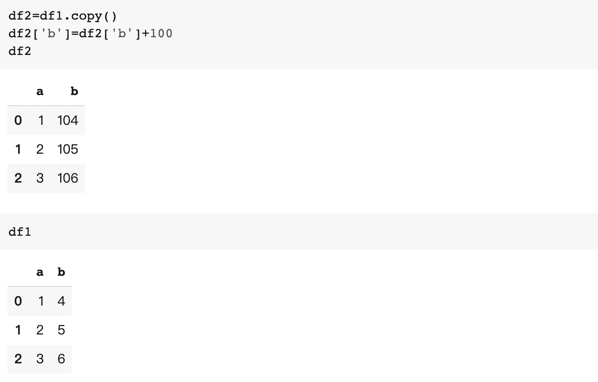

# 让我的数据分析过程更高效的 10 个熊猫窍门:第 1 部分

> 原文：<https://towardsdatascience.com/10-pandas-tricks-to-make-my-data-analyzing-process-more-efficient-part-1-78a0cc1636f3?source=collection_archive---------26----------------------->

## 我希望我早点知道的技巧


由 [Max Duzij](https://unsplash.com/@max_duz?utm_source=medium&utm_medium=referral) 在 [Unsplash](https://unsplash.com?utm_source=medium&utm_medium=referral) 上拍摄的照片

Pandas 可能是 Python 中最重要的数据分析库，它就像 Python 中的 Excel。在这篇文章中，我想分享 10 个熊猫的技巧，我希望我作为一个初学者能早点知道。

我将用我以前的文章作为例子，它讨论了新冠肺炎期间的空中交通。数据集包含 7 个独立的 cvs 文件，包含 7 个月的飞行数据。每个文件大约有 200 万行数据。你可以在这里查看原始数据集。

[](/visualization-of-air-traffic-during-covid-19-pandemic-c5941b049401) [## 新冠肺炎疫情期间空中交通的可视化

### 2020 年全球航班数据的探索性数据分析

towardsdatascience.com](/visualization-of-air-traffic-during-covid-19-pandemic-c5941b049401) 

# read_csv()

`read_csv`可能是 Pandas 中最常用的函数，它用于读取 csv 文件并创建数据帧。

```
df=pd.read_csv(path_data/'1.csv')
```

如果文件很大，可能需要一段时间来读取，所以你可以考虑先读取一小部分，用`nrows`快速浏览，然后用`df.info()`检查数据帧


默认情况下，日期时间列作为对象加载。我们可以用`parse_dates`正确读出。


如果您已经知道您需要哪些列来进行分析，您可以使用`usecols`来只读取您需要的列。


您也可以使用`dtype`自行指定数据类型。

# selectt_dtypes()

有时您需要选择具有相同数据类型的列进行分析。可以用`selectt_dtypes`。例如:


# 复制()

`copy()`在熊猫的数据分析中很重要。

假设我们有一个数据帧`df1`


我们分配一个新的数据帧`df2 = df1`，然后做一些计算


你也会发现`df1`的变化。


如果不想要，可以用`copy()`避免。



# concat()

如果你有多个数据帧，你想把它们放在一起，你可以使用`concat()`，例如:


如果你有多个大文件要处理，你也可以将`pd.concat`和`pd.read_csv`合并


它比编写循环来读取和连接多个文件更方便、更快。

# 值计数

`value_counts()`用于计算唯一值。


您可以通过设置`normalize=True`对其进行规范化


您也可以使用`bins`将连续数据转换成离散区间，从而将其用于连续数据


感谢阅读，我将在第 2 部分文章中继续其他 5 个技巧。

[](/10-pandas-tricks-to-make-my-data-analyzing-process-more-efficient-part-2-b72ea43a0bb5) [## 让我的数据分析过程更高效的 10 个熊猫窍门:第二部分

### 我希望我早点知道的技巧

towardsdatascience.com](/10-pandas-tricks-to-make-my-data-analyzing-process-more-efficient-part-2-b72ea43a0bb5) 

有兴趣也可以看看我之前关于 Python 和 Numpy 的文章。

[](/7-python-tricks-to-make-my-code-better-and-smarter-60dfde0b6c49) [## 让我的代码更好更聪明的 7 个 Python 技巧。

### 我希望我能早点知道的技巧。

towardsdatascience.com](/7-python-tricks-to-make-my-code-better-and-smarter-60dfde0b6c49) [](/7-numpy-tricks-to-make-my-code-better-and-smarter-9e8a4ccf43d1) [## 让我的代码更好更聪明的 7 个小技巧

### 我希望我早点知道的技巧

towardsdatascience.com](/7-numpy-tricks-to-make-my-code-better-and-smarter-9e8a4ccf43d1)