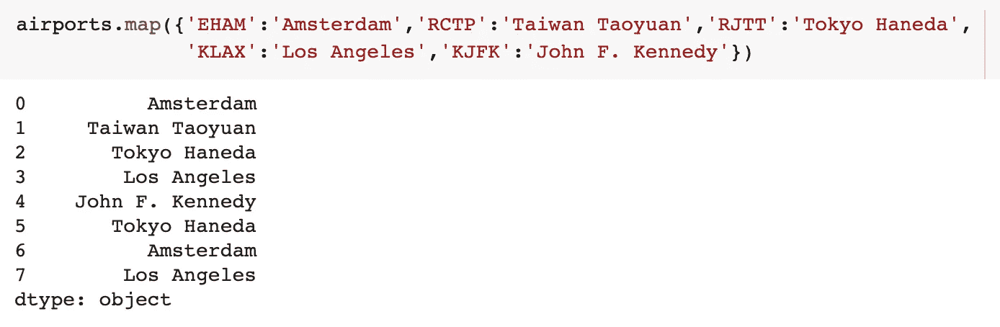
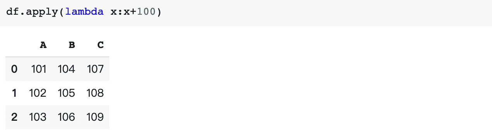

# 让我的数据分析过程更高效的 10 个熊猫窍门:第二部分

> 原文：<https://towardsdatascience.com/10-pandas-tricks-to-make-my-data-analyzing-process-more-efficient-part-2-b72ea43a0bb5?source=collection_archive---------13----------------------->

## 我希望我早点知道的技巧


由 [Max Duzij](https://unsplash.com/@max_duz?utm_source=medium&utm_medium=referral) 在 [Unsplash](https://unsplash.com?utm_source=medium&utm_medium=referral) 上拍摄的照片

**Pandas** 可能是 Python 中最重要的数据分析库，它就像 Python 中的 Excel。在这篇文章中，我想分享 10 个熊猫的技巧，我希望我作为一个初学者早点知道。你可以在这里查看文章的第一部分:

[](/10-pandas-tricks-to-make-my-data-analyzing-process-more-efficient-part-1-78a0cc1636f3) [## 让我的数据分析过程更高效的 10 个熊猫窍门:第 1 部分

### 我希望我早点知道的技巧

towardsdatascience.com](/10-pandas-tricks-to-make-my-data-analyzing-process-more-efficient-part-1-78a0cc1636f3) 

我将用我以前的文章作为例子，它探讨了新冠肺炎期间的空中交通。数据集包含 7 个独立的 cvs 文件，包含 7 个月的飞行数据。每个文件大约有 200 万行数据。你可以在这里查看原始数据集[。](https://traffic-viz.github.io/scenarios/covid19.html)

[](/visualization-of-air-traffic-during-covid-19-pandemic-c5941b049401) [## 新冠肺炎疫情期间空中交通的可视化

### 2020 年全球航班数据的探索性数据分析

towardsdatascience.com](/visualization-of-air-traffic-during-covid-19-pandemic-c5941b049401) 

# 地图

`map()`是一个有用的函数，可以用其他值替换序列中的值。

例如，如果我们有一系列机场代码名称，并且我们希望用全名来替换它们，我们可以使用`map`来完成这项工作。



`replace()`也是做这项工作的一个选择。

`map()`也可以拿功能举例:


# 应用

`apply()`是一个将函数应用于数据帧或序列的函数。

如果我们有一个数据框架:


我们可以对数据帧应用一个函数:



我们也可以通过设置`axis=0`来进行列方式的计算


并按`axis=1`行


您也可以按不同的列进行计算


# 询问

`query()`用于搜索和过滤符合您想要的特定条件的行。

例如，我们有一个包含航班信息的数据帧。


如果我们只想查看来自阿姆斯特丹的航班，可以使用`query()`进行搜索。


如果您想要搜索多个机场，您可以将它们放在一个列表中:


也可能有多个条件:


# 分组依据

`groupby()`是通过对数据分组来探索数据集的强大工具。

再以飞行数据帧为例。


我们可以使用`groupby`来查看每天的航班数量


我们可以对数字列进行一些计算，例如`mean()`(这里没有意义)


我们可以使用`agg()`对不同的列进行不同的操作:


也可以按多个组进行分组:


结合`concat()`、`query()`和`groupby()`，很容易看到不同机场每天的航班数量:


# 切割()

`cut()`用于 bin 连续值。例如，如果我有一个包含几个数字的列表。

```
df=pd.DataFrame({'A':[1,2,4,6,7,2,9,2,1,6,8,9,3,4,6,9,6,3,1,2,4,6,8]})
```

我们可以使用`cut()`来绑定这些值:


我们还可以给箱子分配标签:


可以使用`qcut()`将变量离散成大小相等的桶


就是这样。感谢阅读。欢迎评论和建议。

有兴趣可以看看我关于 Python 和 Numpy 的文章。

[](/7-python-tricks-to-make-my-code-better-and-smarter-60dfde0b6c49) [## 让我的代码更好更聪明的 7 个 Python 技巧。

### 我希望我能早点知道的技巧。

towardsdatascience.com](/7-python-tricks-to-make-my-code-better-and-smarter-60dfde0b6c49) [](/7-numpy-tricks-to-make-my-code-better-and-smarter-9e8a4ccf43d1) [## 让我的代码更好更聪明的 7 个小技巧

### 我希望我早点知道的技巧

towardsdatascience.com](/7-numpy-tricks-to-make-my-code-better-and-smarter-9e8a4ccf43d1)