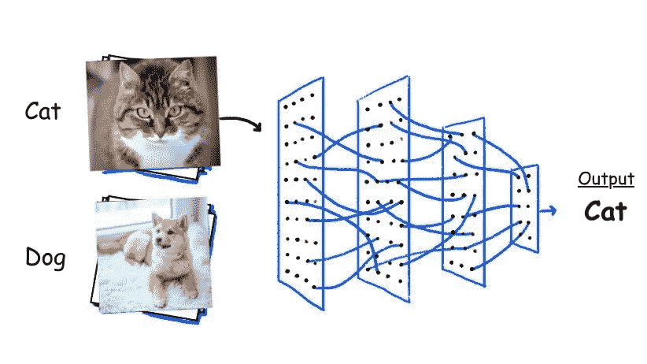
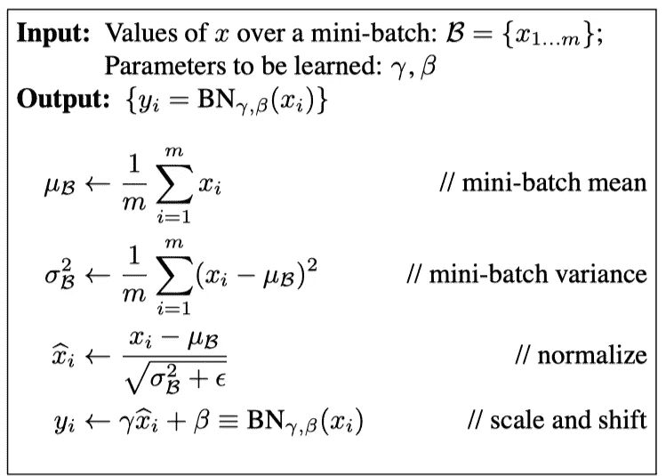
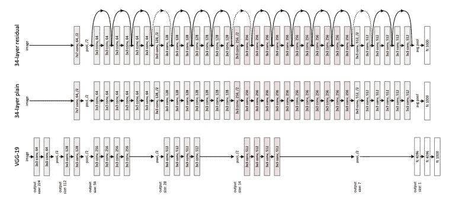
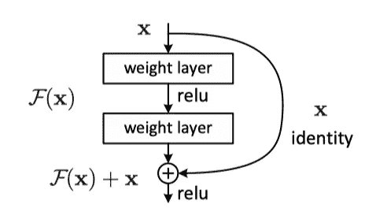
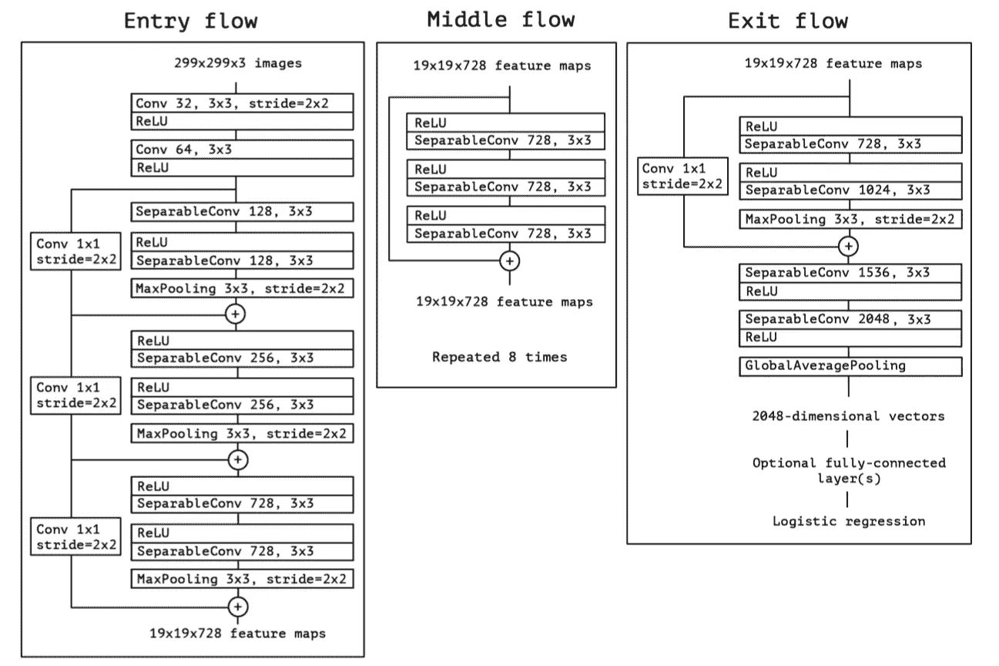
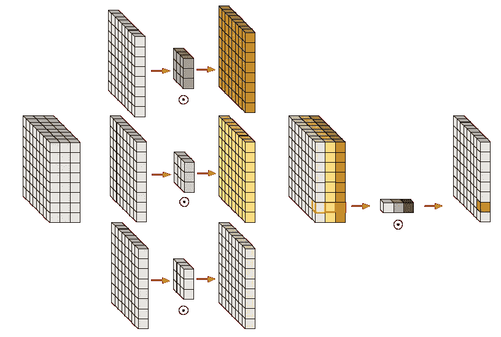
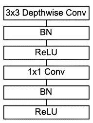
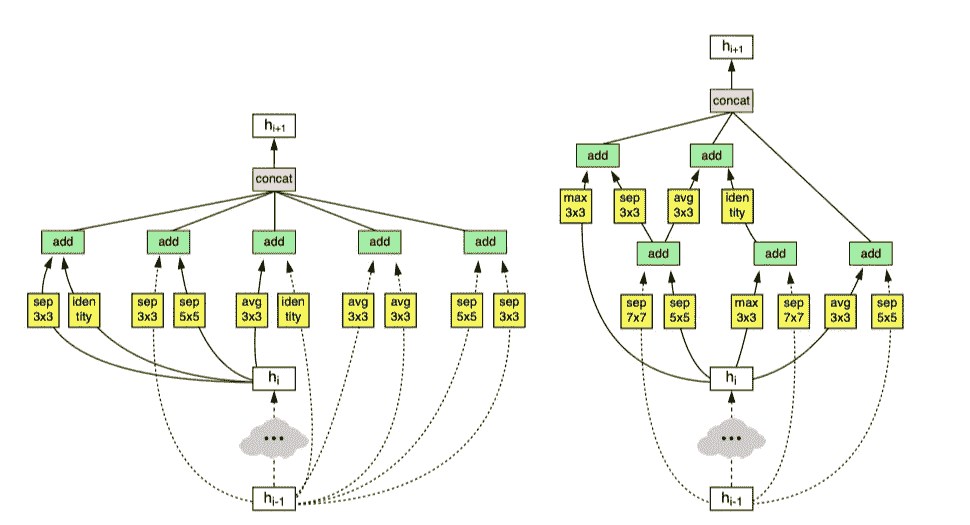
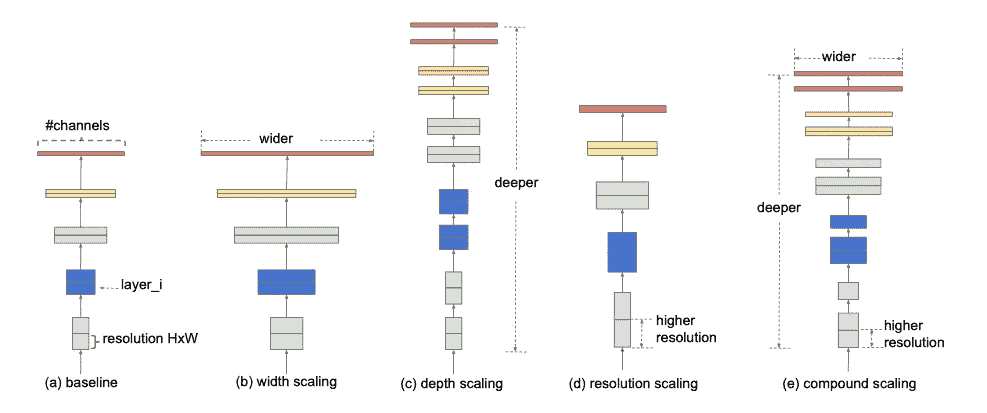

# 深度学习时代理解图像分类应该阅读的 10 篇论文

> 原文：<https://towardsdatascience.com/10-papers-you-should-read-to-understand-image-classification-in-the-deep-learning-era-4b9d792f45a7?source=collection_archive---------7----------------------->

## 快速浏览十年来图像分类的最佳论文，帮助您快速学习计算机视觉

自己画

# 序

计算机视觉是一门将图像和视频转换成机器可理解的信号的学科。通过这些信号，程序员可以基于这种高层次的理解来进一步控制机器的行为。在许多计算机视觉任务中，图像分类是最基本的任务之一。它不仅可以用于许多真实的产品，如谷歌照片的标记和人工智能内容审核，而且还为许多更高级的视觉任务打开了一扇门，如物体检测和视频理解。由于自深度学习取得突破以来，该领域的变化非常快，初学者往往会觉得太难学习了。与典型的软件工程主题不同，关于使用 DCNN 进行图像分类的优秀书籍并不多，理解这一领域的最佳方式是阅读学术论文。但是读什么报纸呢？我从哪里开始？在这篇文章中，我将介绍 10 篇适合初学者阅读的最佳论文。通过这些论文，我们可以看到这个领域是如何发展的，以及研究人员是如何在以往研究成果的基础上提出新观点的。尽管如此，即使你已经在这方面工作了一段时间，理清大局对你还是有帮助的。那么，我们开始吧。

# 1998 年:LeNet

> 基于梯度的学习在文档识别中的应用

从 [*基于梯度的学习应用到文档识别*](http://yann.lecun.com/exdb/publis/pdf/lecun-01a.pdf)

*LeNet 于 1998 年推出，为未来使用卷积神经网络进行图像分类研究奠定了基础。许多经典的 CNN 技术，例如池层、全连接层、填充和激活层，被用于提取特征和进行分类。通过均方误差损失函数和 20 个历元的训练，该网络在 MNIST 测试集上可以达到 99.05%的准确率。即使在 20 年后，许多最先进的分类网络总体上仍然遵循这种模式。*

# *2012 年:AlexNet*

> *基于深度卷积神经网络的图像网分类*

**

*来自[*【ImageNet】用深度卷积神经网络分类*](https://papers.nips.cc/paper/4824-imagenet-classification-with-deep-convolutional-neural-networks.pdf)*

**虽然 LeNet 取得了很大的成绩，显示了 CNN 的潜力，但由于计算能力和数据量的限制，这方面的发展停滞了十年。看起来 CNN 只能解决一些简单的任务，如数字识别，但对于更复杂的特征，如人脸和物体，带有 SVM 分类器的 HarrCascade 或 SIFT 特征提取器是更受欢迎的方法。**

**然而，在 2012 年 ImageNet 大规模视觉识别挑战赛中，Alex Krizhevsky 提出了一种基于 CNN 的解决方案，并将 ImageNet 测试集 top-5 的准确率从 73.8%大幅提高到 84.7%。他们的方法继承了 LeNet 的多层 CNN 的思想，但是大大增加了 CNN 的规模。从上图中可以看出，与 LeNet 的 32x32 相比，输入现在是 224x224，而且许多卷积核有 192 个通道，而 LeNet 的通道是 6 个。虽然设计没有太大变化，但参数增加了数百倍，网络捕捉和表示复杂特征的能力也提高了数百倍。为了训练这样一个大模型，Alex 使用了两个 GTX 580 GPU，每个 3GB RAM，这开创了 GPU 训练的趋势。此外，ReLU 非线性的使用也有助于降低计算成本。**

**除了为网络带来更多的参数之外，它还通过使用丢弃层来探索由更大的网络带来的过拟合问题。它的局部响应归一化方法后来没有得到太多的欢迎，但启发了其他重要的归一化技术，如 BatchNorm，以解决梯度饱和问题。综上所述，AlexNet 为未来 10 年定义了事实上的分类网络框架:卷积、ReLu 非线性激活、MaxPooling 和密集层的组合。**

# **2014 年:VGG**

> **用于大规模图像识别的超深度卷积网络**

****

**来自 Quora "[https://www.quora.com/What-is-the-VGG-neural-network](https://www.quora.com/What-is-the-VGG-neural-network)**

**随着使用 CNN 进行视觉识别取得如此巨大的成功，整个研究界都炸开了锅，所有人都开始研究为什么这个神经网络工作得这么好。例如，在 2013 年的“可视化和理解卷积网络”中，马修·泽勒讨论了 CNN 如何提取特征并可视化中间表示。突然，从 2014 年开始，每个人都开始意识到 CNN 是计算机视觉的未来。在这些直接追随者中，来自视觉几何小组的 VGG 网络是最引人注目的一个。在 ImageNet 测试集上取得了 93.2%的前 5 名准确率和 76.3%的前 1 名准确率。**

**遵循 AlexNet 的设计，VGG 网络有两个主要的更新:1) VGG 不仅使用了像 AlexNet 更广泛的网络，而且更深入。VGG-19 有 19 个卷积层，而 AlexNet 只有 5 个。2) VGG 还证明了一些小的 3×3 卷积滤波器可以取代 AlexNet 的单个 7×7 甚至 11×11 滤波器，实现更好的性能，同时降低计算成本。由于这种优雅的设计，VGG 也成为了其他计算机视觉任务中许多开创性网络的主干网络，例如用于语义分割的 FCN，以及用于对象检测的更快的 R-CNN。**

**对于更深的网络，多层反向传播的梯度消失成为更大的问题。为了解决这个问题，VGG 还讨论了预训练和重量初始化的重要性。这个问题限制了研究人员不断增加更多的层，否则，网络将真的很难收敛。但是两年后我们会看到更好的解决方案。**

# **2014 年:谷歌网**

> **用回旋更深入**

****

**从 [*到*](https://arxiv.org/abs/1409.4842)**

***VGG 有一个好看且易于理解的结构，但它的表现在 ImageNet 2014 竞赛的所有决赛选手中并不是最好的。GoogLeNet，又名 InceptionV1，最终获奖。就像 VGG 一样，GoogLeNet 的主要贡献之一是用 22 层结构推动了网络深度的极限。这再次证明了更深更广的确是提高精度的正确方向。***

***与 VGG 不同，GoogLeNet 试图正面解决计算和梯度递减问题，而不是提出一个更好的预训练模式和权重初始化的解决方案。***

******

***瓶颈初始模块从 [*到*](https://arxiv.org/abs/1409.4842)***

***首先，它通过使用一个名为 Inception 的模块探索了非对称网络设计的思想(见上图)。理想情况下，他们会追求稀疏卷积或密集层，以提高功能效率，但现代硬件设计并不适合这种情况。因此，他们认为网络拓扑级别的稀疏性也有助于功能的融合，同时利用现有的硬件能力。***

***第二，它通过借用一篇名为《网络中的网络》的论文中的思想来解决高计算成本问题。基本上，在进行像 5×5 卷积核这样的繁重计算操作之前，引入 1×1 卷积滤波器来降低特征的维度。这种结构后来被称为“瓶颈”，并广泛应用于许多后续网络中。与“网络中的网络”类似，它也使用了一个平均池层来取代最终的全连接层，以进一步降低成本。***

***第三，为了帮助梯度流向更深的层，GoogLeNet 还对一些中间层输出或辅助输出进行了监督。由于复杂性，这种设计后来在图像分类网络中不太流行，但在计算机视觉的其他领域越来越流行，如姿态估计中的沙漏网络。***

***作为后续，这个谷歌团队为这个盗梦空间系列写了更多的论文。“批量标准化:通过减少内部协变量偏移来加速深度网络训练”代表 InceptionV2。2015 年的“重新思考计算机视觉的初始架构”代表 InceptionV3。而 2015 年的“Inception-v4，Inception-ResNet 以及剩余连接对学习的影响”代表 InceptionV4。每篇论文都在初始网络的基础上增加了更多的改进，并取得了更好的结果。***

# ***2015:批量正常化***

> ***批量标准化:通过减少内部协变量转移加速深度网络训练***

***inception 网络帮助研究人员在 ImageNet 数据集上达到了超人的精确度。然而，作为一种统计学习方法，CNN 很大程度上受限于特定训练数据集的统计性质。因此，为了实现更好的准确性，我们通常需要预先计算整个数据集的平均值和标准差，并首先使用它们来归一化我们的输入，以确保网络中的大多数图层输入是接近的，这转化为更好的激活响应。这种近似方法非常麻烦，有时对于新的网络结构或新的数据集根本不起作用，因此深度学习模型仍然被视为难以训练。为了解决这个问题，Sergey Ioffe 和 Chritian Szegedy(Google net 的创始人)决定发明一种更智能的东西，叫做批处理规范化。***

******

***从 [*批量归一化:通过减少内部协变量加速深度网络训练*](https://arxiv.org/abs/1502.03167)***

***批量标准化的想法并不难:我们可以使用一系列小批量的统计数据来近似整个数据集的统计数据，只要我们训练足够长的时间。此外，除了手动计算统计数据，我们还可以引入两个可学习的参数“scale”和“shift ”,让网络学习如何自行标准化每一层。***

***上图显示了计算批量标准化值的过程。如我们所见，我们取整个小批量的平均值，并计算方差。接下来，我们可以用这个小批量平均值和方差来标准化输入。最后，利用一个比例和一个偏移参数，网络将学习调整批量归一化结果，以最佳地适应随后的层，通常是 ReLU。一个警告是，我们在推断过程中没有小批量信息，因此一个变通方法是在训练过程中计算移动平均值和方差，然后在推断路径中使用这些移动平均值。这个小小的创新如此具有冲击力，所有后来的网络都马上开始使用它。***

# ***2015 年:ResNet***

> ***用于图像识别的深度残差学习***

***2015 年可能是十年来计算机视觉最好的一年，我们已经看到许多伟大的想法不仅出现在图像分类领域，还出现在各种计算机视觉任务中，如对象检测、语义分割等。2015 年最大的进步属于一个名为 ResNet 的新网络，即残余网络，由微软亚洲研究院的一群中国研究人员提出。***

******

***从 [*深度残差学习进行图像识别*](https://arxiv.org/abs/1512.03385)***

***正如我们之前对 VGG 网络所讨论的，变得更深的最大障碍是梯度消失问题，即，当通过更深的层反向传播时，导数变得越来越小，最终达到现代计算机架构无法真正有意义地表示的点。GoogLeNet 试图通过使用辅助监督和不对称启动模块来解决这一问题，但这只是在很小程度上缓解了问题。如果要用 50 层甚至 100 层，会不会有更好的方式让渐变流过网络？ResNet 给出的答案是使用剩余模块。***

******

***残差模块来自***

***ResNet 在输出中增加了一个身份快捷方式，这样每个剩余模块至少不能预测输入是什么，而不会迷失在野外。更重要的是，残差模块试图学习输出和输入之间的差异，而不是希望每一层都直接适合所需的特征映射，这使得任务更容易，因为所需的信息增益更少。想象一下，你正在学习数学，对于每一个新问题，你都有一个类似问题的解决方案，所以你需要做的就是扩展这个解决方案，并试图让它发挥作用。这比为你遇到的每个问题想一个全新的解决方案要容易得多。或者像牛顿说的，我们可以站在巨人的肩膀上，身份输入就是那个巨人对于剩余模。***

***除了身份映射，ResNet 还借鉴了 Inception networks 的瓶颈和批量规范化。最终，它成功地建立了一个具有 152 个卷积层的网络，并在 ImageNet 上取得了 80.72%的顶级准确率。剩余法也成为后来很多其他网络的默认选项，比如 Xception、Darknet 等。此外，由于其简单美观的设计，它仍然广泛应用于当今许多生产视觉识别系统。***

***随着剩余网络的出现，出现了更多的不变量。在《深度剩余网络中的身份映射》中，ResNet 的原作者尝试将激活放在剩余模块之前，取得了较好的效果，这个设计后来被称为 ResNetV2。此外，在 2016 年的一篇论文“深度神经网络的聚合残差变换”中，研究人员提出了 ResNeXt，它为残差模块添加了并行分支，以聚合不同变换的输出。***

# ***2016 年:例外***

> ***例外:深度可分卷积深度学习***

******

***从" [*例外:深度可分卷积深度学习*](https://arxiv.org/abs/1610.02357) "***

**随着 ResNet 的发布，看起来图像分类器中大多数唾手可得的果实都已经到手了。研究人员开始思考 CNN 魔力的内在机制是什么。由于跨通道卷积通常会引入大量参数，因此 Xception network 选择研究这种操作，以全面了解其效果。**

**就像它的名字一样，Xception 起源于盗梦空间网络。在初始模块中，不同转换的多个分支被聚集在一起以实现拓扑稀疏性。但是为什么这种稀疏有效呢？Xception 的作者，也是 Keras 框架的作者，将这一思想扩展到了一个极端的情况，即一个 3x3 卷积文件对应于最终连接之前的一个输出通道。在这种情况下，这些并行卷积核实际上形成了一种新的操作，称为深度卷积。**

****

**从"[深度方向卷积和深度方向可分离卷积](https://medium.com/@zurister/depth-wise-convolution-and-depth-wise-separable-convolution-37346565d4ec)**

**如上图所示，与传统卷积不同，传统卷积将所有通道包括在一次计算中，深度卷积仅单独计算每个通道的卷积，然后将输出连接在一起。这减少了通道之间的特征交换，但也减少了许多连接，因此产生了具有较少参数的层。但是，此操作将输出与输入相同数量的通道(如果将两个或更多通道组合在一起，则输出的通道数量会更少)。因此，一旦通道输出合并，我们需要另一个常规的 1x1 滤波器或逐点卷积来增加或减少通道数量，就像常规卷积一样。**

**这种想法原本并不奇怪。这在一篇名为“大规模学习视觉表现”的论文中有所描述，在 InceptionV2 中偶尔也会用到。Xception 更进一步，用这种新类型替换了几乎所有的卷积。实验结果证明效果很好。它超越了 ResNet 和 InceptionV3，成为一种新的 SOTA 图像分类方法。这也证明了 CNN 中跨通道相关性和空间相关性的映射可以完全解耦。此外，Xception 与 ResNet 具有相同的优点，设计简洁美观，因此它的思想被用于其他后续研究中，如 MobileNet、DeepLabV3 等。**

# **2017 年:移动互联网**

> **MobileNets:用于移动视觉应用的高效卷积神经网络**

**Xception 在 ImageNet 上实现了 79%的前 1 名准确率和 94.5%的前 5 名准确率，但与之前的 SOTA inceptions 3 相比，这两个准确率分别只提高了 0.8%和 0.4%。新的图像分类网络的边际收益越来越小，因此研究人员开始将注意力转移到其他领域。MobileNet 在资源受限的环境中极大地推动了图像分类。**

****

**“MobileNets:用于移动视觉应用的高效卷积神经网络”中的 MobileNet 模块**

**与 Xception 类似，MobileNet 使用了如上所示的深度方向可分离卷积模块，并强调了高效率和更少的参数。**

****

**“MobileNets:用于移动视觉应用的高效卷积神经网络”中的参数比**

**上述公式中的分子是深度方向可分离卷积所需的参数总数。分母是相似正则卷积的参数总数。这里 D[K]是卷积核的大小，D[F]是特征图的大小，M 是输入通道的数量，N 是输出通道的数量。由于我们将通道和空间特征的计算分开，所以我们可以将乘法转化为加法，这是一个较小的量级。更好的是，从这个比值可以看出，输出通道的数量越大，使用这个新的卷积可以节省越多的计算量。**

**MobileNet 的另一个贡献是宽度和分辨率倍增。MobileNet 团队希望找到一种规范的方法来缩小移动设备的模型大小，而最直观的方法是减少输入和输出通道的数量，以及输入图像的分辨率。为了控制这种行为，比率 alpha 与通道相乘，比率 rho 与输入分辨率相乘(这也会影响要素地图的大小)。因此，参数的总数可以用下面的公式表示:**

****

**“MobileNets:用于移动视觉应用的高效卷积神经网络”**

**虽然这种变化在创新方面看起来很幼稚，但它具有巨大的工程价值，因为这是研究人员第一次总结出一种规范的方法来调整网络以适应不同的资源约束。此外，它还总结了改进神经网络的最终解决方案:更宽和高分辨率的输入导致更好的精度，更薄和低分辨率的输入导致更差的精度。**

**随后在 2018 年和 2019 年，MobiletNet 团队还发布了《MobileNetV2:反向残差和线性瓶颈》和《寻找 MobileNetV3》。在 MobileNetV2 中，使用了一种反向剩余瓶颈结构。在 MobileNetV3 中，它开始使用神经架构搜索技术搜索最佳架构组合，我们将在接下来介绍这一点。**

# **2017 年:纳斯网**

> **用于可伸缩图像识别的学习可转移架构**

**就像针对资源受限环境的图像分类一样，神经架构搜索是 2017 年左右出现的另一个领域。通过 ResNet、Inception 和 Xception，我们似乎达到了人类可以理解和设计的最佳网络拓扑，但如果有更好、更复杂的组合，远远超出人类的想象，会怎么样呢？2016 年一篇名为《具有强化学习的神经架构搜索》的论文提出了一种思想，利用强化学习在预定义的搜索空间内搜索最优组合。众所周知，强化学习是一种为搜索主体寻找目标明确、回报丰厚的最优解的方法。然而，受计算能力的限制，本文只讨论了在一个小的 CIFAR 数据集上的应用。**

****

**NASNet 搜索空间。" [*学习可扩展图像识别的可转移架构*](https://arxiv.org/abs/1707.07012) "**

**为了找到像 ImageNet 这样的大型数据集的最佳结构，NASNet 创建了一个为 ImageNet 量身定制的搜索空间。它希望设计一个特殊的搜索空间，这样在 CIFAR 上的搜索结果也可以在 ImageNet 上很好地工作。首先，NASNet 假设 ResNet 和 Xception 等优秀网络中常见手工制作的模块在搜索时仍然有用。所以 NASNet 不是搜索随机的连接和操作，而是搜索 ImageNet 上已经被证明有用的这些模块的组合。第二，实际搜索仍然是在分辨率为 32x32 的 CIFAR 数据集上执行的，因此 NASNet 只搜索不受输入大小影响的模块。为了使第二点起作用，NASNet 预定义了两种类型的模块模板:Reduction 和 Normal。与输入相比，归约像元可能具有归约的特征图，而对于正常像元，情况也是如此。**

****

**从" [*学习可扩展图像识别的可转换架构*](https://arxiv.org/abs/1707.07012) "**

**尽管 NASNet 比手工设计的网络有更好的度量，但它也有一些缺点。寻找最佳结构的成本非常高，只有像谷歌和脸书这样的大公司才能负担得起。此外，最终的结构对人来说没有太大的意义，因此在生产环境中更难维护和改进。2018 年晚些时候，“MnasNet:移动平台感知神经架构搜索”通过用预定义的链式块结构限制搜索步骤，进一步扩展了 nasNet 的想法。此外，通过定义权重因子，mNASNet 给出了一种更系统的方法来搜索给定特定资源约束的模型，而不仅仅是基于 FLOPs 进行评估。**

# **2019 年:效率网**

> **EfficientNet:重新思考卷积神经网络的模型缩放**

**2019 年，CNN 的监督图像分类似乎不再有令人兴奋的想法。网络结构的剧烈变化通常只会带来很小的精度提高。更糟糕的是，当相同的网络应用于不同的数据集和任务时，之前声称的技巧似乎不起作用，这导致了对这些改进是否只是在 ImageNet 数据集上过度拟合的批评。另一方面，有一个技巧永远不会辜负我们的期望:使用更高分辨率的输入，为卷积层添加更多的通道，并添加更多的层。虽然非常残酷，但似乎有一种原则性的方法可以按需扩展网络。MobileNetV1 在 2017 年提出了这一点，但后来重点转移到了更好的网络设计上。**

****

**摘自"[*" efficient net:反思卷积神经网络的模型缩放*](https://arxiv.org/abs/1905.11946) *"***

**在 NASNet 和 mNASNet 之后，研究人员意识到，即使有计算机的帮助，架构的改变也不会产生那么大的好处。所以他们开始退回到扩展网络。EfficientNet 就是建立在这个假设之上的。一方面，它使用 mNASNet 的最佳构建块来确保良好的基础。另一方面，它定义了三个参数α、β和ρ来相应地控制网络的深度、宽度和分辨率。通过这样做，即使没有大型 GPU 池来搜索最佳结构，工程师仍然可以根据他们不同的要求，依靠这些原则参数来调整网络。最后，EfficientNet 给出了 8 个不同的变体，它们具有不同的宽度、深度和分辨率，并且对于小型和大型模型都获得了良好的性能。换句话说，如果你想要高精度，请使用 600x600 和 66M 参数的高效 B7 网络。如果您想要低延迟和较小的型号，请选择 224x224 和 5.3M 参数 EfficientNet-B0。问题解决了。**

# **阅读更多**

**如果你读完了以上 10 篇论文，你应该对 CNN 图像分类的历史有了很好的了解。如果你喜欢继续学习这个领域，我还列出了一些其他有趣的论文来阅读。虽然没有被列入前十名，但这些论文在各自领域都很有名，并激励了世界上许多其他研究人员。**

## **2014 年:SPPNet**

> **用于视觉识别的深度卷积网络中的空间金字塔池**

**SPPNet 借鉴了传统计算机视觉特征提取中特征金字塔的思想。这个金字塔形成了一个不同尺度的特征词包，因此可以适应不同的输入大小，摆脱了固定大小的全连通层。这个想法也进一步启发了 DeepLab 的 ASPP 模块，以及用于对象检测的 FPN。**

## **2016 年:DenseNet**

> **密集连接的卷积网络**

**康奈尔大学的 DenseNet 进一步扩展了 ResNet 的想法。它不仅提供层之间的跳过连接，而且具有来自所有先前层的跳过连接。**

## **2017 年:SENet**

> **压缩和激励网络**

**例外网络证明了跨通道相关性与空间相关性没有太大关系。然而，作为上届 ImageNet 比赛的冠军，SENet 设计了一个挤压和激励块，并讲述了一个不同的故事。SE 块首先使用全局池将所有通道压缩为更少的通道，应用完全连接的变换，然后使用另一个完全连接的层将它们“激发”回原始数量的通道。所以本质上，FC 层帮助网络学习输入特征图上的注意力。**

## **2017 年:ShuffleNet**

> **ShuffleNet:一个用于移动设备的非常有效的卷积神经网络**

**ShuffleNet 建立在 MobileNetV2 的反向瓶颈模块之上，它认为深度方向可分离卷积中的点方向卷积牺牲了精度，换取了更少的计算。为了弥补这一点，ShuffleNet 增加了一个额外的频道洗牌操作，以确保逐点卷积不会总是应用于同一个“点”。在 ShuffleNetV2 中，这种信道混洗机制还进一步扩展到了 ResNet 身份映射分支，因此身份特征的一部分也将用于混洗。**

## **2018:锦囊妙计**

> **卷积神经网络用于图像分类的技巧包**

**锦囊妙计集中在图像分类领域使用的常见技巧。当工程师需要提高基准性能时，它是一个很好的参考。有趣的是，这些技巧，如混合增强和余弦学习率，有时可以实现比新的网络架构更好的改进。**

# **结论**

**随着 EfficientNet 的发布，ImageNet 分类基准似乎走到了尽头。利用现有的深度学习方法，除非发生另一次范式转变，否则我们永远不会有一天能够在 ImageNet 上达到 99.999%的准确率。因此，研究人员正在积极寻找一些新的领域，如大规模视觉识别的自监督或半监督学习。与此同时，对于工程师和企业家来说，使用现有的方法找到这种不完美技术的实际应用变得更加困难。未来我还会写一份调查，分析那些以图像分类为动力的现实世界计算机视觉应用，敬请期待！如果你认为还有其他重要的论文可以阅读，请在下面留下评论，让我们知道。**

***原载于*[*http://yanjia . Li*](https://yanjia.li/10-papers-you-should-read-to-understand-image-classification-in-the-deep-learning-era/)*2020 年 7 月 31 日***

# **参考**

*   **Y.Lecun，L. Bottou，Y. Bengio，P. Haffner， [*基于梯度的学习应用于文档识别*](http://yann.lecun.com/exdb/publis/pdf/lecun-01a.pdf)**
*   **Alex Krizhevsky，Ilya Sutskever，Geoffrey E. Hinton， [*使用深度卷积神经网络的 ImageNet 分类*](https://papers.nips.cc/paper/4824-imagenet-classification-with-deep-convolutional-neural-networks.pdf)**
*   **卡伦·西蒙扬，安德鲁·齐泽曼， [*用于大规模图像识别的极深度卷积网络*](https://arxiv.org/abs/1409.1556)**
*   **克里斯蒂安·塞格迪、、贾、皮埃尔·塞尔马内、斯科特·里德、德拉戈米尔·安古洛夫、杜米特鲁·尔汉、文森特·万霍克、安德鲁·拉宾诺维奇、**
*   ***Sergey Ioffe，Christian Szegedy， [*批量归一化:通过减少内部协变量移位加速深度网络训练*](https://arxiv.org/abs/1502.03167)***
*   ***何、、、、、、 [*用于图像识别的深度残差学习*](https://arxiv.org/abs/1512.03385)***
*   ***Franç ois Chollet， [*例外:深度可分卷积深度学习*](https://arxiv.org/abs/1610.02357)***
*   ***Andrew G. Howard，Menglong Zhu，，Dmitry Kalenichenko，，Tobias Weyand，Marco Andreetto，Hartwig Adam， [*MobileNets:用于移动视觉应用的高效卷积神经网络*](https://arxiv.org/abs/1704.04861)***
*   ***巴雷特·佐夫，维贾伊·瓦苏德万，黄邦贤·施伦斯，阔克诉勒， [*学习用于可伸缩图像识别的可转移架构*](https://arxiv.org/abs/1707.07012)***
*   ***谭明兴，郭诉乐， [*EfficientNet:卷积神经网络模型缩放的再思考*](https://arxiv.org/abs/1905.11946)***
*   ***何、、、、、， [*空间金字塔池深度卷积网络用于视觉识别*](https://arxiv.org/abs/1406.4729)***
*   ***黄高，刘庄，劳伦斯·范·德·马腾，基利安·q·温伯格，***
*   ****、沈李、萨缪尔·阿尔巴尼、、吴，[压缩-激发网络](https://arxiv.org/abs/1709.01507)****
*   ****、林、、、 [ShuffleNet:一种用于移动设备的极其高效的卷积神经网络](https://arxiv.org/abs/1707.01083)****
*   ****佟鹤，，张航，，，谢，[卷积神经网络用于图像分类的锦囊妙计](https://arxiv.org/abs/1812.01187)****