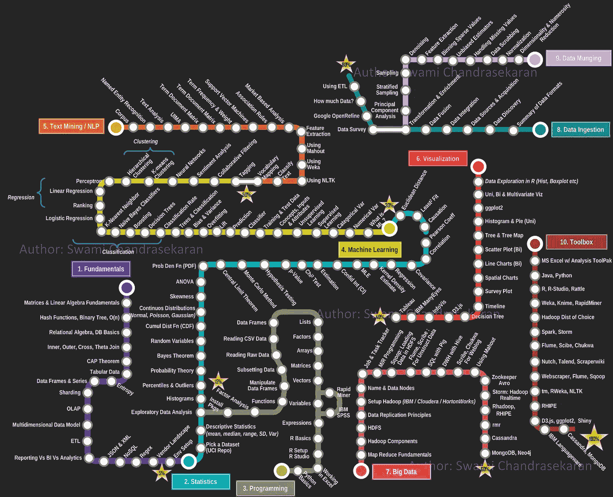

# Github 上的 10 个流行数据科学资源

> 原文：<https://towardsdatascience.com/10-popular-data-science-resources-on-github-7ae288ff4a75?source=collection_archive---------22----------------------->

## 一些顶级的 GitHub 库将教你所有关于数据科学的知识

照片由 [Richy Great](https://unsplash.com/@richygreat?utm_source=unsplash&utm_medium=referral&utm_content=creditCopyText) 在 [Unsplash](https://unsplash.com/?utm_source=unsplash&utm_medium=referral&utm_content=creditCopyText) 上拍摄

> 数据科学领域带来了各种科学工具、流程、算法和从结构化和非结构化数据中提取知识的系统，用于识别其中有意义的模式。

**数据科学**正在成为本世纪**最重要的技术**之一。个人和企业惊讶地看到 [**数据科学在众多领域**](/data-science-trends-for-2020-9b2ee27af499) 中的能力，例如**教育、医疗保健、研究、信息技术**等等。如果你也渴望学习数据科学，互联网上有很多资源会对你有用。

GitHub 就是这样一个令人惊叹的平台，一个所有软件工程师都聚集的社区。这篇文章背后的目标是让你从我们为你收集的**最流行和顶级的 Github 库**开始尽可能多地学习数据科学。请继续阅读！

> 数据科学是让数据变得有用的学科

 [## 面向入门级和中级人员的顶级数据科学面试问题和答案

### 了解数据科学访谈中的最新问题趋势

towardsdatascience.com](/top-data-science-interview-questions-and-answers-for-entry-level-and-mid-level-folks-ce81ad8fa9bb) 

# Github 上的数据科学资源

称 GitHub 仅仅是一个代码库和协作平台是不公平的，因为它远不止于此。知道 GitHub 的人不多，但是 GitHub 也是最好的地方之一，可以了解大量使用各种编程语言****构建的项目，这些语言现在可以用于各种现代用例。在本节中，我们列出了 10 个顶级 GitHub 存储库，它们将教会你所有关于数据科学的知识。****

# ****1.**数据科学 iPython 笔记本******

******星星:** 19.7k****

******分叉者:** 6.3k****

******涵盖的主题:**深度学习、scikit-learn、Kaggle、大数据、Python 库、Python essentials、AWS 等等。****

******作者:**多恩·马丁****

******GitHub 链接:**[https://GitHub . com/donne Martin/data-science-ipython-notebooks](https://github.com/donnemartin/data-science-ipython-notebooks)****

****来自**脸书**的技术负责人 Donne Martin 的**数据科学 IPython 笔记本** repo 涵盖了广泛的热门主题和技术工具，如**大数据、** [**机器学习**](https://blog.digitalogy.co/best-and-free-online-machine-learning-courses/) **、业务分析、Python 基础知识以及一些命令行实用程序**、 [TensorFlow](https://www.tensorflow.org/) 、 [Keras](https://keras.io/) 、[熊猫【等](https://pandas.pydata.org/)****

****每本 IPython 笔记本都包含关于**基础、实现、有用提示的深入信息，以及一些与主题相关的有用练习**。其中一些甚至涵盖了更有经验的专业人士的高级主题。我们建议查看回购协议，了解所涉及工具的完整列表。****

**** [## 2020 年必读的 Python 书籍

### 看看吧，你为什么要读它们？

towardsdatascience.com](/python-books-you-must-read-in-2020-a0fc33798bb)  [## GitHub 上十大热门 Python 项目

### 像这样的 GitHub 项目是人们创造力和才华的完美展示

towardsdatascience.com](/top-10-trending-python-projects-on-github-fb852cd58262) 

# 2.**开源数据科学大师**

**星星:** 16.3k

**分叉者:** 5.6k

**涵盖的主题:**数据分析，Python，R

**作者:**克莱尔·科特尔

**GitHub 链接:**[https://github.com/datasciencemasters/go](https://github.com/datasciencemasters/go)

**由** **数据科学家 Clare Corthell，**Luminant 数据科学咨询的**创始合伙人之一创建，开源数据科学硕士是一门学习数据科学的开源课程。本课程的源材料本质上是基础性的，面向步入数据科学世界的初学者。**

> 整个课程分为三个部分，包括来自华盛顿大学的介绍性视频、来自哈佛大学的视频和课程材料，以及一本基于数据科学和开源工具的书。

该报告涵盖了基于 Python 的[数据科学的一些介绍性主题，如关系代数、统计、图形、可视化、数据争论技术、数据管理、回归、分类和预测分析等等。](/best-python-libraries-for-machine-learning-and-deep-learning-b0bd40c7e8c)

熟悉 R 的个人不会被排除在外，因为课程也提供 R 资源。

 [## 2020 年数据可视化 10 大 R 库

### 可视化在数据科学中扮演着重要的角色，因为它们有能力表示…

blog.digitalogy.co](https://blog.digitalogy.co/top-r-libraries-for-data-visualization/) 

# 3.**牛逼的数据科学**

**星星:** 14.4k

**分叉者:** 4.1k

**涵盖的主题:**什么是数据科学**，**为什么数据科学，数据集数据科学学院，MOOCs，数据集，播客和博客，书籍，时事通讯。

**作者:**法蒂赫·阿克蒂尔克，侯赛因·梅尔特&奥斯曼·温古尔，雷杰普·埃罗尔

**GitHub 链接:**https://github.com/academic/awesome-datascience

发烧友法提赫·阿克图尔克、胡塞因·梅尔特、雷杰普·埃罗尔和奥斯曼·温古尔是这个令人敬畏的数据科学报告的创造者，该报告专门针对数据科学领域的新手。 **repo 使用 Python** ,由大量资源组成，这些资源分为几个部分，以便于浏览:

●信息图表

●教授数据科学的大学

●海量在线开放课程列表

●用于实践的样本数据集

●数据科学博客作者及其博客列表

●时事通讯、期刊、出版物和杂志

●数据科学播客

●书籍

●各种以数据科学为中心的工具列表

●可视化工具

●少量教程

●以及其他类似超赞系列的链接

# 4.**数据科学家路线图**

**星星:** 3.2k

**分叉者:** 914

**By:** MrMimic

**GitHub 链接:**【https://github.com/MrMimic/data-scientist-roadmap 

**MrMimic 的 repo** 提供了各种关键领域的全面覆盖，以及一系列常用的工作工具，这是精通数据科学所必需的。

这份极有价值的数据科学家路线图归功于 Swami Chandrasekaran ，**毕马威(KPMG)的总经理和前 IBM 工程师**，他在他的信息图中精心展示了数据科学家必须具备的技能。

**地铁地图将每个主题列为一个区域/领域**，而**车站代表你必须完成该区域的主题**。为了方便起见，域根据难度进行编号，**从 1 到 10。**

Swami Chandrasekaran 的数据科学技能路线图

# 5.斯坦福 Tensorflow 教程

**星星:** 9.7k

**分叉者:** 4.4k

**By:** 芯片呼延

**GitHub 链接:**https://github.com/chiphuyen/stanford-tensorflow-tutorials

**由斯坦福大学讲师 Chip Huyen** 创建，回购是斯坦福大学名为 tensor flow for Deep Learning Research 的课程的**部分，包含该课程的代码示例。本报告的内容分为作业和范例，同时还包括课程中使用的工具清单。**

代码示例**涵盖了使用 TensorFlow 的各种任务**，**如建模、简单线性和逻辑回归、卷积网络、递归神经网络**。学生可以公开使用这个回购，从斯坦福大学最优秀的头脑之一那里了解上述数据科学主题**。**

# 6.数据科学博客

**星星:** 5.3k

**分叉者:** 1.6k

**涵盖主题:**数据科学博客列表

**作者:** Artem Golubin

**GitHub 链接:**[https://github.com/rushter/data-science-blogs](https://github.com/rushter/data-science-blogs)

**由 Artem Golubin 创建，**数据科学博客 repo 充满了互联网上一些**信息量最大、写得最好、免费的数据科学博客**的链接。收集的内容包括许多知名数据科学从业者、处于创新前沿的企业(如亚马逊)和各种其他网站**如**[**KD nuggets**](https://www.kdnuggets.com/)**的深刻见解。**

此回购中列出的博客涵盖了广泛的主题，包括该行业中具有不同技能和经验水平的人的最新动态。如果你使用 RSS 阅读器，你不会失望，因为 repo 中的大多数链接都是 RSS 友好的。

 [## 2020 年最佳数据科学博客

### 最值得信赖和享有盛誉的来源，让您了解数据科学领域的最新动态。

towardsdatascience.com](/best-data-science-blogs-to-follow-in-2020-d03044169eb4) 

# 7.**数据科学资源**

**星星:** 2k

**分叉者:** 995

**涵盖的主题:**数据科学工具、博客、演示、教程、课程等等。

作者:乔纳森·鲍尔

**GitHub 链接:**https://github.com/jonathan-bower/DataScienceResources

回购最初是由乔纳森·布鲁尔创建的，作为他获得的所有最好和高质量数据科学资源的一站式来源。通过看到其他人的兴趣，乔纳森公开了回购给每个人。

Jonathan 包含的不仅仅是数据科学中涉及的技术组件。他的 repo 是帮助识别和理解现实世界中涉及的最佳数据科学实践以及它如何解决行业中的实际问题的资源的家园。如果你想深入了解公开的数据科学的实际实施和好处，以及它为你开辟的职业道路，这份报告会非常有帮助。

 [## 2020 年必读的数据科学书籍

### 看看吧，你为什么要读它们？

towardsdatascience.com](/data-science-books-you-must-read-in-2020-1f30daace1cb) 

# 8.**数据科学最佳资源**

**星星:** 808

**分叉者:** 365

**涵盖的主题:**数据科学博客、书籍、课程、回购、人工智能、Git 和 Github

**作者:** Tirthajyoti Sarkar

**GitHub 链接:**[https://github.com/tirthajyoti/Data-science-best-resources](https://github.com/tirthajyoti/Data-science-best-resources)

由 Tirthajyoti Sarkar 创建的这个策划回购包含了大量非常有用的资源，可供任何有兴趣了解这十年来最热门技术的人使用。回购的创造者已经纳入了来自**趋势领域的几个关键主题，如数据科学、** [**人工智能**](https://blog.digitalogy.co/best-examples-of-artificial-intelligence-in-everyday-life/) **、云计算、Web 技术、**等等。

除了详细介绍这些主题之外，repo 还附带了各种书籍、文章、视频、MOOCs、编程教程和指南，以补充各种主题，并结构化个人的数据科学学习过程。

# 9.**火花笔记本**

**星星:** 3k

**分叉者:** 640

安迪·彼得雷拉

**GitHub 链接:**[https://github.com/spark-notebook/spark-notebook](https://github.com/spark-notebook/spark-notebook)

**安迪彼得雷拉在 GitHub 上的 Spark Notebook repo** 主要面向企业环境，帮助他们的现代数据科学家和数据工程师配备基于网络的编辑器，这些编辑器能够与[**Scala**](https://www.scala-lang.org/)**、**[**SQL**](http://www.sqlcourse.com/intro.html#:~:text=SQL%20(pronounced%20%22ess%2Dque,for%20relational%20database%20management%20systems.)**查询、标记和**[**JavaScript**](https://www.javascript.com/)**无缝协作。如此强大的编辑器可以简化处理海量数据的工作，以完成探索、分析和学习相关的任务。**

这款笔记本的**亮点** **包括**多火花上下文支持，允许你用一个新的 JVM 运行每个笔记本。它还支持元数据驱动的配置，独家使用 Scala 作为编程语言，并使用动态和反应组件来创建更直观和交互式的可视化。

# 10.**学数据科学**

**星星:** 2.5k

**分叉者:** 1.6k

涵盖的主题:线性回归、逻辑回归、随机森林和 K 均值聚类

**作者:**尼廷·博尔万卡

【https://github.com/nborwankar/LearnDataScience】GitHub 链接:

Nitin Borwankar 的 repo 对任何对数据科学感兴趣的人开放，它包含一个以 IPython 笔记本形式的该领域学习材料的精选**集合。repo **涵盖了数据科学**中的四个主要主题，包括**线性回归、逻辑回归、随机森林和 K 均值聚类**，以及它们各自的数据集。**

每个主题都有自己的 IPython 笔记本，为您提供技术概述、数据探索工具以及从数据集中提取见解的步骤。学习数据科学报告对于那些希望了解数据科学基础知识，同时有现成的实践工具来尝试这些数据探索技术的人来说非常有价值。

 [## 面向数据科学的顶级 Python 库

### 面向数据科学的流行 Python 库概述

towardsdatascience.com](/top-python-libraries-for-data-science-c226dc74999b) 

# 结论

GitHub repos 不仅是现代代码的重要信息源，也是其背后技术的重要信息源。类似于互联网上的其他来源，如社交媒体帐户、参考网站、指南、视频等，GitHub 也值得成为您关于数据科学以及其他趋势技术的可靠和有用的知识来源。

在整篇文章中，我们简要讨论了一些最受欢迎的 GitHub 存储库，用于学习数据科学，这些存储库中的大多数都包含值得浏览的资源，可以帮助您在行业中找到一份声誉好、收入高的工作。如果你正在学习数据科学，我们强烈建议你查看这些回复，我们相信你会找到一些有价值的东西。祝你好运！

> ***注:*** *为了消除各种各样的问题，我想提醒你一个事实，这篇文章仅代表我想分享的个人观点，你有权不同意它。*

如果你有更多的建议或想法，我很乐意倾听。

# 更多有趣的读物

我希望这篇文章对你有用！以下是一些有趣的读物，希望你也喜欢

 [## 面向所有人的顶级谷歌人工智能工具

### 使用谷歌人工智能中心将想法变为现实

towardsdatascience.com](/top-google-ai-tools-for-everyone-60346ab7e08)  [## 2020 年你必须使用的最好的 Python IDEs 和代码编辑器

### 具有显著特性的顶级 Python IDEs 和代码编辑器

towardsdatascience.com](/best-python-ides-and-code-editors-you-must-use-in-2020-2303a53db24)  [## 2020 年必读的机器学习书籍

### 看看吧，你为什么要读它们？

towardsdatascience.com](/machine-learning-books-you-must-read-in-2020-d6e0620b34d7)  [## Python vs. Node。JS:哪个最适合你的项目？

### 使用一组预定义的因素对 Python 和 Node.js 进行详细比较

towardsdatascience.com](/python-vs-node-js-which-one-is-best-for-your-project-e98f2c63f020)  [## 数据科学家的最佳数据科学工具

### 数据科学工具，使任务可以实现

towardsdatascience.com](/best-data-science-tools-for-data-scientists-75be64144a88) 

> **关于作者**
> 
> **克莱尔丁**。是[**Digitalogy**](https://digitalogy.co/)**—**的内容制作者和营销人员，这是一个技术采购和定制匹配市场，根据全球各地的特定需求，将人们与预先筛选的&顶尖开发人员和设计师联系起来。在 [**上跟我连线**](https://medium.com/@harish_6956)**[**Linkedin**](https://www.linkedin.com/in/claire-d-costa-a0379419b/)**&**[**Twitter**](https://twitter.com/ClaireDCosta2)**。********