# 个性化 Jupyter 笔记本需要知道的 11 个实用技巧

> 原文：<https://towardsdatascience.com/10-practical-tips-you-need-to-know-to-personalize-jupyter-notebook-fbd202777e20?source=collection_archive---------5----------------------->

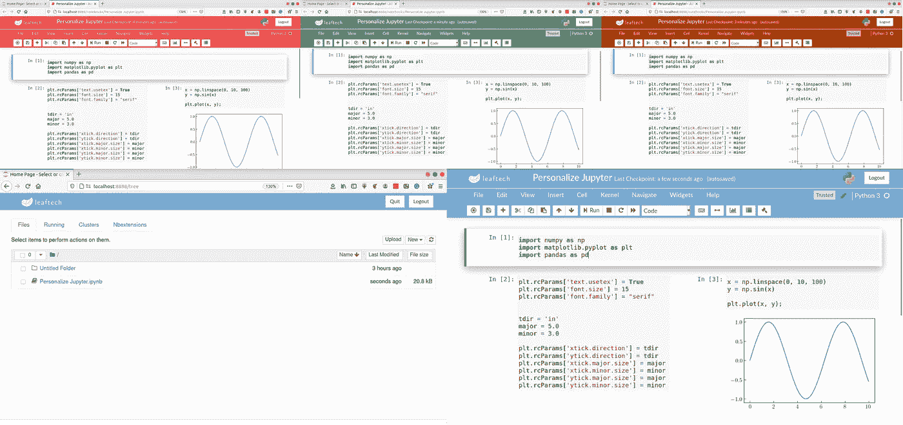

作者图片

## 定制 JUPYTER

## 如何使用 CSS 创建优秀的 Jupyter 笔记本用户界面

你是一个使用 Jupyter Notebook 作为你的编译器的 python 程序员吗？如果您想尝试在 Jupyter Notebook 中运行 python 代码的新体验(以下简称；Jupyter)，你可以通过你喜欢的颜色，字体系列来改变和个性化它。你可以应用我推荐的 11 个实用技巧来构建你的 Jupyter 用户界面。

当您打开它时，您可能看到的默认 Jupyter 如图 1 所示。

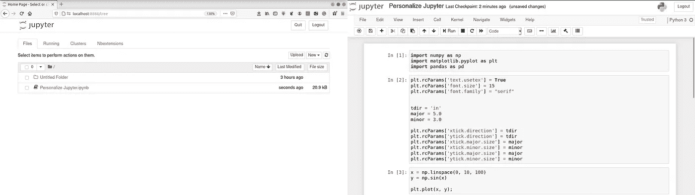

图一。Jupyter 中的默认主页(左)和 python 页面(右)(图片作者/ [Rizky MN](https://rizman.medium.com/) )。

在这个故事的结尾，我将把我的 Jupyter 个性化到我的主题中，如图 2 所示。

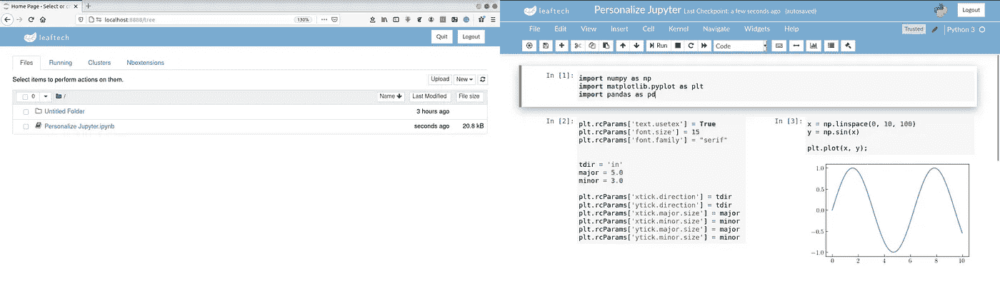

图二。Jupyter 中的个性化主页(左)和 python 页面(右)(图片作者/ [Rizky MN](https://rizman.medium.com/) )。

这个故事是[将登陆页面应用到 Jupyter](/landing-code-applying-landing-page-into-jupyter-notebook-4cdef561881f) 的后续故事。我重用了那个故事中的一些代码，并从[罗德里戈·西尔维拉](https://medium.com/u/513a71ed6458?source=post_page-----fbd202777e20--------------------------------)的[故事](https://medium.com/@formigone/my-first-custom-theme-for-jupyter-notebook-a9c1e69efdfe)中给了一些额外的 CSS 定制。他使用 CSS 构建独特的 Jupyter 主题。我试着解释我使用的每个 CSS 代码的含义。

要使用 CSS 定制它，您需要检查目录~/中名为 custom.css 的文件。jupyter/custom。如果有，可以给它添加一些 CSS 代码。但是，如果您还没有它，您需要在提到的目录中创建文件。如果目录不可用，您需要创建目录。您可以在图 3 中看到我提到的文件。

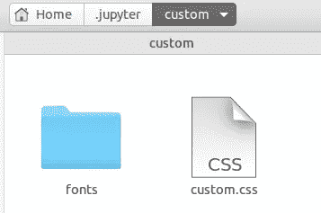

图 3。Linux 中 custom.css 的目录(图片作者/ [Rizky MN](https://rizman.medium.com/) )。

我说的目录是 Linux 的。如果您使用不同的操作系统，您需要找到 Jupyter 的安装目录。对于 Windows 用户来说，我认为它在下面的目录中。

`C:\Users\YourUsername\Anaconda3\Lib\site-packages\notebook\static\custom\custom.css`

但是，我没有检查过。

## 01.自定义标题

当您打开 Jupyter 时，您将被定向到默认的 Jupyter 主页， [http://localhost:8888/tree。](http://localhost:8888/tree#notebooks.)默认主页界面如图 4 所示。

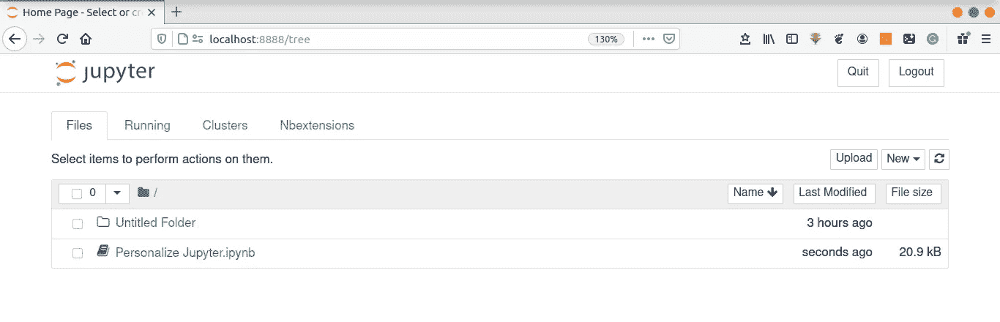

图 4。默认的 Jupyter 主页(图片作者/ [Rizky MN](https://rizman.medium.com/) )。

要定制 Jupyter 主页的标题，您需要在 custom.css 文件中添加以下代码

```
#ipython_notebook::before{
 content:"Welcome to my Jupyter Notebook"
}#ipython_notebook img{
 display:none;
}
```

添加上面的代码后，您需要保存文件并刷新 Jupyter 页面。刷新后的界面如图 5 所示。

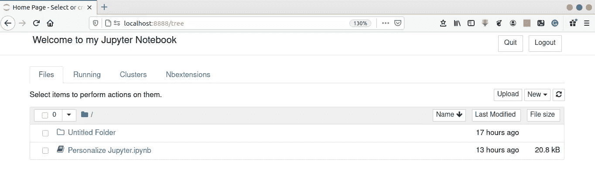

图 5。Jupyter 主页的定制标题(图片由作者/ [Rizky MN](https://rizman.medium.com/) 提供)。

标题页从 Jupyter 徽标更改为“欢迎使用我的 Jupyter 笔记本”您可以通过在 custom.css 文件中写下您想要的标题来自由更改文本。更新后的 custom.css 文件如图 6 所示。

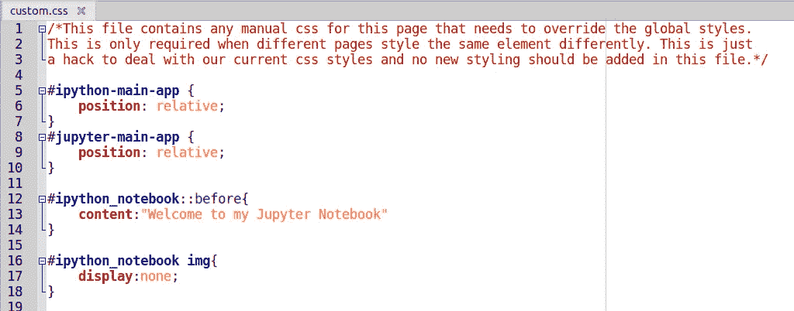

图 6。更新后的 custom.css 文件(图片作者/ [Rizky MN](https://rizman.medium.com/) )。

## 02.自定义字体

您可以更改 Jupyter 中使用的字体，包括标题字体、工具栏字体和单元格字体。要更改标题字体，您需要定义您使用的字体，如下面的 CSS 所示

```
#ipython_notebook::before{
 content:"Welcome to my Jupyter Notebook";
 font-family: Verdana;
 font-weight: 700;
 color: orange;
}
```

我将标题默认字体改为 Verdana，权重为 700，颜色为橙色。如果您在 custom.css 中添加上面的 CSS，保存它，并刷新 Jupyter 页面，您将看到 Jupyter 的更新界面，如图 7 所示。

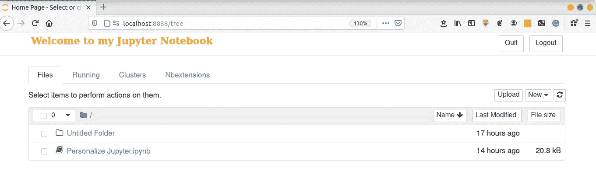

图 7。Jupyter 主页的自定义标题字体(图片由作者/ [Rizky MN](https://rizman.medium.com/) )。

如果你想改变正文中使用的字体，你可以添加这个 CSS

```
[@import](http://twitter.com/import) url([https://fonts.googleapis.com/css?family=Open+Sans](https://fonts.googleapis.com/css?family=Open+Sans));body{
   font-family: 'Open Sans';
   font-weight: 600;
}
```

我把正文字体改成 Open Sans。首先，我需要从 font.googleapis.com 进口。您也可以使用与前一个类似的 CSS 来更改权重。更新后的界面如图 8 所示。

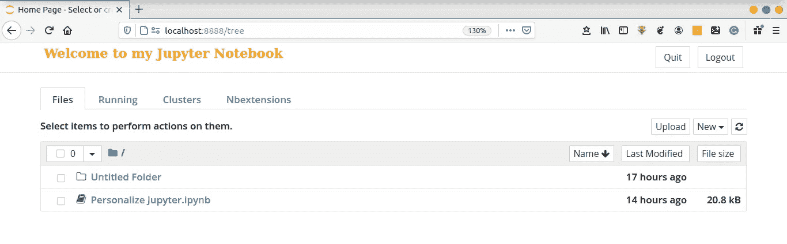

图 8。Jupyter 主页的自定义正文字体(图片由 Author / [Rizky MN](https://rizman.medium.com/) )。

如果你想从一个文件中导入字体，你可以使用这个 CSS

```
@font-face { font-family: roboto-regular; 
			 src: url('../font/Roboto-Regular.ttf'); }
```

下面是更改 Jupyter 界面的 CSS，如图 8 所示。

```
#ipython_notebook::before{
 content:"Welcome to my Jupyter Notebook";
 font-family: Verdana;
 font-weight: 700;
 color: orange;
}#ipython_notebook img{
 display:none;
}[@import](http://twitter.com/import) url([https://fonts.googleapis.com/css?family=Open+Sans](https://fonts.googleapis.com/css?family=Open+Sans));body{
   font-family: 'Open Sans';
   font-weight: 600;
}
```

我喜欢 Lato 字体，所以我在我的 Jupyter 主题中使用它。我使用 Verdana (serif)使其不同于默认字体(sans-serif)。

## 03.自定义徽标

您可以用您的徽标更改 Jupyter 的标题。在这个故事中，我将使用我最喜欢的徽标，如图 9 所示。


图 9。我的 logo(图片作者/ [Rizky MN](https://rizman.medium.com/) )。

要将它应用到 Jupyter 页面中，可以使用这个 CSS

```
#ipython_notebook img{                                                                                        
    display:block; 
    background: url("logo.png") no-repeat;
    background-size: contain;
    width: 100px;
    height: 30px;
    padding-left: 100px;
    padding-right: 50px;
    -moz-box-sizing: border-box;
    box-sizing: border-box;
}
```

我将我的徽标放在 custom.css 的一个类似目录中，因此我声明我的徽标名为 logo.png。您可以更改宽度、高度和其他 CSS 来精确放置您的徽标。结果如图 10 所示。

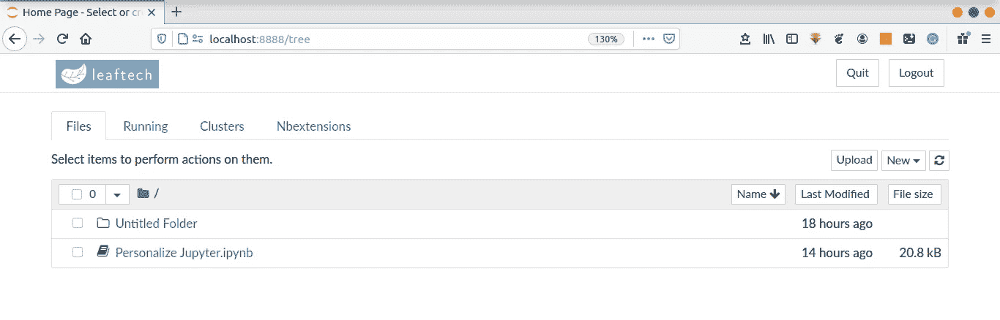

图 10。为你的 Jupyter 定制的 logo(图片作者/ [Rizky MN](https://rizman.medium.com/) )。

如果您检查 python 页面，您将看到更新后的界面，如图 11 所示。

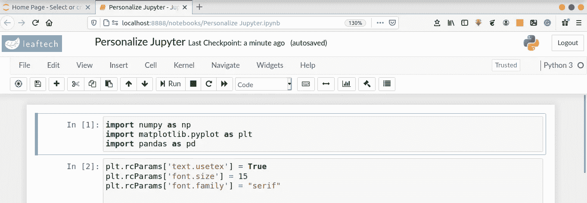

图 11。Jupyter 中为您的 python 页面定制的徽标(图片由作者/ [Rizky MN](https://rizman.medium.com/) )提供。

如果您将所有的字体都改为宽度为 700 的 Verdana 字体，您可以看到不同之处，如图 12 所示。

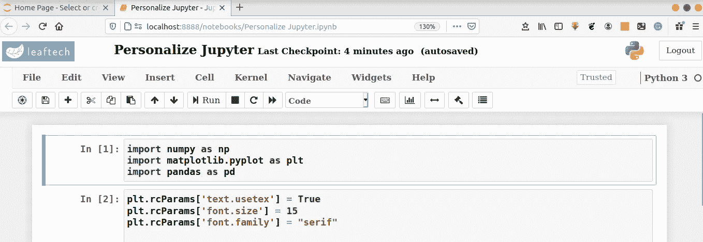

图 12。在 Jupyter 中为您的 python 页面定制的徽标和字体(图片由作者/ [Rizky MN](https://rizman.medium.com/) 提供)。

## 04.自定义标题元素

现在，我们重点讨论如何在 Jupyter 中自定义 Python 页面的界面。我想把 body 元素背景色上面的所有元素都改成和我的 logo 背景色相似的颜色(蓝色，十六进制颜色索引#78abd2)。我用这个 CSS 来改变它

```
body > #header {
    background: #78abd2;
}
```

您可以在图 13 中看到结果。

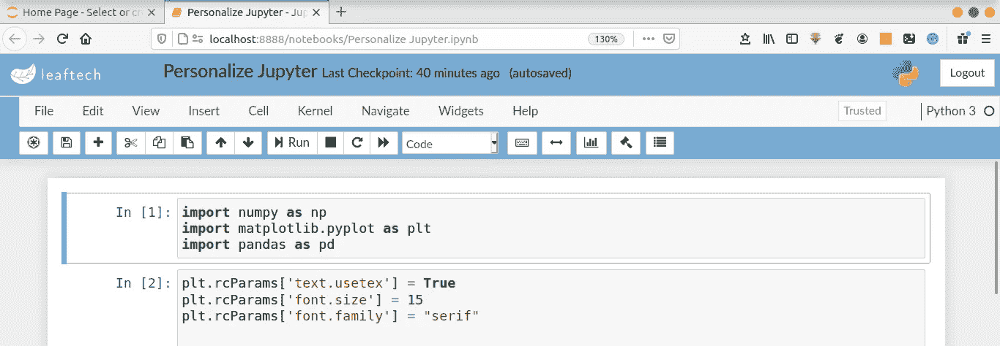

图 13。Jupyter 中定制的 header 元素(图片作者/ [Rizky MN](https://rizman.medium.com/) )。

接下来是改变导航栏的背景颜色(文件，编辑，查看等。).要改变它，你可以使用下面的 CSS。

```
#notebook_name {
    font-weight: 500;
    color: white;
}
```

用上面的 CSS，我把字体颜色改成白色，加粗一些。结果如图 14 所示。

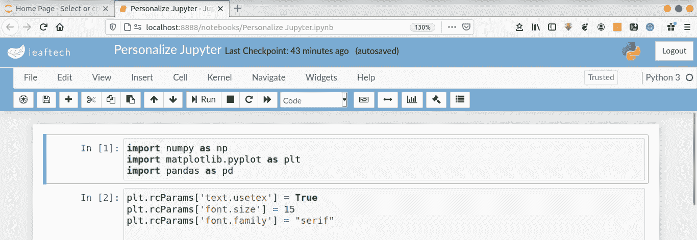

图 14。Jupyter 中定制的 header 元素(图片作者/ [Rizky MN](https://rizman.medium.com/) )。

然后，我将使用这个 CSS 改变最后一个检查点的字体颜色

```
.checkpoint_status,
.autosave_status {
    color: white;
}
```

结果如图 15 所示。

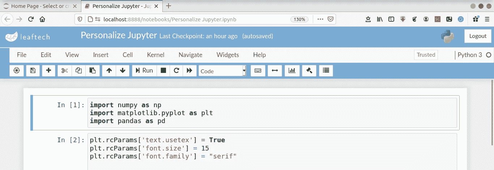

图 15。Jupyter 中定制的 header 元素(图片由 Author / [Rizky MN](https://rizman.medium.com/) )。

下一步是改变导航栏的背景颜色(文件，编辑，查看等)。要改变它，你可以使用下面的 CSS。

```
.navbar-default {
    background: none;
    border: none;
}
```

我去掉了导航栏的背景色，这样它就有了和标题背景色(蓝色)相似的颜色。我还移除了每个导航选项的边框。结果如图 16 所示。


图 16。Jupyter 中的自定义导航栏(图片由作者/ [Rizky MN](https://rizman.medium.com/) )。

下一步是改变导航栏中的字体颜色，并使用 CSS 添加动画。

```
.navbar-default .navbar-nav > li > a, #kernel_indicator {
    color: white;
    transition: all 0.25s;
}
```

结果如图 17 所示。

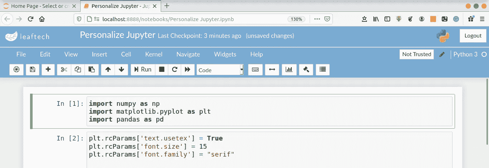

图 17。Jupyter 中的自定义导航栏(图片由作者/ [Rizky MN](https://rizman.medium.com/) )提供。

我提到的动画是当你把光标移动到其中一个导航栏选项，比如文件，文件的颜色会变成黑色。

您可以添加的另一个动画是显示选定导航栏的下划线。要添加它，您可以使用这个 CSS

```
.navbar-default .navbar-nav > li > a:hover, #kernel_indicator:hover{
    border-bottom: 2px solid #fff;
    color: white;
}
```

结果如图 18 所示。

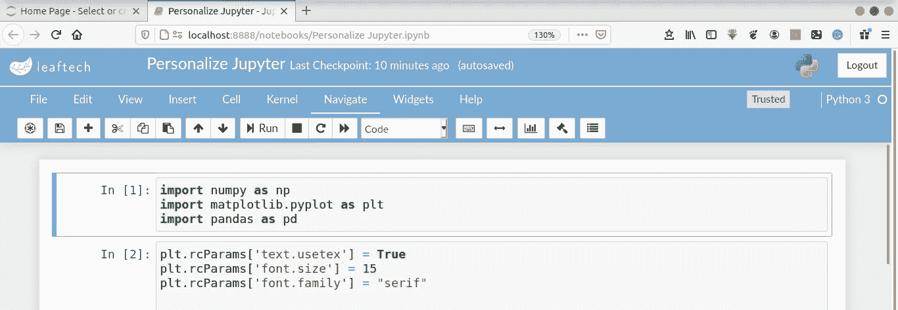

图 18。Jupyter 中的自定义导航栏(图片由作者/ [Rizky MN](https://rizman.medium.com/) )。

当我将光标移至“导航”时，动画会在“导航”下方显示下划线。当你点击另一个地方，它就会消失。

## 05.自定义背景

在我们定制了标题元素之后，我们将定制正文元素。首先，我将把 body 元素的背景色改为白色。要改变它，可以使用这个 CSS。

```
.notebook_app {
    background: white !important;
}
```

结果如图 19 所示。

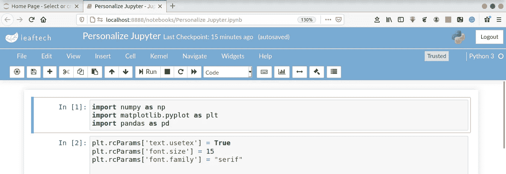

图 19。Jupyter 中定制的身体元素(图片作者/ [Rizky MN](https://rizman.medium.com/) )。

## 06.自定义单元格宽度

要改变单元格宽度，可以使用这个 CSS

```
.container {
    width: 95% !important;
}
```

结果如图 20 所示。

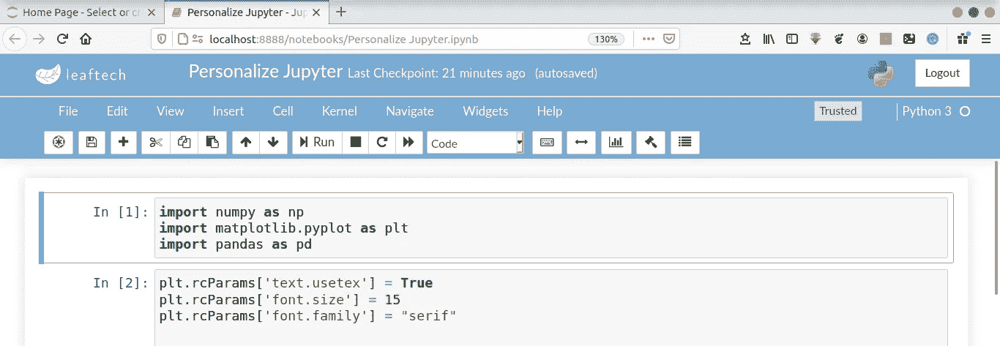

图 20。Jupyter 中的自定义单元格宽度(图片由作者/ [Rizky MN](https://rizman.medium.com/) 提供)。

## 07.自定义单元格之间的边框

接下来是隐藏单元格之间的边界。要隐藏它，您可以使用这个 CSS

```
div.input_area {
    border: none;
    border-radius: 0;
    background: #f7f7f7;
    line-height: 1.5em;
    margin: 0.5em 0;
    padding: 0;
}#notebook-container{
    box-shadow: none !important;
    background-color: white;
}
```

结果如图 21 所示。

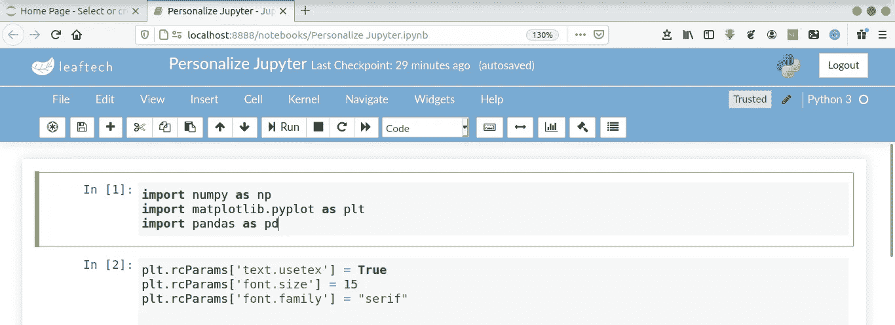

图 21。Jupyter 中定制的边框单元格(图片作者/ [Rizky MN](https://rizman.medium.com/) )。

## 08.向所选单元格添加动画

您可以添加动画，使选定的单元格将被放大，并有阴影效果。要应用它，您可以使用下面的 CSS

```
div.cell {
    transition: all 0.25s;
    border: none;
    position: relative;
    top: 0;
}div.cell.selected, div.cell.selected.jupyter-soft-selected {
    border: none;
    background: transparent;
    box-shadow: 0 6px 18px #aaa;
    z-index: 10;
    top: -10px;
}
```

结果如图 22 所示。

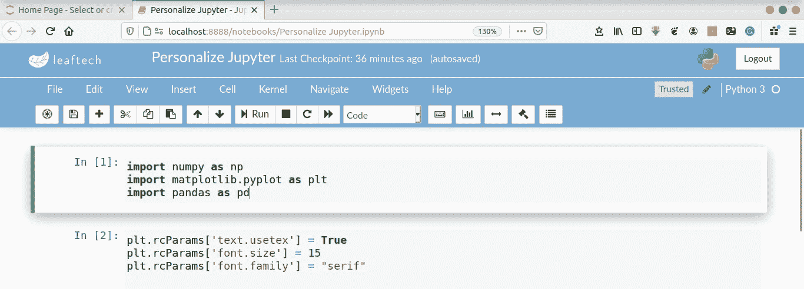

图 22。Jupyter 中的自定义细胞动画(图片由作者/ [Rizky MN](https://rizman.medium.com/) )。

## 09.自定义输出单元格

默认情况下，输出单元格是左对齐的，如图 23 所示。

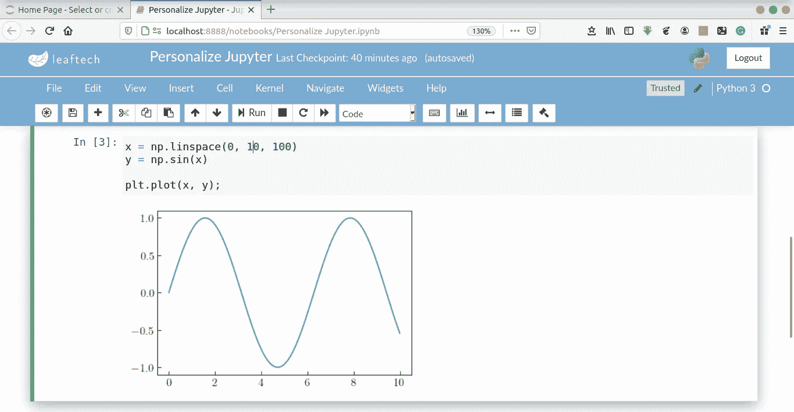

图 23。Jupyter 中的默认输出对齐方式(图片由 Author / [Rizky MN](https://rizman.medium.com/) )。

要改变它，你可以使用这个 CSS

```
.output {
    align-items: center;
}
```

结果如图 24 所示。

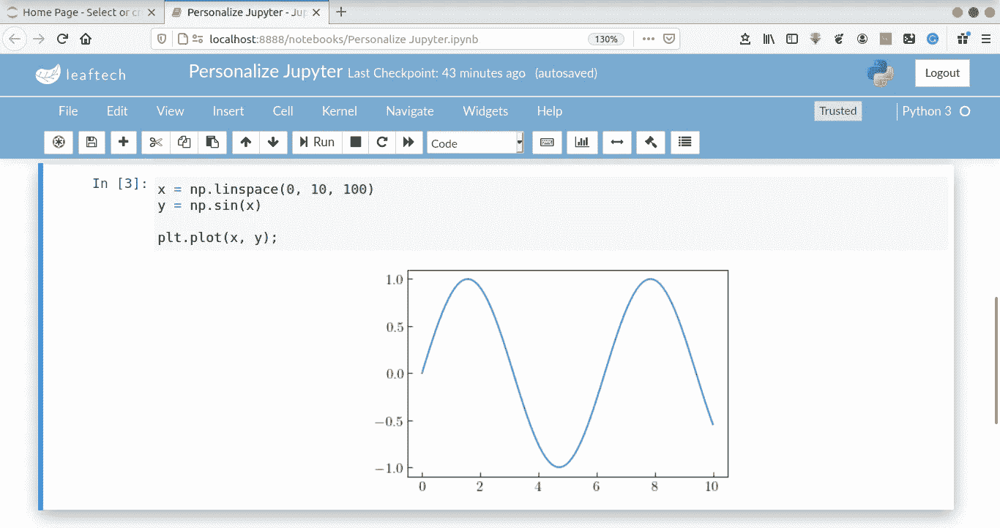

图 24。Jupyter 中的自定义输出对齐(图片由作者/ [Rizky MN](https://rizman.medium.com/) 提供)。

## 10.自定义数据框/表

您可以在 Jupyter 中自定义数据框的背景、对齐方式和填充。默认设置如图 25 所示(输出居中后)。

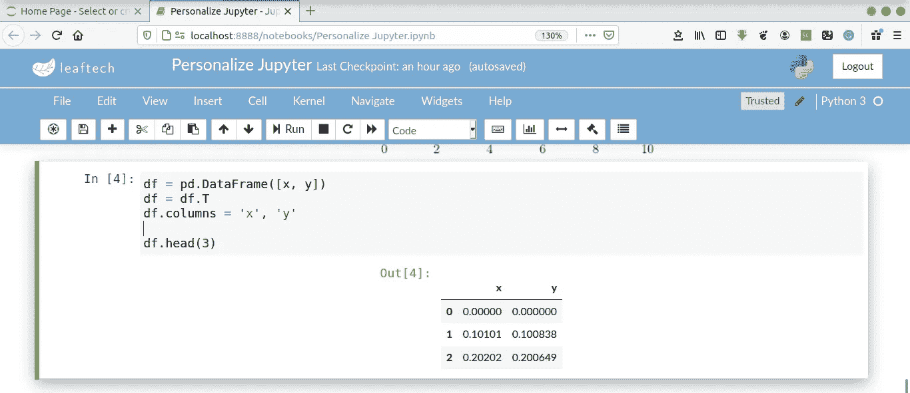

图 25。Jupyter 中默认的数据框接口(图片由作者/ [Rizky MN](https://rizman.medium.com/) )。

你可以使用这个 CSS 来定制它。

```
.dataframe { /* dataframe atau table */
    background: white;
    box-shadow: 0px 1px 2px #bbb;
}.dataframe thead th, .dataframe tbody td {
    text-align: center;
    padding: 1em;
}
```

我设置背景颜色为白色，右对齐，并调整框阴影和填充。结果如图 26 所示。

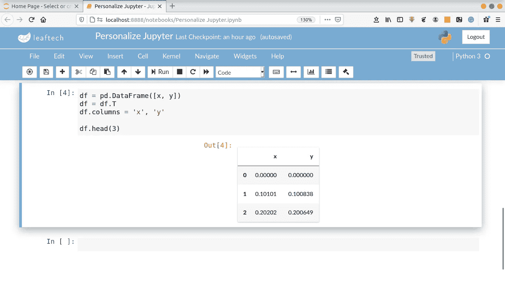

图 26。Jupyter 中定制的数据框接口(图片由作者/ [Rizky MN](https://rizman.medium.com/) )。

## 11.定制线路盒

最后，如果你想删除行框，你可以使用这个 CSS

```
div.prompt,
div.tooltiptext pre {
    display:none
}
```

结果如图 27 所示。

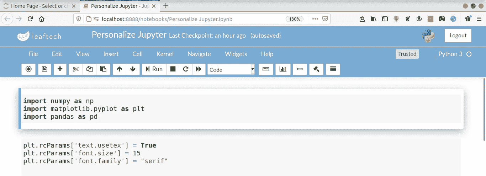

图 27。Jupyter 中定制的 line 单元格(图片由作者/ [Rizky MN](https://rizman.medium.com/) )。

我没有在我的 Jupyter 上应用这个习惯。我让行单元格可见。如果你喜欢隐藏它，你可以使用上面的 CSS。

## 结论

最后，我将在下面的 CSS 中分享我的 Jupyter 的 CSS 定制。

下面是捕获的结果。

## 如果你喜欢这篇文章，这里有一些你可能喜欢的其他文章:

[](/visualizations-with-matplotlib-part-1-c9651008b6b8) [## 使用 Matplotlib 实现 Python 数据可视化—第 1 部分

### 完成了从基础到高级的 Python 绘图的 Matplotlib 教程，包含 100 多个示例

towardsdatascience.com](/visualizations-with-matplotlib-part-1-c9651008b6b8) [](/python-data-visualization-with-matplotlib-part-2-66f1307d42fb) [## 使用 Matplotlib 实现 Python 数据可视化—第 2 部分

### 完成了从基础到高级的 Python 绘图的 Matplotlib 教程，包含 100 多个示例

towardsdatascience.com](/python-data-visualization-with-matplotlib-part-2-66f1307d42fb) [](/5-powerful-tricks-to-visualize-your-data-with-matplotlib-16bc33747e05) [## 使用 Matplotlib 可视化数据的 5 个强大技巧

### 如何使用 LaTeX 字体，创建缩放效果，发件箱图例，连续错误，以及调整框填充边距

towardsdatascience.com](/5-powerful-tricks-to-visualize-your-data-with-matplotlib-16bc33747e05) [](/customizing-multiple-subplots-in-matplotlib-a3e1c2e099bc) [## 在 Matplotlib 中自定义多个子情节

### 使用 subplot、add_subplot 和 GridSpec 在 Matplotlib 中创建复杂 subplot 的指南

towardsdatascience.com](/customizing-multiple-subplots-in-matplotlib-a3e1c2e099bc) [](/introduction-to-big-data-a-simple-code-to-read-1-25-billion-rows-c02f3f166ec9) [## Vaex 大数据简介—读取 12.5 亿行的简单代码

### 用 Python 高效读取和可视化 12.5 亿行星系模拟数据

towardsdatascience.com](/introduction-to-big-data-a-simple-code-to-read-1-25-billion-rows-c02f3f166ec9) 

仅此而已。感谢您阅读这个故事。喜欢就评论分享。我还建议您关注我的帐户，以便在我发布新故事时收到通知。