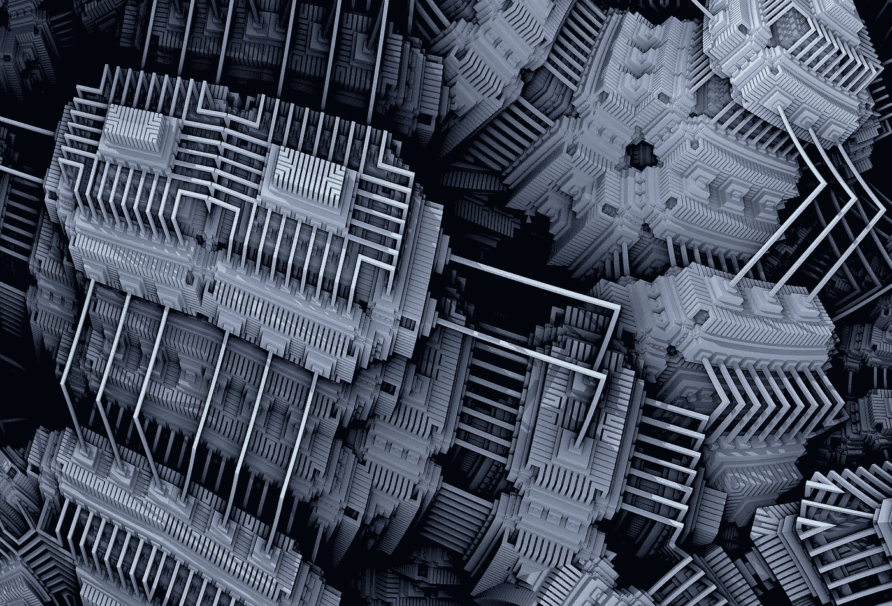
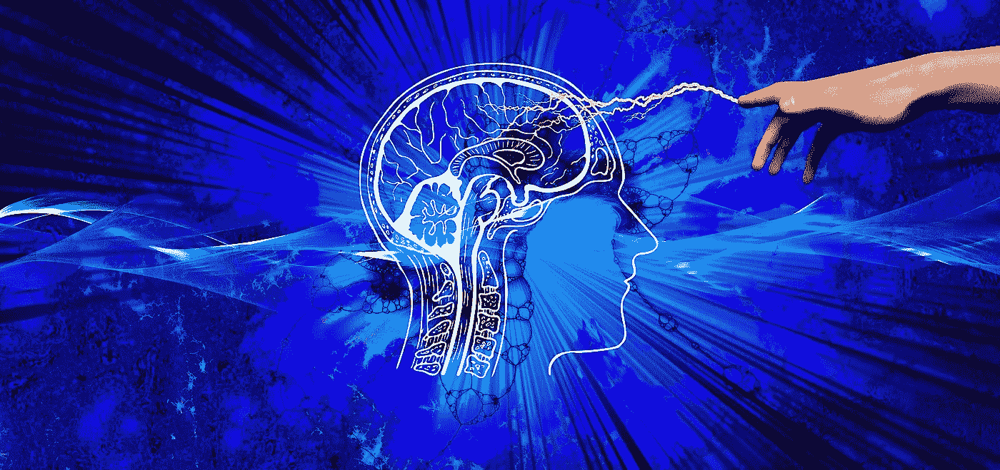
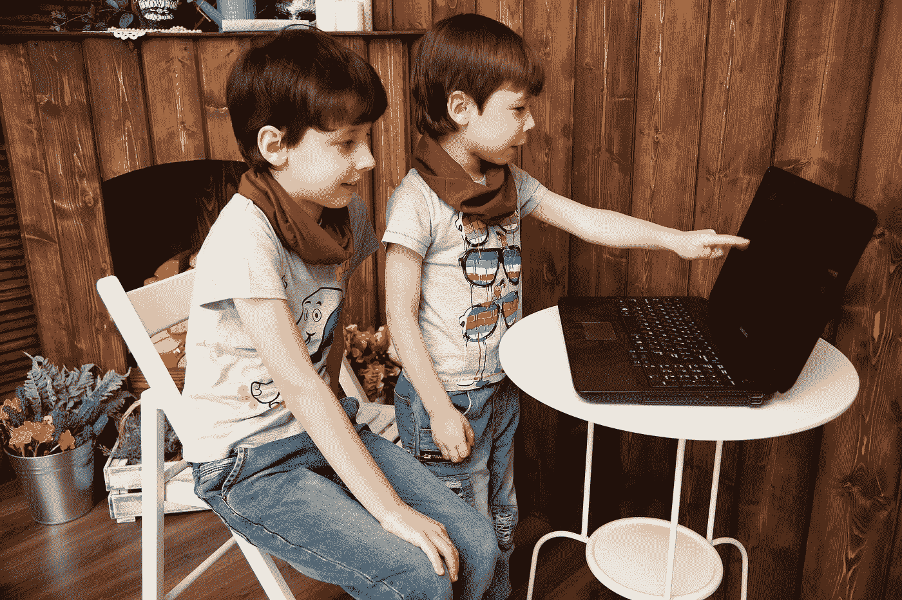
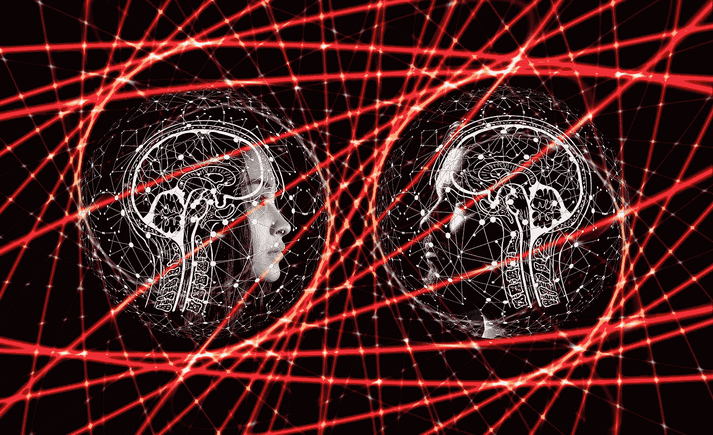
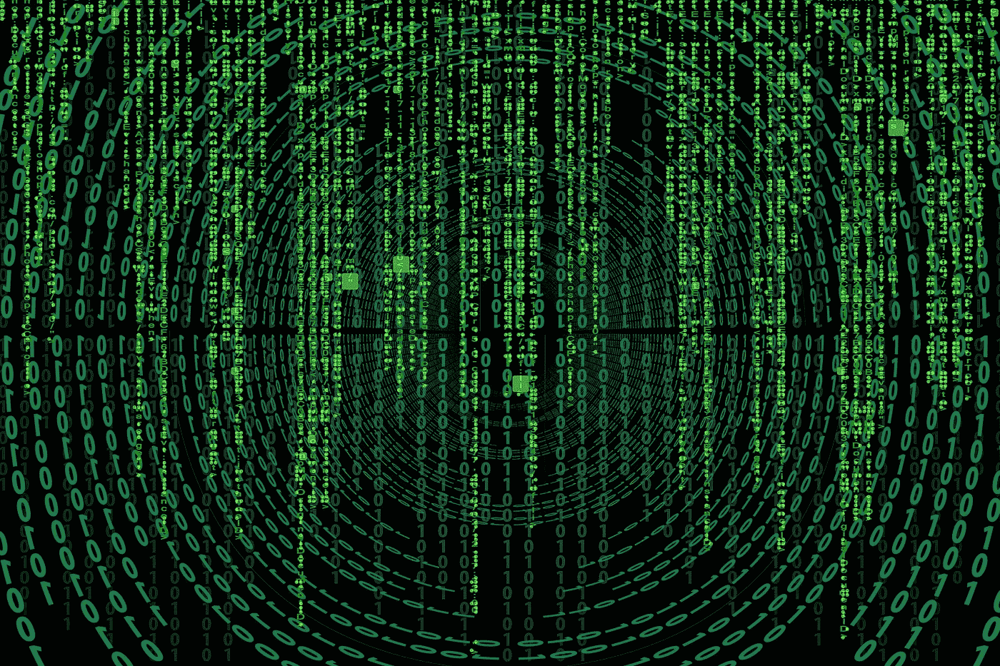

# 对 21 世纪 30 年代软件发展趋势的 10 个预测

> 原文：<https://towardsdatascience.com/10-predictions-about-the-software-development-trends-in-the-2030s-2fab86c5f661?source=collection_archive---------13----------------------->

## 从量子计算到字节码:2030 年及以后的主要软件发展趋势

来源:iStock

如果说我们把现代人类文明想象成一辆汽车，那么软件业就是那辆汽车的发动机。在 21 世纪，软件开发行业发生了许多创新、进步和颠覆。尤其是在过去十年中发生的创新和变化的数量是前所未有的。

以下是我们在过去十年目睹的重大变化:

*   DevOps
*   持续集成/持续交付
*   集装箱化和虚拟化
*   NoSQL，新西兰
*   云
*   微服务，无服务器
*   区块链
*   深度学习
*   数据密集型应用
*   基于 JavaScript 的 Web 开发(Angular，React，Vue)

**随着数字化和工业 4.0 的快速发展，我们将在未来十年看到软件开发行业更加巨大的变化和创新。**如果我今天进入低温睡眠，2030 年醒来，我将如何找到软件开发生态系统？

预测未来是一项艰难的工作。预测未来十年的软件发展趋势几乎是不可能的。在这里，我将列出 21 世纪 30 年代我们可以期待的十大软件发展趋势。

# 1.量子计算

来自 [Pixabay](https://pixabay.com/?utm_source=link-attribution&utm_medium=referral&utm_campaign=image&utm_content=3831794) 的[皮特·林弗斯](https://pixabay.com/users/TheDigitalArtist-202249/?utm_source=link-attribution&utm_medium=referral&utm_campaign=image&utm_content=3831794)的图片

1982 年，诺贝尔奖物理学家**理查德·费曼**发表论文，《用计算机模拟物理的 ***，*** ，量子计算诞生*。*与经典计算机不同，**它使用量子力学现象如叠加和量子纠缠进行计算**。简单地说，数字计算机的晶体管可以处于一种状态:要么是 0，要么是 1。

> 但是量子计算机的基本单元，**量子位**可以处于 0 或 1 的状态，也可以是 0 和 1 的线性组合。因此，量子计算机的能力随着每增加一个量子位而呈指数级增长。**量子纠缠是指两个量子比特一旦纠缠，即使一个在地球上，另一个在仙女座星系上，也能瞬间交换信息**。如果我们把数字计算机想象成一个普通人，那么量子计算机就像超级智能的外星人，可以同时和数百万人下棋，或者可以同时解决数百万个数学问题。

在过去的十年里，量子计算取得了很多进步。2019 年 10 月，**谷歌**声称他们已经通过其 **54 量子位 Sycamore 量子计算机**实现了量子霸权，尽管该消息受到了 **IBM** 的挑战:

 [## 谷歌证实“量子优势”突破

### 谷歌在科学杂志上发表的一篇新文章中正式宣布，它已经实现了量子霸权

www.theverge.com](https://www.theverge.com/2019/10/23/20928294/google-quantum-supremacy-sycamore-computer-qubit-milestone) 

上个月，霍尼韦尔声称已经制造出最强大的量子计算机，量子体积为**64:**

 [## 霍尼韦尔称，它已经建造了世界上最强大的量子计算机

### 在通往量子计算未来的竞赛中，霍尼韦尔刚刚取得了新的领先优势。总部位于北卡罗来纳州的…

www.forbes.com](https://www.forbes.com/sites/davidjeans/2020/06/19/honeywell-says-it-has-built-the-worlds-most-powerful-quantum-computer/) 

量子计算有几个挑战:QPU 需要放入几乎绝对零度的温度，量子计算机由于量子退相干会产生巨大的误差。在未来十年，量子计算将成为大公司最热门的研究课题，世界超级大国将争夺**量子霸权**。

在 21 世纪 30 年代，量子计算将得到显著发展，工程师将在现实世界中使用它，如量子物理模拟、天气预报、药物开发、金融建模、人工智能、交通优化、星际旅行。它还将成为人工智能等其他领域进步的催化剂。有了量子纠缠，我们终于可以看到分布式计算中 CAP 定理的**终结**因为量子纠缠粒子可以瞬间共享信息。

在 21 世纪 30 年代初，量子计算将开始威胁经典密码学和相关领域，如金融交易、区块链。因此，随着每个人都试图用量子密码术取代经典密码术，这个行业将会发生巨大的变化和骚动。到 21 世纪 30 年代末，量子计算将最终打破经典密码学，这可能会像维基解密一样引起巨大的社会骚动，因为它将解密许多安全和敏感的通信。

> 2030 年代将是量子计算的十年。

# 2.人工智能驱动的软件开发

图片来自[pix abay](https://pixabay.com/?utm_source=link-attribution&utm_medium=referral&utm_campaign=image&utm_content=3914811)Gerd Altmann

2018 年 5 月，**桑德尔·皮帅(谷歌首席执行官)**发布了基于人工智能的智能**功能，用于 Gmail 和谷歌文档**。最初，我对它的有用性持怀疑态度。仅仅过了两年，我发现智能写作功能帮助我提高了打字速度，这真是太神奇了。对于软件开发人员来说，也有 AI 驱动的**代码完成插件/扩展**可用于主要的 ide，如**codata 或 Kite** 。人工智能驱动的测试生成工具或人工智能驱动的端到端测试工具也越来越受欢迎。

虽然这些人工智能驱动的软件开发工具还不强大，但它们将成为未来几天的热门话题。这些工具的任何改进都会在软件开发中带来巨大的生产力增益。随着未来开源项目数量的指数级增长，人工智能驱动的软件开发工具将拥有更多的训练数据，并且只会越来越好。

> 在 21 世纪 30 年代，软件开发人员将从各种人工智能驱动的软件开发工具中获得大量支持，如代码完成、测试生成、端到端测试、数据库建模、CI/CD 等。开发人员只需要定义方法名称和字段，人工智能将生成源代码，包括单元/集成/验收测试。此外，开发人员将用简单的英语编写/讲述项目/类的功能，AI 将生成带有 CI/CD 和集成/验收测试的源代码。在 AI 的帮助下，21 世纪 30 年代的开发者体验和开发者生产率将比今天高得多。

# 3.低代码/无代码

图片来自 [Pixabay](https://pixabay.com/?utm_source=link-attribution&utm_medium=referral&utm_campaign=image&utm_content=4928563) 的[викториябородинова](https://pixabay.com/users/Victoria_Borodinova-6314823/?utm_source=link-attribution&utm_medium=referral&utm_campaign=image&utm_content=4928563)

软件开发人员是目前最稀缺的资源。如果你是一个企业家，有一个伟大的想法，那么你必须首先雇佣一些开发人员来实现你的第一个产品或 MVP。即使你是软件公司的项目经理/产品经理，你仍然需要一个软件开发团队来开发你的 MVP。同样，你必须等待相当长的时间(几个月到一年)才能看到你的 MVP。

在过去的几年里，一个新的运动 L **CNC(低代码无代码)正在获得牵引力，它试图减少产品开发的障碍**。有许多优秀的 LCNC 应用程序能够在短时间内开发出第一个产品，而不需要任何软件工程师。Bubble、Huddle、Webflow 提供了快速的 Web 应用程序开发。Kodika 提供无代码的 iOS 应用开发。抛物线是一个无代码数据工作流平台，而 Airtable 是 LCNC 数据库和电子表格的混合体。还有一个人工智能/人工智能的 LCNC 平台。

当前的 LCNC 平台要开发高度灵活的行业级应用程序还有很长的路要走。如果我们认为工业级应用程序是乐高头脑风暴，那么当前的 LCNC 应用程序就像乐高得宝。在未来十年，LCNC 平台将会发生巨大的变化。到 21 世纪 30 年代，将会有大量成熟的 LCNC 平台可以创建行业级应用。企业家或企业高管将使用 LCNC 开发 80–90%的消费者应用 MVP。将会有一些强大的人工智能驱动的 LCNC，甚至软件工程师也将使用它们来开始新的应用程序开发。因此，如果你有新鲜的想法，但没有钱或没有编码经验，21 世纪 30 年代将是你的绝佳时机。

# 4.新编程语言的兴起

由 [Max Duzij](https://unsplash.com/@max_duz?utm_source=unsplash&utm_medium=referral&utm_content=creditCopyText) 在 [Unsplash](https://unsplash.com/s/photos/programming?utm_source=unsplash&utm_medium=referral&utm_content=creditCopyText) 上拍摄的照片

在 2000 年代，我们认为我们不需要任何新的编程语言。有用于系统编程的 C/C++，用于商业应用的 Java，用于 Web 开发的 PHP/JavaScript，用于脚本的 Ruby/Python。但在接下来的十年里，我们看到了编程语言领域的许多创新和突破。Rust 的成功证明，有了创新的想法，一种新的语言甚至可以挑战强大的编程语言，如 C/C++。同样，Go 也表明了创造一种简单而强大的成功编程语言是可能的。 **Swift、TypeScript、Julia、Kotlin、Dart、Elixir、Crystal、Elm 也是最近十年开发的流行且被广泛采用的编程语言**。

在未来十年，我们将会看到编程语言领域更多的创新。起源于过去十年的编程语言将会更加流行，而许多其他新的编程语言将会登场。在 2030 年代，编程语言的市场份额将会更加分散，甚至比今天更分散。Rust 将取代 C/C++成为头号系统编程语言，而 T2 将取代 Python 成为人工智能的事实语言。随着人工智能驱动的软件开发和创新工具的出现，多语言编程将成为 21 世纪 30 年代的常态而非例外。

我预计 21 世纪 30 年代，数十种新的**云原生编程语言**将成为主流。此外，将会有一些更现代的量子计算编程语言。

到 2030 年， **WebAssembly** 将成为在支持多线程编程模型的 Web 或智能设备上运行的事实上的字节码格式。它将允许使用任何语言编写消费者应用程序(例如，Web、智能设备),充分利用带下划线的硬件(例如，GPU)的优势。因此，像 Rust 这样强大而接近金属的语言将被用于开发游戏、3d、AR/VAR 应用程序或其他针对 Web、智能设备的 CPU 密集型应用程序。此外，在 21 世纪 30 年代，浏览器将成为操作系统，几乎 100%的消费者桌面应用程序将在浏览器上运行。

# 5.云计算

图片来自 [Pixabay](https://pixabay.com/?utm_source=link-attribution&utm_medium=referral&utm_campaign=image&utm_content=4373407)

2006 年，亚马逊在云计算领域迈出了巨大的一步，提供了三种 AWS 云服务:EC2、S3 和 SQS。在接下来的 14 年里，云计算变得无孔不入，无处不在。最初，接受云计算的是初创公司。近年来，政府组织、医疗保健、采矿、银行、保险，甚至五角大楼都在向云迁移。新冠肺炎危机向我们展示了**公司不仅需要适应云的纵向扩展/横向扩展，还需要适应云的横向扩展。科纳仕公司报告称，2020 年 Q1 的云支出将增长 34%:**

 [## Q1 2020 年全球云服务市场

### 2020 年 Q1 的云支出创历史新高，增长 34%，原因是远程工作需求云基础架构服务支出创历史新高…

www.canalys.com](https://www.canalys.com/newsroom/worldwide-cloud-infrastructure-services-Q1-2020) 

未来十年，云计算将在软件开发中无处不在。此外，云计算的当前问题(例如，安全性)将在这十年内得到解决。谷歌通过 Cloud Native Foundation 统一云堆栈的尝试将聚集更多的蒸汽，许多云服务将在 2030 年实现标准化。

在 21 世纪 30 年代，云计算**(公共/私有/混合)将是软件开发的“正常”方式**。此外，内部数据中心将使用“标准化”云堆栈或特定于供应商的云堆栈。

由于量子计算机的物理要求，2030 年代我们将只在云中使用量子计算和量子人工智能。到 21 世纪 30 年代末，量子加密将会成熟，并将为云计算提供一个牢不可破的强大安全机制。不管我们是否喜欢，21 世纪 30 年代的云计算将是集中式的，只有大型科技公司才会像今天一样主导它。

# 6.人工智能

图片由 [Gerd Altmann](https://pixabay.com/users/geralt-9301/?utm_source=link-attribution&utm_medium=referral&utm_campaign=image&utm_content=4815728) 从 [Pixabay](https://pixabay.com/?utm_source=link-attribution&utm_medium=referral&utm_campaign=image&utm_content=4815728) 拍摄

人工智能是计算机科学中最早的学科之一，但在人工智能的冬天面临着几次挫折。在第二个人工智能冬天(上世纪 90 年代)之后，人工智能的第一个重大突破性事件发生在 2012 年，当时谷歌大脑项目中的**吴恩达用从 YouTube 视频中拍摄的 1000 万张未分类图片训练了一个 16000 CPU 节点的神经网络，它可以检测一只猫。另一个开创性的事件发生在 2016 年，当时谷歌的 **AlphaGo AI** 击败了围棋世界冠军，因为围棋可能的棋盘位置比宇宙中的原子总数还要多。**

此外，**现代硬件(GPU)和云计算推动了人工智能算法，**这导致了过去十年中机器学习/深度学习的许多创新。Alexa/Siri、垃圾邮件检测、欺诈检测、自动驾驶、购物推荐、音乐推荐只是我们每天都在使用的庞大 AI 应用中的一小部分。

同样在未来十年，人工智能将出现重大创新和突破，特别是在强化学习方面。AI 将在 2030 年代开始吃掉世界。与普遍的看法相反，人工智能将帮助人类，而不是取代人类。我们将驾驶自动驾驶汽车。医生将使用人工智能进行更好的治疗。生命科学公司将利用人工智能进行更好的药物开发。即使作为开发者，我们也会使用 AI 驱动的操作系统和 AI 驱动的应用程序。

在 21 世纪 30 年代，**人工智能将完全可以解释和诠释，**不像今天。到那时，人工智能不仅能找到一只猫，还能解释或理解它为什么是一只猫。21 世纪 30 年代量子计算的突破将大大推动人工智能，因为神经网络模型将在量子计算机的帮助下即时训练并使用训练好的模型。我预计我们将看到**人工智能奇点**，即它将在没有人类帮助的情况下继续以失控的方式改进。

> 人工智能和量子计算将在 21 世纪 30 年代把人类文明带到下一个阶段(**工业 5.0** )。

# 7.特定领域的硬件

图片来自 [Pixabay](https://pixabay.com/?utm_source=link-attribution&utm_medium=referral&utm_campaign=image&utm_content=3509891)

如果说我们从过去十年的软件开发行业中学到了什么，那就是“**一刀切”**但在硬件开发上，还是“一刀切”。今天的软件应用程序变化如此之大，以至于在许多情况下，专用硬件可以比通用硬件提供显著的优势。在过去几年中，有几个成功的特定领域硬件开发的例子。比特币挖矿有专门的硬件可以更高效地计算 SHA。谷歌开发了一个专门的 **GPU (TPU)** 为运行 TensorFlow 而优化。另一个非常成功的专业硬件是 **Amazon AWS Nitro，**这是一个用于容器化/虚拟化的专业硬件，在他们的无服务器 EC2 平台上为 Amazon 提供了很大的帮助。

在下一个十年，我们将会看到越来越多的专用计算硬件。2030 年代将会出现大量的专用硬件:**数据库专用硬件、AI 专用硬件、数据处理专用硬件等等**。目前，硬件开发类似于 2010 年之前的软件开发，导致发布周期较长。在 21 世纪 30 年代，硬件开发将结合软件开发的许多最佳实践。它将在跨职能团队中使用敏捷方法，硬件工程师将与特定领域的软件工程一起工作。因此，硬件发布周期将会更短，这反过来将会产生更多特定领域的硬件。

# 8.分布式 SQL

图片由[皮克斯拜](https://pixabay.com/?utm_source=link-attribution&utm_medium=referral&utm_campaign=image&utm_content=2953869)的 Gerd Altmann 提供

目前，我们面临着**两个数据库**的问题。根据 CAP 定理，对于分布式系统/分布式数据库，我们只能拥有 CAP 中的任意两个(一致性、可用性、分区容忍)。对于一致性是基本要求的应用程序(例如，银行、保险和大多数其他业务应用程序)，我们使用 SQL 数据库(OLTP)，它提供 CAP 的 CA。对于高度可扩展的应用程序，可用性是一致性的关键要求(例如，分析工作负载、社交媒体类工作负载)，我们使用各种 NoSQL 数据库(OLAP)。将数据从 OLTP 移动到 OLAP 需要大量的工作。此外，SQL 数据库为数据(SQL)提供了单一的抽象层，而 NoSQL 不提供任何单一的抽象层。

在过去的几年里，我们已经看到了分布式 SQL (NewSQL) 数据库的兴起，它结合了 SQL 的一致性和 NoSQL 数据库的可伸缩性。虽然它们中的许多(蟑螂 DB，AWS Aurora)正在获得大量的牵引力，但仍有改进的空间。在下一个十年，我们将在分布式 SQL 领域看到更多的创新。

在 21 世纪 30 年代，我们可以看到真正的分布式 SQL，因为许多其他领域的创新(例如，专用硬件、量子计算)。一个想法可能是“**量子纠缠 SQL 数据库，”**其中量子纠缠 SQL 数据库的集群将提供 SQL 数据库的一致性，即使一个数据库在地球上，而另一个数据库在火星上。

# 9.统一的数据密集型应用

来自 [Pixabay](https://pixabay.com/?utm_source=link-attribution&utm_medium=referral&utm_campaign=image&utm_content=1840758) 的 [David Mark](https://pixabay.com/users/12019-12019/?utm_source=link-attribution&utm_medium=referral&utm_campaign=image&utm_content=1840758) 的图片

在过去的十年中，我们看到了数据密集型应用的爆炸式增长。我们有批处理工具(Spark，Hadoop Map Reduce)，流处理工具(Flink，Strom)，排队(Kafka，Pulsar)，全文搜索工具(Solr，Elastic Search)，缓存(Redis)，列存储(Cassandra)，行存储(SQL 数据库)。缺点是现在没有类似 SQL 的数据处理抽象。目前，为特定的数据建模寻找合适的数据密集型工具是一项艰巨的任务。

在未来十年，我们将看到许多数据处理工具的融合，它们将为批处理和流处理提供统一的数据建模。在 21 世纪 30 年代，我们将发现数据密集型应用程序更少分散，更统一。我们还将看到在同一数据处理框架中抽象许多数据建模(例如，流、全文搜索、缓存、列操作、行操作)的工具。此外，我们将看到数据密集型应用程序更加可组合(如 Unix ),这样我们就可以轻松地插入多个应用程序。在 21 世纪 30 年代，开发人员将通过一个类似“管道”的操作符将分布式 SQL 数据库与全文搜索引擎连接起来。

# 10.区块链

图片由 [mmi9](https://pixabay.com/users/mmi9-1424200/?utm_source=link-attribution&utm_medium=referral&utm_campaign=image&utm_content=3277336) 来自 [Pixabay](https://pixabay.com/?utm_source=link-attribution&utm_medium=referral&utm_campaign=image&utm_content=3277336)

绝望的时代往往会带来颠覆性的创新。2007 年全球金融危机期间，[T5，](https://en.wikipedia.org/wiki/Satoshi_Nakamoto) 结合 5/6 现有技术(哈希、hashcash、公私密码、点对点网络)，创造了**比特币**，第一种加密货币。**比特币**的成功带动了新技术的兴起:**区块链或者分布式账本**。在过去十年中，区块链技术取得了许多进步，并为在非加密货币用例中使用区块链打开了大门。一个这样的创新是**以太坊，**其中一个块是一段代码。以太坊的优势在于这段代码是通用的，即智能合约，可以映射到包括加密货币在内的任何东西。

尽管区块链是一项颠覆性技术，但它有许多限制，阻碍了它的大规模采用。在未来十年，我们将看到区块链的许多创新，它的许多限制将得到解决。在 21 世纪 30 年代，区块链将是成熟的技术。会用在很多领域，以合同/交易为基础，集中化:**金融交易、房地产合同、油气采购、供应链、版权、分享音乐**。在 21 世纪 30 年代，量子计算将开始威胁经典加密。由于传统加密是区块链的关键，它将在 21 世纪 30 年代经历重大变化，并将适应量子加密。

# 类似文章:

 [## 2020 年最受欢迎的 10 种编程语言

### 针对求职者和新开发人员的顶级编程语言的深入分析和排名

towardsdatascience.com](/top-10-in-demand-programming-languages-to-learn-in-2020-4462eb7d8d3e)  [## 有效的微服务:10 个最佳实践

### 正确实施微服务架构的 10 个技巧

towardsdatascience.com](/effective-microservices-10-best-practices-c6e4ba0c6ee2)  [## 2020 年要学习的十大 JavaScript 框架

### 现代 JavaScript 开发中最重要的 JavaScript 框架的精选列表

towardsdatascience.com](/top-10-javascript-frameworks-to-learn-in-2020-a0b83ed3211b)