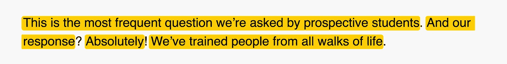
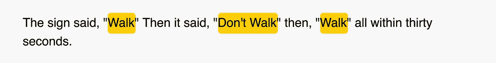
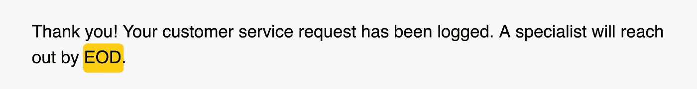
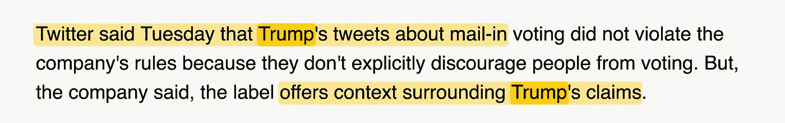
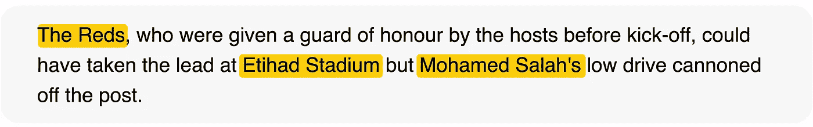
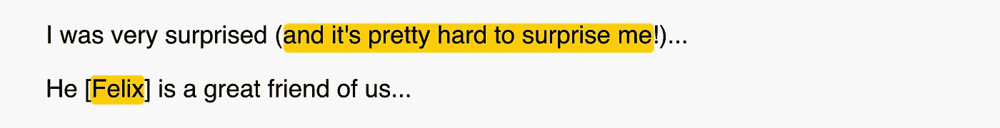

# 用于即席文本分析的 10 个纯 Python 函数

> 原文：<https://towardsdatascience.com/10-pure-python-functions-for-ad-hoc-text-analysis-e23dd4b1508a?source=collection_archive---------36----------------------->

## 不使用外部库压缩文本数据

克里斯多夫·伯恩斯在 [Unsplash](https://unsplash.com?utm_source=medium&utm_medium=referral) 上拍摄的照片

T**ext*****data**是最常见的数据格式。大量的文章、推文、文档、书籍等等，每天都在我们周围飞来飞去。您可以提取的见解数量巨大，帮助提取这些见解的工具也在不断改进。*

*在 Python 中，可以使用外部库来处理文本数据。这些库的一个问题是它们不是轻量级的，而且对于初学者来说，它们确实有一个陡峭的学习曲线。在许多情况下，如果您的唯一目的是探索和了解数据，用纯 Python 编写的函数可以做得很好。*

*下面我列出了 10 个我最常用的功能。这些功能主要是**启发式功能**，在假设条件下正常工作。这些假设在以下考虑它们的功能中陈述。*

## *#1 获取句子*

**假设:凡是以点、问号、感叹号结尾的，都作为一个句子。**

**

## *#2 获取每句话的条目列表*

**假设:取一个冒号，后跟用逗号分隔的项目列表。**

**

## *#3 获取所有数值*

**假设:所有数字都被考虑，不管它们是字符串的一部分还是独立的。**

**

## *#4 获取引号内的文本*

*假设:介于引号之间的内容将被采用。*

**

## *#5 获取大写单词*

**假设:取全大写中的任意一个字。**

**

## *#6 获取单词的上下文*

**

## *#7 获取句子中的结果标题词*

**假设:取句子中的后件标题词。**

**

## *#8 获取括号内的文本*

**假设:取圆括号、方括号或大括号之间的内容。**

**

## *#9 去掉标点符号*

## *#10 描述文本*

# *结论*

*在处理和分析过程中，文本数据伴随着巨大的洞察机遇和挑战。有很多用于语言处理的外部库，比如 [NLTK](https://www.nltk.org/) 、 [spaCy](https://spacy.io/) 和 [polyglot](https://pypi.org/project/polyglot/) 。如果你想在 NLP 中做一些严肃的事情，这些工具是你应该使用的。*

*这些库的一个问题是它们相当重。当然，他们必须用不同的结构组织支持不同的语言，这是主要原因。如果您只是想研究和提取文本数据的统计数据，带有内置模块的 Python 可以做得很好。*

*上面列出的 10 个 Python 函数为此提供了一个良好的开端。使用这些函数来探索和了解数据。这些不是生产就绪的脚本。明智地使用它们，并根据需要扩展它们的功能。编码快乐！*

* [## 提升你的软件开发职业生涯的三件大事

### 从优秀到卓越

medium.com](https://medium.com/swlh/three-significant-things-to-elevate-your-software-development-career-83be99cedf28)  [## 作为一名开发人员，赢得尊重的 4 件事

### 迈向成功的事业

medium.com](https://medium.com/@dardanx/4-things-that-will-earn-you-respect-as-a-developer-eec54d1ac189)*