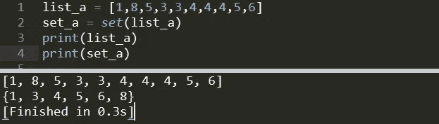
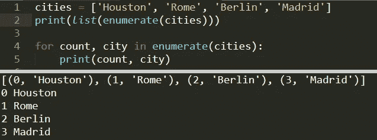
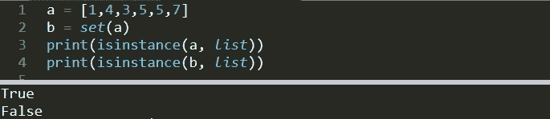
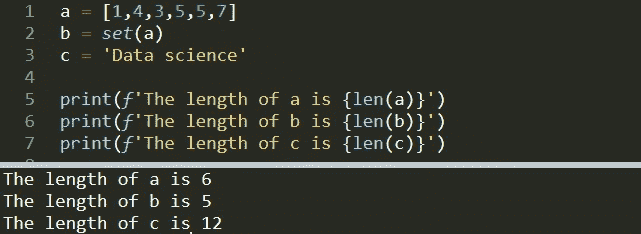
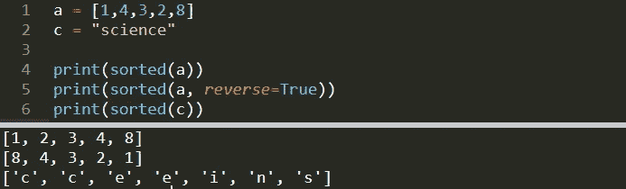
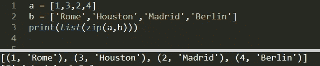
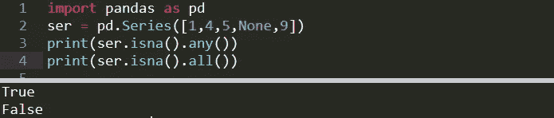
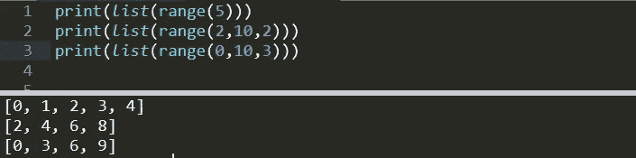
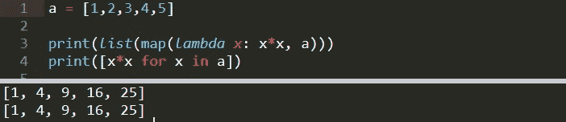
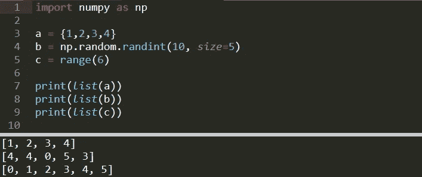

# 每个数据科学家都应该知道的 10 个 Python 内置函数

> 原文：<https://towardsdatascience.com/10-python-built-in-functions-every-data-scientist-should-know-233b302abc05?source=collection_archive---------14----------------------->

## 用例子和用例解释


斯蒂芬·亨宁在 [Unsplash](https://unsplash.com/s/photos/trend?utm_source=unsplash&utm_medium=referral&utm_content=creditCopyText) 上的照片

Python 是许多数据科学家和分析师的首选编程语言。这样选择的原因之一是 python 相对更容易学习和使用。更重要的是，有各种各样的第三方库可以简化数据科学领域的许多任务。例如， **numpy** 和 **pandas** 就是很好的数据分析库。 **Scikit-learn** 和 **tensorflow** 用于机器学习和数据预处理任务。我们还有 python 数据可视化库，如 **matplotlib** 和 **seaborn** 。python 生态系统中还有很多更有用的数据科学库。

在这篇文章中，我们不会谈论这些库或框架。我们更愿意讨论 python 的重要内置函数。这些函数中的一些也在我们提到的库中使用。没有必要重新发明轮子。

我们开始吧。

# **1。设置**

Set 函数从 iterable(如列表)中返回一个 set 对象。集合是唯一值的无序序列。因此，与列表不同，集合没有重复的值。集合的一个用例是从列表或元组中删除重复值。让我们看一个例子。

```
list_a = [1,8,5,3,3,4,4,4,5,6]
set_a = set(list_a)
print(list_a)
print(set_a)
[1, 8, 5, 3, 3, 4, 4, 4, 5, 6]
{1, 3, 4, 5, 6, 8}
```



如您所见，重复项被删除，值被排序。集合是不可订阅的(因为没有保持顺序),所以我们不能访问或修改集合中的单个元素。然而，我们可以**向集合中添加**元素**T21 或者**从集合中移除**元素。**

```
set_a.add(15)
print(set_a)
{1, 3, 4, 5, 6, 8, 15}
```

# **2。枚举**

使用 iterables 时，Enumerate 提供计数。它可以放在 for 循环中，也可以直接用在 iterable 上来创建枚举对象。枚举对象基本上是一个元组列表。

```
cities = ['Houston', 'Rome', 'Berlin', 'Madrid']
print(list(enumerate(cities)))
[(0, 'Houston'), (1, 'Rome'), (2, 'Berlin'), (3, 'Madrid')]
```

与 for 循环一起使用:

```
for count, city in enumerate(cities):
   print(count, city)0 Houston
1 Rome
2 Berlin
3 Madrid
```



# **3。Isinstance**

Isinstance 函数用于检查或比较对象的类别。它接受一个对象和一个类作为参数，如果该对象是该类的实例，则返回 True。

```
a = [1,4,3,5,5,7]
b = set(a)
print(isinstance(a, list))
print(isinstance(b, list))
True
False
```

我们可以使用 **type** 函数来访问一个对象的类，但是在进行比较时，isinstance 就在手边。



# **4。Len**

Len 函数返回对象的长度或对象中的项数。例如，len 可用于检查:

*   字符串中的字符数
*   列表中元素的数量
*   数据帧中的行数

```
a = [1,4,3,5,5,7]
b = set(a)
c = 'Data science'print(f'The length of a is {len(a)}')
print(f'The length of b is {len(b)}')
print(f'The length of c is {len(c)}')The length of a is 6
The length of b is 5
The length of c is 12
```



# **5。已排序**

顾名思义，sorted 函数用于对 iterable 进行排序。默认情况下，按升序排序，但可以用**反转**参数改变。

```
a = [1,4,3,2,8]print(sorted(a))
print(sorted(a, reverse=True))[1, 2, 3, 4, 8]
[8, 4, 3, 2, 1]
```

在做数据清理和处理时，我们可能需要对一个列表或熊猫系列进行排序。Sorted 也可以用来对字符串中的字符进行排序，但它返回的是一个列表。

```
c = "science"
print(sorted(c))
['c', 'c', 'e', 'e', 'i', 'n', 's']
```



# **6。Zip**

Zip 函数以 iterables 作为参数，返回一个由元组组成的迭代器。假设我们有两个关联列表。

```
a = [1,3,2,4]
b = ['Rome','Houston','Madrid','Berlin']print(list(zip(a,b)))
[(1, 'Rome'), (3, 'Houston'), (2, 'Madrid'), (4, 'Berlin')]
```

可重复项不必具有相同的长度。第一个匹配的索引被压缩。例如，在上面的例子中，如果列表 a 是[1，3，2，4，5]，输出将是相同的。Zip 函数也可以接受两个以上的 iterables。



# **7。任何和所有**

我不想把**的任何**和**的所有**功能分开，因为它们是互补的。如果 iterable 的任何元素为 True，则 Any 返回 True。如果 iterable 的所有元素都为 True，则 All 返回 True。

any and all 的一个典型用例是检查 pandas 系列或 dataframe 中缺失的值。

```
import pandas as pd
ser = pd.Series([1,4,5,None,9])print(ser.isna().any())
print(ser.isna().all())True
False
```



# **8。范围**

范围是不可变的序列。它需要 3 个参数，即**开始**、**停止**和**步长**大小。例如，range(0，10，2)返回一个序列，从 0 开始，到 10 结束(10 不包括在内)，增量为 2。

唯一需要的参数是 stop。Start 和 step 参数是可选的。

```
print(list(range(5)))
[0, 1, 2, 3, 4]print(list(range(2,10,2)))
[2, 4, 6, 8]print(list(range(0,10,3)))
[0, 3, 6, 9]
```



# 9。地图

Map function 将函数应用于迭代器的每个元素，并返回一个 iterable。

```
a = [1,2,3,4,5]print(list(map(lambda x: x*x, a)))
[1, 4, 9, 16, 25]
```

我们使用映射函数来平方列表 a 的每个元素。这个操作也可以用列表理解来完成。

```
a = [1,2,3,4,5]
b = [x*x for x in a]
print(b)
```



在大多数情况下，列表理解优于映射函数，因为它速度快，语法简单。例如，对于一个有 100 万个元素的列表，我的计算机在 1.2 秒内完成了理解列表的任务，在 1.4 秒内完成了映射功能。

当处理较大的可迭代对象(远大于一百万)时，由于内存问题，map 是更好的选择。如果你想进一步阅读，这里有一个关于列表理解的详细帖子。

[](/list-comprehensions-in-python-explained-294a464b5245) [## Python 中的列表理解—解释

### 何时使用和不使用列表理解。

towardsdatascience.com](/list-comprehensions-in-python-explained-294a464b5245) 

# 10。列表

List 是一个可变序列，用于存储相同或不同类型的项目集合。

```
a = [1, 'a', True, [1,2,3], {1,2}]print(type(a))
<class 'list'>print(len(a))
5
```

是包含整数、字符串、布尔值、列表和集合的列表。对于这篇文章，我们更感兴趣的是用类型构造函数(list())创建 list。你可能已经注意到我们在这篇文章中使用了 list()。它接受一个 iterable 并将其转换为一个列表。例如，map(lambda x: x*x，a)创建一个迭代器。我们转换成一个列表来打印它。

我们可以从一个范围、集合、pandas 系列、numpy 数组或任何其他的 iterable 中创建一个列表。

```
import numpy as npa = {1,2,3,4}
b = np.random.randint(10, size=5)
c = range(6)print(list(a))
[1, 2, 3, 4]print(list(b))
[4, 4, 0, 5, 3]print(list(c))
[0, 1, 2, 3, 4, 5]
```



感谢您的阅读。如果您有任何反馈，请告诉我。