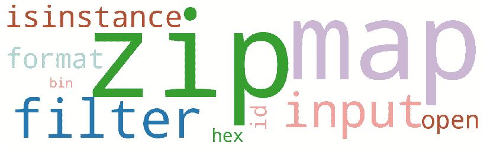

# 你应该知道的 10 个 Python 内置函数

> 原文：<https://towardsdatascience.com/10-python-built-in-functions-you-should-know-f6beba1698bb?source=collection_archive---------2----------------------->

## 带有用法示例

Python 解释器内置了许多始终可用的函数和类型。在本文中，我们将详细解释其中的 10 个功能。我们开始吧！

# 1.isinstance

如果**对象**参数是 **classinfo** 参数的实例，则 **isinstance(object，classinfo)** 函数返回 **True** 。如果不是，函数返回**假**。如果 **classinfo** 是一个对象元组，并且**对象**是其中任何一个的实例，那么函数返回 True。

## 例子

这个函数对于对象类型比较非常有用。我们可以通过以下方式轻松检查对象是否属于 list 类型:

# 2.活力

**zip(*iterables)** 函数返回元组的**迭代器，其中 *i* 元组包含来自每个 iterables 的 *i* 元素。**元组**的长度等于传递给函数的**可迭代变量**的数量。在下面的代码块中，两个**列表**被传递给 **zip 函数**，获得每个长度为 2 的元组的迭代器。**

zip 函数可以接受任何类型的 iterable，比如列表、字符串、元组或字典，返回一个 iterator 对象。为了可视化这个对象，我们可以用内置函数 **list()** 将其转换成一个 **list** 。

## 例子

这个函数在处理循环时会派上用场，允许一次遍历多个可迭代对象。我们可以使用 **zip** 函数轻松地遍历两个列表，如下所示:

该函数也可与内置函数 **dict()** 结合使用，以如下方式从两个**列表**中创建一个**字典**:

功能 **zip** 也可用于**使用**解包操作符*** 将**序列解压缩成独立的序列。在下面的代码块中，我们**将一个元组列表解压**成两个元组。

# 3.地图

**映射(函数，可迭代，...)** function 将给定的函数应用于 iterable 的每个元素。返回值是一个地图对象。这个对象基本上是一个迭代器，我们可以很容易地转换成一个**列表**或**集合**，再次使用**内置的**函数。

**映射函数**将**函数**作为第一个参数。当我们想到 Python 中的一个函数时，我们会自动想到 **def** 关键字，但 map 函数不仅接受用户使用 **def** 关键字创建的函数，还接受**内置、**和**匿名函数** (lambda 表达式)。第二个参数是一个**可迭代的**。iterable 是具有可计数数量的值的对象，例如可以使用 for 循环进行迭代。列表、集合、元组或字典是可迭代的，可用作**映射**函数的第二个参数。

## 例子

当我们想要对一个 iterable 的所有元素应用数学运算时,**映射函数**会非常有用。在下面的代码块中，三种不同的数学运算应用于列表的元素。

如上所示，我们使用了匿名函数，因为它们对于短期使用非常有用。然而，正如我之前提到的，我们也可以使用常规函数。

如果**多个可迭代**参数被传递，该函数将被并行应用于所有可迭代的项目。下面的代码展示了如何用 map 函数将两个 iterables(列表)的元素相乘。

# 4.过滤器

**filter(function，iterable)** 函数以一个**函数**和一个 **iterable** 作为输入，返回 **iterable** 中的元素，函数返回 **True** 。与**映射**函数一样，**过滤**函数不仅接受**常规函数** (def 关键字)，还接受**内置、**和**匿名函数。**

## 例子

下面的代码使用**过滤器**函数从列表中获取奇数。

**过滤函数**接受任何类型的 iterable 作为第二个参数，比如列表、字符串、元组或字典，返回一个 iterator 对象。为了可视化这个对象，我们可以用内置函数 **list()** 将其转换成一个 **list** 。

在下面的代码块中，我们使用一组字符串作为输入，过滤那些以 M 或 v 开头的字符串。

# 5.投入

**input([prompt])** 函数从用户处获取原始输入，并以字符串形式返回。该函数采用可选参数( **prompt** )，可用于在用户要求输入时向用户显示消息。

## 例子

下面的代码要求用户输入他/她的名字。

如果我们想将输入作为一个数字使用，我们必须将它转换成一个整数或浮点数，因为函数将输入存储为一个字符串。

如上图，通过内置函数 **float()** 将用户的输入转化为浮点数。

# 6.身份证明（identification）

函数的作用是:返回一个对象的身份。这是一个整数，在对象的生命周期中是唯一的和恒定的。

## 例子

当复制对象来检查我们是否已经创建了对象的独立副本时，这个函数会派上用场。

在 Python 中， **=操作符**不复制对象。它提供了另一个名称来引用同一个对象，这意味着对新对象的任何修改都会反映在原始对象中。下面的代码块显示赋值操作符(=)并没有创建一个新对象，而是创建了一个对原始对象的新引用，因为两个变量有相同的 **id** 号。

我们还可以使用下面的**恒等运算符**来检查两个变量是否指向同一个对象:

*   **是否为** →如果双方具有相同的身份，则评估为**真**
*   **不为** →如果双方具有不同的身份，则评估为**真**

如上所示，两个变量(numbers 和 new_numbers)指向同一个对象，因为**是操作符**的值为**真**。

为了创建对象的完全独立的克隆，我们可以使用 **copy.deepcopy(x)** 函数(在 **copy** 模块中定义)。这个函数创建了一个独立的副本，这意味着我们可以在不修改原始对象的情况下改变新对象。在这种情况下，两个变量具有不同的 **id** 编号，并且**标识运算符为**的结果为**假**。

# **7。六角**

函数的作用是:将一个整数转换成一个小写的十六进制字符串。该字符串以前缀**‘0x’**开头，表示是一个十六进制数。如果输入的对象不是整数，该函数将引发异常( **TypeError** )。下面的代码将整数 10 转换成十六进制数。

## **例题**

**十六进制数字**经常被程序员用来指定颜色，因为它们提供了比“绿色”或“红色”等字符串值更宽的范围。Python 使用形式为 **'#RRGGBB'** 的字符串来表示十六进制颜色，其中RR(红色)、GG(绿色)和 BB(蓝色)是介于 00 和 FF 之间的十六进制数字，表示颜色的强度。颜色也可以用一个**元组 RGB** (红、绿、蓝)来表示，其中每个参数用一个 0 到 255 之间的整数定义颜色的强度。现在假设您想要一个函数将一个 **RGB 元组**表示映射到一个**十六进制字符串**。下面的代码块显示了我们如何在**十六进制函数**的帮助下实现这种转换。

# 8.箱子

**bin(x)** 函数将一个整数转换成前缀为**‘0b’**的二进制字符串。

## 例子

如果输入的对象不是整数，函数 **bin** 会产生一个异常( **TypeError** )。为了避免这个问题，在尝试将整数转换为二进制数时，我们可以使用 **try** 和 **except** 语句。 **try 子句**包含了可以引发异常的操作( **bin 函数**)，而 **except 子句**包含了处理异常的代码。下面的函数将整数转换为二进制数，考虑到如果提供不同于整数的对象作为输入，将引发异常。此外，前缀**‘0b’**被删除，只返回二进制数。

# 9.格式

**format(value[，format_spec])** 函数返回由格式说明符控制的给定值的格式化表示。

## 例子

格式说明符确定如何格式化值，其结构如下:

> **[[fill]align][sign][#][0][width][grouping _ option][。【精确类型】**

您可以通过以下链接了解有关格式化值的所有选项的详细信息:

 [## 字符串-常见字符串操作- Python 3.8.2 文档

### 内置的 string 类提供了通过方法…进行复杂的变量替换和值格式化的能力

docs.python.org](https://docs.python.org/3/library/string.html#formatspec) 

现在，让我们看一些例子:

*   四舍五入到两位小数的定点记数法
*   百分比四舍五入到小数点后一位
*   十六进制数
*   指数记数法四舍五入两位小数，正数和负数都带符号
*   带填充字符、宽度和右对齐的数字

正如您所观察到的，format 函数提供了多种格式化值的方法。组合格式说明符的不同参数以发现更多的表示形式。😄

# 10.打开

**open( *file* ， *mode='r'* ， *buffering=-1* ， *encoding=None* ， *errors=None* ， *newline=None* ， *closefd=True* ， *opener=None* )** 函数以一个字符串作为输入，指定文件的路径，返回一个 file 对象。如果文件无法打开，则会出现 **OSError** 。

## **例子**

我们使用 **open 函数**在 Python 中读写文件。要读取一个文件，首先我们在读取模式 **(mode='r')** 下使用**打开函数**打开它。这个函数返回一个文件对象，我们将它赋给变量 f。然后，我们使用**读取方法**来访问文件的内容，并将其放入一个字符串中。最后，我们使用**关闭方法**关闭文件。当我们不再需要文件时，记住关闭所有文件以避免用完文件句柄是很重要的。

我们还可以使用。readlines()方法如下:

为了逐行读取文件，我们使用 readline()方法。该方法从文件中读取一整行，并将其作为字符串返回。

在 Python 中工作时，很容易忘记关闭文件。因此，Python 为**提供了**语句，该语句在嵌套代码块执行后自动关闭文件。

如您所见，不再需要**关闭方法**！

用 Python 写文件，我们在写模式 **(mode='w')** 下使用**打开函数**。如果文件不存在，Python 会为您创建一个。一旦文件打开，我们用**写方法**向文件添加文本。请记住，write 方法会在插入文本之前删除文件的内容，这一点很重要。最后，我们必须关闭文件，除非我们像以前一样使用带有语句的**。**

# 有趣的网页

除了官方文档之外，还有各种各样的网页可以找到有趣的例子！

 [## 内置函数- Python 3.8.2 文档

### Python 解释器内置了许多始终可用的函数和类型。它们被列出…

docs.python.org](https://docs.python.org/3/library/functions.html)  [## Python 内置函数

### Python 有一组内置函数。

www.w3schools.com](https://www.w3schools.com/python/python_ref_functions.asp)  [## Python 内置函数

### Python 有几个现成的函数可供使用。这些函数称为内置函数。在这个…

www.programiz.com](https://www.programiz.com/python-programming/methods/built-in)  [## 极客论坛|极客的计算机科学门户

### 极客的计算机科学门户。它包含写得很好，很好的思想和很好的解释计算机科学和…

www.geeksforgeeks.org](https://www.geeksforgeeks.org/)  [## Python 编程简介| Udacity

### 在本课程中，您将学习 Python 编程语言的基础，以及编程最佳…

www.udacity.com](https://www.udacity.com/course/introduction-to-python--ud1110) 

感谢阅读🍀 🎬

阿曼达