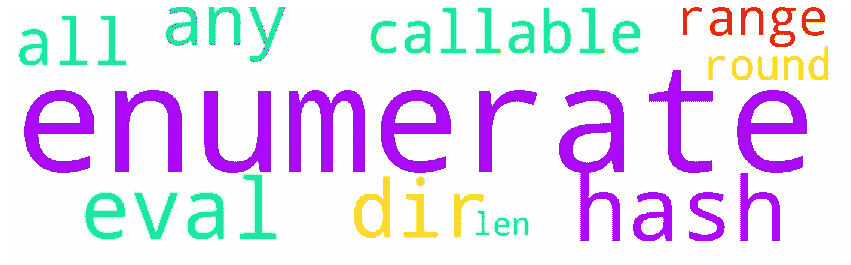
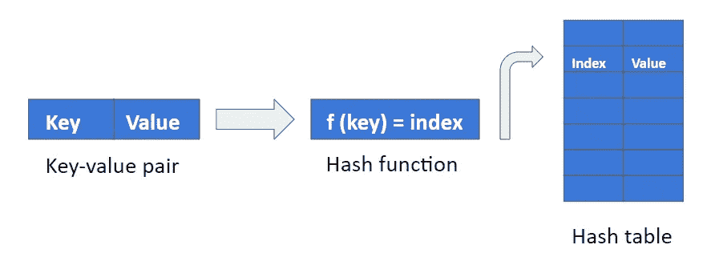

# 你应该知道的 10 个 Python 内置函数

> 原文：<https://towardsdatascience.com/10-python-built-in-functions-you-should-know-fbd5c879e0ab?source=collection_archive---------28----------------------->

## 第 2 部分—使用示例

**功能**是一组允许你执行特定任务的语句。它们对于避免代码重复、使程序更有条理、更易于调试特别有用。尽管你可以随时定义自己的函数， **Python** 提供了多个**内置函数**随时可用。在本文中，我们将详细解释其中的 10 个功能。我们开始吧！

# 1.目录

**dir([object])** 函数返回包含 **Python 中任意**对象**的**属性**和**方法**的字符串排序列表。**该函数将单个**对象**作为输入，并有助于获取关于我们可以对该对象执行的操作的信息。

其中，我们可以使用 **dir 函数**与:

*   **内置容器(如字典)**

正如您所看到的， **dir 函数**返回一个列表，其中包含 Python 中字典可用的所有方法(甚至是魔法方法)。

*   **模块(例如来自 Python 标准库)**

在下面的代码块中， **dir 函数**返回在 **glob** 模块中定义的所有属性和方法。

*   **自己的对象**

我们创建了一个名为 Rectangle 的新类，它通过矩形的高度和宽度来定义矩形。接下来，我们创建这个类的一个实例，名为 rectangle_1。然后，我们使用 **dir 函数**获取 rectangle_1 对象的所有属性和方法(包括继承的魔法方法)。

# 2.列举

**枚举(iterable，start=0)** 函数将一个计数器添加到一个 iterable(例如一个列表)中，并返回一个枚举对象。这个对象可以直接在 for 循环中使用，每次迭代都获得一个形式为( **index，item** )的**双项元组**。

如上所示，**枚举函数**创建了一个元组的**可迭代对象，它可以直接在指定两个变量的 **for 循环中解包。****

或者，我们可以使用 **next()** 函数来遍历**枚举**对象，因为该对象支持**迭代协议**，这意味着 **__iter__** 和 **__next__** 方法都被实现。**下一个函数**每次被调用时都从**枚举对象**返回下一个元组。

为了检查**枚举对象**，我们可以通过以下方式使用内置函数 **list()** 将其转换为一个列表。

默认情况下，**枚举函数**从 0 开始计数。但是，在某些情况下，您希望计数器从不同的数字开始计数。我们可以通过在第二个参数( **start)** 中指定索引(整数)来轻松地更改**起始索引**，如下所示。

# 3.evaluate 评价

**eval(expression[，globals[，locals]])函数**执行包含 Python 代码的字符串并返回结果。这个函数有 3 个参数:(1) **表达式** , (2) **全局变量**,( 3)**局部变量**。第一个参数包含要作为 Python 表达式计算的字符串。另外两个参数是可选的，包含全局/局部方法和变量。

如下图所示，使用 **eval 函数**，我们不仅可以对**表达式**求值，还可以调用**方法**和**函数**。

**eval 函数**仅适用于**表达式**，试图将**语句**作为输入将引发异常( **SyntaxError** )。

虽然 **eval 函数**在评估用户引入的**表达式**时很方便，但该函数有重要的**安全缺陷。**用户可以将不受信任的代码传递给 **eval 函数**，甚至可以删除您系统中的文件。这个问题的解决方案是通过修改**全局**和**局部**参数来限制 **eval 函数**的执行环境。

如果你想知道更多关于 eval 函数的信息，我真的建议你看看下面的文章。

 [## Python eval():动态计算表达式——真正的 Python

### 在本教程中，您将了解到:您可以使用内置的 Python eval()从一个…

realpython.com](https://realpython.com/python-eval-function/) 

# 4.全部

当给定的**可迭代**(例如一个列表)中的所有元素都为真时， **all(iterable)** 函数返回 **True** 。如果不是，则返回**假**。

在 Python 中，以下值被视为**假**(假值):

*   没有人
*   False(布尔类型)
*   任何数值类型的零(例如 0，0.0，0j)
*   空序列(例如()，[])
*   空映射(例如{})

所有这些值在布尔上下文中评估为**假**，并且它们可以在 **if** 或 **while** 语句中使用，也可以与操作数**和**、**或**以及 **not** 一起使用。

如果其中一个 False 值包含在**可迭代**中，则 **all()函数**返回 **False** ，如下所示。

# 5.任何的

**any(iterable)** 函数接受一个 iterable(如列表、字典或元组)作为输入，如果 **iterable** 的任何元素为真，则返回 **True** 。如果不是，则返回**假**。

与 **all()函数**一样，any()不限于评估**布尔数据类型**。该函数评估 iterable 的值是 True 还是 falsy，如果任何值为 True，则返回 **True** 。(参见第 4 部分中被视为虚假的值)

要检查一个值是真还是假，我们可以使用如下所示的 **bool()** 函数。

*   如果输入值为**真值**，该函数返回**真值**。
*   如果输入值为 **falsy** ，则返回 **False** 。

# 6.混杂

**哈希表**是将**键**映射到**值**的数据结构。一个**哈希表**使用一个**哈希函数**来获得**索引**，其中**值**可以在下表中找到，如下图所示。

**hash()** 函数返回一个对象的**哈希值**(如果它有一个的话)，意思是提供在**哈希表**中查找的索引。

正如您所看到的，如果提供了一个**不可变的**对象作为输入，这个函数将返回一个**整数** ( **哈希值**)。相反，如果提供了一个**可变**对象，则 **hash()函数**会引发一个异常( **TypeError** ),因为可变对象(例如列表)是**不可共享的**(它们可以在其生命周期内改变)。

当提供特定的**输入**时， **hash()函数**总是返回相同的数字**输出**值，这意味着它是一个**确定性函数**。

请记住，**散列函数**的输出在您的计算机上可能不同，因为这个函数**是依赖于平台的**。

**Python** 对字典和集合使用**哈希表**。因此，我们可以很容易地确定一个对象是否属于一个字典或集合，因为我们知道它在内存数组中的索引(哈希函数的输出)。因此，在字典或集合中搜索一个元素的时间复杂度仅为 **O(1)(无哈希冲突)。**

相反，如果我们将元素存储在列表中，我们需要潜在地搜索列表中的每个元素，以确定给定元素是否存在(**时间复杂度 O(n)** )。

下面的代码块显示了在集合中搜索元素要比在列表中快得多。

正如我之前所说的， **hash()函数**的输入应该是一个**不可变的**对象。出于这个原因，我们不能使用**可变的**对象作为字典的键或者集合的元素。

如上所示，当试图使用一个列表作为字典的键时，会引发一个 TypeError。

# **7。可调用**

如果作为参数传递的对象是可调用的，则 **callable(object)** 函数返回 **True** 。如果没有，返回**假**。

**可调用对象**是可以用函数运算符**()调用的对象。Python** 有五个可调用的对象:(1) **函数**，(2) **方法**，(3) **类**，(4) **类实例(**如果 __call__ 方法被定义 **)** ，(5) **生成器**。

如下所示，如果这些对象中的任何一个作为输入被提供，**可调用函数**返回 **True** 。相反，如果我们提供一个整数，函数返回 **False** 。

# 8.范围

**range([start]，stop，[step])** 函数返回一个不可变的**整数序列** (range 对象)，将三个参数作为输入:

*   **开始→** 序列的开始索引(默认为 0)
*   **停止→** 范围的上限(总是被排除)
*   **步长→** 序列的步长(默认为 1)

**启动**和**步骤**是可选参数，调用该函数时**停止**是唯一需要的参数。为了可视化一个 **range 对象**的元素，我们可以使用内置函数 **list()** 将其转换为一个列表。

下面的代码块显示了使用 range 函数生成的多个整数范围。

**范围函数**通常与**一起用于循环**以迭代一系列**数字**。

如上所示，range 函数的上限总是被排除在外。

虽然不太常用，但是**范围函数**也与 **while 循环**和 **if 语句**一起使用。

# 9.低输入联网（low-entry networking 的缩写）

**len(object)** **函数**返回一个对象中的项数。如下图所示， **len()函数**的输入可以是集合、序列、 **NumPy 数组、**甚至是**熊猫系列。**

**len()函数**通常与 **range()函数**一起使用，以迭代**可迭代**的**索引**。

如下所示，我们可以使用语法 **range(len(iterable))迭代从 0 到 iterable 长度的数字。**

下面的代码块产生与前面相同的输出，但是在这种情况下，我们迭代列表的**项**，而不是索引。

# 10.轮次

**round(number[，ndigits])** 函数返回一个浮点数**四舍五入到小数点后 n 位数**。函数的第二个参数是可选的，如果省略，函数将返回一个整数作为输出。

如下图所示，我们可以很容易地用 **round()函数**将圆周率四舍五入到小数点后两位或最接近的整数。

**Python** 包括更多的**内置函数**，它们执行**数学运算**，比如:

*   **abs(x)** →获取一个数的绝对值 **x**
*   **复数([real[，imag]]) →** 定义一个复数 **real+imagj**
*   **max(iterable)** →获得 **iterable** 中的最大项目
*   **最小(可迭代)** →获得**可迭代**中的最小项目

# 有趣的网页

除了官方文档之外，还有各种各样的网页可以找到有趣的例子！

 [## 内置函数- Python 3.8.3 文档

### Python 解释器内置了许多始终可用的函数和类型。它们被列出…

docs.python.org](https://docs.python.org/3/library/functions.html)  [## Python 内置函数

### Python 有一组内置函数。

www.w3schools.com](https://www.w3schools.com/python/python_ref_functions.asp)  [## Python 内置函数

### Python 有几个现成的函数可供使用。这些函数称为内置函数。在这个…

www.programiz.com](https://www.programiz.com/python-programming/methods/built-in)  [## 极客论坛|极客的计算机科学门户

### 极客的计算机科学门户。它包含写得很好，很好的思想和很好的解释计算机科学和…

www.geeksforgeeks.org](https://www.geeksforgeeks.org/)  [## Python 编程简介| Udacity

### 在本课程中，您将学习 Python 编程语言的基础，以及编程最佳…

www.udacity.com](https://www.udacity.com/course/introduction-to-python--ud1110) 

# 第一部分

如果你还有兴趣了解更多关于内置函数的知识。阅读第 1 部分:)

 [## 你应该知道的 10 个 Python 内置函数

### 带有用法示例

towardsdatascience.com](/10-python-built-in-functions-you-should-know-f6beba1698bb) 

Python 提供了各种各样的内置函数，随时可供使用，这使得您的编程生活变得更加容易，因为您不需要浪费时间编写自己的代码。此外，Python 标准库以及第三方模块提供了更多功能来处理日常编程。因此，在大多数情况下，掌握 Python 编程就是了解可用的代码。💪

我希望你喜欢阅读这篇文章！再见👐

阿曼达💜